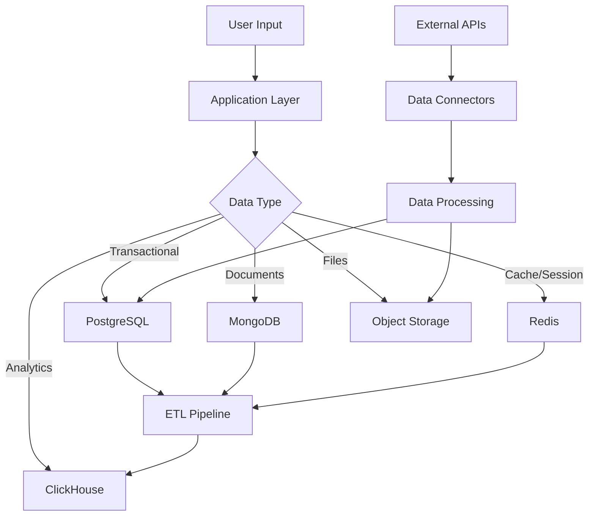
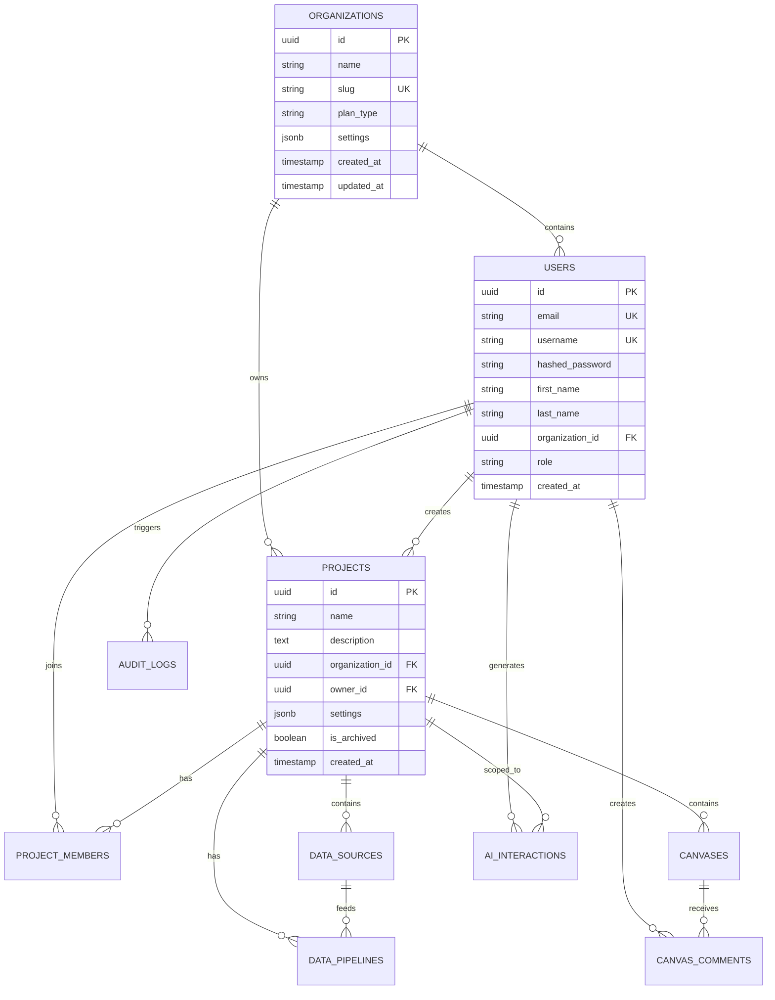

# 5. Data Model

## 5.1. Overview

The Jabiru data model is designed to support a modern, scalable analytics platform with the following key principles:

- **Multi-tenancy:** Complete data isolation between organizations
- **Flexibility:** Support for various data types and evolving schemas
- **Performance:** Optimized for real-time collaboration and fast queries
- **Auditability:** Complete audit trails for compliance and debugging
- **Scalability:** Horizontal scaling capabilities for growing datasets

## 5.2. Data Architecture Strategy

### 5.2.1. Database Selection Rationale

```yaml
PostgreSQL:
  purpose: Transactional data, user management, metadata
  strengths: ACID compliance, complex queries, JSON support
  use_cases: Users, projects, permissions, audit logs

MongoDB:
  purpose: Document storage for flexible content
  strengths: Schema flexibility, horizontal scaling
  use_cases: Canvas layouts, templates, user-generated content

Redis:
  purpose: Caching and real-time data
  strengths: High performance, pub/sub, atomic operations
  use_cases: Sessions, query cache, real-time collaboration

ClickHouse:
  purpose: Analytics and time-series data
  strengths: Columnar storage, aggregation performance
  use_cases: Usage analytics, performance metrics, audit analytics

Object Storage (S3):
  purpose: File storage and data lake
  strengths: Unlimited storage, cost-effective
  use_cases: Uploaded files, exports, backups
```

### 5.2.2. Data Flow Architecture



## 5.3. Database Schemas

### 5.3.1. PostgreSQL Schema (Core Application Data)

```sql
-- Core Tables
CREATE TABLE organizations (
    id UUID PRIMARY KEY DEFAULT gen_random_uuid(),
    name VARCHAR(255) NOT NULL,
    slug VARCHAR(255) UNIQUE NOT NULL,
    plan_type VARCHAR(50) NOT NULL DEFAULT 'free',
    settings JSONB DEFAULT '{}',
    created_at TIMESTAMP DEFAULT CURRENT_TIMESTAMP,
    updated_at TIMESTAMP DEFAULT CURRENT_TIMESTAMP
);

CREATE TABLE users (
    id UUID PRIMARY KEY DEFAULT gen_random_uuid(),
    email VARCHAR(255) UNIQUE NOT NULL,
    username VARCHAR(255) UNIQUE NOT NULL,
    hashed_password TEXT,
    first_name VARCHAR(255),
    last_name VARCHAR(255),
    avatar_url TEXT,
    organization_id UUID REFERENCES organizations(id),
    role VARCHAR(50) NOT NULL DEFAULT 'member',
    settings JSONB DEFAULT '{}',
    last_login_at TIMESTAMP,
    created_at TIMESTAMP DEFAULT CURRENT_TIMESTAMP,
    updated_at TIMESTAMP DEFAULT CURRENT_TIMESTAMP
);

CREATE TABLE projects (
    id UUID PRIMARY KEY DEFAULT gen_random_uuid(),
    name VARCHAR(255) NOT NULL,
    description TEXT,
    organization_id UUID REFERENCES organizations(id),
    owner_id UUID REFERENCES users(id),
    settings JSONB DEFAULT '{}',
    is_archived BOOLEAN DEFAULT FALSE,
    created_at TIMESTAMP DEFAULT CURRENT_TIMESTAMP,
    updated_at TIMESTAMP DEFAULT CURRENT_TIMESTAMP
);

-- Collaboration Tables
CREATE TABLE project_members (
    project_id UUID REFERENCES projects(id),
    user_id UUID REFERENCES users(id),
    role VARCHAR(50) NOT NULL, -- 'viewer', 'editor', 'admin'
    permissions JSONB DEFAULT '{}',
    invited_by UUID REFERENCES users(id),
    joined_at TIMESTAMP DEFAULT CURRENT_TIMESTAMP,
    PRIMARY KEY (project_id, user_id)
);

-- Data Management Tables
CREATE TABLE data_sources (
    id UUID PRIMARY KEY DEFAULT gen_random_uuid(),
    project_id UUID REFERENCES projects(id),
    name VARCHAR(255) NOT NULL,
    type VARCHAR(50) NOT NULL, -- 'file', 'database', 'api', 'streaming'
    connection_config JSONB NOT NULL,
    schema_info JSONB,
    metadata JSONB DEFAULT '{}',
    status VARCHAR(50) NOT NULL DEFAULT 'active',
    last_sync_at TIMESTAMP,
    created_at TIMESTAMP DEFAULT CURRENT_TIMESTAMP,
    updated_at TIMESTAMP DEFAULT CURRENT_TIMESTAMP
);

CREATE TABLE data_pipelines (
    id UUID PRIMARY KEY DEFAULT gen_random_uuid(),
    project_id UUID REFERENCES projects(id),
    name VARCHAR(255) NOT NULL,
    source_id UUID REFERENCES data_sources(id),
    pipeline_config JSONB NOT NULL,
    schedule_cron VARCHAR(255),
    is_active BOOLEAN DEFAULT TRUE,
    last_run_at TIMESTAMP,
    next_run_at TIMESTAMP,
    created_at TIMESTAMP DEFAULT CURRENT_TIMESTAMP,
    updated_at TIMESTAMP DEFAULT CURRENT_TIMESTAMP
);

-- Analytics Tables
CREATE TABLE saved_queries (
    id UUID PRIMARY KEY DEFAULT gen_random_uuid(),
    project_id UUID REFERENCES projects(id),
    name VARCHAR(255) NOT NULL,
    query_text TEXT NOT NULL,
    query_type VARCHAR(50) NOT NULL, -- 'sql', 'python', 'natural_language'
    parameters JSONB DEFAULT '{}',
    created_by UUID REFERENCES users(id),
    is_public BOOLEAN DEFAULT FALSE,
    created_at TIMESTAMP DEFAULT CURRENT_TIMESTAMP,
    updated_at TIMESTAMP DEFAULT CURRENT_TIMESTAMP
);

CREATE TABLE query_executions (
    id UUID PRIMARY KEY DEFAULT gen_random_uuid(),
    query_id UUID REFERENCES saved_queries(id),
    executed_by UUID REFERENCES users(id),
    status VARCHAR(50) NOT NULL, -- 'pending', 'running', 'completed', 'failed'
    parameters JSONB DEFAULT '{}',
    result_location TEXT,
    error_message TEXT,
    execution_time_ms INTEGER,
    rows_returned INTEGER,
    started_at TIMESTAMP DEFAULT CURRENT_TIMESTAMP,
    completed_at TIMESTAMP
);

-- AI Integration Tables
CREATE TABLE ai_interactions (
    id UUID PRIMARY KEY DEFAULT gen_random_uuid(),
    user_id UUID REFERENCES users(id),
    project_id UUID REFERENCES projects(id),
    interaction_type VARCHAR(50) NOT NULL,
    request JSONB NOT NULL,
    response JSONB NOT NULL,
    provider VARCHAR(50) NOT NULL,
    model VARCHAR(100) NOT NULL,
    input_tokens INTEGER,
    output_tokens INTEGER,
    cost_usd DECIMAL(10, 6),
    latency_ms INTEGER,
    created_at TIMESTAMP DEFAULT CURRENT_TIMESTAMP
);

-- Audit Tables
CREATE TABLE audit_logs (
    id UUID PRIMARY KEY DEFAULT gen_random_uuid(),
    user_id UUID REFERENCES users(id),
    organization_id UUID REFERENCES organizations(id),
    action VARCHAR(255) NOT NULL,
    resource_type VARCHAR(50) NOT NULL,
    resource_id UUID,
    changes JSONB,
    ip_address INET,
    user_agent TEXT,
    created_at TIMESTAMP DEFAULT CURRENT_TIMESTAMP
);

-- Indexes
CREATE INDEX idx_projects_org ON projects(organization_id);
CREATE INDEX idx_data_sources_project ON data_sources(project_id);
CREATE INDEX idx_audit_logs_user ON audit_logs(user_id, created_at DESC);
CREATE INDEX idx_ai_interactions_user ON ai_interactions(user_id, created_at DESC);
```

### 5.3.2. MongoDB Schema (Canvas Structure)

```javascript
// Canvas Collection
{
  "_id": ObjectId("..."),
  "project_id": "uuid",
  "name": "Q4 Sales Analysis",
  "description": "Analysis of Q4 2024 sales performance",
  "owner_id": "uuid",
  "version": 1,
  "layout": {
    "type": "grid",
    "columns": 12,
    "rowHeight": 50,
    "breakpoints": {
      "lg": 1200,
      "md": 996,
      "sm": 768,
      "xs": 480
    }
  },
  "blocks": [
    {
      "id": "block_1",
      "type": "chart",
      "position": { "x": 0, "y": 0, "w": 6, "h": 4 },
      "content": {
        "chart_type": "bar",
        "title": "Sales by Region",
        "data_source": {
          "type": "query",
          "query_id": "uuid",
          "parameters": {}
        },
        "config": {
          "x_axis": "region",
          "y_axis": "total_sales",
          "color": "product_category",
          "aggregation": "sum"
        },
        "style": {
          "theme": "light",
          "colors": ["#1f77b4", "#ff7f0e", "#2ca02c"]
        }
      },
      "metadata": {
        "created_by": "uuid",
        "created_at": ISODate("2024-01-15T10:30:00Z"),
        "last_modified_by": "uuid",
        "last_modified_at": ISODate("2024-01-15T14:20:00Z")
      }
    },
    {
      "id": "block_2",
      "type": "narrative",
      "position": { "x": 6, "y": 0, "w": 6, "h": 4 },
      "content": {
        "text": "## Key Insights\n\nSales in Q4 increased by {{metric:25.3}}% compared to Q3...",
        "data_bindings": [
          {
            "key": "metric:25.3",
            "source": "block_1",
            "calculation": "percentage_change",
            "value": 25.3
          }
        ]
      }
    },
    {
      "id": "block_3",
      "type": "table",
      "position": { "x": 0, "y": 4, "w": 12, "h": 6 },
      "content": {
        "title": "Detailed Sales Breakdown",
        "data_source": {
          "type": "query",
          "query_id": "uuid"
        },
        "columns": [
          { "field": "product", "header": "Product", "type": "string" },
          { "field": "q4_sales", "header": "Q4 Sales", "type": "currency" },
          { "field": "growth", "header": "Growth %", "type": "percentage" }
        ],
        "pagination": { "enabled": true, "pageSize": 20 },
        "sorting": { "enabled": true, "defaultSort": "q4_sales" },
        "filtering": { "enabled": true }
      }
    }
  ],
  "sharing": {
    "visibility": "private", // 'private', 'team', 'public'
    "permissions": [
      {
        "user_id": "uuid",
        "role": "editor",
        "granted_at": ISODate("2024-01-10T09:00:00Z"),
        "granted_by": "uuid"
      }
    ],
    "public_link": null,
    "embed_settings": {
      "enabled": false,
      "allowed_domains": []
    }
  },
  "interactions": {
    "views": 145,
    "last_viewed_at": ISODate("2024-01-15T16:45:00Z"),
    "comments_count": 12,
    "favorites_count": 5
  },
  "metadata": {
    "tags": ["sales", "q4", "regional"],
    "created_at": ISODate("2024-01-01T10:00:00Z"),
    "updated_at": ISODate("2024-01-15T14:20:00Z"),
    "version_history": [
      {
        "version": 1,
        "changes": "Initial creation",
        "changed_by": "uuid",
        "changed_at": ISODate("2024-01-01T10:00:00Z")
      }
    ]
  }
}

// Canvas Templates Collection
{
  "_id": ObjectId("..."),
  "name": "Sales Dashboard Template",
  "description": "Standard template for sales analysis",
  "category": "sales",
  "thumbnail_url": "https://...",
  "is_public": true,
  "usage_count": 234,
  "blocks": [...], // Predefined blocks structure
  "required_fields": ["date", "sales_amount", "region"],
  "created_by": "system",
  "created_at": ISODate("2024-01-01T00:00:00Z")
}
```

### 5.3.3. Redis Cache Schema

```yaml
# Cache Key Patterns

# User Sessions
session:{user_id}:
  data: { token, user_info, permissions }
  ttl: 24h

# Query Results
query:result:{query_hash}:
  data: { result_data, metadata, execution_time }
  ttl: 1h

# Real-time Collaboration
canvas:state:{canvas_id}:
  data: { current_state, active_users, locks }
  ttl: persistent with cleanup

canvas:presence:{canvas_id}:
  data: { user_id: { cursor, selection, last_seen } }
  ttl: 5m rolling

# Rate Limiting
rate_limit:{user_id}:{endpoint}:
  data: request_count
  ttl: 1m

# AI Response Cache
ai:response:{prompt_hash}:
  data: { response, model, timestamp }
  ttl: 24h

# Temporary Data Processing
processing:{job_id}:
  data: { status, progress, partial_results }
  ttl: 1h
```

### 5.3.4. ClickHouse Schema (Analytics Data)

```sql
-- Usage Analytics
CREATE TABLE user_events (
    timestamp DateTime64(3),
    user_id String,
    organization_id String,
    event_type LowCardinality(String),
    event_data String, -- JSON
    session_id String,
    ip_address IPv4,
    user_agent String
) ENGINE = MergeTree()
PARTITION BY toYYYYMM(timestamp)
ORDER BY (organization_id, user_id, timestamp);

-- Query Performance
CREATE TABLE query_performance (
    timestamp DateTime64(3),
    query_id String,
    user_id String,
    organization_id String,
    query_type LowCardinality(String),
    execution_time_ms UInt32,
    rows_processed UInt64,
    bytes_processed UInt64,
    cache_hit Boolean,
    error_code String
) ENGINE = MergeTree()
PARTITION BY toYYYYMM(timestamp)
ORDER BY (organization_id, timestamp);

-- System Metrics
CREATE TABLE system_metrics (
    timestamp DateTime64(3),
    metric_name LowCardinality(String),
    metric_value Float64,
    tags Map(String, String),
    instance_id String
) ENGINE = MergeTree()
PARTITION BY toYYYYMM(timestamp)
ORDER BY (metric_name, timestamp);
```

### 5.3.5. Context Service Schema (Vector Database)

```python
# Context Embeddings Schema (Pinecone/Weaviate)
{
    "id": "context_embedding_uuid",
    "vector": [0.1, 0.2, ...], # 1536-dimensional embedding
    "metadata": {
        "organization_id": "uuid",
        "project_id": "uuid", 
        "context_type": "metric_definition",
        "content": "Revenue is calculated as total sales minus returns",
        "domain": "ecommerce",
        "created_at": "2024-01-15T10:30:00Z",
        "updated_at": "2024-01-15T14:20:00Z"
    }
}

# Business Context Collection (MongoDB)
{
    "_id": ObjectId("..."),
    "organization_id": "uuid",
    "project_id": "uuid", # null for organization-wide context
    "domain": "ecommerce",
    "metrics": [
        {
            "name": "revenue",
            "formula": "SUM(sales_amount) - SUM(returns)",
            "aggregation_type": "sum",
            "description": "Net revenue after returns",
            "aliases": ["sales", "income", "turnover"]
        }
    ],
    "terminology": {
        "customer": ["client", "user", "buyer"],
        "order": ["purchase", "transaction", "sale"]
    },
    "business_rules": [
        {
            "rule": "Only include completed orders in revenue",
            "conditions": "status = 'completed'",
            "priority": 1
        }
    ],
    "data_relationships": [
        {
            "table_a": "orders",
            "table_b": "customers", 
            "relationship": "many_to_one",
            "join_key": "customer_id"
        }
    ],
    "version": 1,
    "created_at": ISODate("2024-01-01T10:00:00Z"),
    "updated_at": ISODate("2024-01-15T14:20:00Z")
}
```

## 5.4. Data Relationships

### 5.4.1. Entity Relationship Diagram



### 5.4.2. Data Access Patterns

```yaml
read_patterns:
  user_dashboard:
    query: "Load user's projects with recent activity"
    tables: [projects, project_members, audit_logs]
    frequency: high
    optimization: index on (user_id, updated_at)
    
  canvas_collaboration:
    query: "Real-time canvas state and user presence"
    storage: Redis
    frequency: very_high
    optimization: Redis clustering with consistent hashing
    
  ai_context_lookup:
    query: "Find relevant context for user query"
    storage: Vector DB + MongoDB
    frequency: high
    optimization: Vector similarity search with metadata filtering

write_patterns:
  user_interactions:
    target: ClickHouse events table
    frequency: very_high
    optimization: Batch inserts, partitioning by time
    
  canvas_updates:
    target: MongoDB + Redis
    frequency: high
    optimization: Write-through cache, document versioning
    
  audit_logging:
    target: PostgreSQL + ClickHouse
    frequency: high
    optimization: Async writes, log aggregation
```

## 5.5. Data Migrations and Versioning

### 5.5.1. Schema Migration Strategy

```yaml
migration_approach:
  postgresql:
    tool: Alembic (Python) / Flyway (Java)
    strategy: Sequential versioned migrations
    rollback: Supported with down migrations
    
  mongodb:
    tool: Custom migration scripts
    strategy: Application-level migrations
    rollback: Manual with backup restoration
    
  clickhouse:
    tool: Custom SQL scripts
    strategy: Additive migrations only
    rollback: Data backups, schema recreation
```

### 5.5.2. Data Versioning

```python
# Canvas Version Schema
{
    "canvas_id": "uuid",
    "version": 1,
    "changes": {
        "type": "block_added",
        "block_id": "block_1",
        "content": {...},
        "position": {...}
    },
    "author": "user_uuid",
    "timestamp": "2024-01-15T10:30:00Z",
    "parent_version": 0,
    "branch": "main" # for future branching support
}

# Context Version Schema  
{
    "context_id": "uuid",
    "version": 2,
    "changes": {
        "metrics_added": ["conversion_rate"],
        "terminology_updated": {"customer": ["client", "user"]},
        "rules_modified": [{"rule_id": "uuid", "change": "updated"}]
    },
    "author": "user_uuid", 
    "timestamp": "2024-01-15T10:30:00Z",
    "parent_version": 1
}
```

## 5.6. Data Security and Privacy

### 5.6.1. Data Classification

```yaml
data_classification:
  public:
    examples: [product_catalog, public_templates]
    encryption: TLS in transit
    access: No authentication required
    
  internal:
    examples: [user_profiles, organization_settings]
    encryption: TLS + AES-256 at rest
    access: Authenticated users only
    
  confidential:
    examples: [financial_data, customer_pii]
    encryption: TLS + AES-256 + field-level encryption
    access: Explicit permission required
    
  restricted:
    examples: [audit_logs, security_events]
    encryption: TLS + AES-256 + additional controls
    access: Admin/compliance roles only
```

### 5.6.2. Data Retention Policies

```yaml
retention_policies:
  user_generated_content:
    canvases: 7 years after deletion
    projects: 7 years after archival
    comments: 7 years after deletion
    
  system_data:
    audit_logs: 7 years minimum (compliance)
    performance_metrics: 2 years
    error_logs: 1 year
    
  analytics_data:
    user_events: 3 years
    usage_metrics: 5 years  
    system_metrics: 2 years
    
  temporary_data:
    sessions: 24 hours
    query_cache: 1 hour
    processing_jobs: 24 hours
```

## 5.7. Performance Considerations

### 5.7.1. Indexing Strategy

```sql
-- PostgreSQL Indexes
CREATE INDEX CONCURRENTLY idx_projects_org_active 
ON projects(organization_id, is_archived) 
WHERE is_archived = false;

CREATE INDEX CONCURRENTLY idx_canvas_project_updated 
ON canvases(project_id, updated_at DESC);

CREATE INDEX CONCURRENTLY idx_audit_user_action_time 
ON audit_logs(user_id, action, created_at DESC);

-- MongoDB Indexes
db.canvases.createIndex(
    { "project_id": 1, "updated_at": -1 },
    { "background": true }
);

db.canvas_comments.createIndex(
    { "canvas_id": 1, "created_at": -1 },
    { "background": true }
);
```

### 5.7.2. Partitioning Strategy

```yaml
partitioning:
  clickhouse:
    user_events: 
      partition_key: toYYYYMM(timestamp)
      retention: 36 months
      
    query_performance:
      partition_key: toYYYYMM(timestamp) 
      retention: 24 months
      
  postgresql:
    audit_logs:
      partition_key: created_at (monthly)
      retention: 84 months
      
    ai_interactions:
      partition_key: created_at (monthly)
      retention: 12 months
```

This comprehensive data model provides the foundation for Jabiru's scalable, secure, and performant data architecture while supporting all the features outlined in the user flows and technical architecture.
