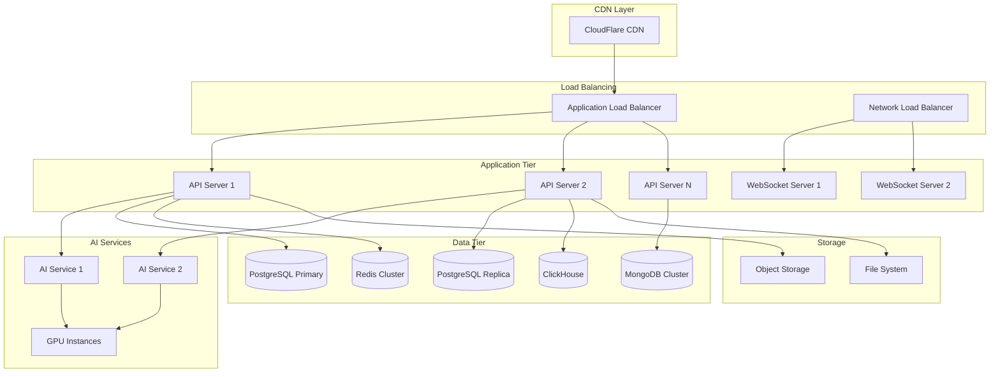

# 10. Deployment & Operations

## 10.1. Overview

This document outlines the comprehensive deployment and operations strategy for the Jabiru platform, covering infrastructure architecture, deployment pipelines, monitoring, incident response, and operational procedures. The strategy ensures reliable, scalable, and maintainable operations across all environments.

### 10.1.1. Operational Philosophy

- **Infrastructure as Code:** All infrastructure defined and managed through code
- **Immutable Deployments:** Blue-green deployments with rollback capabilities
- **Observability First:** Comprehensive monitoring, logging, and tracing
- **Automated Operations:** Minimize manual interventions through automation
- **Security by Design:** Security integrated into all operational processes

### 10.1.2. Environment Strategy

```yaml
environments:
  development:
    purpose: Feature development and initial testing
    scaling: Minimal resources
    data: Synthetic test data
    monitoring: Basic health checks
    
  staging:
    purpose: Integration testing and pre-production validation
    scaling: Production-like with reduced capacity
    data: Anonymized production data
    monitoring: Full monitoring stack
    
  production:
    purpose: Live user-facing application
    scaling: Auto-scaling with high availability
    data: Live user data with backups
    monitoring: Comprehensive monitoring with alerting
    
  disaster_recovery:
    purpose: Failover environment for business continuity
    scaling: Production equivalent
    data: Real-time replicated data
    monitoring: Continuous health monitoring
```

## 10.2. Infrastructure Architecture

### 10.2.1. Cloud Architecture Design



### 10.2.2. Infrastructure as Code

```terraform
# Main infrastructure configuration
module "vpc" {
  source = "./modules/vpc"
  
  cidr_block           = "10.0.0.0/16"
  availability_zones   = ["us-west-2a", "us-west-2b", "us-west-2c"]
  enable_nat_gateway   = true
  enable_vpn_gateway   = false
  
  tags = {
    Environment = var.environment
    Project     = "impala"
  }
}

module "eks_cluster" {
  source = "./modules/eks"
  
  cluster_name        = "impala-${var.environment}"
  cluster_version     = "1.28"
  vpc_id             = module.vpc.vpc_id
  subnet_ids         = module.vpc.private_subnet_ids
  
  node_groups = {
    general = {
      instance_types = ["m5.large", "m5.xlarge"]
      scaling_config = {
        desired_size = 3
        max_size     = 10
        min_size     = 1
      }
    }
    
    ai_workload = {
      instance_types = ["p3.2xlarge"]
      scaling_config = {
        desired_size = 1
        max_size     = 5
        min_size     = 0
      }
      taints = [{
        key    = "workload-type"
        value  = "ai-gpu"
        effect = "NO_SCHEDULE"
      }]
    }
  }
}

module "rds_postgresql" {
  source = "./modules/rds"
  
  identifier     = "impala-postgres-${var.environment}"
  engine         = "postgres"
  engine_version = "15.4"
  instance_class = "db.r6g.xlarge"
  
  allocated_storage     = 100
  max_allocated_storage = 1000
  storage_encrypted     = true
  
  db_name  = "impala"
  username = "impala_user"
  
  vpc_security_group_ids = [module.security_groups.database_sg_id]
  db_subnet_group_name   = module.vpc.database_subnet_group
  
  backup_retention_period = 7
  backup_window          = "03:00-04:00"
  maintenance_window     = "Sun:04:00-Sun:05:00"
  
  enabled_cloudwatch_logs_exports = ["postgresql"]
  monitoring_interval            = 60
  
  multi_az = var.environment == "production"
}

module "mongodb_atlas" {
  source = "./modules/mongodb-atlas"
  
  project_name = "impala-${var.environment}"
  cluster_name = "impala-cluster"
  
  cluster_type   = "REPLICASET"
  mongodb_version = "7.0"
  
  provider_instance_size_name = var.environment == "production" ? "M30" : "M10"
  provider_region_name        = "US_WEST_2"
  
  backup_enabled = true
  pit_enabled   = var.environment == "production"
}

module "redis_elasticache" {
  source = "./modules/elasticache"
  
  cluster_id           = "impala-redis-${var.environment}"
  engine              = "redis"
  engine_version      = "7.0"
  parameter_group_name = "default.redis7"
  
  node_type = var.environment == "production" ? "cache.r6g.xlarge" : "cache.r6g.large"
  num_cache_nodes = 1
  
  port = 6379
  
  subnet_group_name = module.vpc.cache_subnet_group
  security_group_ids = [module.security_groups.cache_sg_id]
  
  at_rest_encryption_enabled = true
  transit_encryption_enabled = true
}
```

### 10.2.3. Kubernetes Manifests

```yaml
# Application deployment
apiVersion: apps/v1
kind: Deployment
metadata:
  name: impala-api
  namespace: impala-prod
spec:
  replicas: 3
  strategy:
    type: RollingUpdate
    rollingUpdate:
      maxSurge: 1
      maxUnavailable: 0
  selector:
    matchLabels:
      app: impala-api
  template:
    metadata:
      labels:
        app: impala-api
    spec:
      containers:
      - name: api
        image: impala/api:v1.2.3
        ports:
        - containerPort: 8000
        env:
        - name: DATABASE_URL
          valueFrom:
            secretKeyRef:
              name: database-credentials
              key: url
        - name: REDIS_URL
          valueFrom:
            secretKeyRef:
              name: cache-credentials
              key: url
        resources:
          requests:
            memory: "512Mi"
            cpu: "250m"
          limits:
            memory: "1Gi"
            cpu: "500m"
        livenessProbe:
          httpGet:
            path: /health
            port: 8000
          initialDelaySeconds: 30
          periodSeconds: 10
        readinessProbe:
          httpGet:
            path: /ready
            port: 8000
          initialDelaySeconds: 5
          periodSeconds: 5

---
apiVersion: v1
kind: Service
metadata:
  name: impala-api-service
  namespace: impala-prod
spec:
  selector:
    app: impala-api
  ports:
  - protocol: TCP
    port: 80
    targetPort: 8000
  type: ClusterIP

---
apiVersion: networking.k8s.io/v1
kind: Ingress
metadata:
  name: impala-api-ingress
  namespace: impala-prod
  annotations:
    kubernetes.io/ingress.class: "nginx"
    cert-manager.io/cluster-issuer: "letsencrypt-prod"
    nginx.ingress.kubernetes.io/rate-limit: "100"
spec:
  tls:
  - hosts:
    - api.impala.ai
    secretName: api-tls-secret
  rules:
  - host: api.impala.ai
    http:
      paths:
      - path: /
        pathType: Prefix
        backend:
          service:
            name: impala-api-service
            port:
              number: 80
```

## 10.3. CI/CD Pipeline

### 10.3.1. Pipeline Architecture

```yaml
pipeline_stages:
  1_source_control:
    trigger: Git push to main/develop branches
    actions: [checkout_code, validate_commit]
    
  2_code_quality:
    actions: [lint_check, type_check, security_scan]
    tools: [eslint, pylint, sonarqube, snyk]
    
  3_build:
    actions: [compile_code, build_containers, run_unit_tests]
    artifacts: [docker_images, test_reports, coverage_reports]
    
  4_integration_tests:
    environment: staging
    actions: [deploy_to_staging, run_integration_tests, run_e2e_tests]
    
  5_security_validation:
    actions: [vulnerability_scan, compliance_check, penetration_test]
    tools: [trivy, owasp_zap, checkov]
    
  6_performance_testing:
    actions: [load_testing, performance_regression_check]
    tools: [k6, lighthouse, jmeter]
    
  7_deployment:
    strategy: blue_green
    actions: [deploy_to_production, health_check, gradual_rollout]
    
  8_post_deployment:
    actions: [smoke_tests, monitoring_validation, alert_setup]
```

### 10.3.2. GitHub Actions Workflow

```yaml
name: CI/CD Pipeline

on:
  push:
    branches: [main, develop]
  pull_request:
    branches: [main]

env:
  REGISTRY: ghcr.io
  IMAGE_NAME: ${{ github.repository }}

jobs:
  code-quality:
    runs-on: ubuntu-latest
    steps:
    - uses: actions/checkout@v4
    
    - name: Setup Node.js
      uses: actions/setup-node@v4
      with:
        node-version: '18'
        cache: 'npm'
    
    - name: Setup Python
      uses: actions/setup-python@v4
      with:
        python-version: '3.11'
        cache: 'pip'
    
    - name: Install dependencies
      run: |
        npm ci
        pip install -r requirements.txt
    
    - name: Run linting
      run: |
        npm run lint
        python -m pylint src/
    
    - name: Run type checking
      run: |
        npm run type-check
        python -m mypy src/
    
    - name: Security scan
      uses: securecodewarrior/github-action-add-sarif@v1
      with:
        sarif-file: security-scan-results.sarif

  build:
    needs: code-quality
    runs-on: ubuntu-latest
    outputs:
      image-tag: ${{ steps.meta.outputs.tags }}
      image-digest: ${{ steps.build.outputs.digest }}
    steps:
    - uses: actions/checkout@v4
    
    - name: Set up Docker Buildx
      uses: docker/setup-buildx-action@v3
    
    - name: Log in to Container Registry
      uses: docker/login-action@v3
      with:
        registry: ${{ env.REGISTRY }}
        username: ${{ github.actor }}
        password: ${{ secrets.GITHUB_TOKEN }}
    
    - name: Extract metadata
      id: meta
      uses: docker/metadata-action@v5
      with:
        images: ${{ env.REGISTRY }}/${{ env.IMAGE_NAME }}
        tags: |
          type=ref,event=branch
          type=ref,event=pr
          type=sha,prefix={{branch}}-
    
    - name: Build and push Docker image
      id: build
      uses: docker/build-push-action@v5
      with:
        context: .
        push: true
        tags: ${{ steps.meta.outputs.tags }}
        labels: ${{ steps.meta.outputs.labels }}
        cache-from: type=gha
        cache-to: type=gha,mode=max

  integration-tests:
    needs: build
    runs-on: ubuntu-latest
    services:
      postgres:
        image: postgres:15
        env:
          POSTGRES_PASSWORD: test
          POSTGRES_DB: impala_test
        options: >-
          --health-cmd pg_isready
          --health-interval 10s
          --health-timeout 5s
          --health-retries 5
      redis:
        image: redis:7
        options: >-
          --health-cmd "redis-cli ping"
          --health-interval 10s
          --health-timeout 5s
          --health-retries 5
    steps:
    - uses: actions/checkout@v4
    
    - name: Run integration tests
      run: |
        docker-compose -f docker-compose.test.yml up --abort-on-container-exit
        
    - name: Upload test results
      uses: actions/upload-artifact@v3
      with:
        name: test-results
        path: test-results/

  deploy-staging:
    needs: [build, integration-tests]
    runs-on: ubuntu-latest
    if: github.ref == 'refs/heads/develop'
    environment: staging
    steps:
    - name: Configure AWS credentials
      uses: aws-actions/configure-aws-credentials@v4
      with:
        aws-access-key-id: ${{ secrets.AWS_ACCESS_KEY_ID }}
        aws-secret-access-key: ${{ secrets.AWS_SECRET_ACCESS_KEY }}
        aws-region: us-west-2
    
    - name: Deploy to EKS
      run: |
        aws eks update-kubeconfig --name impala-staging
        kubectl set image deployment/impala-api api=${{ needs.build.outputs.image-tag }}
        kubectl rollout status deployment/impala-api

  deploy-production:
    needs: [build, integration-tests]
    runs-on: ubuntu-latest
    if: github.ref == 'refs/heads/main'
    environment: production
    steps:
    - name: Blue-Green Deployment
      run: |
        # Blue-green deployment script
        ./scripts/blue-green-deploy.sh ${{ needs.build.outputs.image-tag }}
```

### 10.3.3. Deployment Scripts

```bash
#!/bin/bash
# blue-green-deploy.sh - Blue-Green deployment script

set -e

IMAGE_TAG=$1
NAMESPACE="impala-prod"
APP_NAME="impala-api"

# Current deployment (blue)
CURRENT_COLOR=$(kubectl get deployment ${APP_NAME} -n ${NAMESPACE} -o jsonpath='{.metadata.labels.color}' || echo "blue")
NEW_COLOR=$([ "$CURRENT_COLOR" = "blue" ] && echo "green" || echo "blue")

echo "Current deployment: $CURRENT_COLOR"
echo "New deployment: $NEW_COLOR"
echo "Image: $IMAGE_TAG"

# Deploy new version
echo "Deploying new version..."
kubectl patch deployment ${APP_NAME} -n ${NAMESPACE} -p '{"metadata":{"labels":{"color":"'${NEW_COLOR}'"}}}'
kubectl set image deployment/${APP_NAME} -n ${NAMESPACE} api=${IMAGE_TAG}

# Wait for rollout
echo "Waiting for rollout to complete..."
kubectl rollout status deployment/${APP_NAME} -n ${NAMESPACE} --timeout=600s

# Health check
echo "Performing health checks..."
for i in {1..30}; do
    if kubectl get pods -n ${NAMESPACE} -l app=${APP_NAME},color=${NEW_COLOR} | grep Running; then
        echo "Health check passed"
        break
    fi
    echo "Waiting for pods to be ready..."
    sleep 10
done

# Update service to point to new deployment
echo "Switching traffic to new deployment..."
kubectl patch service ${APP_NAME}-service -n ${NAMESPACE} -p '{"spec":{"selector":{"color":"'${NEW_COLOR}'"}}}'

# Verification
echo "Verifying deployment..."
sleep 30
if curl -f https://api.impala.ai/health; then
    echo "Deployment successful!"
    
    # Clean up old deployment
    echo "Cleaning up old deployment..."
    kubectl delete deployment ${APP_NAME}-${CURRENT_COLOR} -n ${NAMESPACE} || true
else
    echo "Deployment failed! Rolling back..."
    kubectl patch service ${APP_NAME}-service -n ${NAMESPACE} -p '{"spec":{"selector":{"color":"'${CURRENT_COLOR}'"}}}'
    exit 1
fi
```

## 10.4. Monitoring and Observability

### 10.4.1. Monitoring Stack

```yaml
monitoring_components:
  metrics:
    prometheus:
      purpose: Metrics collection and storage
      retention: 15 days
      scrape_interval: 15s
      
    grafana:
      purpose: Metrics visualization and dashboards
      authentication: SSO integration
      alerting: Integrated with alertmanager
      
  logging:
    elasticsearch:
      purpose: Log storage and indexing
      retention: 30 days
      indices: Application, infrastructure, audit
      
    kibana:
      purpose: Log visualization and analysis
      authentication: SSO integration
      
    fluentd:
      purpose: Log collection and forwarding
      sources: Application logs, system logs, audit logs
      
  tracing:
    jaeger:
      purpose: Distributed tracing
      retention: 7 days
      sampling_rate: 0.1%
      
  alerting:
    alertmanager:
      purpose: Alert routing and management
      channels: PagerDuty, Slack, Email
      
  uptime_monitoring:
    pingdom:
      purpose: External uptime monitoring
      checks: Every 1 minute from multiple locations
```

### 10.4.2. Monitoring Configuration

```python
# Prometheus metrics configuration
from prometheus_client import Counter, Histogram, Gauge, start_http_server
import time
import functools

# Application metrics
REQUEST_COUNT = Counter(
    'http_requests_total',
    'Total HTTP requests',
    ['method', 'endpoint', 'status']
)

REQUEST_LATENCY = Histogram(
    'http_request_duration_seconds',
    'HTTP request latency',
    ['method', 'endpoint']
)

ACTIVE_CONNECTIONS = Gauge(
    'websocket_connections_active',
    'Active WebSocket connections'
)

AI_REQUEST_COUNT = Counter(
    'ai_requests_total',
    'Total AI requests',
    ['provider', 'model', 'type']
)

AI_REQUEST_LATENCY = Histogram(
    'ai_request_duration_seconds',
    'AI request latency',
    ['provider', 'model']
)

DATABASE_CONNECTIONS = Gauge(
    'database_connections_active',
    'Active database connections',
    ['database']
)

def monitor_endpoint(func):
    """Decorator to monitor API endpoints"""
    @functools.wraps(func)
    def wrapper(*args, **kwargs):
        start_time = time.time()
        method = kwargs.get('method', 'GET')
        endpoint = kwargs.get('endpoint', func.__name__)
        
        try:
            result = func(*args, **kwargs)
            status = '200'
            return result
        except Exception as e:
            status = '500'
            raise
        finally:
            REQUEST_COUNT.labels(
                method=method,
                endpoint=endpoint,
                status=status
            ).inc()
            
            REQUEST_LATENCY.labels(
                method=method,
                endpoint=endpoint
            ).observe(time.time() - start_time)
    
    return wrapper

class MonitoringService:
    """Centralized monitoring service"""
    
    def __init__(self):
        # Start Prometheus metrics server
        start_http_server(8000)
    
    def track_ai_request(self, provider: str, model: str, request_type: str, duration: float):
        """Track AI service requests"""
        AI_REQUEST_COUNT.labels(
            provider=provider,
            model=model,
            type=request_type
        ).inc()
        
        AI_REQUEST_LATENCY.labels(
            provider=provider,
            model=model
        ).observe(duration)
    
    def update_connection_count(self, connection_type: str, count: int):
        """Update active connection counts"""
        if connection_type == 'websocket':
            ACTIVE_CONNECTIONS.set(count)
        elif connection_type.startswith('database'):
            DATABASE_CONNECTIONS.labels(database=connection_type).set(count)
```

### 10.4.3. Alert Rules

```yaml
# Prometheus alert rules
groups:
- name: application_alerts
  rules:
  - alert: HighErrorRate
    expr: rate(http_requests_total{status=~"5.."}[5m]) > 0.1
    for: 2m
    labels:
      severity: critical
    annotations:
      summary: High error rate detected
      description: "Error rate is {{ $value }} errors per second"

  - alert: HighResponseTime
    expr: histogram_quantile(0.95, rate(http_request_duration_seconds_bucket[5m])) > 2
    for: 5m
    labels:
      severity: warning
    annotations:
      summary: High response time
      description: "95th percentile response time is {{ $value }}s"

  - alert: DatabaseConnectionHigh
    expr: database_connections_active > 80
    for: 5m
    labels:
      severity: warning
    annotations:
      summary: High database connection count
      description: "Database connections: {{ $value }}"

- name: infrastructure_alerts
  rules:
  - alert: PodCrashLooping
    expr: rate(kube_pod_container_status_restarts_total[15m]) > 0
    for: 5m
    labels:
      severity: critical
    annotations:
      summary: Pod is crash looping
      description: "Pod {{ $labels.pod }} is restarting frequently"

  - alert: NodeNotReady
    expr: kube_node_status_condition{condition="Ready",status="true"} == 0
    for: 5m
    labels:
      severity: critical
    annotations:
      summary: Node not ready
      description: "Node {{ $labels.node }} is not ready"

- name: business_alerts
  rules:
  - alert: AIServiceDown
    expr: up{job="ai-service"} == 0
    for: 1m
    labels:
      severity: critical
    annotations:
      summary: AI service is down
      description: "AI service has been down for more than 1 minute"
```

## 10.5. Backup and Disaster Recovery

### 10.5.1. Backup Strategy

```yaml
backup_configuration:
  databases:
    postgresql:
      type: Continuous backup + Point-in-time recovery
      frequency: Real-time WAL streaming
      retention: 30 days
      cross_region: true
      
    mongodb:
      type: Atlas backup service
      frequency: Every 6 hours
      retention: 90 days
      point_in_time_recovery: true
      
    redis:
      type: RDB snapshots + AOF
      frequency: Every hour
      retention: 7 days
      
  application_data:
    user_files:
      storage: S3 with versioning
      backup_frequency: Real-time replication
      retention: 7 years
      cross_region: true
      
    configurations:
      storage: Git repositories
      backup_frequency: On every change
      retention: Indefinite
      
  infrastructure:
    kubernetes_manifests:
      storage: Git + Helm charts
      backup_frequency: On every deployment
      restoration_time: < 30 minutes
```

### 10.5.2. Disaster Recovery Plan

```python
class DisasterRecoveryOrchestrator:
    """Automated disaster recovery orchestration"""
    
    def __init__(self):
        self.recovery_procedures = {
            'database_failure': self.recover_database,
            'application_failure': self.recover_application,
            'infrastructure_failure': self.recover_infrastructure,
            'complete_outage': self.execute_full_recovery
        }
    
    def detect_disaster_type(self) -> str:
        """Automatically detect the type of disaster"""
        checks = {
            'database_health': self.check_database_health(),
            'application_health': self.check_application_health(),
            'infrastructure_health': self.check_infrastructure_health()
        }
        
        if not any(checks.values()):
            return 'complete_outage'
        elif not checks['database_health']:
            return 'database_failure'
        elif not checks['application_health']:
            return 'application_failure'
        elif not checks['infrastructure_health']:
            return 'infrastructure_failure'
        
        return 'no_disaster'
    
    def execute_recovery(self):
        """Execute appropriate recovery procedure"""
        disaster_type = self.detect_disaster_type()
        
        if disaster_type == 'no_disaster':
            return "System is healthy"
        
        print(f"Disaster detected: {disaster_type}")
        print("Initiating recovery procedures...")
        
        recovery_procedure = self.recovery_procedures.get(disaster_type)
        if recovery_procedure:
            return recovery_procedure()
        else:
            return "Unknown disaster type"
    
    def recover_database(self):
        """Recover from database failure"""
        steps = [
            "1. Switch to read replica",
            "2. Promote replica to primary", 
            "3. Restore from latest backup if needed",
            "4. Update application configuration",
            "5. Verify data integrity"
        ]
        
        for step in steps:
            print(f"Executing: {step}")
            # Actual recovery logic would go here
            time.sleep(2)
        
        return "Database recovery completed"
    
    def recover_application(self):
        """Recover from application failure"""
        steps = [
            "1. Identify failed components",
            "2. Roll back to last known good version",
            "3. Scale up healthy instances",
            "4. Redistribute traffic",
            "5. Monitor application health"
        ]
        
        for step in steps:
            print(f"Executing: {step}")
            time.sleep(2)
        
        return "Application recovery completed"
    
    def execute_full_recovery(self):
        """Execute full disaster recovery to secondary region"""
        steps = [
            "1. Activate disaster recovery site",
            "2. Restore databases from backups",
            "3. Deploy application stack",
            "4. Restore user data from S3",
            "5. Update DNS to point to DR site",
            "6. Validate system functionality",
            "7. Notify stakeholders"
        ]
        
        for step in steps:
            print(f"Executing: {step}")
            time.sleep(5)  # Full recovery takes longer
        
        return "Full disaster recovery completed"
```

### 10.5.3. Recovery Time Objectives

```yaml
recovery_targets:
  critical_services:
    authentication:
      rto: 15 minutes
      rpo: 5 minutes
      
    core_application:
      rto: 30 minutes
      rpo: 15 minutes
      
    ai_services:
      rto: 1 hour
      rpo: 1 hour
      
  data_recovery:
    user_data:
      rto: 4 hours
      rpo: 1 hour
      
    analytics_data:
      rto: 24 hours
      rpo: 4 hours
      
  full_system:
    complete_recovery: 4 hours
    data_loss_tolerance: 1 hour
```

## 10.6. Security Operations

### 10.6.1. Security Monitoring

```yaml
security_monitoring:
  intrusion_detection:
    tools: [Suricata, OSSEC, Falco]
    monitoring: 24/7 automated
    response: Automated blocking + alerts
    
  vulnerability_scanning:
    tools: [Nessus, OpenVAS, Trivy]
    frequency: Daily automated scans
    coverage: Infrastructure, containers, dependencies
    
  log_analysis:
    tools: [Splunk, ELK Stack, Graylog]
    sources: Application, system, network, security logs
    correlation: ML-based anomaly detection
    
  compliance_monitoring:
    frameworks: [SOC 2, GDPR, ISO 27001]
    auditing: Continuous compliance checking
    reporting: Automated compliance reports
```

### 10.6.2. Incident Response

```python
class SecurityIncidentHandler:
    """Security incident response automation"""
    
    def __init__(self):
        self.incident_types = {
            'data_breach': self.handle_data_breach,
            'unauthorized_access': self.handle_unauthorized_access,
            'malware_detected': self.handle_malware,
            'ddos_attack': self.handle_ddos
        }
        self.notification_channels = [
            'security_team@impala.ai',
            'pagerduty',
            'slack_security_channel'
        ]
    
    def detect_incident(self, alert_data: dict) -> str:
        """Classify security incident type"""
        # ML-based incident classification logic
        if 'data_exfiltration' in alert_data.get('indicators', []):
            return 'data_breach'
        elif 'failed_authentication' in alert_data.get('indicators', []):
            return 'unauthorized_access'
        elif 'malicious_file' in alert_data.get('indicators', []):
            return 'malware_detected'
        elif 'traffic_spike' in alert_data.get('indicators', []):
            return 'ddos_attack'
        
        return 'unknown'
    
    def handle_data_breach(self, incident_data: dict):
        """Handle data breach incident"""
        response_steps = [
            "1. Immediately isolate affected systems",
            "2. Preserve evidence for forensic analysis",
            "3. Assess scope of data exposure",
            "4. Notify legal and compliance teams",
            "5. Prepare customer communications",
            "6. Execute breach notification procedures"
        ]
        
        return self.execute_response(response_steps, severity='critical')
    
    def handle_unauthorized_access(self, incident_data: dict):
        """Handle unauthorized access attempt"""
        response_steps = [
            "1. Block suspicious IP addresses",
            "2. Force password reset for affected accounts",
            "3. Review access logs for anomalies",
            "4. Strengthen authentication requirements",
            "5. Monitor for continued threats"
        ]
        
        return self.execute_response(response_steps, severity='high')
    
    def execute_response(self, steps: list, severity: str):
        """Execute incident response steps"""
        incident_id = self.create_incident_ticket(severity)
        
        for step in steps:
            print(f"[{incident_id}] Executing: {step}")
            # Actual response logic would go here
            
        self.notify_stakeholders(incident_id, severity)
        return f"Incident {incident_id} response completed"
```

## 10.7. Capacity Planning and Scaling

### 10.7.1. Auto-scaling Configuration

```yaml
autoscaling_policies:
  application_tier:
    horizontal_pod_autoscaler:
      min_replicas: 3
      max_replicas: 50
      target_cpu_utilization: 70%
      target_memory_utilization: 80%
      
    vertical_pod_autoscaler:
      update_mode: "Auto"
      resource_policy:
        min_allowed:
          cpu: 100m
          memory: 128Mi
        max_allowed:
          cpu: 2000m
          memory: 4Gi
          
  database_tier:
    read_replica_scaling:
      trigger: Read CPU > 70% for 5 minutes
      max_replicas: 5
      scale_down_delay: 15 minutes
      
  ai_services:
    gpu_scaling:
      trigger: Queue depth > 10 requests
      max_instances: 10
      scale_down_delay: 10 minutes
      instance_type: p3.2xlarge
```

### 10.7.2. Capacity Planning

```python
class CapacityPlanner:
    """Automated capacity planning and forecasting"""
    
    def __init__(self):
        self.metrics_collector = MetricsCollector()
        self.forecasting_model = TimeSeriesForecaster()
    
    def analyze_current_capacity(self) -> dict:
        """Analyze current resource utilization"""
        return {
            'cpu_utilization': self.metrics_collector.get_average_cpu(),
            'memory_utilization': self.metrics_collector.get_average_memory(),
            'storage_usage': self.metrics_collector.get_storage_usage(),
            'network_bandwidth': self.metrics_collector.get_network_usage(),
            'database_connections': self.metrics_collector.get_db_connections()
        }
    
    def forecast_demand(self, horizon_days: int = 30) -> dict:
        """Forecast resource demand for specified period"""
        historical_data = self.metrics_collector.get_historical_metrics(days=90)
        
        forecasts = {}
        for metric, data in historical_data.items():
            forecast = self.forecasting_model.predict(data, horizon_days)
            forecasts[metric] = {
                'predicted_values': forecast,
                'confidence_interval': self.calculate_confidence_interval(forecast),
                'growth_rate': self.calculate_growth_rate(data)
            }
        
        return forecasts
    
    def generate_scaling_recommendations(self) -> list:
        """Generate scaling recommendations based on forecasts"""
        current_capacity = self.analyze_current_capacity()
        forecasted_demand = self.forecast_demand()
        
        recommendations = []
        
        # CPU scaling recommendation
        if forecasted_demand['cpu_utilization']['predicted_values'][-1] > 80:
            recommendations.append({
                'resource': 'CPU',
                'action': 'Scale up',
                'current': current_capacity['cpu_utilization'],
                'forecast': forecasted_demand['cpu_utilization']['predicted_values'][-1],
                'timeline': '2 weeks'
            })
        
        # Memory scaling recommendation
        if forecasted_demand['memory_utilization']['predicted_values'][-1] > 85:
            recommendations.append({
                'resource': 'Memory',
                'action': 'Scale up',
                'current': current_capacity['memory_utilization'],
                'forecast': forecasted_demand['memory_utilization']['predicted_values'][-1],
                'timeline': '3 weeks'
            })
        
        return recommendations
    
    def create_scaling_plan(self) -> dict:
        """Create comprehensive scaling plan"""
        recommendations = self.generate_scaling_recommendations()
        
        return {
            'current_date': datetime.now(),
            'analysis_period': '90 days historical',
            'forecast_horizon': '30 days',
            'recommendations': recommendations,
            'estimated_costs': self.calculate_scaling_costs(recommendations),
            'implementation_timeline': self.create_implementation_timeline(recommendations)
        }
```

## 10.8. Operational Procedures

### 10.8.1. Standard Operating Procedures

```yaml
operational_procedures:
  daily_operations:
    health_checks:
      frequency: Every 4 hours
      automated: true
      escalation: Auto-alert on failure
      
    log_review:
      frequency: Daily
      automated: Anomaly detection
      manual: Weekly detailed review
      
    backup_verification:
      frequency: Daily
      automated: Backup integrity checks
      testing: Monthly restore tests
      
  weekly_operations:
    security_updates:
      schedule: Sunday 2 AM
      process: Automated with rollback
      testing: Staging environment first
      
    performance_review:
      metrics: Response time, throughput, errors
      analysis: Trend identification
      actions: Performance optimization
      
    capacity_review:
      metrics: Resource utilization
      forecasting: Growth projections
      planning: Scaling decisions
      
  monthly_operations:
    disaster_recovery_test:
      scope: Complete system recovery
      environment: Isolated test environment
      validation: RTO/RPO compliance
      
    security_assessment:
      vulnerability_scan: Full infrastructure
      penetration_test: Critical components
      compliance_check: Regulatory requirements
      
    cost_optimization:
      analysis: Resource utilization vs cost
      rightsizing: Instance optimization
      reserved_instances: Commitment planning
```

### 10.8.2. Runbook Automation

```python
class RunbookAutomation:
    """Automated runbook execution system"""
    
    def __init__(self):
        self.runbooks = {
            'high_cpu_usage': self.handle_high_cpu,
            'database_slow_queries': self.handle_slow_queries,
            'memory_leak': self.handle_memory_leak,
            'disk_space_low': self.handle_disk_space,
            'certificate_expiry': self.handle_cert_expiry
        }
    
    def execute_runbook(self, alert_type: str, alert_data: dict):
        """Execute appropriate runbook based on alert type"""
        runbook = self.runbooks.get(alert_type)
        if runbook:
            return runbook(alert_data)
        else:
            return f"No runbook found for alert type: {alert_type}"
    
    def handle_high_cpu(self, alert_data: dict):
        """Handle high CPU usage alert"""
        steps = [
            "1. Identify top CPU consuming processes",
            "2. Check for runaway processes",
            "3. Scale up instances if necessary",
            "4. Analyze application performance",
            "5. Create performance improvement ticket"
        ]
        
        # Actual implementation would include:
        # - Process analysis
        # - Auto-scaling trigger
        # - Performance metrics collection
        
        return self.execute_steps(steps, alert_data)
    
    def handle_slow_queries(self, alert_data: dict):
        """Handle database slow queries"""
        steps = [
            "1. Identify slow running queries",
            "2. Check database connection pool",
            "3. Analyze query execution plans",
            "4. Scale read replicas if needed",
            "5. Create database optimization ticket"
        ]
        
        return self.execute_steps(steps, alert_data)
    
    def handle_memory_leak(self, alert_data: dict):
        """Handle memory leak detection"""
        steps = [
            "1. Identify memory leak source",
            "2. Collect heap dumps",
            "3. Restart affected services",
            "4. Monitor memory usage",
            "5. Create bug fix ticket"
        ]
        
        return self.execute_steps(steps, alert_data)
    
    def execute_steps(self, steps: list, alert_data: dict):
        """Execute runbook steps"""
        execution_log = []
        
        for step in steps:
            print(f"Executing: {step}")
            # Log step execution
            execution_log.append({
                'step': step,
                'timestamp': datetime.now(),
                'status': 'completed'
            })
            time.sleep(1)
        
        return {
            'runbook_execution': 'completed',
            'steps_executed': len(steps),
            'execution_log': execution_log,
            'alert_data': alert_data
        }
```

## 10.9. Cost Optimization

### 10.9.1. Cost Monitoring and Optimization

```python
class CostOptimizer:
    """Automated cost optimization system"""
    
    def __init__(self):
        self.cost_analyzer = CostAnalyzer()
        self.resource_optimizer = ResourceOptimizer()
    
    def analyze_cost_trends(self) -> dict:
        """Analyze cost trends and identify optimization opportunities"""
        return {
            'monthly_costs': self.cost_analyzer.get_monthly_costs(),
            'cost_by_service': self.cost_analyzer.get_cost_by_service(),
            'cost_trends': self.cost_analyzer.get_cost_trends(),
            'optimization_opportunities': self.identify_optimization_opportunities()
        }
    
    def identify_optimization_opportunities(self) -> list:
        """Identify specific cost optimization opportunities"""
        opportunities = []
        
        # Under-utilized instances
        underutilized = self.resource_optimizer.find_underutilized_instances()
        if underutilized:
            opportunities.append({
                'type': 'rightsizing',
                'description': f'Rightsize {len(underutilized)} underutilized instances',
                'potential_savings': self.calculate_rightsizing_savings(underutilized),
                'effort': 'Low'
            })
        
        # Reserved instance opportunities
        reserved_opportunities = self.resource_optimizer.find_reserved_instance_opportunities()
        if reserved_opportunities:
            opportunities.append({
                'type': 'reserved_instances',
                'description': 'Purchase reserved instances for consistent workloads',
                'potential_savings': self.calculate_reserved_savings(reserved_opportunities),
                'effort': 'Medium'
            })
        
        # Unused resources
        unused_resources = self.resource_optimizer.find_unused_resources()
        if unused_resources:
            opportunities.append({
                'type': 'cleanup',
                'description': f'Remove {len(unused_resources)} unused resources',
                'potential_savings': self.calculate_cleanup_savings(unused_resources),
                'effort': 'Low'
            })
        
        return opportunities
    
    def implement_optimizations(self) -> dict:
        """Implement cost optimization recommendations"""
        implementations = []
        
        # Auto-shutdown non-production environments
        shutdown_result = self.implement_auto_shutdown()
        implementations.append(shutdown_result)
        
        # Rightsize instances
        rightsizing_result = self.implement_rightsizing()
        implementations.append(rightsizing_result)
        
        # Clean up unused resources
        cleanup_result = self.implement_cleanup()
        implementations.append(cleanup_result)
        
        return {
            'optimizations_implemented': len(implementations),
            'implementations': implementations,
            'estimated_monthly_savings': sum(impl['monthly_savings'] for impl in implementations)
        }
```

### 10.9.2. Cost Allocation and Budgeting

```yaml
cost_management:
  budget_alerts:
    monthly_budget: $10000
    alert_thresholds: [50%, 80%, 95%, 100%]
    notification_channels: [email, slack, pagerduty]
    
  cost_allocation:
    by_environment:
      production: 60%
      staging: 25%  
      development: 15%
      
    by_service:
      compute: 45%
      database: 25%
      storage: 15%
      networking: 10%
      ai_services: 5%
      
  optimization_targets:
    cost_per_user: < $2.50/month
    cost_efficiency_improvement: 15% yearly
    unused_resource_percentage: < 5%
```

This comprehensive deployment and operations document provides the foundation for reliable, scalable, and cost-effective operations of the Jabiru platform, ensuring high availability, security, and operational excellence.