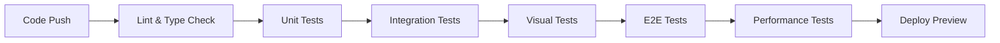

# Design QA & Testing

## Visual Regression Testing

### Tools and Setup

#### Chromatic + Storybook
```json
{
  "scripts": {
    "chromatic": "chromatic --project-token=YOUR_TOKEN",
    "chromatic:ci": "chromatic --project-token=$CHROMATIC_PROJECT_TOKEN --exit-zero-on-changes"
  }
}
```

#### Percy Integration
```typescript
// .percy.yml
version: 2
snapshot:
  widths: [375, 768, 1280, 1920]
  min-height: 1024
  percy-css: |
    /* Hide dynamic content */
    .timestamp { visibility: hidden; }
    .loading-animation { display: none; }
```

### Visual Testing Workflow

1. **Component-Level Testing**
   - Capture all component states
   - Test all prop combinations
   - Document edge cases

```typescript
// Button.visual.test.tsx
import { render } from '@testing-library/react';
import percySnapshot from '@percy/puppeteer';

describe('Button Visual Tests', () => {
  const variants = ['primary', 'secondary', 'ghost'];
  const sizes = ['sm', 'md', 'lg'];
  const states = ['default', 'hover', 'active', 'disabled'];
  
  variants.forEach(variant => {
    sizes.forEach(size => {
      states.forEach(state => {
        it(`renders ${variant} ${size} ${state}`, async () => {
          const component = render(
            <Button variant={variant} size={size} disabled={state === 'disabled'}>
              Button Text
            </Button>
          );
          
          if (state === 'hover') {
            await page.hover('button');
          } else if (state === 'active') {
            await page.mouse.down();
          }
          
          await percySnapshot(page, `Button-${variant}-${size}-${state}`);
        });
      });
    });
  });
});
```

2. **Page-Level Testing**
   - Full page screenshots
   - Responsive breakpoints
   - Dark mode variations

## Cross-Browser Testing

### Browser Matrix
```yaml
supported_browsers:
  - name: Chrome
    versions: [latest, latest-1]
  - name: Firefox
    versions: [latest, latest-1]
  - name: Safari
    versions: [latest, latest-1]
  - name: Edge
    versions: [latest, latest-1]
  
mobile_browsers:
  - name: iOS Safari
    versions: [15, 16]
  - name: Chrome Android
    versions: [latest]
```

### Automated Browser Testing
```typescript
// playwright.config.ts
import { PlaywrightTestConfig } from '@playwright/test';

const config: PlaywrightTestConfig = {
  projects: [
    {
      name: 'chromium',
      use: { ...devices['Desktop Chrome'] },
    },
    {
      name: 'firefox',
      use: { ...devices['Desktop Firefox'] },
    },
    {
      name: 'webkit',
      use: { ...devices['Desktop Safari'] },
    },
    {
      name: 'Mobile Chrome',
      use: { ...devices['Pixel 5'] },
    },
    {
      name: 'Mobile Safari',
      use: { ...devices['iPhone 13'] },
    },
  ],
};
```

### Browser-Specific CSS
```css
/* Firefox-specific fixes */
@-moz-document url-prefix() {
  .custom-scrollbar {
    scrollbar-width: thin;
    scrollbar-color: var(--scrollbar-thumb) var(--scrollbar-track);
  }
}

/* Safari-specific fixes */
@supports (-webkit-appearance: none) {
  .safari-fix {
    -webkit-backface-visibility: hidden;
  }
}
```

## Component Testing

### Unit Testing with React Testing Library

#### Test Structure
```typescript
// Component.test.tsx
import { render, screen, userEvent } from '@testing-library/react';
import { Component } from './Component';

describe('Component', () => {
  describe('Rendering', () => {
    it('renders with required props', () => {
      render(<Component title="Test" />);
      expect(screen.getByText('Test')).toBeInTheDocument();
    });
    
    it('renders all child elements', () => {
      render(<Component title="Test" description="Description" />);
      expect(screen.getByText('Description')).toBeInTheDocument();
    });
  });
  
  describe('Interactions', () => {
    it('calls onClick handler when clicked', async () => {
      const handleClick = jest.fn();
      render(<Component title="Test" onClick={handleClick} />);
      
      await userEvent.click(screen.getByRole('button'));
      expect(handleClick).toHaveBeenCalledTimes(1);
    });
  });
  
  describe('Accessibility', () => {
    it('has no accessibility violations', async () => {
      const { container } = render(<Component title="Test" />);
      const results = await axe(container);
      expect(results).toHaveNoViolations();
    });
  });
});
```

#### Custom Test Utilities
```typescript
// test-utils.tsx
import { render as rtlRender } from '@testing-library/react';
import { MantineProvider } from '@mantine/core';
import { ThemeProvider } from '../theme';

function render(ui: React.ReactElement, options = {}) {
  return rtlRender(
    <MantineProvider>
      <ThemeProvider>
        {ui}
      </ThemeProvider>
    </MantineProvider>,
    options
  );
}

export * from '@testing-library/react';
export { render };
```

### Integration Testing

#### API Mocking
```typescript
// mocks/handlers.ts
import { rest } from 'msw';

export const handlers = [
  rest.get('/api/user', (req, res, ctx) => {
    return res(
      ctx.status(200),
      ctx.json({
        id: '1',
        name: 'Test User',
        email: 'test@example.com'
      })
    );
  }),
];
```

#### Component Integration Tests
```typescript
describe('UserProfile Integration', () => {
  it('loads and displays user data', async () => {
    render(<UserProfile userId="1" />);
    
    // Loading state
    expect(screen.getByText('Loading...')).toBeInTheDocument();
    
    // Loaded state
    await waitFor(() => {
      expect(screen.getByText('Test User')).toBeInTheDocument();
    });
    
    // Interaction
    await userEvent.click(screen.getByText('Edit Profile'));
    expect(screen.getByRole('dialog')).toBeInTheDocument();
  });
});
```

## Design Consistency Checks

### Automated Design Token Validation
```typescript
// design-token-validator.ts
import { tokens } from '../tokens';
import { getCSSCustomProperties } from './utils';

describe('Design Token Consistency', () => {
  it('all design tokens are defined in CSS', () => {
    const cssVars = getCSSCustomProperties();
    
    Object.entries(tokens.colors).forEach(([key, value]) => {
      expect(cssVars).toContain(`--color-${key}`);
    });
  });
  
  it('spacing values follow 8px grid', () => {
    Object.values(tokens.spacing).forEach(value => {
      const pixels = parseFloat(value) * 16; // rem to px
      expect(pixels % 8).toBe(0);
    });
  });
});
```

### Component Prop Validation
```typescript
// Automated prop testing
import { ComponentProps } from './types';

function validateProps(props: ComponentProps) {
  const errors: string[] = [];
  
  // Size validation
  if (props.size && !['sm', 'md', 'lg'].includes(props.size)) {
    errors.push(`Invalid size: ${props.size}`);
  }
  
  // Color validation
  if (props.color && !isValidColor(props.color)) {
    errors.push(`Invalid color: ${props.color}`);
  }
  
  return errors;
}
```

## User Flow Testing

### E2E Test Scenarios

#### Critical User Paths
```typescript
// e2e/onboarding.spec.ts
import { test, expect } from '@playwright/test';

test.describe('60-Second Onboarding', () => {
  test('completes onboarding in under 60 seconds', async ({ page }) => {
    const startTime = Date.now();
    
    await page.goto('/onboarding');
    
    // Step 1: Basic Info
    await page.fill('[name="companyName"]', 'Test Company');
    await page.fill('[name="teamSize"]', '10-50');
    await page.click('text=Next');
    
    // Step 2: Use Case
    await page.click('text=Product Development');
    await page.click('text=Continue');
    
    // Step 3: First Project
    await page.fill('[name="projectName"]', 'My First Project');
    await page.click('text=Create Project');
    
    // Verify completion
    await expect(page).toHaveURL('/dashboard');
    
    const endTime = Date.now();
    const duration = (endTime - startTime) / 1000;
    
    expect(duration).toBeLessThan(60);
  });
});
```

#### Mobile User Flows
```typescript
test.describe('Mobile Navigation', () => {
  test.use({ viewport: { width: 375, height: 667 } });
  
  test('bottom navigation works correctly', async ({ page }) => {
    await page.goto('/');
    
    // Test each tab
    await page.click('[aria-label="Projects"]');
    await expect(page).toHaveURL('/projects');
    
    await page.click('[aria-label="Search"]');
    await expect(page).toHaveURL('/search');
  });
});
```

## Performance Testing

### Lighthouse CI Integration
```yaml
# .github/workflows/lighthouse.yml
name: Lighthouse CI
on: [push]
jobs:
  lighthouse:
    runs-on: ubuntu-latest
    steps:
      - uses: actions/checkout@v3
      - name: Run Lighthouse CI
        uses: treosh/lighthouse-ci-action@v9
        with:
          urls: |
            http://localhost:3000/
            http://localhost:3000/projects
            http://localhost:3000/canvas
          budgetPath: ./lighthouse-budget.json
          uploadArtifacts: true
```

### Performance Budget
```json
// lighthouse-budget.json
[
  {
    "path": "/*",
    "resourceSizes": [
      {
        "resourceType": "script",
        "budget": 500
      },
      {
        "resourceType": "stylesheet",
        "budget": 150
      },
      {
        "resourceType": "total",
        "budget": 1000
      }
    ],
    "resourceCounts": [
      {
        "resourceType": "third-party",
        "budget": 10
      }
    ]
  }
]
```

## Testing Checklist

### Pre-Release Checklist
- [ ] All unit tests passing
- [ ] All integration tests passing
- [ ] Visual regression tests approved
- [ ] Cross-browser testing complete
- [ ] Mobile testing complete
- [ ] Accessibility audit passed
- [ ] Performance budgets met
- [ ] Design token consistency verified
- [ ] User flow tests passing
- [ ] No console errors in production build

### Component Testing Matrix
| Component | Unit Tests | Visual Tests | A11y Tests | Browser Tests |
|-----------|------------|--------------|------------|---------------|
| Button    | ✅         | ✅           | ✅         | ✅            |
| Input     | ✅         | ✅           | ✅         | ✅            |
| Modal     | ✅         | ✅           | ✅         | ✅            |
| Table     | ✅         | ✅           | ✅         | ✅            |

### Automated Testing Pipeline
