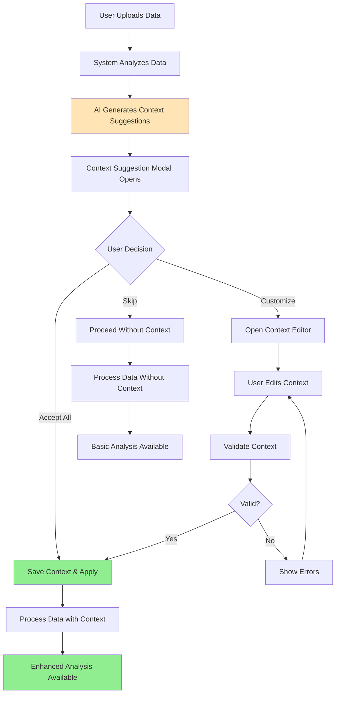
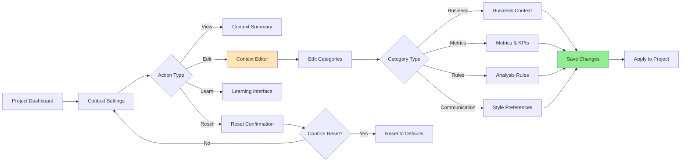
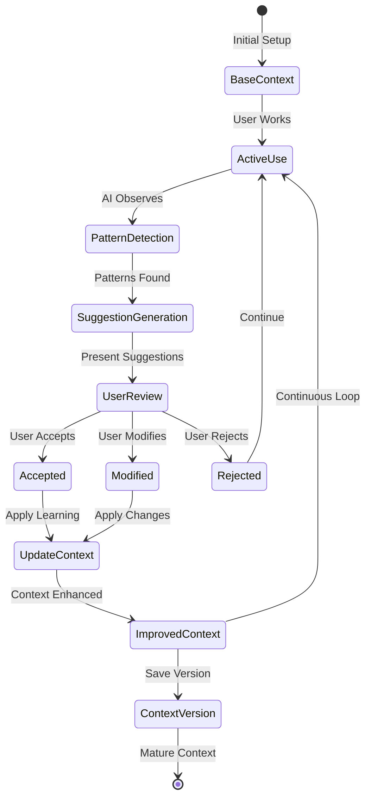
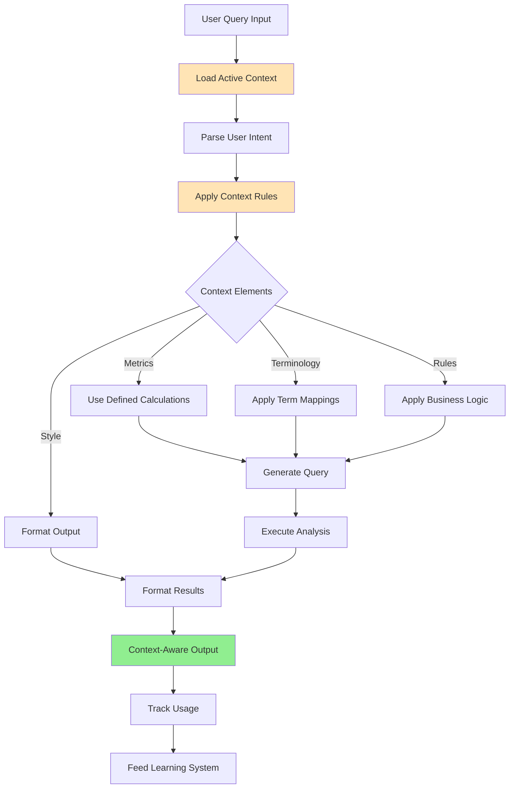

# User Flows & Wireframes - Context Feature

## 1. Overview

The Context Feature is central to Jabiru's AI capabilities, enabling the system to understand each user's specific business domain, terminology, and analytical preferences. This document details all user flows and wireframes related to context management.

## 2. Context Feature User Flows

### 2.1. Initial Context Setup Flow (Post-Upload)



### 2.2. Context Management Flow



### 2.3. Context Learning & Evolution Flow



### 2.4. Context Application in Analysis Flow



## 3. Context Feature Wireframes

### 3.1. Context Suggestion Modal (Initial Detection)

```
┌─────────────────────────────────────────────────────────────────┐
│ 📊 Understanding Your Data                    [Skip] [Customize] │
├─────────────────────────────────────────────────────────────────┤
│                                                                 │
│ Based on your data, here's what we detected:                   │
│                                                                 │
│ ┌─────────────────────────────────────────────────────────────┐│
│ │ 🏢 Industry: E-commerce / Retail                            ││
│ │ 📈 Data Type: Sales Transactions                            ││
│ │ 📅 Time Period: Jan 2023 - Dec 2023                        ││
│ │ 💰 Currency: USD                                            ││
│ └─────────────────────────────────────────────────────────────┘│
│                                                                 │
│ Key Metrics We Identified:                                      │
│ ┌─────────────────────────────────────────────────────────────┐│
│ │ ✓ Revenue = Total sales amount before discounts            ││
│ │ ✓ AOV = Average Order Value (Revenue / Order Count)        ││
│ │ ✓ Customer LTV = Lifetime value per customer               ││
│ │ ✓ CAC = Customer Acquisition Cost                          ││
│ │ + Add custom metric...                                      ││
│ └─────────────────────────────────────────────────────────────┘│
│                                                                 │
│ Suggested Analysis Focus:                                       │
│ ┌─────────────────────────────────────────────────────────────┐│
│ │ • Year-over-year growth comparisons                        ││
│ │ • Seasonal patterns (Q4 holiday spike expected)            ││
│ │ • Customer segment performance                             ││
│ │ • Product category analysis                                ││
│ └─────────────────────────────────────────────────────────────┘│
│                                                                 │
│ How should we communicate insights?                             │
│ ┌─────────────────────────────────────────────────────────────┐│
│ │ Style: [Executive Summary ▼]                               ││
│ │ Terminology: Use "Customers" not "Users"                   ││
│ │ Focus: Revenue growth and profitability                    ││
│ └─────────────────────────────────────────────────────────────┘│
│                                                                 │
│              [Accept All Suggestions]  [Customize Details]      │
└─────────────────────────────────────────────────────────────────┘
```

### 3.2. Full Context Editor

```
┌─────────────────────────────────────────────────────────────────┐
│ 📝 Project Context Editor                    [Save] [Cancel]    │
├─────────────────────────────────────────────────────────────────┤
│                                                                 │
│ ┌─────────────────────┬─────────────────────────────────────┐  │
│ │ Context Categories  │  Business Context                   │  │
│ │                     │  ┌─────────────────────────────────┐│  │
│ │ ▼ Business Context  │  │ Industry: [E-commerce      ▼] ││  │
│ │ ▶ Metrics & KPIs    │  │ ├─ E-commerce                 ││  │
│ │ ▶ Relationships     │  │ ├─ SaaS                       ││  │
│ │ ▶ Analysis Rules    │  │ ├─ Healthcare                 ││  │
│ │ ▶ Communication     │  │ ├─ Finance                    ││  │
│ │ ▶ Custom Rules      │  │ └─ Other...                   ││  │
│ │                     │  │                               ││  │
│ │ [Import Template]   │  │ Business Model: [B2C       ▼] ││  │
│ │ [Export Context]    │  │                               ││  │
│ │                     │  │ Description:                  ││  │
│ │                     │  │ ┌─────────────────────────────┐││  │
│ │                     │  │ │ We're an online retailer   │││  │
│ │                     │  │ │ focused on sustainable     │││  │
│ │                     │  │ │ fashion. Primary markets:  │││  │
│ │                     │  │ │ US, UK, and EU.           │││  │
│ │                     │  │ └─────────────────────────────┘││  │
│ │                     │  │                               ││  │
│ │                     │  │ Key Business Drivers:         ││  │
│ │                     │  │ • Customer retention          ││  │
│ │                     │  │ • Average order value         ││  │
│ │                     │  │ • Conversion rate             ││  │
│ │                     │  │ • Sustainability metrics      ││  │
│ │                     │  │ [+ Add driver]                ││  │
│ │                     │  │                               ││  │
│ │                     │  │ Fiscal Year: [Calendar    ▼] ││  │
│ │                     │  │ Primary Currency: [USD    ▼] ││  │
│ └─────────────────────┴─────────────────────────────────────┘  │
└─────────────────────────────────────────────────────────────────┘
```

### 3.3. Metrics & KPIs Configuration

```
┌─────────────────────────────────────────────────────────────────┐
│ 📝 Project Context Editor > Metrics & KPIs                     │
├─────────────────────────────────────────────────────────────────┤
│                                                                 │
│ Define your key business metrics and how they're calculated:   │
│                                                                 │
│ ┌─────────────────────────────────────────────────────────────┐│
│ │ Metric Name    │ Definition              │ Calculation      ││
│ ├────────────────┼─────────────────────────┼──────────────────┤│
│ │ Revenue        │ Total sales before tax  │ SUM(order_total) ││
│ │                │ and after discounts     │                  ││
│ │                │                         │ [Edit Formula]   ││
│ ├────────────────┼─────────────────────────┼──────────────────┤│
│ │ AOV            │ Average order value     │ Revenue /        ││
│ │                │                         │ COUNT(orders)    ││
│ │                │                         │ [Edit Formula]   ││
│ ├────────────────┼─────────────────────────┼──────────────────┤│
│ │ LTV            │ Customer lifetime value │ AOV × Frequency  ││
│ │                │ over 24 months          │ × 24             ││
│ │                │                         │ [Edit Formula]   ││
│ ├────────────────┼─────────────────────────┼──────────────────┤│
│ │ CAC            │ Customer acquisition    │ (Marketing +     ││
│ │                │ cost                    │ Sales Costs) /   ││
│ │                │                         │ New Customers    ││
│ │                │                         │ [Edit Formula]   ││
│ └────────────────┴─────────────────────────┴──────────────────┘│
│                                                                 │
│ [+ Add Metric]  [Import from Template]  [Validate All]         │
│                                                                 │
│ 💡 Tip: These metrics will be automatically recognized when     │
│ you ask questions about your data.                             │
└─────────────────────────────────────────────────────────────────┘
```

### 3.4. Analysis Rules Configuration

```
┌─────────────────────────────────────────────────────────────────┐
│ 📝 Project Context Editor > Analysis Rules                      │
├─────────────────────────────────────────────────────────────────┤
│                                                                 │
│ Set rules for how your data should be analyzed:                │
│                                                                 │
│ ┌─────────────────────────────────────────────────────────────┐│
│ │ ✓ Comparison Rules                                          ││
│ │   ┌─────────────────────────────────────────────────────┐  ││
│ │   │ • Always show year-over-year comparisons            │  ││
│ │   │ • Default to % change, not absolute                 │  ││
│ │   │ • Include previous period in all charts             │  ││
│ │   │ [+ Add rule]                                        │  ││
│ │   └─────────────────────────────────────────────────────┘  ││
│ │                                                             ││
│ │ ✓ Data Quality Rules                                        ││
│ │   ┌─────────────────────────────────────────────────────┐  ││
│ │   │ • Flag incomplete data (>5% missing)                │  ││
│ │   │ • Exclude test orders (email contains 'test')       │  ││
│ │   │ • Remove outliers beyond 3 std deviations           │  ││
│ │   │ [+ Add rule]                                        │  ││
│ │   └─────────────────────────────────────────────────────┘  ││
│ │                                                             ││
│ │ ✓ Threshold Alerts                                          ││
│ │   ┌─────────────────────────────────────────────────────┐  ││
│ │   │ • CAC:LTV ratio below 1:3 = Critical                │  ││
│ │   │ • Conversion rate < 2% = Warning                    │  ││
│ │   │ • Revenue decline > 10% = Alert                     │  ││
│ │   │ [+ Add threshold]                                   │  ││
│ │   └─────────────────────────────────────────────────────┘  ││
│ │                                                             ││
│ │ ✓ Segmentation Defaults                                     ││
│ │   ┌─────────────────────────────────────────────────────┐  ││
│ │   │ • Premium: LTV > $500                               │  ││
│ │   │ • Regular: LTV $100-500                             │  ││
│ │   │ • New: First purchase < 30 days                    │  ││
│ │   │ [+ Add segment]                                     │  ││
│ │   └─────────────────────────────────────────────────────┘  ││
│ └─────────────────────────────────────────────────────────────┘│
└─────────────────────────────────────────────────────────────────┘
```

### 3.5. Communication Style Preferences

```
┌─────────────────────────────────────────────────────────────────┐
│ 📝 Project Context Editor > Communication Style                 │
├─────────────────────────────────────────────────────────────────┤
│                                                                 │
│ How should insights be communicated?                           │
│                                                                 │
│ ┌─────────────────────────────────────────────────────────────┐│
│ │ Narrative Style                                             ││
│ │ ┌─────────────────────────────────────────────────────────┐││
│ │ │ ○ Technical - Detailed, data-focused                    │││
│ │ │ ● Executive - High-level, action-oriented               │││
│ │ │ ○ Explanatory - Educational, with context               │││
│ │ └─────────────────────────────────────────────────────────┘││
│ │                                                             ││
│ │ Terminology Preferences                                     ││
│ │ ┌─────────────────────────────────────────────────────────┐││
│ │ │ Instead of...          │ Use...                        │││
│ │ ├─────────────────────────┼───────────────────────────────┤││
│ │ │ Users                   │ Customers                    │││
│ │ │ Conversion              │ Purchase completion          │││
│ │ │ Churn                   │ Customer loss                │││
│ │ │ [+ Add mapping]         │                              │││
│ │ └─────────────────────────────────────────────────────────┘││
│ │                                                             ││
│ │ Visualization Preferences                                   ││
│ │ ☑ Always show data labels on charts                        ││
│ │ ☑ Use brand colors when possible                           ││
│ │ ☐ Include trend lines by default                           ││
│ │ ☑ Show confidence intervals                                ││
│ │                                                             ││
│ │ Report Formatting                                           ││
│ │ ☑ Start with executive summary                             ││
│ │ ☑ Include methodology notes                                ││
│ │ ☐ Add data sources appendix                                ││
│ │ ☑ Highlight key takeaways                                  ││
│ └─────────────────────────────────────────────────────────────┘│
└─────────────────────────────────────────────────────────────────┘
```

### 3.6. Context Learning Interface

```
┌─────────────────────────────────────────────────────────────────┐
│ 🧠 Context Learning                          [Apply] [Dismiss] │
├─────────────────────────────────────────────────────────────────┤
│                                                                 │
│ Based on your recent analyses, we've noticed some patterns:    │
│                                                                 │
│ ┌─────────────────────────────────────────────────────────────┐│
│ │ 📊 New Metric Pattern Detected                              ││
│ │                                                             ││
│ │ You frequently calculate "Repeat Purchase Rate" as:        ││
│ │ Customers with 2+ orders / Total Customers                 ││
│ │                                                             ││
│ │ Would you like to add this to your metrics?                ││
│ │                                                             ││
│ │ [✓ Add to Metrics] [Modify Definition] [Not Now]           ││
│ └─────────────────────────────────────────────────────────────┘│
│                                                                 │
│ ┌─────────────────────────────────────────────────────────────┐│
│ │ 🔍 Common Filter Detected                                   ││
│ │                                                             ││
│ │ You often filter by "Premium Customers" using:             ││
│ │ LTV > $500 AND Total Orders > 3                           ││
│ │                                                             ││
│ │ Save as a customer segment?                                ││
│ │                                                             ││
│ │ Name: [Premium Customers        ]                          ││
│ │ [✓ Save Segment] [Adjust Criteria] [Skip]                  ││
│ └─────────────────────────────────────────────────────────────┘│
│                                                                 │
│ ┌─────────────────────────────────────────────────────────────┐│
│ │ 📝 Communication Style Update                               ││
│ │                                                             ││
│ │ Your reports often emphasize "sustainability impact"       ││
│ │ Should we prioritize this in future narratives?            ││
│ │                                                             ││
│ │ [✓ Yes, Always] [Sometimes] [No Thanks]                    ││
│ └─────────────────────────────────────────────────────────────┘│
│                                                                 │
│ Learning History: 12 improvements accepted this month           │
└─────────────────────────────────────────────────────────────────┘
```

### 3.7. Context Quick Access Panel (Canvas View)

```
┌─────────────────────────────────────────────────────────────────┐
│ 🧠 Active Context                                    [Edit] [×] │
├─────────────────────────────────────────────────────────────────┤
│                                                                 │
│ E-commerce Retail | B2C | Sustainable Fashion                  │
│                                                                 │
│ ┌─────────────────────────────────────────────────────────────┐│
│ │ 📊 Key Metrics                              [View All]     ││
│ │ • Revenue = SUM(order_total)                              ││
│ │ • AOV = Revenue / Order Count                             ││
│ │ • LTV = AOV × Purchase Frequency × 24                     ││
│ │ • CAC = (Marketing + Sales) / New Customers               ││
│ └─────────────────────────────────────────────────────────────┘│
│                                                                 │
│ ┌─────────────────────────────────────────────────────────────┐│
│ │ 🎯 Active Rules                             [Manage]       ││
│ │ • YoY comparison enabled                                  ││
│ │ • CAC:LTV threshold: 1:3                                  ││
│ │ • Excluding test orders                                   ││
│ └─────────────────────────────────────────────────────────────┘│
│                                                                 │
│ ┌─────────────────────────────────────────────────────────────┐│
│ │ 💬 Quick Context Override                                  ││
│ │ For this analysis only: [                              ]  ││
│ │ Example: "Focus on mobile users"              [Apply]     ││
│ └─────────────────────────────────────────────────────────────┘│
│                                                                 │
│ Last updated: 2 days ago | Version 1.3 | [View History]        │
└─────────────────────────────────────────────────────────────────┘
```

### 3.8. Context Conflict Resolution

```
┌─────────────────────────────────────────────────────────────────┐
│ ⚠️ Context Conflict Detected                                   │
├─────────────────────────────────────────────────────────────────┤
│                                                                 │
│ We found conflicting definitions in your context:              │
│                                                                 │
│ ┌─────────────────────────────────────────────────────────────┐│
│ │ Metric: "Revenue"                                           ││
│ │                                                             ││
│ │ Current Definition:                                         ││
│ │ "Total sales including tax and shipping"                   ││
│ │ Formula: SUM(order_total + tax + shipping)                 ││
│ │                                                             ││
│ │ New Detection:                                              ││
│ │ "Total sales before tax and shipping"                      ││
│ │ Formula: SUM(order_total)                                  ││
│ │                                                             ││
│ │ This conflicts with your existing definition.              ││
│ └─────────────────────────────────────────────────────────────┘│
│                                                                 │
│ How would you like to resolve this?                            │
│                                                                 │
│ [Keep Current] [Use New] [Create Variant] [Manual Edit]        │
│                                                                 │
│ ☐ Apply this decision to all future conflicts                  │
└─────────────────────────────────────────────────────────────────┘
```

### 3.9. Context Template Library

```
┌─────────────────────────────────────────────────────────────────┐
│ 📚 Context Template Library              [Search...] [Filter ▼] │
├─────────────────────────────────────────────────────────────────┤
│                                                                 │
│ Industry Templates                                              │
│ ┌─────────────────────────────────────────────────────────────┐│
│ │ ┌─────────────────┐ ┌─────────────────┐ ┌─────────────────┐││
│ │ │ 🛍️ E-commerce   │ │ 💻 SaaS B2B     │ │ 🏥 Healthcare   │││
│ │ │                 │ │                 │ │                 │││
│ │ │ • Revenue       │ │ • MRR/ARR       │ │ • Patient Vol.  │││
│ │ │ • AOV           │ │ • Churn Rate    │ │ • Wait Times    │││
│ │ │ • Cart Abandon. │ │ • LTV:CAC       │ │ • Readmission   │││
│ │ │                 │ │                 │ │                 │││
│ │ │ [Use Template]  │ │ [Use Template]  │ │ [Use Template]  │││
│ │ └─────────────────┘ └─────────────────┘ └─────────────────┘││
│ └─────────────────────────────────────────────────────────────┘│
│                                                                 │
│ Custom Templates (Your Organization)                            │
│ ┌─────────────────────────────────────────────────────────────┐│
│ │ ⭐ Q4 Analysis Context                    Used by 12 people ││
│ │    Last updated: Dec 15, 2023             [Use] [Preview]  ││
│ │                                                             ││
│ │ ⭐ Product Launch Metrics                 Used by 8 people  ││
│ │    Last updated: Jan 5, 2024              [Use] [Preview]  ││
│ └─────────────────────────────────────────────────────────────┘│
│                                                                 │
│ [Create New Template] [Import from File]                        │
└─────────────────────────────────────────────────────────────────┘
```

### 3.10. Context History & Versioning

```
┌─────────────────────────────────────────────────────────────────┐
│ 📜 Context Version History                   [Compare] [Export] │
├─────────────────────────────────────────────────────────────────┤
│                                                                 │
│ Current Version: 1.3                                            │
│                                                                 │
│ ┌─────────────────────────────────────────────────────────────┐│
│ │ ● Version 1.3 (Current)                    March 15, 2024   ││
│ │   Added sustainability metrics                              ││
│ │   Updated CAC calculation to include affiliate costs        ││
│ │   Changes: +3 metrics, ~2 rules                            ││
│ └─────────────────────────────────────────────────────────────┘│
│                                                                 │
│ ┌─────────────────────────────────────────────────────────────┐│
│ │ ○ Version 1.2                              March 1, 2024    ││
│ │   Refined customer segments                                ││
│ │   Added mobile vs desktop analysis rules                   ││
│ │   Changes: +2 segments, +4 rules           [Restore]       ││
│ └─────────────────────────────────────────────────────────────┘│
│                                                                 │
│ ┌─────────────────────────────────────────────────────────────┐│
│ │ ○ Version 1.1                              Feb 15, 2024    ││
│ │   Initial metrics setup                                    ││
│ │   Basic e-commerce KPIs defined                            ││
│ │   Changes: +12 metrics, +8 rules           [Restore]       ││
│ └─────────────────────────────────────────────────────────────┘│
│                                                                 │
│ [Show Detailed Diff] [Download Version]                         │
└─────────────────────────────────────────────────────────────────┘
```

## 4. Mobile Context Experience

### 4.1. Mobile Context Summary

```
┌─────────────────────────────────────────┐
│ 📱 Jabiru                         ≡     │
├─────────────────────────────────────────┤
│                                         │
│ Sales Dashboard                         │
│ ┌─────────────────────────────────────┐│
│ │ 🧠 Retail Context Active      ⓘ    ││
│ └─────────────────────────────────────┘│
│                                         │
│ [🎤] "Show today's sales"               │
│                                         │
│ Understanding: Daily revenue with       │
│ your retail metrics...                  │
│                                         │
│ ┌─────────────────────────────────────┐│
│ │ Today's Revenue: $45,231            ││
│ │ ↑ 12% vs yesterday                  ││
│ │ ↑ 8% vs last Tuesday                ││
│ │                                     ││
│ │ [📊 View Chart]                     ││
│ └─────────────────────────────────────┘│
│                                         │
│ [Home] [Data] [Canvas] [Context]        │
└─────────────────────────────────────────┘
```

### 4.2. Mobile Context Quick Edit

```
┌─────────────────────────────────────────┐
│ 🧠 Quick Context                    [×] │
├─────────────────────────────────────────┤
│                                         │
│ Active Metrics:                         │
│ • Revenue ✓                            │
│ • AOV ✓                                │
│ • Conversion Rate ✓                    │
│ [+ Add Metric]                         │
│                                         │
│ Quick Override:                         │
│ ┌─────────────────────────────────────┐│
│ │ Focus on: [Mobile traffic only  ▼] ││
│ │ Time: [Last 7 days              ▼] ││
│ └─────────────────────────────────────┘│
│                                         │
│ [Apply Override] [Full Editor]          │
└─────────────────────────────────────────┘
```

## 5. Error States & Edge Cases

### 5.1. Missing Context Warning

```
┌─────────────────────────────────────────────────────────────────┐
│ 💡 Enhance Your Analysis                                        │
├─────────────────────────────────────────────────────────────────┤
│                                                                 │
│ Your project doesn't have context configured yet.              │
│                                                                 │
│ Adding context will help us:                                    │
│ • Understand your business terminology                          │
│ • Apply the right calculations automatically                    │
│ • Generate more relevant insights                              │
│ • Save time on repetitive tasks                                │
│                                                                 │
│ ┌─────────────────────────────────────────────────────────────┐│
│ │ 🎯 Quick Start Options:                                     ││
│ │                                                             ││
│ │ [📊 Analyze My Data]  Let AI suggest context               ││
│ │ [📚 Use Template]     Start with industry template         ││
│ │ [✏️ Manual Setup]     Configure from scratch               ││
│ └─────────────────────────────────────────────────────────────┘│
│                                                                 │
│ [Set Up Now] [Remind Me Later] [Continue Without Context]      │
└─────────────────────────────────────────────────────────────────┘
```

### 5.2. Invalid Context Configuration

```
┌─────────────────────────────────────────────────────────────────┐
│ ❌ Context Validation Error                                     │
├─────────────────────────────────────────────────────────────────┤
│                                                                 │
│ We found some issues with your context configuration:          │
│                                                                 │
│ ┌─────────────────────────────────────────────────────────────┐│
│ │ ⚠️ Circular Reference in Metrics                            ││
│ │                                                             ││
│ │ "LTV" references "AOV"                                      ││
│ │ "AOV" references "Revenue per Customer"                     ││
│ │ "Revenue per Customer" references "LTV"                     ││
│ │                                                             ││
│ │ This creates a circular dependency.                         ││
│ │                                                             ││
│ │ [Fix Dependencies] [View Diagram]                           ││
│ └─────────────────────────────────────────────────────────────┘│
│                                                                 │
│ ┌─────────────────────────────────────────────────────────────┐│
│ │ ⚠️ Undefined Column Reference                               ││
│ │                                                             ││
│ │ Metric "CAC" references column "marketing_spend"            ││
│ │ This column wasn't found in your data sources.             ││
│ │                                                             ││
│ │ [Update Formula] [Map to Existing Column]                   ││
│ └─────────────────────────────────────────────────────────────┘│
│                                                                 │
│ [Fix All Issues] [Save Anyway] [Cancel]                        │
└─────────────────────────────────────────────────────────────────┘
```

### 5.3. Context Migration Required

```
┌─────────────────────────────────────────────────────────────────┐
│ 🔄 Context Update Available                                     │
├─────────────────────────────────────────────────────────────────┤
│                                                                 │
│ We've improved our context system! Your current context        │
│ needs to be migrated to the new format.                        │
│                                                                 │
│ What's New:                                                     │
│ • Better metric dependencies                                    │
│ • Industry-specific AI models                                   │
│ • Advanced segmentation rules                                   │
│ • Multi-language support                                        │
│                                                                 │
│ Your Current Context:                                           │
│ ┌─────────────────────────────────────────────────────────────┐│
│ │ Version: 1.0 (Legacy)                                       ││
│ │ Metrics: 12 defined                                         ││
│ │ Rules: 8 active                                             ││
│ │ Last Modified: 30 days ago                                  ││
│ └─────────────────────────────────────────────────────────────┘│
│                                                                 │
│ Migration Preview:                                              │
│ ✓ All metrics will be preserved                                │
│ ✓ Rules will be enhanced with new capabilities                 │
│ ✓ No data or analyses will be affected                         │
│                                                                 │
│ [Migrate Now] [Preview Changes] [Export Backup] [Later]        │
└─────────────────────────────────────────────────────────────────┘
```

## 6. Context Feature Benefits Summary

### 6.1. Immediate Benefits

- **No Repetition**: Define metrics once, use everywhere
- **Consistency**: Same calculations across all analyses
- **Speed**: AI understands intent without explanation
- **Accuracy**: Reduced errors from manual calculations

### 6.2. Progressive Benefits

- **Learning**: System improves with usage
- **Customization**: Deeply personalized experience
- **Collaboration**: Shared understanding across team
- **Scalability**: Context grows with business

### 6.3. Long-term Benefits

- **Knowledge Preservation**: Institutional knowledge captured
- **Onboarding**: New team members productive faster
- **Evolution**: Context adapts as business changes
- **Competitive Advantage**: Unique analytical capabilities

## 7. Implementation Notes

### 7.1. Technical Considerations

- Context stored at project level in PostgreSQL
- Version history maintained for rollback capability
- Real-time validation of context rules
- Efficient caching of compiled context

### 7.2. UX Principles

- Progressive disclosure - start simple, reveal complexity
- Always provide escape hatches (skip, later, manual)
- Show value immediately through examples
- Make learning feel like assistance, not correction

### 7.3. Success Metrics

- % of projects with configured context
- Average time to configure initial context
- Context acceptance rate (AI suggestions)
- Reduction in query clarification requests
- Improvement in first-query success rate
