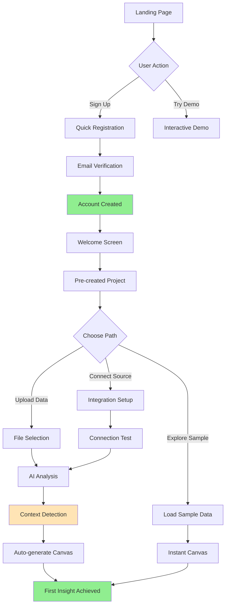
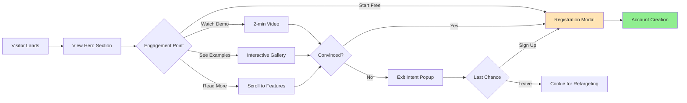
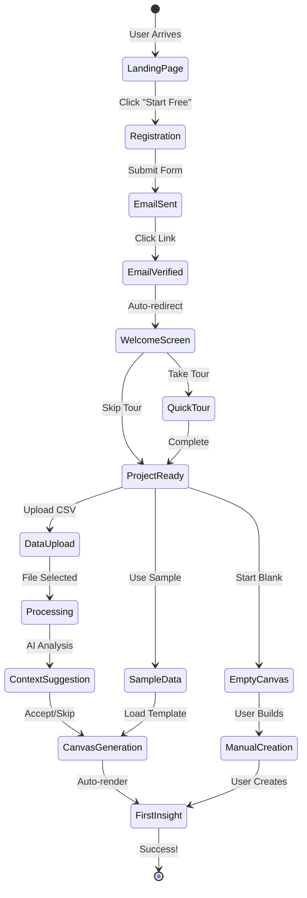
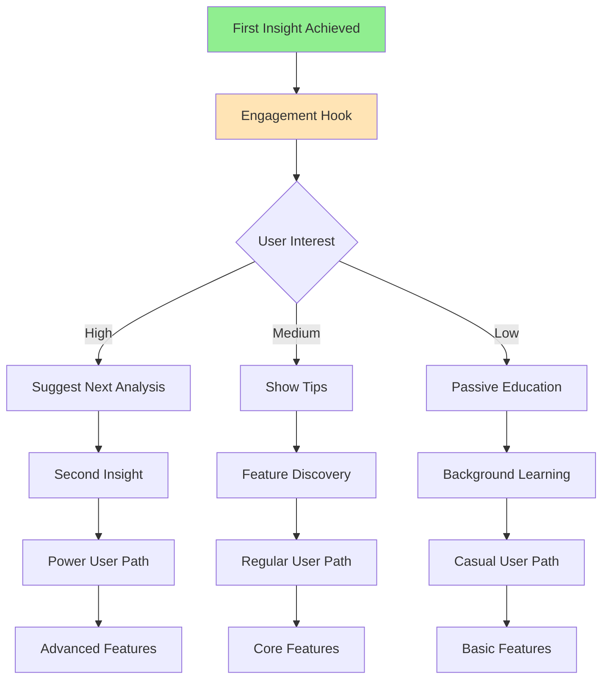

# User Flows & Wireframes - First-Time User Experience

## 1. Overview

The First-Time User Experience is critical to Jabiru's success, designed to achieve the ambitious goal of "first insight in under 60 seconds." This document details every step from landing page to first meaningful data visualization, emphasizing speed, simplicity, and immediate value delivery.

## 2. First-Time User Journey Flows

### 2.1. Primary Signup → First Insight Flow



### 2.2. Landing Page → Registration Decision Flow



### 2.3. Accelerated Onboarding Flow



### 2.4. Progressive Value Revelation Flow



## 3. First-Time User Wireframes

### 3.1. Landing Page (Above the Fold)

```
┌─────────────────────────────────────────────────────────────────┐
│ IMPALA                                    [Docs] [Pricing] [Login]│
├─────────────────────────────────────────────────────────────────┤
│                                                                 │
│          From Data to Insights in Under 60 Seconds             │
│                                                                 │
│    The AI-powered analytics platform that speaks your          │
│    language and understands your business                       │
│                                                                 │
│         [▶ Watch 2-min Demo]    [Start Free - No CC]          │
│                                                                 │
│ ┌─────────────────────────────────────────────────────────────┐│
│ │                                                             ││
│ │  [Animated preview showing:                                ││
│ │   1. CSV upload → 2. AI analysis → 3. Beautiful charts]    ││
│ │                                                             ││
│ └─────────────────────────────────────────────────────────────┘│
│                                                                 │
│   🚀 10,000+ analysts save 10 hours/week with Jabiru          │
│                                                                 │
│ ─ ─ ─ ─ ─ ─ ─ ─ ─ ─ (scroll indicator) ─ ─ ─ ─ ─ ─ ─ ─ ─ ─   │
└─────────────────────────────────────────────────────────────────┘
```

### 3.2. Quick Registration Modal

```
┌─────────────────────────────────────────────────────────────────┐
│ Start Your Free Jabiru Account                            [×]  │
├─────────────────────────────────────────────────────────────────┤
│                                                                 │
│ 🎯 Get your first insight in under 60 seconds                  │
│                                                                 │
│ ┌─────────────────────────────────────────────────────────────┐│
│ │ Work Email                                                  ││
│ │ [you@company.com                                        ]  ││
│ │                                                             ││
│ │ Password                                                    ││
│ │ [••••••••••••                                           ]  ││
│ │ ✓ 8+ characters  ✓ One number  ○ One special character    ││
│ └─────────────────────────────────────────────────────────────┘│
│                                                                 │
│              [Create Free Account]                              │
│                                                                 │
│ ───────────────────── OR ─────────────────────                │
│                                                                 │
│ [G Continue with Google]  [M Continue with Microsoft]          │
│                                                                 │
│ ┌─────────────────────────────────────────────────────────────┐│
│ │ ✓ 14-day free trial, no credit card required              ││
│ │ ✓ Full access to all features                             ││
│ │ ✓ Your data stays private and secure                      ││
│ └─────────────────────────────────────────────────────────────┘│
│                                                                 │
│ By signing up, you agree to our Terms and Privacy Policy       │
└─────────────────────────────────────────────────────────────────┘
```

### 3.3. Email Verification Screen

```
┌─────────────────────────────────────────────────────────────────┐
│ 📧 Check Your Email                                             │
├─────────────────────────────────────────────────────────────────┤
│                                                                 │
│              We've sent a verification link to:                │
│                    john@company.com                             │
│                                                                 │
│ ┌─────────────────────────────────────────────────────────────┐│
│ │                                                             ││
│ │         [Animated email icon with timer: 0:45]             ││
│ │                                                             ││
│ │     Most users receive their email within 1 minute         ││
│ │                                                             ││
│ └─────────────────────────────────────────────────────────────┘│
│                                                                 │
│ Didn't receive it?                                              │
│ • Check your spam folder                                        │
│ • Make sure you entered the right email                        │
│                                                                 │
│ [Resend Email]  [Change Email Address]                         │
│                                                                 │
│ 💡 Pro tip: Add noreply@impala.ai to your contacts            │
└─────────────────────────────────────────────────────────────────┘
```

### 3.4. Welcome Screen (First Login)

```
┌─────────────────────────────────────────────────────────────────┐
│ Welcome to Jabiru, John! 🎉                                    │
├─────────────────────────────────────────────────────────────────┤
│                                                                 │
│   Let's get you to your first insight in under 60 seconds      │
│                                                                 │
│ ┌─────────────────────────────────────────────────────────────┐│
│ │  How would you like to start?                              ││
│ │                                                             ││
│ │  ┌─────────────┐ ┌─────────────┐ ┌─────────────┐         ││
│ │  │ 📊 Upload   │ │ 🎮 Try      │ │ 🔗 Connect  │         ││
│ │  │    Data     │ │   Sample    │ │   Source   │         ││
│ │  │             │ │             │ │             │         ││
│ │  │ Drop a CSV  │ │ E-commerce  │ │ Database   │         ││
│ │  │ to analyze  │ │ demo data   │ │ Google     │         ││
│ │  │             │ │             │ │ Sheets     │         ││
│ │  │ [Choose]    │ │ [Choose]    │ │ [Choose]   │         ││
│ │  └─────────────┘ └─────────────┘ └─────────────┘         ││
│ └─────────────────────────────────────────────────────────────┘│
│                                                                 │
│ ⏱️ Current time: 0:08 / 0:60 seconds                          │
│                                                                 │
│                    [Skip tour, I'll explore]                   │
└─────────────────────────────────────────────────────────────────┘
```

### 3.5. Data Upload Interface (First-Time)

```
┌─────────────────────────────────────────────────────────────────┐
│ 📊 Upload Your Data                          ⏱️ 0:15 / 0:60    │
├─────────────────────────────────────────────────────────────────┤
│                                                                 │
│ ┌─────────────────────────────────────────────────────────────┐│
│ │                                                             ││
│ │                     [Drag & drop zone]                      ││
│ │                                                             ││
│ │                    📁 Drop your CSV here                    ││
│ │                   or click to browse                        ││
│ │                                                             ││
│ │               Supports: CSV, Excel, TSV                     ││
│ │                   Max size: 1GB                             ││
│ │                                                             ││
│ └─────────────────────────────────────────────────────────────┘│
│                                                                 │
│ 🚀 What happens next:                                           │
│ • AI analyzes your data structure (5 seconds)                  │
│ • We detect your business type and metrics (5 seconds)         │
│ • Your first chart appears automatically (5 seconds)           │
│                                                                 │
│ [Use sample data instead]                                       │
└─────────────────────────────────────────────────────────────────┘
```

### 3.6. Upload Progress & AI Analysis

```
┌─────────────────────────────────────────────────────────────────┐
│ 🤖 AI is analyzing your data...              ⏱️ 0:23 / 0:60    │
├─────────────────────────────────────────────────────────────────┤
│                                                                 │
│ sales_data_2024.csv (2.4 MB)                                   │
│                                                                 │
│ ┌─────────────────────────────────────────────────────────────┐│
│ │ ████████████████████░░░░░░░░░░░░░░░░░░░  45%              ││
│ └─────────────────────────────────────────────────────────────┘│
│                                                                 │
│ ✓ File uploaded successfully                                    │
│ ✓ 15,234 rows detected                                         │
│ ⚡ Analyzing data patterns...                                   │
│                                                                 │
│ ┌─────────────────────────────────────────────────────────────┐│
│ │ 🔍 What we're finding:                                      ││
│ │                                                             ││
│ │ • Detected: E-commerce transaction data                    ││
│ │ • Time period: Jan-Dec 2023                               ││
│ │ • Key metrics: Revenue, Orders, Customers                  ││
│ │ • Interesting pattern: Strong Q4 growth                    ││
│ │                                                             ││
│ │ [AI thinking animation...]                                 ││
│ └─────────────────────────────────────────────────────────────┘│
└─────────────────────────────────────────────────────────────────┘
```

### 3.7. Context Quick Setup (First-Time Simplified)

```
┌─────────────────────────────────────────────────────────────────┐
│ 🎯 Almost there! Quick setup                  ⏱️ 0:35 / 0:60    │
├─────────────────────────────────────────────────────────────────┤
│                                                                 │
│ We detected you're analyzing e-commerce data. Let's optimize   │
│ your experience:                                                │
│                                                                 │
│ ┌─────────────────────────────────────────────────────────────┐│
│ │ Your main goal:                                             ││
│ │ ○ Understand sales performance                              ││
│ │ ○ Track customer behavior                                   ││
│ │ ● Improve business metrics        ← Recommended            ││
│ │ ○ Custom analysis                                           ││
│ └─────────────────────────────────────────────────────────────┘│
│                                                                 │
│ ┌─────────────────────────────────────────────────────────────┐│
│ │ Your role:                                                  ││
│ │ [Business Owner ▼]                                          ││
│ │  • Business Owner                                           ││
│ │  • Data Analyst                                             ││
│ │  • Marketing Manager                                        ││
│ │  • Other                                                    ││
│ └─────────────────────────────────────────────────────────────┘│
│                                                                 │
│ [Let's go! →]                    [Skip, use defaults]          │
└─────────────────────────────────────────────────────────────────┘
```

### 3.8. First Canvas Generation

```
┌─────────────────────────────────────────────────────────────────┐
│ ✨ Creating your first insights...            ⏱️ 0:45 / 0:60    │
├─────────────────────────────────────────────────────────────────┤
│                                                                 │
│ ┌─────────────────────────────────────────────────────────────┐│
│ │                                                             ││
│ │     [Animated canvas building visualization]               ││
│ │                                                             ││
│ │     📊 Revenue Overview          ✓ Complete                ││
│ │     📈 Growth Trends            ⚡ Building...              ││
│ │     👥 Customer Analysis         ○ Up next                 ││
│ │     💡 Key Insights             ○ Up next                 ││
│ │                                                             ││
│ └─────────────────────────────────────────────────────────────┘│
│                                                                 │
│ Building a canvas optimized for Business Owners...             │
│                                                                 │
│ 💡 Tip: You can ask questions in plain English once ready      │
└─────────────────────────────────────────────────────────────────┘
```

### 3.9. First Insight Achieved! 🎉

```
┌─────────────────────────────────────────────────────────────────┐
│ Your Sales Dashboard                  ✅ 0:52 / 0:60 - Success! │
├─────────────────────────────────────────────────────────────────┤
│                                                                 │
│ ┌────────────────────────┬────────────────────────────────────┐│
│ │ 📊 2023 Revenue        │ 📈 Monthly Growth Trend           ││
│ │                        │                                    ││
│ │ $2.4M                  │ [Line chart showing upward trend] ││
│ │ ↑ 34% YoY              │                                    ││
│ │                        │ Peak: December ($420K)             ││
│ └────────────────────────┴────────────────────────────────────┘│
│                                                                 │
│ ┌─────────────────────────────────────────────────────────────┐│
│ │ 💡 Key Insights We Found:                                   ││
│ │                                                             ││
│ │ • Your Q4 sales grew 45% compared to Q3                    ││
│ │ • Customer retention improved to 68%                       ││
│ │ • Mobile orders now represent 52% of total                 ││
│ │                                                             ││
│ │ 💬 Ask me anything: "Show me top products by revenue"  [↵] ││
│ └─────────────────────────────────────────────────────────────┘│
│                                                                 │
│ [🎯 Set up goals] [📊 Add more data] [🔗 Share] [Explore →]    │
└─────────────────────────────────────────────────────────────────┘
```

### 3.10. Interactive Product Tour (Optional)

```
┌─────────────────────────────────────────────────────────────────┐
│ 👋 Quick Tour (1 of 4)                              [Skip Tour] │
├─────────────────────────────────────────────────────────────────┤
│                                                                 │
│ ┌─────────────────────────────────────────────────────────────┐│
│ │     Welcome to your AI-powered analytics workspace!        ││
│ │                                                             ││
│ │  ┌─────────────────────────────────────────────────┐      ││
│ │  │                                                   │ ←────┼┼─ "This is your canvas"
│ │  │         [Highlighted canvas area]                │      ││
│ │  │                                                   │      ││
│ │  └─────────────────────────────────────────────────┘      ││
│ │                                                             ││
│ │  • Drag and resize charts                                  ││
│ │  • Click any number to explore                             ││
│ │  • Ask questions in plain English                          ││
│ └─────────────────────────────────────────────────────────────┘│
│                                                                 │
│ [Previous] [Next →] [Start Exploring]                          │
│                                                                 │
│ ○ ● ○ ○                                                        │
└─────────────────────────────────────────────────────────────────┘
```

### 3.11. First-Time Helper Widget

```
┌─────────────────────────────────────────┐
│ 🎓 Getting Started                 [−] │
├─────────────────────────────────────────┤
│                                         │
│ Try these actions:                      │
│                                         │
│ ☐ Ask a question about your data       │
│   Type: "What's my best selling item?" │
│                                         │
│ ☐ Add another visualization            │
│   Say: "Show customer segments"        │
│                                         │
│ ☐ Drill into details                   │
│   Click any chart to explore           │
│                                         │
│ ☐ Share with your team                 │
│   Click Share button above             │
│                                         │
│ [Hide Helper] [Show Me How]             │
└─────────────────────────────────────────┘
```

### 3.12. Empty State (No Data Path)

```
┌─────────────────────────────────────────────────────────────────┐
│ My First Project                                    [Settings]  │
├─────────────────────────────────────────────────────────────────┤
│                                                                 │
│ ┌─────────────────────────────────────────────────────────────┐│
│ │                                                             ││
│ │                    Welcome to Jabiru! 👋                    ││
│ │                                                             ││
│ │              Let's get some data to analyze                ││
│ │                                                             ││
│ │  ┌─────────────┐ ┌─────────────┐ ┌─────────────┐         ││
│ │  │ 📁 Upload   │ │ 🔗 Connect  │ │ 🎮 Use      │         ││
│ │  │   CSV/Excel │ │  Database   │ │   Sample    │         ││
│ │  │             │ │             │ │             │         ││
│ │  │ Drag files  │ │ PostgreSQL  │ │ E-commerce  │         ││
│ │  │ or browse   │ │ MySQL       │ │ SaaS metrics│         ││
│ │  │             │ │ BigQuery    │ │ Marketing   │         ││
│ │  │ [Upload]    │ │ [Connect]   │ │ [Load]      │         ││
│ │  └─────────────┘ └─────────────┘ └─────────────┘         ││
│ │                                                             ││
│ │           Not sure? Start with sample data ↑               ││
│ └─────────────────────────────────────────────────────────────┘│
│                                                                 │
│ 💡 Pro tip: Most users start with a CSV upload                │
└─────────────────────────────────────────────────────────────────┘
```

## 4. Mobile First-Time Experience

### 4.1. Mobile Landing Page

```
┌─────────────────────────────────────────┐
│ 📱 IMPALA                          ≡    │
├─────────────────────────────────────────┤
│                                         │
│   Data to Insights                      │
│   in 60 Seconds                         │
│                                         │
│   AI analytics that                     │
│   speaks your language                  │
│                                         │
│   [Start Free]                          │
│                                         │
│   [▶ Watch Demo]                       │
│                                         │
│ ┌─────────────────────────────────────┐│
│ │                                     ││
│ │ [Product preview animation]         ││
│ │                                     ││
│ └─────────────────────────────────────┘│
│                                         │
│ Already have an account? [Login]        │
└─────────────────────────────────────────┘
```

### 4.2. Mobile Quick Signup

```
┌─────────────────────────────────────────┐
│ Create Account                     [×]  │
├─────────────────────────────────────────┤
│                                         │
│ 🚀 Start free, no card required        │
│                                         │
│ ┌─────────────────────────────────────┐│
│ │ Email                               ││
│ │ [                                 ] ││
│ │                                     ││
│ │ Password                            ││
│ │ [                                 ] ││
│ └─────────────────────────────────────┘│
│                                         │
│ [Create Account]                        │
│                                         │
│ ──────── OR ────────                   │
│                                         │
│ [G Google]  [M Microsoft]               │
│                                         │
│ Terms | Privacy                         │
└─────────────────────────────────────────┘
```

## 5. Alternative Entry Points

### 5.1. Demo Mode (No Signup)

```
┌─────────────────────────────────────────────────────────────────┐
│ 🎮 Interactive Demo                         [Sign Up] [Exit]    │
├─────────────────────────────────────────────────────────────────┤
│                                                                 │
│ Experience Jabiru with sample e-commerce data                  │
│                                                                 │
│ ┌─────────────────────────────────────────────────────────────┐│
│ │ 📊 Revenue Dashboard                                        ││
│ │ ┌─────────────────┬────────────────┐                       ││
│ │ │ Monthly Revenue │ Growth Rate     │    💬 Try asking:    ││
│ │ │ $125,000        │ ↑ 23%           │    "Show me customer ││
│ │ │ [Chart]         │ [Chart]         │     segments"        ││
│ │ └─────────────────┴────────────────┘                       ││
│ └─────────────────────────────────────────────────────────────┘│
│                                                                 │
│ ⚡ This is live - try clicking charts or asking questions!     │
│                                                                 │
│ Ready to analyze your own data? [Create Free Account]          │
└─────────────────────────────────────────────────────────────────┘
```

### 5.2. Invitation Flow (Team Member)

```
┌─────────────────────────────────────────────────────────────────┐
│ 👋 Sarah invited you to Jabiru                                  │
├─────────────────────────────────────────────────────────────────┤
│                                                                 │
│ ┌─────────────────────────────────────────────────────────────┐│
│ │ "Hey! Check out this sales analysis I created. You'll love  ││
│ │  how easy Jabiru makes data analysis!" - Sarah              ││
│ └─────────────────────────────────────────────────────────────┘│
│                                                                 │
│ Canvas: Q4 2023 Sales Performance                               │
│ Project: Acme Corp Analytics                                    │
│ Your role: Editor                                               │
│                                                                 │
│ ┌─────────────────────────────────────────────────────────────┐│
│ │ [Preview of shared canvas]                                  ││
│ └─────────────────────────────────────────────────────────────┘│
│                                                                 │
│ [Accept Invitation & Create Account]                            │
│                                                                 │
│ Already have an account? [Login]                                │
└─────────────────────────────────────────────────────────────────┘
```

## 6. Progressive Engagement

### 6.1. Day 1 Follow-up Email

```
Subject: Your data insights are ready, John!

Hi John,

Great job getting your first insight in just 52 seconds! 🎉

Here's what you discovered:
• Revenue grew 34% year-over-year
• Q4 showed exceptional 45% growth
• Mobile orders are now 52% of total

Ready to dig deeper? Here are 3 quick wins:

[📊 Analyze customer segments] - 2 min
[📈 Find growth opportunities] - 3 min
[🎯 Set up automated reports] - 5 min

Questions? Just reply to this email.

Happy analyzing!
The Jabiru Team
```

### 6.2. In-App Progressive Discovery

```
┌─────────────────────────────────────────┐
│ 💡 New Discovery                   [×]  │
├─────────────────────────────────────────┤
│                                         │
│ You've been looking at revenue data.    │
│ Did you know you can:                   │
│                                         │
│ • Compare periods side-by-side          │
│ • Set up alerts for changes             │
│ • Share live dashboards with your team  │
│                                         │
│ [Show Me How] [Maybe Later]             │
└─────────────────────────────────────────┘
```

## 7. Success Metrics & Optimization Points

### 7.1. Key Metrics to Track

1. **Time to First Insight**

   - Target: < 60 seconds
   - Measure: Signup → First visualization rendered

2. **Activation Rate**

   - Target: > 80% upload data within first session
   - Measure: Users who complete data upload / Total signups

3. **Drop-off Points**
   - Email verification
   - Data upload
   - Context configuration
   - First query

### 7.2. A/B Testing Opportunities

1. **Registration Flow**

   - Single field (email only) vs full form
   - Social login prominence
   - Demo before signup vs signup first

2. **Onboarding Path**

   - Guided tour vs immediate sandbox
   - Sample data vs empty state
   - Context setup timing

3. **First Canvas**
   - Auto-generated insights vs blank canvas
   - Number of initial visualizations
   - AI suggestions prominence

## 8. Implementation Notes

### 8.1. Performance Requirements

- Landing page: < 1s load time
- Registration: < 2s to create account
- File upload: Show progress immediately
- AI analysis: Stream results as available
- Canvas generation: Progressive rendering

### 8.2. Error Handling

- Network failures: Offline capability for critical paths
- Upload errors: Clear guidance and retry options
- AI failures: Graceful fallback to manual setup
- Validation: Inline, real-time feedback

### 8.3. Accessibility

- Keyboard navigation throughout
- Screen reader optimized
- High contrast mode available
- Mobile-first responsive design
