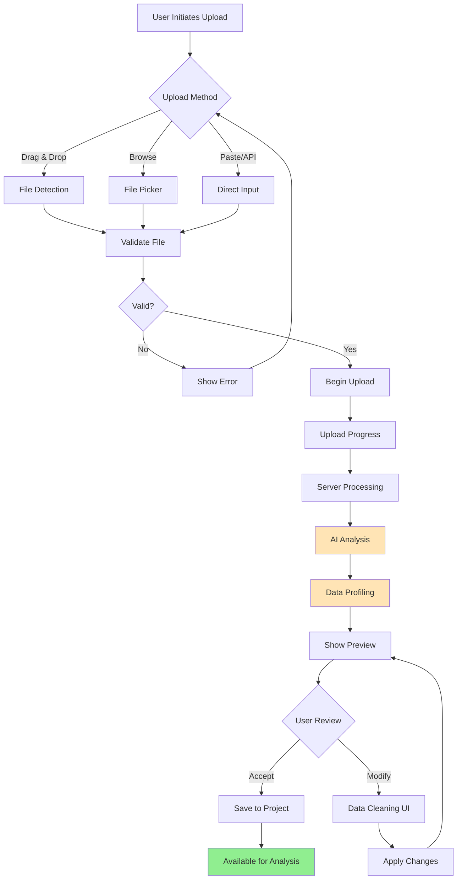
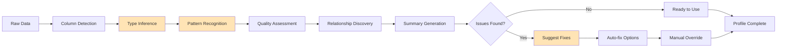
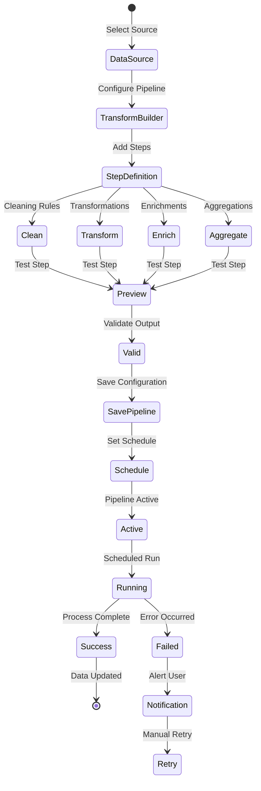
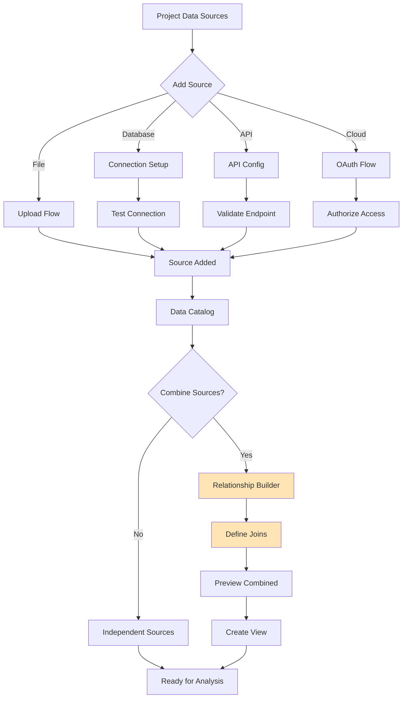

# User Flows & Wireframes - Data Upload & Processing

## 1. Overview

Data Upload & Processing is the gateway to insights in Jabiru. This document details all flows related to getting data into the system, including file uploads, data source connections, AI-powered profiling, cleaning, and transformation capabilities. The focus is on automation and intelligence to minimize manual data preparation work.

## 2. Data Upload & Processing Flows

### 2.1. Primary File Upload Flow



### 2.2. AI-Powered Data Profiling Flow



### 2.3. Data Transformation Pipeline Flow



### 2.4. Multi-Source Data Integration Flow



## 3. Data Upload & Processing Wireframes

### 3.1. Data Sources Dashboard

```
┌─────────────────────────────────────────────────────────────────┐
│ 📊 Data Sources - My E-commerce Project          [+ Add Source] │
├─────────────────────────────────────────────────────────────────┤
│                                                                 │
│ [🔍 Search sources...]                    [Filter: All ▼] [⚙️]  │
│                                                                 │
│ Your Data Sources (3)                                           │
│ ┌─────────────────────────────────────────────────────────────┐│
│ │ ┌─────────────────────────────────┬─────────────────────┐  ││
│ │ │ 📄 sales_data_2024.csv          │ 🟢 Active           │  ││
│ │ │                                 │                     │  ││
│ │ │ 15,234 rows × 12 columns        │ Updated: 2 hrs ago │  ││
│ │ │ Monthly sales transactions      │ Next refresh: Daily │  ││
│ │ │                                 │                     │  ││
│ │ │ [View] [Edit] [Refresh] [⋮]     │ 98% data quality   │  ││
│ │ └─────────────────────────────────┴─────────────────────┘  ││
│ │                                                             ││
│ │ ┌─────────────────────────────────┬─────────────────────┐  ││
│ │ │ 🔗 PostgreSQL - Orders DB       │ 🟢 Connected        │  ││
│ │ │                                 │                     │  ││
│ │ │ 3 tables, 125k total rows       │ Live connection     │  ││
│ │ │ orders, customers, products     │ Last sync: 1 min   │  ││
│ │ │                                 │                     │  ││
│ │ │ [Explore] [Settings] [Test] [⋮] │ No issues          │  ││
│ │ └─────────────────────────────────┴─────────────────────┘  ││
│ │                                                             ││
│ │ ┌─────────────────────────────────┬─────────────────────┐  ││
│ │ │ 📊 Google Sheets - Marketing    │ ⚠️ Needs attention  │  ││
│ │ │                                 │                     │  ││
│ │ │ 5 sheets, 2,341 rows            │ Permission needed  │  ││
│ │ │ Campaign performance data       │ Last sync: Failed  │  ││
│ │ │                                 │                     │  ││
│ │ │ [Reconnect] [View Error] [⋮]    │ [Fix Now]          │  ││
│ │ └─────────────────────────────────┴─────────────────────┘  ││
│ └─────────────────────────────────────────────────────────────┘│
│                                                                 │
│ 💡 Tip: Combine multiple sources to create unified datasets     │
└─────────────────────────────────────────────────────────────────┘
```

### 3.2. Add Data Source Modal

```
┌─────────────────────────────────────────────────────────────────┐
│ Add Data Source                                            [×]  │
├─────────────────────────────────────────────────────────────────┤
│                                                                 │
│ Choose how to add your data:                                   │
│                                                                 │
│ ┌─────────────────────────────────────────────────────────────┐│
│ │ 📁 File Upload                                   Most Used  ││
│ │ Upload CSV, Excel, JSON, or Parquet files                  ││
│ │ Perfect for: Reports, exports, one-time analysis           ││
│ │                                          [Select Files →]   ││
│ ├─────────────────────────────────────────────────────────────┤│
│ │ 🔗 Database Connection                                      ││
│ │ Connect to PostgreSQL, MySQL, BigQuery, Snowflake          ││
│ │ Perfect for: Live data, large datasets, auto-refresh       ││
│ │                                            [Connect →]      ││
│ ├─────────────────────────────────────────────────────────────┤│
│ │ ☁️ Cloud Services                                           ││
│ │ Google Sheets, Salesforce, Stripe, Shopify                 ││
│ │ Perfect for: Business tools, SaaS data, team data          ││
│ │                                          [Browse Apps →]    ││
│ ├─────────────────────────────────────────────────────────────┤│
│ │ 🌐 API / Webhook                                            ││
│ │ REST API, GraphQL, Webhooks, Custom endpoints              ││
│ │ Perfect for: Real-time data, custom integrations           ││
│ │                                         [Configure →]       ││
│ └─────────────────────────────────────────────────────────────┘│
└─────────────────────────────────────────────────────────────────┘
```

### 3.3. File Upload Interface

```
┌─────────────────────────────────────────────────────────────────┐
│ Upload Files                                     [Cancel] [×]   │
├─────────────────────────────────────────────────────────────────┤
│                                                                 │
│ ┌─────────────────────────────────────────────────────────────┐│
│ │                                                             ││
│ │                                                             ││
│ │                    📁 Drop files here                       ││
│ │                                                             ││
│ │               or [Browse Files] to upload                   ││
│ │                                                             ││
│ │                                                             ││
│ │     Supports: CSV, XLS, XLSX, JSON, Parquet, TSV          ││
│ │              Maximum size: 1GB per file                     ││
│ │                                                             ││
│ └─────────────────────────────────────────────────────────────┘│
│                                                                 │
│ Recent Uploads:                                                 │
│ • orders_march_2024.csv - 2 days ago                           │
│ • customer_data.xlsx - 1 week ago                              │
│ • product_catalog.json - 2 weeks ago                           │
│                                                                 │
│ [Import from URL] [Connect Google Drive] [Use Sample Data]     │
└─────────────────────────────────────────────────────────────────┘
```

### 3.4. Upload Progress & Processing

```
┌─────────────────────────────────────────────────────────────────┐
│ Processing Your Data                              ⏸️ ⏹️ [×]     │
├─────────────────────────────────────────────────────────────────┤
│                                                                 │
│ sales_transactions_2024.csv                                     │
│                                                                 │
│ ┌─────────────────────────────────────────────────────────────┐│
│ │ Upload Progress                                             ││
│ │ ████████████████████████████████████░░░░░  85% (17.3 MB)  ││
│ │ Speed: 2.1 MB/s • Time remaining: 3 seconds                ││
│ └─────────────────────────────────────────────────────────────┘│
│                                                                 │
│ ┌─────────────────────────────────────────────────────────────┐│
│ │ ✓ File uploaded successfully                               ││
│ │ ⚡ Analyzing data structure...                              ││
│ │ ○ Detecting data types                                     ││
│ │ ○ Profiling data quality                                   ││
│ │ ○ Finding patterns and relationships                       ││
│ └─────────────────────────────────────────────────────────────┘│
│                                                                 │
│ 🤖 AI Analysis in Progress:                                     │
│ ┌─────────────────────────────────────────────────────────────┐│
│ │ "I'm detecting e-commerce transaction data with seasonal   ││
│ │  patterns. Found 24,567 orders across 12 months..."        ││
│ │                                                             ││
│ │ [AI thinking animation...]                                 ││
│ └─────────────────────────────────────────────────────────────┘│
│                                                                 │
│ This usually takes 10-30 seconds depending on file size        │
└─────────────────────────────────────────────────────────────────┘
```

### 3.5. AI Data Profiling Results

```
┌─────────────────────────────────────────────────────────────────┐
│ 📊 Data Profile: sales_transactions_2024.csv     [Accept] [Edit]│
├─────────────────────────────────────────────────────────────────┤
│                                                                 │
│ Overview                                      Data Quality: 94% │
│ ┌─────────────────────────────────────────────────────────────┐│
│ │ 📏 24,567 rows × 15 columns                                ││
│ │ 📅 Date range: Jan 1, 2024 - Dec 31, 2024                 ││
│ │ 💾 File size: 20.4 MB                                      ││
│ │ 🏢 Detected type: E-commerce transactions                  ││
│ └─────────────────────────────────────────────────────────────┘│
│                                                                 │
│ Column Analysis                            [Show Raw Data ▼]    │
│ ┌─────────────────────────────────────────────────────────────┐│
│ │ Column          │ Type      │ Quality │ Unique │ Pattern  ││
│ ├─────────────────┼───────────┼─────────┼────────┼──────────┤│
│ │ order_id        │ Text → ID │ 100% ✓  │ 24,567 │ ORD-#### ││
│ │ order_date      │ Date ✓    │ 100% ✓  │ 365    │ MM/DD/YY ││
│ │ customer_email  │ Email ✓   │ 98% ⚠️   │ 8,234  │ Valid    ││
│ │ product_name    │ Text ✓    │ 100% ✓  │ 342    │ -        ││
│ │ quantity        │ Number ✓  │ 100% ✓  │ 15     │ Integer  ││
│ │ unit_price      │ Currency✓ │ 99% ⚠️   │ 89     │ $##.##   ││
│ │ total_amount    │ Currency✓ │ 100% ✓  │ 1,234  │ $###.##  ││
│ │ discount_code   │ Text ✓    │ 45% ⚠️   │ 23     │ SAVE##   ││
│ │ shipping_method │ Category✓ │ 100% ✓  │ 4      │ List     ││
│ └─────────────────────────────────────────────────────────────┘│
│                                                                 │
│ 🔍 AI Insights:                                                 │
│ • Peak sales in December (Black Friday effect detected)        │
│ • 523 duplicate emails found (might be repeat customers)       │
│ • Missing discount codes are normal (55% full price)           │
│ • Currency formatting is consistent                            │
│                                                                 │
│ [View Detailed Report] [Download Profile] [Set Up Cleaning]    │
└─────────────────────────────────────────────────────────────────┘
```

### 3.6. Data Cleaning Interface

```
┌─────────────────────────────────────────────────────────────────┐
│ 🧹 Data Cleaning: sales_transactions_2024       [Preview] [Apply]│
├─────────────────────────────────────────────────────────────────┤
│                                                                 │
│ Suggested Cleaning Actions:                      3 issues found │
│                                                                 │
│ ┌─────────────────────────────────────────────────────────────┐│
│ │ ⚠️ Missing Values (453 cells)                    [Fix All] ││
│ │                                                             ││
│ │ discount_code: 13,542 empty values                         ││
│ │ Suggestion: Fill with "NO_DISCOUNT"              [Apply]   ││
│ │                                                             ││
│ │ customer_phone: 234 empty values                           ││
│ │ Suggestion: Keep empty (not required)            [Apply]   ││
│ ├─────────────────────────────────────────────────────────────┤│
│ │ 📧 Invalid Emails (12 found)                    [Fix All]  ││
│ │                                                             ││
│ │ Row 1,234: "john@.com" → Missing domain          [Fix]     ││
│ │ Row 5,678: "test@test" → Invalid format          [Fix]     ││
│ │ Row 8,901: "@company.com" → Missing name         [Fix]     ││
│ │                                                  [View All] ││
│ ├─────────────────────────────────────────────────────────────┤│
│ │ 💰 Currency Formatting (89 inconsistent)        [Fix All]  ││
│ │                                                             ││
│ │ Convert all to standard format: $1,234.56                  ││
│ │ • "1234.5" → "$1,234.50"                                   ││
│ │ • "$1234" → "$1,234.00"                                    ││
│ │ • "1,234.5" → "$1,234.50"                                  ││
│ └─────────────────────────────────────────────────────────────┘│
│                                                                 │
│ Custom Rules:                                    [+ Add Rule]   │
│ • Remove test orders (email contains "test")         [Active]  │
│ • Exclude refunded orders (status = "refunded")      [Active]  │
│                                                                 │
│ [Reset] [Save as Template] [Apply Selected] [Apply All]        │
└─────────────────────────────────────────────────────────────────┘
```

### 3.7. Data Transformation Builder

```
┌─────────────────────────────────────────────────────────────────┐
│ 🔄 Transform: sales_transactions_2024        [Test] [Save] [×] │
├─────────────────────────────────────────────────────────────────┤
│                                                                 │
│ ┌────────────────┬────────────────────────────────────────────┐│
│ │ Steps          │ Step 2: Calculate Metrics                   ││
│ │                │                                              ││
│ │ 1. Clean Data  │ Add calculated columns to your data:        ││
│ │ 2. Calculate ▶ │                                              ││
│ │ 3. Reshape     │ ┌──────────────────────────────────────────┐││
│ │ 4. Aggregate   │ │ Column Name: [revenue_after_discount   ]│││
│ │                │ │                                          │││
│ │ [+ Add Step]   │ │ Formula:                                 │││
│ │                │ │ [total_amount - (total_amount *         ]│││
│ │                │ │ [discount_percentage / 100)             ]│││
│ │                │ │                                          │││
│ │                │ │ ✓ Formula is valid                       │││
│ │                │ │                                          │││
│ │                │ │ Preview:                                 │││
│ │                │ │ • Row 1: $95.00 - 10% = $85.50         │││
│ │                │ │ • Row 2: $150.00 - 0% = $150.00        │││
│ │                │ └──────────────────────────────────────────┘││
│ │                │                                              ││
│ │                │ [+ Add Another Column]                       ││
│ │                │                                              ││
│ │                │ Existing Calculations:                       ││
│ │                │ • order_value_category (High/Med/Low)       ││
│ │                │ • days_since_order                          ││
│ │                │ • is_repeat_customer                        ││
│ └────────────────┴────────────────────────────────────────────┘│
│                                                                 │
│ Output Preview:                                   5,234 rows    │
│ [▼ Show sample data with transformations applied]              │
└─────────────────────────────────────────────────────────────────┘
```

### 3.8. Database Connection Setup

```
┌─────────────────────────────────────────────────────────────────┐
│ Connect to Database                           [Test] [Connect]  │
├─────────────────────────────────────────────────────────────────┤
│                                                                 │
│ Database Type: [PostgreSQL ▼]                                   │
│               • PostgreSQL                                      │
│               • MySQL                                           │
│               • BigQuery                                        │
│               • Snowflake                                       │
│               • Redshift                                        │
│                                                                 │
│ Connection Details:                                             │
│ ┌─────────────────────────────────────────────────────────────┐│
│ │ Host:     [analytics.company.com                         ] ││
│ │ Port:     [5432                                           ] ││
│ │ Database: [production_analytics                           ] ││
│ │ Username: [readonly_user                                  ] ││
│ │ Password: [••••••••••••                                   ] ││
│ │                                                             ││
│ │ ☑ Use SSL connection                                       ││
│ │ ☐ Use SSH tunnel                                           ││
│ └─────────────────────────────────────────────────────────────┘│
│                                                                 │
│ Advanced Options:                                    [Show ▼]   │
│                                                                 │
│ Test Results:                                                   │
│ ┌─────────────────────────────────────────────────────────────┐│
│ │ ✓ Connection successful                                     ││
│ │ ✓ 12 tables found                                          ││
│ │ ✓ Read permissions verified                                ││
│ │                                                             ││
│ │ Available tables: orders, customers, products...  [Browse] ││
│ └─────────────────────────────────────────────────────────────┘│
└─────────────────────────────────────────────────────────────────┘
```

### 3.9. Table/Data Selection from Database

```
┌─────────────────────────────────────────────────────────────────┐
│ Select Data to Import                         [Preview] [Import]│
├─────────────────────────────────────────────────────────────────┤
│                                                                 │
│ 🗄️ production_analytics                    [🔍 Search tables...] │
│                                                                 │
│ ┌─────────────────────────────────────────────────────────────┐│
│ │ Tables (12)                              Sync Options       ││
│ │                                                             ││
│ │ ☑ orders (125,432 rows)                 [Full ▼] [Daily ▼] ││
│ │   Last updated: 2 minutes ago                              ││
│ │   Columns: order_id, customer_id, date, total...           ││
│ │                                                             ││
│ │ ☑ customers (45,231 rows)               [Full ▼] [Weekly ▼]││
│ │   Last updated: 1 hour ago                                 ││
│ │   Columns: customer_id, email, name, created_at...         ││
│ │                                                             ││
│ │ ☐ products (1,234 rows)                 [Full ▼] [Manual ▼]││
│ │   Last updated: 3 days ago                                 ││
│ │   Columns: product_id, name, category, price...            ││
│ │                                                             ││
│ │ [Select All] [Clear]                    More tables...     ││
│ └─────────────────────────────────────────────────────────────┘│
│                                                                 │
│ Query Builder (Advanced):                         [Switch View] │
│ ┌─────────────────────────────────────────────────────────────┐│
│ │ SELECT * FROM orders                                       ││
│ │ WHERE created_at >= '2024-01-01'                          ││
│ │ LIMIT 1000                                                 ││
│ │                                                             ││
│ │ [Validate Query] [Save as View]                            ││
│ └─────────────────────────────────────────────────────────────┘│
│                                                                 │
│ Estimated import: ~2.3 MB, < 1 minute                          │
└─────────────────────────────────────────────────────────────────┘
```

### 3.10. Wide Data Detection & Unpivot

```
┌─────────────────────────────────────────────────────────────────┐
│ 📊 Data Structure Optimization                   [Skip] [Apply] │
├─────────────────────────────────────────────────────────────────┤
│                                                                 │
│ We detected your data is in "wide" format:                     │
│                                                                 │
│ Current Structure:                                              │
│ ┌─────────────────────────────────────────────────────────────┐│
│ │ Product  │ Jan │ Feb │ Mar │ Apr │ May │ Jun │ ... │ Dec  ││
│ ├──────────┼─────┼─────┼─────┼─────┼─────┼─────┼─────┼──────┤│
│ │ Laptop   │ 120 │ 135 │ 128 │ 142 │ 156 │ 149 │ ... │ 289  ││
│ │ Phone    │ 340 │ 325 │ 358 │ 392 │ 401 │ 423 │ ... │ 567  ││
│ │ Tablet   │ 89  │ 92  │ 87  │ 95  │ 103 │ 98  │ ... │ 145  ││
│ └─────────────────────────────────────────────────────────────┘│
│                                                                 │
│ 🔄 Suggested "Long" Format (Better for analysis):              │
│ ┌─────────────────────────────────────────────────────────────┐│
│ │ Product  │ Month │ Sales │        Benefits:                 ││
│ ├──────────┼───────┼───────┤        • Easy filtering by month ││
│ │ Laptop   │ Jan   │ 120   │        • Time series analysis    ││
│ │ Laptop   │ Feb   │ 135   │        • Flexible aggregations   ││
│ │ Laptop   │ Mar   │ 128   │        • Standard for BI tools   ││
│ │ Phone    │ Jan   │ 340   │                                  ││
│ │ Phone    │ Feb   │ 325   │        [Preview Full Transform] ││
│ └─────────────────────────────────────────────────────────────┘│
│                                                                 │
│ Column Mapping:                                                 │
│ • Keep columns: [Product ▼]                                    │
│ • Month column name: [Month          ]                         │
│ • Value column name: [Sales          ]                         │
│                                                                 │
│ [Keep Wide Format] [Apply Unpivot] [Learn More]                │
└─────────────────────────────────────────────────────────────────┘
```

### 3.11. ETL Pipeline Configuration

```
┌─────────────────────────────────────────────────────────────────┐
│ ⚙️ Configure Data Pipeline: Daily Sales Update    [Save] [Run] │
├─────────────────────────────────────────────────────────────────┤
│                                                                 │
│ Pipeline Flow:                                                  │
│ ┌─────────────────────────────────────────────────────────────┐│
│ │  [DB] → [Extract] → [Clean] → [Transform] → [Load] → [📊]  ││
│ │         ↓           ↓         ↓             ↓               ││
│ │      orders      Remove    Calculate    Update          ││
│ │      table       nulls     metrics      dataset         ││
│ └─────────────────────────────────────────────────────────────┘│
│                                                                 │
│ 1. Source Configuration                           [Edit]        │
│ ┌─────────────────────────────────────────────────────────────┐│
│ │ Source: PostgreSQL - production_analytics                  ││
│ │ Table: orders                                              ││
│ │ Filter: WHERE created_at >= CURRENT_DATE - 1               ││
│ │ Mode: Incremental (new records only)                       ││
│ └─────────────────────────────────────────────────────────────┘│
│                                                                 │
│ 2. Transformations                               [Edit]         │
│ ┌─────────────────────────────────────────────────────────────┐│
│ │ • Remove test orders (email LIKE '%test%')                ││
│ │ • Calculate order_value_tier                               ││
│ │ • Add customer_lifetime_value lookup                       ││
│ │ • Aggregate by product_category                            ││
│ └─────────────────────────────────────────────────────────────┘│
│                                                                 │
│ 3. Schedule                                      [Edit]         │
│ ┌─────────────────────────────────────────────────────────────┐│
│ │ Frequency: Daily at 6:00 AM EST                            ││
│ │ Retry on failure: 3 times, 5 min interval                  ││
│ │ Alert on failure: email@company.com                        ││
│ │ Next run: Tomorrow, 6:00 AM (in 14 hours)                  ││
│ └─────────────────────────────────────────────────────────────┘│
│                                                                 │
│ [Test Pipeline] [View History] [Duplicate] [Delete]            │
└─────────────────────────────────────────────────────────────────┘
```

### 3.12. Pipeline Monitoring Dashboard

```
┌─────────────────────────────────────────────────────────────────┐
│ 📊 Pipeline Monitor: Daily Sales Update          [⚙️] [Refresh] │
├─────────────────────────────────────────────────────────────────┤
│                                                                 │
│ Status: 🟢 Healthy          Last Run: 2 hours ago (Success)    │
│ Next Run: Tomorrow 6:00 AM  Uptime: 99.2% (30 days)           │
│                                                                 │
│ Recent Runs:                                                    │
│ ┌─────────────────────────────────────────────────────────────┐│
│ │ Date/Time          │ Status │ Duration │ Rows  │ Actions   ││
│ ├────────────────────┼────────┼──────────┼───────┼───────────┤│
│ │ Today, 6:00 AM     │ ✅     │ 2m 34s   │ 1,234 │ [View]    ││
│ │ Yesterday, 6:00 AM │ ✅     │ 2m 28s   │ 1,198 │ [View]    ││
│ │ Dec 28, 6:00 AM    │ ✅     │ 2m 41s   │ 1,456 │ [View]    ││
│ │ Dec 27, 6:00 AM    │ ⚠️     │ 5m 12s   │ 1,234 │ [Details] ││
│ │ Dec 26, 6:00 AM    │ ✅     │ 2m 33s   │ 987   │ [View]    ││
│ └─────────────────────────────────────────────────────────────┘│
│                                                                 │
│ Performance Metrics:                                            │
│ ┌─────────────────────────────────────────────────────────────┐│
│ │ Average Duration: 2m 45s      Processing Rate: 450 rows/s  ││
│ │                                                             ││
│ │ [Chart showing run duration over last 30 days]             ││
│ │                                                             ││
│ │ Data Quality Trends:                                        ││
│ │ • Missing values: 0.2% ↓     • Duplicates: 0 ✓            ││
│ │ • Format errors: 0.1% ↓      • Validation: 100% ✓         ││
│ └─────────────────────────────────────────────────────────────┘│
│                                                                 │
│ [Pause Pipeline] [Run Now] [Edit Configuration] [Export Logs]  │
└─────────────────────────────────────────────────────────────────┘
```

## 4. Mobile Data Upload Experience

### 4.1. Mobile Data Sources List

```
┌─────────────────────────────────────────┐
│ 📊 Data Sources                    [+]  │
├─────────────────────────────────────────┤
│                                         │
│ ┌─────────────────────────────────────┐│
│ │ 📄 sales_2024.csv                   ││
│ │ 15k rows • Updated 2h ago           ││
│ │ [View] [Refresh] [⋮]                ││
│ └─────────────────────────────────────┘│
│                                         │
│ ┌─────────────────────────────────────┐│
│ │ 🔗 Orders Database                  ││
│ │ Connected • Live sync               ││
│ │ [Explore] [Settings]                ││
│ └─────────────────────────────────────┘│
│                                         │
│ ┌─────────────────────────────────────┐│
│ │ + Add New Source                    ││
│ │ Upload, connect, or import          ││
│ └─────────────────────────────────────┘│
│                                         │
│ [Home] [Data] [Canvas] [Settings]       │
└─────────────────────────────────────────┘
```

### 4.2. Mobile Upload Flow

```
┌─────────────────────────────────────────┐
│ Add Data                           [×]  │
├─────────────────────────────────────────┤
│                                         │
│ ┌─────────────────────────────────────┐│
│ │ 📁 From Device                      ││
│ │ Upload from your phone              ││
│ └─────────────────────────────────────┘│
│                                         │
│ ┌─────────────────────────────────────┐│
│ │ 📷 Take Photo                       ││
│ │ Scan receipts or documents          ││
│ └─────────────────────────────────────┘│
│                                         │
│ ┌─────────────────────────────────────┐│
│ │ ☁️ Cloud Storage                    ││
│ │ Google Drive, Dropbox, iCloud       ││
│ └─────────────────────────────────────┘│
│                                         │
│ ┌─────────────────────────────────────┐│
│ │ 📧 Email to Jabiru                  ││
│ │ data@impala.ai                      ││
│ └─────────────────────────────────────┘│
└─────────────────────────────────────────┘
```

## 5. Error States & Recovery

### 5.1. Upload Error

```
┌─────────────────────────────────────────────────────────────────┐
│ ❌ Upload Failed                                                │
├─────────────────────────────────────────────────────────────────┤
│                                                                 │
│ We couldn't process your file:                                 │
│                                                                 │
│ File: sales_data_corrupted.csv                                 │
│ Error: Invalid CSV format on line 1,234                        │
│                                                                 │
│ ┌─────────────────────────────────────────────────────────────┐│
│ │ Line 1,233: "Product A", 100, 29.99, "2024-01-15"         ││
│ │ Line 1,234: "Product B, Special", 50, 49.99 "2024-01-16   ││
│ │              ❌ Missing comma     ❌ Missing quote         ││
│ └─────────────────────────────────────────────────────────────┘│
│                                                                 │
│ How to fix:                                                     │
│ • Check for missing quotes around text with commas             │
│ • Ensure all rows have the same number of columns              │
│ • Remove any special characters in headers                      │
│                                                                 │
│ [Download Error Report] [Try Different File] [Get Help]        │
└─────────────────────────────────────────────────────────────────┘
```

### 5.2. Connection Error

```
┌─────────────────────────────────────────────────────────────────┐
│ ⚠️ Connection Issue                              [Retry] [×]    │
├─────────────────────────────────────────────────────────────────┤
│                                                                 │
│ Cannot connect to database:                                     │
│ PostgreSQL - analytics.company.com                              │
│                                                                 │
│ Error Details:                                                  │
│ ┌─────────────────────────────────────────────────────────────┐│
│ │ Connection timed out after 30 seconds                       ││
│ │ SQLSTATE[08006]                                             ││
│ │                                                             ││
│ │ Possible causes:                                            ││
│ │ • Database server is down                                   ││
│ │ • Firewall blocking connection                              ││
│ │ • Invalid credentials                                       ││
│ │ • Network connectivity issues                               ││
│ └─────────────────────────────────────────────────────────────┘│
│                                                                 │
│ Troubleshooting:                                                │
│ • Verify database is accessible from your network              │
│ • Check if IP whitelist includes your address: 192.168.1.100  │
│ • Test connection with database client                         │
│                                                                 │
│ [Edit Connection] [Test Different Database] [Contact Support]   │
└─────────────────────────────────────────────────────────────────┘
```

## 6. Advanced Features

### 6.1. Multi-File Upload with Relationships

```
┌─────────────────────────────────────────────────────────────────┐
│ 🔗 Define Relationships                          [Auto-detect]  │
├─────────────────────────────────────────────────────────────────┤
│                                                                 │
│ Files uploaded: 3                                               │
│ • orders.csv (10,234 rows)                                     │
│ • customers.csv (3,456 rows)                                   │
│ • products.csv (234 rows)                                      │
│                                                                 │
│ Detected Relationships:                                         │
│ ┌─────────────────────────────────────────────────────────────┐│
│ │ orders.customer_id ←→ customers.id                         ││
│ │ Confidence: 98% (9,987 matches found)            [Confirm] ││
│ │                                                             ││
│ │ orders.product_sku ←→ products.sku                         ││
│ │ Confidence: 100% (all values match)              [Confirm] ││
│ │                                                             ││
│ │ + Add manual relationship                                   ││
│ └─────────────────────────────────────────────────────────────┘│
│                                                                 │
│ Join Preview:                                                   │
│ ┌─────────────────────────────────────────────────────────────┐│
│ │ Combined dataset will have:                                 ││
│ │ • 10,234 rows (preserving all orders)                      ││
│ │ • 45 columns total                                         ││
│ │ • Customer names and emails added to orders                ││
│ │ • Product details added to orders                          ││
│ │                                          [Preview Data]    ││
│ └─────────────────────────────────────────────────────────────┘│
│                                                                 │
│ [Create Separate Tables] [Create Combined View] [Advanced]     │
└─────────────────────────────────────────────────────────────────┘
```

### 6.2. Data Versioning

```
┌─────────────────────────────────────────────────────────────────┐
│ 📚 Version History: sales_data.csv              [Compare] [×]  │
├─────────────────────────────────────────────────────────────────┤
│                                                                 │
│ Current Version: v4 (Active)                                    │
│                                                                 │
│ ┌─────────────────────────────────────────────────────────────┐│
│ │ Version │ Date/Time         │ Changes    │ Uploaded By     ││
│ ├─────────┼───────────────────┼────────────┼─────────────────┤│
│ │ v4 ●    │ Today, 2:30 PM    │ +234 rows  │ You             ││
│ │         │                   │ Dec data   │                 ││
│ │         │                   │            │ [Revert]        ││
│ ├─────────┼───────────────────┼────────────┼─────────────────┤│
│ │ v3      │ Dec 1, 9:00 AM    │ +198 rows  │ Sarah J.        ││
│ │         │                   │ Nov data   │                 ││
│ │         │                   │            │ [View] [Revert] ││
│ ├─────────┼───────────────────┼────────────┼─────────────────┤│
│ │ v2      │ Nov 1, 9:15 AM    │ Fixed      │ You             ││
│ │         │                   │ formatting │                 ││
│ │         │                   │            │ [View] [Revert] ││
│ ├─────────┼───────────────────┼────────────┼─────────────────┤│
│ │ v1      │ Oct 15, 3:00 PM   │ Initial    │ You             ││
│ │         │                   │ upload     │                 ││
│ │         │                   │            │ [View]          ││
│ └─────────┴───────────────────┴────────────┴─────────────────┘│
│                                                                 │
│ Storage used: 45.2 MB of 10 GB (0.5%)                          │
│                                                                 │
│ [Download Version] [Delete Old Versions] [Export History]      │
└─────────────────────────────────────────────────────────────────┘
```

## 7. Implementation Notes

### 7.1. Performance Optimization

- **Chunked uploads** for large files
- **Streaming processing** to show results as available
- **Smart sampling** for instant previews
- **Background processing** for heavy operations
- **Caching** of profiling results

### 7.2. Data Quality Features

- **Automatic type detection** with confidence scores
- **Pattern recognition** for common formats
- **Anomaly detection** in data distributions
- **Relationship discovery** between tables
- **Data lineage tracking** for transformations

### 7.3. Security Considerations

- **Client-side encryption** option for sensitive data
- **Secure file transfer** with progress tracking
- **Connection string encryption** for databases
- **Row-level security** for shared sources
- **Audit logging** of all data operations

## 8. Success Metrics

### 8.1. Upload Success Metrics

- **Upload success rate**: > 95%
- **Average processing time**: < 30s for files under 100MB
- **Auto-detection accuracy**: > 90% for data types
- **User intervention required**: < 20% of uploads

### 8.2. Data Quality Metrics

- **Clean data on first try**: > 80%
- **Successful transformations**: > 95%
- **Pipeline reliability**: > 99% uptime
- **Error recovery rate**: > 90% auto-recovery
