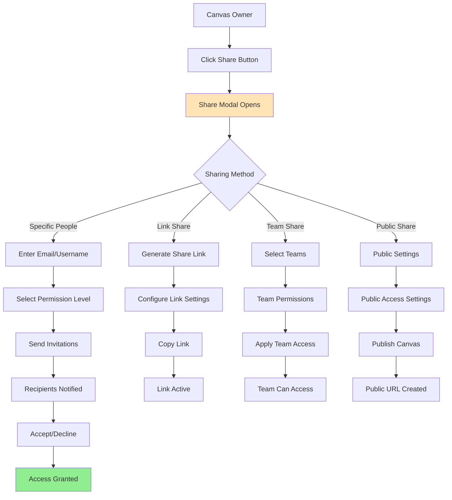
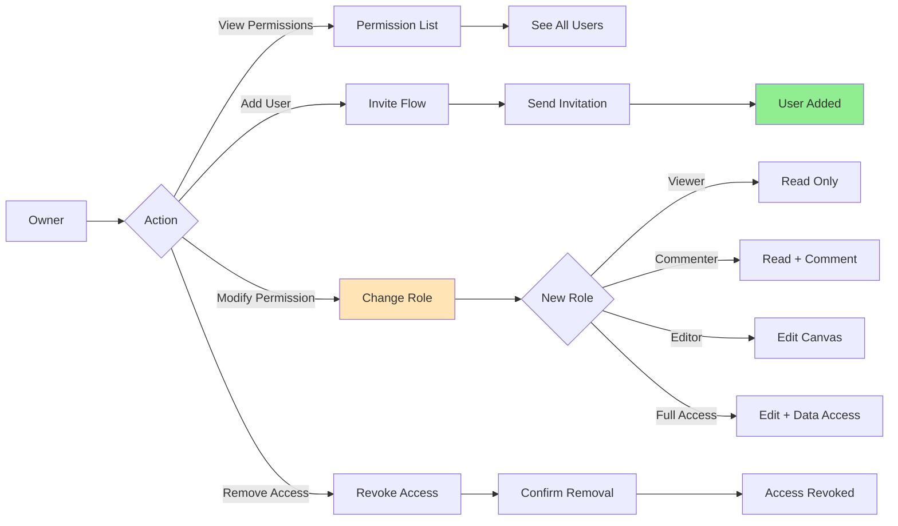
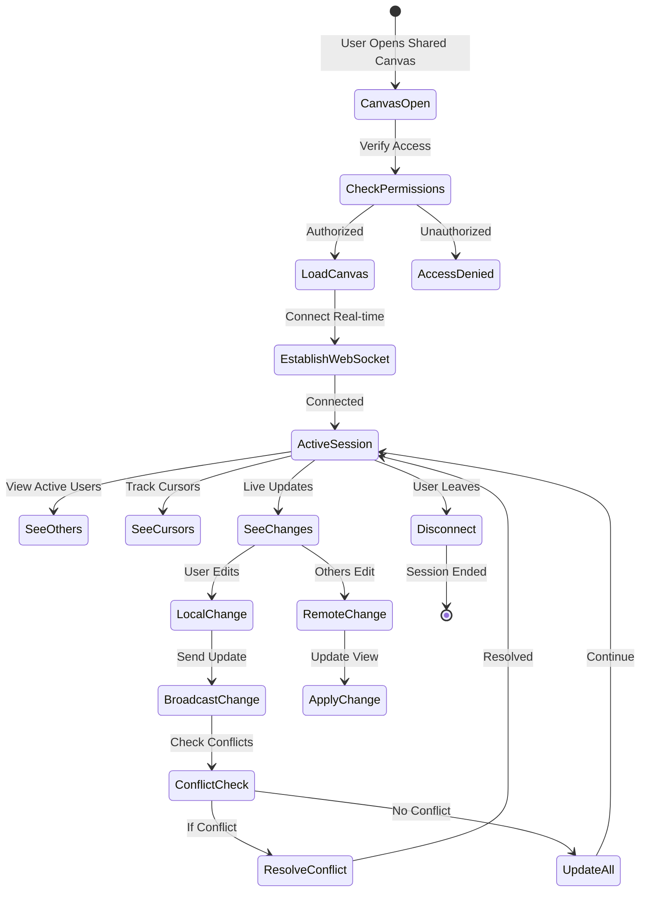

# User Flows & Wireframes - Canvas Sharing & Collaboration

## 1. Overview

Canvas Sharing & Collaboration transforms Jabiru from a personal analytics tool into a collaborative platform where teams can work together on data insights. This document details all flows related to sharing canvases, managing permissions, real-time collaboration, and team workflows.

## 2. Canvas Sharing & Collaboration Flows

### 2.1. Canvas Sharing Flow



### 2.2. Permission Management Flow



### 2.3. Real-time Collaboration Flow



### 2.4. Comment Thread Flow

```mermaid
graph TD
    A[User Views Canvas] --> B[Sees Commentable Element]
    B --> C[Click Comment Icon]
    C --> D[Comment Panel Opens]
    D --> E{Action Type}

    E -->|New Comment| F[Type Comment]
    E -->|Reply| G[Type Reply]
    E -->|View Thread| H[Read Discussion]

    F --> I[@Mention Users?]
    G --> I
    I -->|Yes| J[User Search]
    I -->|No| K[Post Comment]
    J --> L[Select Users]
    L --> K

    K --> M[Comment Posted]
    M --> N[Notifications Sent]
    N --> O[Thread Updated]

    H --> P{User Action}
    P -->|Reply| G
    P -->|Resolve| Q[Mark Resolved]
    P -->|React| R[Add Reaction]

    Q --> S[Thread Archived]
    R --> T[Update Reactions]

    style M fill:#90EE90
    style N fill:#FFE4B5
```

## 3. Canvas Sharing & Collaboration Wireframes

### 3.1. Canvas Header with Share Button

```
┌─────────────────────────────────────────────────────────────────┐
│ Q1 2024 Sales Analysis                                          │
│ Last edited 2 minutes ago by You                               │
│                                                                 │
│ [👁 View Only] [💬 12] [↗ Share] [⋮ More]                      │
│                                                                 │
│ ┌─────────────────────────────────────────────────────────────┐│
│ │ 👥 Active Now (3)                                           ││
│ │ ● You  ● Sarah Chen  ● Mike Johnson                        ││
│ └─────────────────────────────────────────────────────────────┘│
├─────────────────────────────────────────────────────────────────┤
│                     [Canvas Content]                            │
└─────────────────────────────────────────────────────────────────┘
```

### 3.2. Share Canvas Modal

```
┌─────────────────────────────────────────────────────────────────┐
│ Share "Q1 2024 Sales Analysis"                            [×]  │
├─────────────────────────────────────────────────────────────────┤
│                                                                 │
│ ┌─────────────────────────────────────────────────────────────┐│
│ │ 👤 Share with People                                        ││
│ │ ┌─────────────────────────────────────────────────────────┐││
│ │ │ 🔍 Enter email, name, or team...                        │││
│ │ └─────────────────────────────────────────────────────────┘││
│ │                                                             ││
│ │ Suggestions:                                                ││
│ │ ┌─────────────────────────────────────────────────────────┐││
│ │ │ 👤 John Smith          john@company.com                 │││
│ │ │ 👤 Sarah Chen          sarah@company.com                │││
│ │ │ 👥 Marketing Team      8 members                        │││
│ │ │ 👥 Leadership Team     5 members                        │││
│ │ └─────────────────────────────────────────────────────────┘││
│ └─────────────────────────────────────────────────────────────┘│
│                                                                 │
│ Permission Level:                                               │
│ ┌─────────────────────────────────────────────────────────────┐│
│ │ [👁 Viewer ▼]                                               ││
│ │                                                             ││
│ │ 👁 Viewer      Can view only                               ││
│ │ 💬 Commenter  Can view and comment                         ││
│ │ ✏️ Editor     Can edit canvas (not data)                   ││
│ │ 🔓 Full Access Can edit canvas and underlying data         ││
│ └─────────────────────────────────────────────────────────────┘│
│                                                                 │
│ ☐ Notify people via email                                      │
│ ┌─────────────────────────────────────────────────────────────┐│
│ │ Add a message (optional):                                   ││
│ │ Check out our Q1 performance analysis...                    ││
│ └─────────────────────────────────────────────────────────────┘│
│                                                                 │
│                                    [Cancel] [Share]            │
└─────────────────────────────────────────────────────────────────┘
```

### 3.3. Link Sharing Settings

```
┌─────────────────────────────────────────────────────────────────┐
│ Share "Q1 2024 Sales Analysis"                   [Back] [×]    │
├─────────────────────────────────────────────────────────────────┤
│                                                                 │
│ 🔗 Share with Link                                              │
│                                                                 │
│ ┌─────────────────────────────────────────────────────────────┐│
│ │ Link Sharing: [ON ✓]                                        ││
│ │                                                             ││
│ │ Anyone with this link can:                                  ││
│ │ [👁 View ▼]                                                 ││
│ │ • View                                                      ││
│ │ • Comment                                                   ││
│ │ • Edit (Requires sign in)                                   ││
│ └─────────────────────────────────────────────────────────────┘│
│                                                                 │
│ ┌─────────────────────────────────────────────────────────────┐│
│ │ https://impala.ai/canvas/q1-sales-analysis-2024       [📋] ││
│ └─────────────────────────────────────────────────────────────┘│
│                                                                 │
│ Advanced Settings:                                              │
│ ┌─────────────────────────────────────────────────────────────┐│
│ │ ☑ Require email verification                               ││
│ │ ☑ Allow downloading data                                   ││
│ │ ☐ Password protect (Premium)                               ││
│ │                                                             ││
│ │ Link expires: [Never ▼]                                     ││
│ │ • Never                                                     ││
│ │ • In 7 days                                                 ││
│ │ • In 30 days                                                ││
│ │ • Custom date...                                            ││
│ │                                                             ││
│ │ Analytics:                                                  ││
│ │ This link has been viewed 0 times                          ││
│ └─────────────────────────────────────────────────────────────┘│
│                                                                 │
│ [Reset Link] [Copy Link] [Done]                                │
└─────────────────────────────────────────────────────────────────┘
```

### 3.4. Current Access List

```
┌─────────────────────────────────────────────────────────────────┐
│ Share "Q1 2024 Sales Analysis"                   [Back] [×]    │
├─────────────────────────────────────────────────────────────────┤
│                                                                 │
│ 👥 Who has access                                               │
│                                                                 │
│ Owner                                                           │
│ ┌─────────────────────────────────────────────────────────────┐│
│ │ 👤 You (John Smith)                         Owner          ││
│ │    john.smith@company.com                                  ││
│ └─────────────────────────────────────────────────────────────┘│
│                                                                 │
│ Shared with 5 people                           [Manage ▼]      │
│ ┌─────────────────────────────────────────────────────────────┐│
│ │ 👤 Sarah Chen                               Editor    [▼]  ││
│ │    sarah@company.com • Last viewed 2 hours ago             ││
│ │                                                             ││
│ │ 👤 Mike Johnson                              Viewer    [▼]  ││
│ │    mike@company.com • Currently viewing                    ││
│ │                                                             ││
│ │ 👥 Marketing Team (8 members)                Commenter [▼]  ││
│ │    Added by You • 3 active viewers                         ││
│ │    [View Members]                                           ││
│ │                                                             ││
│ │ 🔗 Anyone with link                          Viewer    [▼]  ││
│ │    12 anonymous viewers                                     ││
│ │    [View Analytics] [Revoke Link]                           ││
│ └─────────────────────────────────────────────────────────────┘│
│                                                                 │
│ Pending Invitations (2)                                         │
│ ┌─────────────────────────────────────────────────────────────┐│
│ │ 📧 david@company.com                         Editor         ││
│ │    Invited 3 days ago [Resend] [Cancel]                    ││
│ └─────────────────────────────────────────────────────────────┘│
│                                                                 │
│ [Add People] [Save Changes]                                     │
└─────────────────────────────────────────────────────────────────┘
```

### 3.5. Real-time Collaboration Interface

```
┌─────────────────────────────────────────────────────────────────┐
│ Q1 2024 Sales Analysis                    👥 3 people viewing  │
├─────────────────────────────────────────────────────────────────┤
│                                                                 │
│ ┌─────────────────────────────────────────────────────────────┐│
│ │ Monthly Revenue Trend                    📍 Sarah editing   ││
│ │                                                             ││
│ │ [Chart with highlighted area showing Sarah's cursor]        ││
│ │                                                             ││
│ │ 💬 Mike: "Can we add Q4 2023 for comparison?"              ││
│ └─────────────────────────────────────────────────────────────┘│
│                                                                 │
│ ┌────────────────┬────────────────────────────────────────────┐│
│ │ Key Metrics    │ Customer Segments                          ││
│ │                │                                              ││
│ │ Revenue: $2.4M │ [Pie chart]                                ││
│ │ Growth: +34%   │                                              ││
│ │ AOV: $156      │ 🔷 Mike's cursor                           ││
│ └────────────────┴────────────────────────────────────────────┘│
│                                                                 │
│ Active Collaborators:                                           │
│ ┌─────────────────────────────────────────────────────────────┐│
│ │ ● You • Editing chart                                       ││
│ │ ● Sarah Chen • Viewing metrics                              ││
│ │ ● Mike Johnson • Adding comment                             ││
│ └─────────────────────────────────────────────────────────────┘│
└─────────────────────────────────────────────────────────────────┘
```

### 3.6. Collaboration Presence Indicators

```
┌─────────────────────────────────────────────────────────────────┐
│ 👥 Active Now (3)                              [Hide Others ▼] │
├─────────────────────────────────────────────────────────────────┤
│                                                                 │
│ ┌─────────────────────────────────────────────────────────────┐│
│ │ 🟢 John Smith (You)                                         ││
│ │    Editing: Revenue chart                                   ││
│ │                                                             ││
│ │ 🟡 Sarah Chen                                               ││
│ │    Viewing: Customer segments                               ││
│ │    Last action: 30 seconds ago                              ││
│ │                                                             ││
│ │ 🟢 Mike Johnson                                             ││
│ │    Commenting on: Growth metrics                            ││
│ │    Typing...                                                ││
│ └─────────────────────────────────────────────────────────────┘│
│                                                                 │
│ Recent Activity:                                                │
│ • Sarah moved "Customer LTV" chart - 2 min ago                │
│ • Mike added comment on revenue - 5 min ago                    │
│ • You updated date filter - 8 min ago                          │
│                                                                 │
│ [Follow Sarah's View] [Jump to Mike's Location]                │
└─────────────────────────────────────────────────────────────────┘
```

### 3.7. Permission Change Modal

```
┌─────────────────────────────────────────────────────────────────┐
│ Change Permissions for Sarah Chen                         [×]   │
├─────────────────────────────────────────────────────────────────┤
│                                                                 │
│ Current Role: Editor                                            │
│                                                                 │
│ Change to:                                                      │
│ ┌─────────────────────────────────────────────────────────────┐│
│ │ ○ 👁 Viewer                                                 ││
│ │   • View canvas and data                                    ││
│ │   • Cannot make changes                                     ││
│ │                                                             ││
│ │ ○ 💬 Commenter                                              ││
│ │   • View and add comments                                   ││
│ │   • Cannot edit content                                     ││
│ │                                                             ││
│ │ ● ✏️ Editor (Current)                                       ││
│ │   • Edit canvas layout and content                          ││
│ │   • Cannot modify data sources                              ││
│ │                                                             ││
│ │ ○ 🔓 Full Access                                            ││
│ │   • Full editing capabilities                               ││
│ │   • Can modify data sources and queries                     ││
│ │                                                             ││
│ │ ○ ❌ Remove Access                                          ││
│ │   • Revoke all permissions                                  ││
│ │   • User will be notified                                   ││
│ └─────────────────────────────────────────────────────────────┘│
│                                                                 │
│ ⚠️ Sarah has made 47 edits to this canvas                      │
│                                                                 │
│ [Cancel] [Update Permissions]                                   │
└─────────────────────────────────────────────────────────────────┘
```

### 3.8. Collaboration Conflict Resolution

```
┌─────────────────────────────────────────────────────────────────┐
│ ⚠️ Editing Conflict Detected                                   │
├─────────────────────────────────────────────────────────────────┤
│                                                                 │
│ You and Sarah Chen are editing the same element:               │
│ "Monthly Revenue Chart"                                         │
│                                                                 │
│ Your Changes:                         Sarah's Changes:          │
│ ┌───────────────────────┐ ┌───────────────────────┐           │
│ │ • Changed to bar chart│ │ • Changed colors      │           │
│ │ • Added trend line    │ │ • Updated Y-axis scale│           │
│ │ • Modified title      │ │ • Added data labels   │           │
│ └───────────────────────┘ └───────────────────────┘           │
│                                                                 │
│ How would you like to resolve this?                            │
│                                                                 │
│ [Use My Version] [Use Sarah's Version] [Merge Changes]         │
│                                                                 │
│ 💡 Tip: You can also chat with Sarah to coordinate             │
│ [Open Chat]                                                     │
└─────────────────────────────────────────────────────────────────┘
```

### 3.9. Share Success Notification

```
┌─────────────────────────────────────────────────────────────────┐
│ ✅ Canvas Shared Successfully                                   │
├─────────────────────────────────────────────────────────────────┤
│                                                                 │
│ Shared with:                                                    │
│ • Sarah Chen (Editor)                                           │
│ • Mike Johnson (Viewer)                                         │
│ • Marketing Team - 8 members (Commenter)                       │
│                                                                 │
│ Email invitations sent: 3                                       │
│ Link sharing: Enabled (Viewer access)                           │
│                                                                 │
│ What's next?                                                    │
│ ┌─────────────────────────────────────────────────────────────┐│
│ │ 💬 @mention collaborators in comments to get their         ││
│ │    attention on specific insights                           ││
│ │                                                             ││
│ │ 📱 Share the link in Slack or Teams for quick access       ││
│ │                                                             ││
│ │ 🔔 You'll be notified when people view or edit             ││
│ └─────────────────────────────────────────────────────────────┘│
│                                                                 │
│ [View Access List] [Copy Link] [Done]                          │
└─────────────────────────────────────────────────────────────────┘
```

### 3.10. Public Canvas View (Embedded)

```
┌─────────────────────────────────────────────────────────────────┐
│ 🌐 impala.ai                                      [Sign In]     │
├─────────────────────────────────────────────────────────────────┤
│                                                                 │
│ Q1 2024 Sales Analysis                                          │
│ By Acme Corporation • Published March 15, 2024                  │
│                                                                 │
│ ┌─────────────────────────────────────────────────────────────┐│
│ │ This canvas is view-only. Sign in to interact.             ││
│ └─────────────────────────────────────────────────────────────┘│
│                                                                 │
│ [Canvas content in read-only mode]                              │
│                                                                 │
│ ┌─────────────────────────────────────────────────────────────┐│
│ │ 💡 Want to analyze your own data?                          ││
│ │                                                             ││
│ │ [Start Free Trial] [Request Edit Access]                   ││
│ └─────────────────────────────────────────────────────────────┘│
│                                                                 │
│ Share: [📧 Email] [🔗 Copy Link] [Twitter] [LinkedIn]          │
└─────────────────────────────────────────────────────────────────┘
```

### 3.11. Team Sharing Interface

```
┌─────────────────────────────────────────────────────────────────┐
│ Share with Teams                                   [Back] [×]   │
├─────────────────────────────────────────────────────────────────┤
│                                                                 │
│ Select teams to share with:                                     │
│                                                                 │
│ Your Teams:                                                     │
│ ┌─────────────────────────────────────────────────────────────┐│
│ │ ☐ 👥 Marketing Team (8 members)                             ││
│ │    Includes: Sarah, Mike, Jennifer, David...               ││
│ │    Suggested role: [Commenter ▼]                           ││
│ │                                                             ││
│ │ ☑ 👥 Analytics Team (5 members)                             ││
│ │    Includes: You, Lisa, Robert, Amy, Chris                 ││
│ │    Suggested role: [Editor ▼]                              ││
│ │                                                             ││
│ │ ☐ 👥 Leadership Team (12 members)                           ││
│ │    Includes: CEO, VPs, Directors                           ││
│ │    Suggested role: [Viewer ▼]                              ││
│ │                                                             ││
│ │ ☐ 👥 All Company (247 members)                              ││
│ │    Share with entire organization                          ││
│ │    Suggested role: [Viewer ▼]                              ││
│ └─────────────────────────────────────────────────────────────┘│
│                                                                 │
│ ⚠️ Sharing with teams will grant access to all team members    │
│                                                                 │
│ [Cancel] [Share with Selected Teams]                            │
└─────────────────────────────────────────────────────────────────┘
```

### 3.12. Mobile Collaboration View

```
┌─────────────────────────────────────────┐
│ 📊 Q1 Sales Analysis              ···   │
├─────────────────────────────────────────┤
│ 👥 3 viewing now                        │
├─────────────────────────────────────────┤
│                                         │
│ [Canvas with mobile-optimized layout]   │
│                                         │
│ ┌─────────────────────────────────────┐│
│ │ 💬 New comment from Sarah           ││
│ │ "Check the mobile conversion rate"  ││
│ │ [Reply] [View Thread]               ││
│ └─────────────────────────────────────┘│
│                                         │
│ [🏠] [💬 12] [👥 Share] [⋮]             │
└─────────────────────────────────────────┘
```

## 4. Advanced Collaboration Features

### 4.1. Live Collaboration Session

```
┌─────────────────────────────────────────────────────────────────┐
│ 🎥 Live Session: Budget Planning                  [Leave] [⚙️]  │
├─────────────────────────────────────────────────────────────────┤
│                                                                 │
│ ┌───────────────┬─────────────────────────────────────────────┐│
│ │ Participants  │ Canvas: 2024 Budget Analysis                 ││
│ │               │                                               ││
│ │ 🎤 John (Host)│ [Shared canvas view with annotations]        ││
│ │ 🔊 Sarah      │                                               ││
│ │ 🔇 Mike       │ Sarah's cursor ➜                             ││
│ │ 👁 Amy        │                                               ││
│ │               │ "Let's focus on Q2 projections..."           ││
│ │ [Invite More] │                                               ││
│ │               │                                               ││
│ │ Chat:         │                                               ││
│ │ Sarah: Great  │                                               ││
│ │ point about   │                                               ││
│ │ margins       │                                               ││
│ │               │                                               ││
│ │ [Type...]     │                                               ││
│ └───────────────┴─────────────────────────────────────────────┘│
│                                                                 │
│ [🎤 Mute] [📹 Share Screen] [⏺️ Record] [💬 Chat]              │
└─────────────────────────────────────────────────────────────────┘
```

### 4.2. Version Comparison for Collaboration

```
┌─────────────────────────────────────────────────────────────────┐
│ 🔄 Canvas Versions                          [Merge] [Close]     │
├─────────────────────────────────────────────────────────────────┤
│                                                                 │
│ Comparing changes:                                              │
│                                                                 │
│ Your Version (Current)          Sarah's Version (2 min ago)    │
│ ┌─────────────────────┐ ┌─────────────────────┐               │
│ │ Revenue: $2.4M      │ │ Revenue: $2.4M      │               │
│ │ ├─ Q1: $580K       │ │ ├─ Q1: $580K       │               │
│ │ ├─ Q2: $620K       │ │ ├─ Q2: $620K       │               │
│ │ ├─ Q3: $590K ✓     │ │ ├─ Q3: $595K ✗     │ ← Different   │
│ │ └─ Q4: $610K       │ │ └─ Q4: $605K ✗     │ ← Different   │
│ └─────────────────────┘ └─────────────────────┘               │
│                                                                 │
│ Differences found: 2                                            │
│ • Q3 Revenue: You: $590K | Sarah: $595K                       │
│ • Q4 Revenue: You: $610K | Sarah: $605K                       │
│                                                                 │
│ [Use Mine] [Use Sarah's] [Merge Manually] [Discuss in Chat]    │
└─────────────────────────────────────────────────────────────────┘
```

### 4.3. Collaboration Analytics

```
┌─────────────────────────────────────────────────────────────────┐
│ 📊 Collaboration Insights                    [Export] [Close]   │
├─────────────────────────────────────────────────────────────────┤
│                                                                 │
│ Canvas: Q1 2024 Sales Analysis                                  │
│ Period: Last 30 days                                            │
│                                                                 │
│ Engagement Overview:                                            │
│ ┌─────────────────────────────────────────────────────────────┐│
│ │ Total Views: 156          Unique Viewers: 23               ││
│ │ Total Edits: 47           Active Editors: 5                ││
│ │ Comments: 34              Resolved: 28                      ││
│ │ Avg. Session: 12 min      Peak Time: Tue 2-4 PM           ││
│ └─────────────────────────────────────────────────────────────┘│
│                                                                 │
│ Top Contributors:                                               │
│ ┌─────────────────────────────────────────────────────────────┐│
│ │ 1. Sarah Chen      - 18 edits, 12 comments                ││
│ │ 2. You             - 15 edits, 8 comments                 ││
│ │ 3. Mike Johnson    - 8 edits, 10 comments                 ││
│ │ 4. Amy Liu         - 6 edits, 4 comments                  ││
│ └─────────────────────────────────────────────────────────────┘│
│                                                                 │
│ Activity Timeline:                                              │
│ [Chart showing daily activity over 30 days]                    │
│                                                                 │
│ Most Discussed Elements:                                        │
│ • Revenue projections chart (12 comments)                      │
│ • Customer segment analysis (8 comments)                        │
│ • Quarterly comparison table (6 comments)                       │
└─────────────────────────────────────────────────────────────────┘
```

## 5. Permission Scenarios

### 5.1. Viewer Experience

```
┌─────────────────────────────────────────────────────────────────┐
│ Q1 2024 Sales Analysis (View Only)           👁 Viewer Access  │
├─────────────────────────────────────────────────────────────────┤
│                                                                 │
│ ⓘ You have view-only access to this canvas                     │
│                                                                 │
│ [Canvas content - all interactive elements disabled]            │
│                                                                 │
│ Available Actions:                                              │
│ [📊 Export Chart] [📄 Download PDF] [🔗 Share Link]            │
│                                                                 │
│ Need to make changes?                                           │
│ [Request Edit Access] [Make a Copy] [Contact Owner]            │
└─────────────────────────────────────────────────────────────────┘
```

### 5.2. Commenter Experience

```
┌─────────────────────────────────────────────────────────────────┐
│ Q1 2024 Sales Analysis                    💬 Commenter Access  │
├─────────────────────────────────────────────────────────────────┤
│                                                                 │
│ [Canvas content with comment indicators]                        │
│                                                                 │
│ 💬 Click anywhere to add a comment                              │
│                                                                 │
│ ┌─────────────────────────────────────────────────────────────┐│
│ │ Add your comment:                                           ││
│ │ [What do you think about this data?                    ]   ││
│ │                                                             ││
│ │ [Cancel] [Post Comment]                                     ││
│ └─────────────────────────────────────────────────────────────┘│
└─────────────────────────────────────────────────────────────────┘
```

### 5.3. Editor Experience

```
┌─────────────────────────────────────────────────────────────────┐
│ Q1 2024 Sales Analysis                      ✏️ Editor Access   │
├─────────────────────────────────────────────────────────────────┤
│                                                                 │
│ [Full canvas with editing capabilities]                         │
│                                                                 │
│ You can:                                                        │
│ ✓ Edit charts and visualizations                               │
│ ✓ Add new content blocks                                       │
│ ✓ Rearrange layout                                             │
│ ✓ Add comments and annotations                                 │
│ ✗ Modify data sources (requires Full Access)                   │
│                                                                 │
│ [+ Add Block] [🎨 Change Theme] [📊 New Chart]                 │
└─────────────────────────────────────────────────────────────────┘
```

## 6. Security & Privacy

### 6.1. Access Audit Log

```
┌─────────────────────────────────────────────────────────────────┐
│ 🔐 Access History                              [Export] [Close] │
├─────────────────────────────────────────────────────────────────┤
│                                                                 │
│ Canvas: Q1 2024 Sales Analysis                                  │
│ [🔍 Search by user or date...]                [Filter: All ▼]  │
│                                                                 │
│ Recent Access:                                                  │
│ ┌─────────────────────────────────────────────────────────────┐│
│ │ Time              User           Action          IP          ││
│ ├───────────────────────────────────────────────────────────┤│
│ │ 2 min ago        Sarah Chen     Edited chart    10.0.1.45  ││
│ │ 15 min ago       Mike Johnson   Viewed          10.0.1.67  ││
│ │ 1 hour ago       Amy Liu        Added comment   10.0.1.23  ││
│ │ 2 hours ago      Anonymous      Viewed (link)   External   ││
│ │ 3 hours ago      John Smith     Shared canvas   10.0.1.12  ││
│ └─────────────────────────────────────────────────────────────┘│
│                                                                 │
│ Suspicious Activity: None detected                              │
│                                                                 │
│ [Download Full Log] [Security Settings]                         │
└─────────────────────────────────────────────────────────────────┘
```

### 6.2. External Sharing Warning

```
┌─────────────────────────────────────────────────────────────────┐
│ ⚠️ External Sharing Warning                                    │
├─────────────────────────────────────────────────────────────────┤
│                                                                 │
│ You're about to share this canvas with:                        │
│ external.user@gmail.com                                         │
│                                                                 │
│ This email is outside your organization.                        │
│                                                                 │
│ This canvas contains:                                           │
│ • Financial data                                                │
│ • Customer information                                          │
│ • Strategic projections                                         │
│                                                                 │
│ ☐ I understand the risks and want to proceed                   │
│                                                                 │
│ [Cancel] [Share Anyway]                                         │
└─────────────────────────────────────────────────────────────────┘
```

## 7. Implementation Notes

### 7.1. Technical Requirements

- **WebSocket connections** for real-time updates
- **Operational Transform** or **CRDTs** for conflict resolution
- **Presence system** for cursor tracking and user status
- **Efficient diffing** for version comparison
- **Permission caching** for performance

### 7.2. Performance Considerations

- **Lazy loading** of collaborator data
- **Debounced updates** to prevent flooding
- **Smart syncing** only changed elements
- **Connection pooling** for multiple users
- **Optimistic UI** for instant feedback

### 7.3. Collaboration Best Practices

- **Auto-save** every 30 seconds
- **Presence timeout** after 5 minutes idle
- **Comment notifications** batched hourly
- **Version snapshots** every significant change
- **Conflict prevention** through locking

## 8. Success Metrics

### 8.1. Sharing Metrics

- **Share rate**: % of canvases shared
- **Collaboration depth**: Avg collaborators per canvas
- **Permission distribution**: Viewer vs Editor vs Full
- **External sharing**: % shared outside org

### 8.2. Engagement Metrics

- **Active collaboration**: % with multiple editors
- **Comment engagement**: Comments per shared canvas
- **Real-time sessions**: Concurrent editors
- **Version conflicts**: Conflicts per 100 edits
- **Access frequency**: Views per shared canvas
