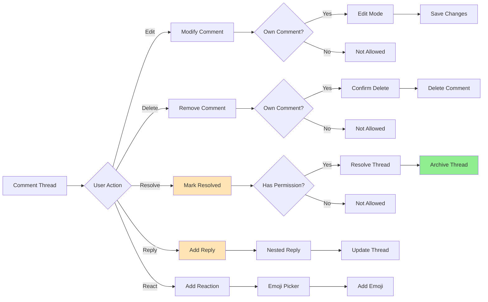
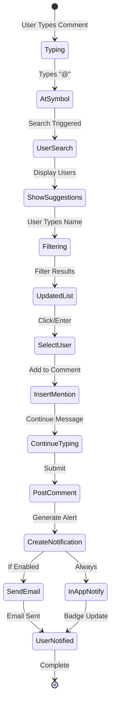

# User Flows & Wireframes - Canvas Comments

## 1. Overview

Canvas Comments enable asynchronous collaboration by allowing users to discuss specific elements, provide feedback, and track conversations directly within the analytics canvas. This document details all flows related to commenting, including creation, threading, mentions, notifications, and resolution workflows.

## 2. Canvas Comments Flows

### 2.1. Comment Creation Flow

```mermaid
graph TD
    A[User Views Canvas] --> B{Interaction Type}
    B -->|Click Comment Icon| C[Existing Comment Thread]
    B -->|Right Click| D[Context Menu]
    B -->|Keyboard Shortcut| E[Quick Comment]
    B -->|Select Text/Element| F[Inline Comment]

    C --> G[View Thread]
    D --> H[Select "Add Comment"]
    E --> I[Comment Box Appears]
    F --> J[Highlight & Comment]

    H --> I
    J --> I

    I --> K[Type Comment]
    K --> L{Add Enhancements?}
    L -->|@Mention| M[User Search]
    L -->|Attachment| N[File Upload]
    L -->|Formatting| O[Rich Text]
    L -->|None| P[Post Comment]

    M --> Q[Select Users]
    N --> R[Attach File]
    O --> S[Apply Format]

    Q --> P
    R --> P
    S --> P

    P --> T[Comment Posted]
    T --> U[Notifications Sent]
    U --> V[Thread Updated]

    style I fill:#FFE4B5
    style T fill:#90EE90
```

### 2.2. Comment Thread Management Flow



### 2.3. @Mention Flow



### 2.4. Comment Notification Flow

```mermaid
graph TD
    A[Comment Action] --> B{Notification Trigger}
    B -->|New Comment| C[Check Subscribers]
    B -->|@Mention| D[Direct Notification]
    B -->|Reply| E[Thread Participants]
    B -->|Resolve| F[Thread Creator]

    C --> G[Canvas Watchers]
    D --> H[Mentioned Users]
    E --> I[Previous Commenters]
    F --> J[Original Author]

    G --> K{Notification Preferences}
    H --> K
    I --> K
    J --> K

    K -->|Immediate| L[Send Now]
    K -->|Batched| M[Queue for Digest]
    K -->|Disabled| N[No Notification]

    L --> O[Multi-Channel]
    M --> P[Hourly/Daily Digest]

    O --> Q[In-App Badge]
    O --> R[Email Alert]
    O --> S[Slack/Teams]

    P --> T[Consolidated Email]

    style D fill:#FFE4B5
    style L fill:#90EE90
```

## 3. Canvas Comments Wireframes

### 3.1. Canvas with Comment Indicators

```
┌─────────────────────────────────────────────────────────────────┐
│ Sales Dashboard Q1 2024                   💬 12  [↗ Share] [⋮] │
├─────────────────────────────────────────────────────────────────┤
│                                                                 │
│ ┌─────────────────────────┬─────────────────────────────────┐  │
│ │ Revenue Trend      💬 3 │ Customer Segments         💬 2  │  │
│ │                         │                                 │  │
│ │ [Chart with comment     │ [Pie chart with comment       │  │
│ │  indicators on specific │  bubble on largest segment]    │  │
│ │  data points]           │                                 │  │
│ │                         │                                 │  │
│ │ 🔵 🔵 🔵               │ 🔵                             │  │
│ └─────────────────────────┴─────────────────────────────────┘  │
│                                                                 │
│ ┌─────────────────────────────────────────────────────────────┐│
│ │ Key Metrics                                           💬 5  ││
│ │                                                             ││
│ │ Revenue: $2.4M 🔵      Growth: +34% 🔵🔵                  ││
│ │ AOV: $156              Customers: 15,234 🔵                ││
│ │                                                             ││
│ │ 💡 Click any 🔵 to view comments                           ││
│ └─────────────────────────────────────────────────────────────┘│
│                                                                 │
│ [👁 3 viewers] [💬 Comments Panel] [🔔 Subscribe to Updates]    │
└─────────────────────────────────────────────────────────────────┘
```

### 3.2. Comment Creation Interface

```
┌─────────────────────────────────────────────────────────────────┐
│ 💬 Add Comment                                            [×]   │
├─────────────────────────────────────────────────────────────────┤
│                                                                 │
│ Commenting on: Revenue Trend Chart - December Peak              │
│                                                                 │
│ ┌─────────────────────────────────────────────────────────────┐│
│ │ This December spike looks unusual compared to last year.    ││
│ │ @Sarah Chen could you verify if this includes the holiday   ││
│ │ promotion data?                                              ││
│ │                                                              ││
│ │ |                                                            ││
│ └─────────────────────────────────────────────────────────────┘│
│                                                                 │
│ [@] [📎] [B] [I] [U] [🔗] [</> Code] [" Quote]                 │
│                                                                 │
│ ☐ Also post in Slack channel #analytics                        │
│                                                                 │
│ [Cancel] [Save as Draft] [Post Comment]                        │
└─────────────────────────────────────────────────────────────────┘
```

### 3.3. @Mention Autocomplete

```
┌─────────────────────────────────────────────────────────────────┐
│ 💬 Add Comment                                                  │
├─────────────────────────────────────────────────────────────────┤
│                                                                 │
│ ┌─────────────────────────────────────────────────────────────┐│
│ │ The revenue spike needs investigation. @sa|                 ││
│ └─────────────────────────────────────────────────────────────┘│
│                                                                 │
│ ┌─────────────────────────────────────────────────────────────┐│
│ │ 👤 Sarah Chen              @sarahchen                      ││
│ │    Analytics Team • Last active 2h ago                     ││
│ │                                                             ││
│ │ 👤 Sam Rodriguez           @samr                           ││
│ │    Finance Team • Last active 1d ago                       ││
│ │                                                             ││
│ │ 👥 Sales Team              @sales-team                     ││
│ │    12 members • Notify all members                         ││
│ │                                                             ││
│ │ 💡 Type more to refine or ↑↓ to navigate                   ││
│ └─────────────────────────────────────────────────────────────┘│
└─────────────────────────────────────────────────────────────────┘
```

### 3.4. Comment Thread View

```
┌─────────────────────────────────────────────────────────────────┐
│ 💬 Comment Thread                          [Resolve] [⋮] [×]    │
├─────────────────────────────────────────────────────────────────┤
│                                                                 │
│ On: Revenue Trend Chart - December Peak                         │
│ Started by Mike Johnson • 2 hours ago                          │
│                                                                 │
│ ┌─────────────────────────────────────────────────────────────┐│
│ │ 👤 Mike Johnson                          2 hours ago  ⋮    ││
│ │                                                             ││
│ │ This December spike looks unusual compared to last year.    ││
│ │ @Sarah Chen could you verify if this includes the holiday  ││
│ │ promotion data?                                             ││
│ │                                                             ││
│ │ 👍 2  💡 1                              [Reply]             ││
│ ├─────────────────────────────────────────────────────────────┤│
│ │   👤 Sarah Chen                         1 hour ago    ⋮    ││
│ │                                                             ││
│ │   Yes, it includes Black Friday and Cyber Monday. The      ││
│ │   promotion ran from Nov 24 - Dec 3.                       ││
│ │                                                             ││
│ │   📎 holiday_promo_report.pdf                              ││
│ │                                                             ││
│ │   👍 1                                  [Reply]             ││
│ │   └─────────────────────────────────────────────────────   ││
│ │       👤 Mike Johnson                   45 min ago         ││
│ │                                                             ││
│ │       Perfect, that explains the 47% increase. Should      ││
│ │       we add a note to the chart?                          ││
│ │                                                             ││
│ │                                         [Reply]             ││
│ ├─────────────────────────────────────────────────────────────┤│
│ │ 👤 Amy Liu                              30 min ago    ⋮    ││
│ │                                                             ││
│ │ I've added an annotation to the chart highlighting the      ││
│ │ promotion period. Should be clearer now!                    ││
│ │                                                             ││
│ │ ✅ Chart updated                                            ││
│ │                                                             ││
│ │ 🎉 2                                    [Reply]             ││
│ └─────────────────────────────────────────────────────────────┘│
│                                                                 │
│ ┌─────────────────────────────────────────────────────────────┐│
│ │ Add a reply...                          [@] [📎] [Post]    ││
│ └─────────────────────────────────────────────────────────────┘│
└─────────────────────────────────────────────────────────────────┘
```

### 3.5. Comments Panel (Sidebar)

```
┌─────────────────────────────────────────────────────────────────┐
│ 💬 Comments (12)                    [Filter ▼] [Mark All Read] │
├─────────────────────────────────────────────────────────────────┤
│                                                                 │
│ [All] [Unresolved] [Mentions] [My Comments]                    │
│                                                                 │
│ ┌─────────────────────────────────────────────────────────────┐│
│ │ 🔴 Unresolved • Revenue Chart                              ││
│ │ Mike: "December spike looks unusual..."                     ││
│ │ 3 replies • Last activity 30m ago          [View Thread]   ││
│ ├─────────────────────────────────────────────────────────────┤│
│ │ 🔵 New • Customer Segments                                 ││
│ │ Sarah: "@John what's driving the Enterprise growth?"        ││
│ │ 0 replies • 1 hour ago                     [View Thread]   ││
│ ├─────────────────────────────────────────────────────────────┤│
│ │ ✅ Resolved • Q3 Comparison                                ││
│ │ Amy: "Fixed the calculation error"                          ││
│ │ 2 replies • Resolved 2 hours ago           [View Thread]   ││
│ ├─────────────────────────────────────────────────────────────┤│
│ │ 💬 Active • Profit Margins                                 ││
│ │ You: "Should we include shipping costs?"                    ││
│ │ 5 replies • Last activity 3 hours ago      [View Thread]   ││
│ └─────────────────────────────────────────────────────────────┘│
│                                                                 │
│ Show: [✓ Active] [✓ Resolved] [  Archived]                    │
│                                                                 │
│ [Load More Comments...]                                         │
└─────────────────────────────────────────────────────────────────┘
```

### 3.6. Comment Notifications

```
┌─────────────────────────────────────────────────────────────────┐
│ 🔔 Notifications                              [⚙️] [Mark All Read]│
├─────────────────────────────────────────────────────────────────┤
│                                                                 │
│ New (3)                                                         │
│ ┌─────────────────────────────────────────────────────────────┐│
│ │ 💬 Sarah Chen mentioned you                    5 min ago   ││
│ │ "@John what's driving the Enterprise growth in Q4?"         ││
│ │ On: Customer Segments Chart                   [View] [Reply]││
│ ├─────────────────────────────────────────────────────────────┤│
│ │ 💬 Mike Johnson replied to your comment        1 hour ago  ││
│ │ "Good catch! I'll update the calculations"                  ││
│ │ On: Profit Margins Analysis                   [View] [Reply]││
│ ├─────────────────────────────────────────────────────────────┤│
│ │ ✅ Amy Liu resolved a thread you follow        2 hours ago ││
│ │ "Fixed the Q3 calculation error"                            ││
│ │ On: Quarterly Comparison                      [View]        ││
│ └─────────────────────────────────────────────────────────────┘│
│                                                                 │
│ Earlier Today                                                   │
│ ┌─────────────────────────────────────────────────────────────┐│
│ │ 👥 3 new comments on Sales Dashboard           4 hours ago ││
│ │ From: Marketing Team members                  [View All]    ││
│ └─────────────────────────────────────────────────────────────┘│
│                                                                 │
│ Notification Settings:                                          │
│ • @mentions: Immediate ✓                                       │
│ • Replies: Batched (hourly) ✓                                 │
│ • Canvas updates: Daily digest ✓               [Change Settings]│
└─────────────────────────────────────────────────────────────────┘
```

### 3.7. Comment Resolution Dialog

```
┌─────────────────────────────────────────────────────────────────┐
│ ✅ Resolve Comment Thread?                                [×]   │
├─────────────────────────────────────────────────────────────────┤
│                                                                 │
│ Thread: "December revenue spike investigation"                  │
│ 4 comments • 3 participants                                     │
│                                                                 │
│ Resolution Summary (optional):                                  │
│ ┌─────────────────────────────────────────────────────────────┐│
│ │ Verified the spike was due to Black Friday promotion.       ││
│ │ Added annotation to chart for clarity.                      ││
│ │                                                              ││
│ └─────────────────────────────────────────────────────────────┘│
│                                                                 │
│ Action taken:                                                   │
│ ☑ Chart updated with promotion annotation                       │
│ ☐ Data corrected                                               │
│ ☐ No action needed - discussion only                           │
│ ☐ Other: [                                                   ] │
│                                                                 │
│ After resolution:                                               │
│ • Thread will be marked as resolved ✅                         │
│ • Participants will be notified                                │
│ • Comments remain visible but read-only                        │
│                                                                 │
│ [Cancel] [Resolve Thread]                                       │
└─────────────────────────────────────────────────────────────────┘
```

### 3.8. Comment Search & Filter

```
┌─────────────────────────────────────────────────────────────────┐
│ 🔍 Search Comments                                       [×]    │
├─────────────────────────────────────────────────────────────────┤
│                                                                 │
│ ┌─────────────────────────────────────────────────────────────┐│
│ │ 🔍 Search: "revenue calculation"                        [×] ││
│ └─────────────────────────────────────────────────────────────┘│
│                                                                 │
│ Filters:                                                        │
│ ┌─────────────────────────────────────────────────────────────┐│
│ │ Author: [All Users ▼]          Date: [Last 30 days ▼]     ││
│ │ Status: [All ▼]                Canvas: [Current ▼]        ││
│ │ Has attachments: ☐             Mentions me: ☐             ││
│ └─────────────────────────────────────────────────────────────┘│
│                                                                 │
│ Results (3 comments):                                           │
│ ┌─────────────────────────────────────────────────────────────┐│
│ │ 💬 Mike Johnson • 2 days ago                               ││
│ │ "The revenue calculation seems off for..."                  ││
│ │ On: Q4 Analysis Dashboard                    [View Thread] ││
│ ├─────────────────────────────────────────────────────────────┤│
│ │ 💬 Sarah Chen • 1 week ago                                 ││
│ │ "Updated revenue calculation to include..."                 ││
│ │ On: Monthly Metrics Canvas                   [View Thread] ││
│ ├─────────────────────────────────────────────────────────────┤│
│ │ ✅ Amy Liu • 2 weeks ago                                   ││
│ │ "Fixed the revenue calculation formula"                     ││
│ │ On: Financial Dashboard (Resolved)           [View Thread] ││
│ └─────────────────────────────────────────────────────────────┘│
│                                                                 │
│ [Export Results] [Clear Filters] [Save Search]                 │
└─────────────────────────────────────────────────────────────────┘
```

### 3.9. Mobile Comment Interface

```
┌─────────────────────────────────────────┐
│ 📊 Sales Dashboard              💬 12   │
├─────────────────────────────────────────┤
│                                         │
│ [Canvas view with comment indicators]   │
│                                         │
│ ┌─────────────────────────────────────┐│
│ │ 💬 New comment from Sarah           ││
│ │ "@John check December numbers"      ││
│ │ 2 min ago            [Reply] [View] ││
│ └─────────────────────────────────────┘│
│                                         │
│ [🏠] [💬] [🔔 3] [👤]                   │
└─────────────────────────────────────────┘

[Swipe up for full comments panel]
```

### 3.10. Comment Analytics Dashboard

```
┌─────────────────────────────────────────────────────────────────┐
│ 💬 Comment Analytics                    [Export] [Date Range ▼] │
├─────────────────────────────────────────────────────────────────┤
│                                                                 │
│ Canvas: Q1 2024 Sales Analysis          Period: Last 30 days   │
│                                                                 │
│ Overview:                                                       │
│ ┌─────────────────────────────────────────────────────────────┐│
│ │ Total Comments: 47        Active Threads: 12               ││
│ │ Resolved: 35 (74%)        Avg Resolution: 4.2 hours        ││
│ │ Participants: 8           Avg Replies: 3.4                 ││
│ │ With Attachments: 15      @Mentions: 23                    ││
│ └─────────────────────────────────────────────────────────────┘│
│                                                                 │
│ Activity Timeline:                                              │
│ ┌─────────────────────────────────────────────────────────────┐│
│ │ [Line chart showing daily comment activity]                 ││
│ │ Peak: Tuesday 2-4 PM                                        ││
│ └─────────────────────────────────────────────────────────────┘│
│                                                                 │
│ Top Commenters:              Most Discussed Elements:           │
│ ┌───────────────────┐ ┌─────────────────────────────────────┐│
│ │ 1. Sarah (15)    │ │ • Revenue Chart (12 threads)        ││
│ │ 2. Mike (12)     │ │ • Customer Segments (8 threads)     ││
│ │ 3. You (10)      │ │ • Profit Margins (6 threads)        ││
│ │ 4. Amy (8)       │ │ • Growth Metrics (5 threads)        ││
│ └───────────────────┘ └─────────────────────────────────────┘│
│                                                                 │
│ Response Time:                                                  │
│ • Average first response: 1.2 hours                            │
│ • Fastest responder: Sarah Chen (avg 15 min)                  │
└─────────────────────────────────────────────────────────────────┘
```

## 4. Advanced Comment Features

### 4.1. Rich Text Formatting

````
┌─────────────────────────────────────────────────────────────────┐
│ 💬 Comment Editor                                         [×]   │
├─────────────────────────────────────────────────────────────────┤
│                                                                 │
│ ┌─────────────────────────────────────────────────────────────┐│
│ │ ## Key Findings                                             ││
│ │                                                              ││
│ │ The **December spike** shows:                               ││
│ │ - 47% increase over November                                ││
│ │ - Driven by Black Friday (see attached report)              ││
│ │                                                              ││
│ │ ```sql                                                       ││
│ │ SELECT SUM(revenue) FROM orders                             ││
│ │ WHERE date BETWEEN '2024-11-24' AND '2024-12-03'           ││
│ │ ```                                                          ││
│ │                                                              ││
│ │ > Note: Excludes returns processed after Dec 31             ││
│ └─────────────────────────────────────────────────────────────┘│
│                                                                 │
│ [B] [I] [U] [S] [Link] [Code] [Quote] [List] [#] [Table]      │
│                                                                 │
│ Attachments:                                                    │
│ 📎 black_friday_analysis.xlsx (245 KB)           [Remove]      │
│                                                                 │
│ [Preview] [Cancel] [Post Comment]                               │
└─────────────────────────────────────────────────────────────────┘
````

### 4.2. Comment Templates

```
┌─────────────────────────────────────────────────────────────────┐
│ 💬 Use Comment Template                                   [×]   │
├─────────────────────────────────────────────────────────────────┤
│                                                                 │
│ Choose a template:                                              │
│                                                                 │
│ ┌─────────────────────────────────────────────────────────────┐│
│ │ 📊 Data Quality Issue                                       ││
│ │ Flag problems with data accuracy or completeness            ││
│ │                                              [Use Template] ││
│ ├─────────────────────────────────────────────────────────────┤│
│ │ ❓ Question for Analysis                                    ││
│ │ Ask clarifying questions about methods or results           ││
│ │                                              [Use Template] ││
│ ├─────────────────────────────────────────────────────────────┤│
│ │ 💡 Suggestion                                               ││
│ │ Propose improvements or alternative approaches              ││
│ │                                              [Use Template] ││
│ ├─────────────────────────────────────────────────────────────┤│
│ │ ✅ Approval                                                 ││
│ │ Approve analysis with optional conditions                   ││
│ │                                              [Use Template] ││
│ ├─────────────────────────────────────────────────────────────┤│
│ │ 🚨 Urgent Issue                                             ││
│ │ Escalate critical problems requiring immediate attention    ││
│ │                                              [Use Template] ││
│ └─────────────────────────────────────────────────────────────┘│
│                                                                 │
│ [Create Custom Template] [Skip]                                 │
└─────────────────────────────────────────────────────────────────┘
```

### 4.3. Comment Automation Rules

```
┌─────────────────────────────────────────────────────────────────┐
│ ⚙️ Comment Automation                      [+ New Rule] [Save]  │
├─────────────────────────────────────────────────────────────────┤
│                                                                 │
│ Active Rules:                                                   │
│                                                                 │
│ ┌─────────────────────────────────────────────────────────────┐│
│ │ Rule 1: Auto-assign to Data Team              [Edit] [Off] ││
│ │ When: Comment contains "data quality" or "error"            ││
│ │ Then: @mention @data-team and add 🚨 label                 ││
│ ├─────────────────────────────────────────────────────────────┤│
│ │ Rule 2: Weekly Summary                        [Edit] [On]  ││
│ │ When: Every Friday at 5 PM                                  ││
│ │ Then: Post summary of unresolved comments                   ││
│ ├─────────────────────────────────────────────────────────────┤│
│ │ Rule 3: Stale Thread Alert                    [Edit] [On]  ││
│ │ When: No activity for 7 days on open thread                 ││
│ │ Then: Notify thread creator and add ⏰ label                ││
│ └─────────────────────────────────────────────────────────────┘│
│                                                                 │
│ Create New Rule:                                                │
│ When: [Select trigger ▼]                                        │
│ Then: [Select action ▼]                                         │
│                                                                 │
│ [Test Rule] [Create Rule]                                       │
└─────────────────────────────────────────────────────────────────┘
```

## 5. Integration Points

### 5.1. Slack Integration

```
┌─────────────────────────────────────────────────────────────────┐
│ 💬 Posted to Slack                                              │
├─────────────────────────────────────────────────────────────────┤
│                                                                 │
│ #analytics-discussion                                           │
│                                                                 │
│ 🤖 Jabiru Bot                                          2:34 PM │
│ New comment on "Q1 2024 Sales Analysis"                        │
│                                                                 │
│ Mike Johnson:                                                   │
│ "December spike looks unusual. @Sarah Chen could you verify?"  │
│                                                                 │
│ 📊 View in Jabiru | 💬 Reply in Thread | 🔔 Follow            │
│                                                                 │
│ ┌─────────────────────────────────────────────────────────────┐│
│ │ 💬 Reply as Sarah Chen:                                     ││
│ │ Yes, checking now...                              [Send]    ││
│ └─────────────────────────────────────────────────────────────┘│
└─────────────────────────────────────────────────────────────────┘
```

### 5.2. Email Notification

```
Subject: [Jabiru] Sarah mentioned you in a comment

Hi John,

Sarah Chen mentioned you in a comment on "Q1 2024 Sales Analysis":

"@John what's driving the Enterprise growth in Q4? The 67%
increase seems too high to be organic."

Chart: Customer Segments
Canvas: Q1 2024 Sales Analysis
Project: Revenue Analytics

[View Comment] [Reply] [Unsubscribe]

---
You're receiving this because you were mentioned.
Manage your notification preferences in Jabiru settings.
```

## 6. Error States & Edge Cases

### 6.1. Comment Submission Error

```
┌─────────────────────────────────────────────────────────────────┐
│ ❌ Comment Not Posted                                           │
├─────────────────────────────────────────────────────────────────┤
│                                                                 │
│ Your comment couldn't be posted:                               │
│                                                                 │
│ • Network connection lost                                       │
│ • Please check your connection and try again                   │
│                                                                 │
│ Your comment has been saved locally:                           │
│ ┌─────────────────────────────────────────────────────────────┐│
│ │ "The December spike needs investigation..."                 ││
│ └─────────────────────────────────────────────────────────────┘│
│                                                                 │
│ [Retry] [Save as Draft] [Discard]                              │
└─────────────────────────────────────────────────────────────────┘
```

### 6.2. Deleted Comment Reference

```
┌─────────────────────────────────────────────────────────────────┐
│ 💬 Comment Thread                                               │
├─────────────────────────────────────────────────────────────────┤
│                                                                 │
│ ┌─────────────────────────────────────────────────────────────┐│
│ │ 🚫 This comment has been deleted                            ││
│ │    Deleted by author • 2 hours ago                          ││
│ ├─────────────────────────────────────────────────────────────┤│
│ │   👤 Sarah Chen                         1 hour ago         ││
│ │                                                             ││
│ │   I was responding to the revenue question - the spike     ││
│ │   is due to the Black Friday promotion.                    ││
│ │                                                             ││
│ │   ℹ️ Original comment was deleted                          ││
│ └─────────────────────────────────────────────────────────────┘│
└─────────────────────────────────────────────────────────────────┘
```

### 6.3. Permission Denied

```
┌─────────────────────────────────────────────────────────────────┐
│ 🔒 Comments Disabled                                            │
├─────────────────────────────────────────────────────────────────┤
│                                                                 │
│ You don't have permission to comment on this canvas.           │
│                                                                 │
│ Your current role: Viewer                                       │
│ Required role: Commenter or higher                              │
│                                                                 │
│ To add comments, you can:                                       │
│ • Request access from the canvas owner                          │
│ • Ask to be upgraded to Commenter role                         │
│                                                                 │
│ Canvas owner: john.smith@company.com                            │
│                                                                 │
│ [Request Access] [Close]                                        │
└─────────────────────────────────────────────────────────────────┘
```

## 7. Implementation Notes

### 7.1. Technical Architecture

- **Real-time sync** using WebSockets for live updates
- **Optimistic UI** for instant feedback
- **Offline support** with local storage queue
- **Rich text editor** with markdown support
- **File attachments** up to 10MB per comment

### 7.2. Performance Optimization

- **Lazy loading** of comment threads
- **Pagination** for long threads (20 comments per page)
- **Virtualized scrolling** for comment panels
- **Debounced typing** indicators
- **Compressed avatars** and attachments

### 7.3. Data Model

```javascript
Comment {
  id: UUID
  canvas_id: UUID
  element_id: UUID (optional)
  author_id: UUID
  parent_id: UUID (for replies)
  content: Text (markdown)
  mentions: Array<user_id>
  attachments: Array<file_id>
  reactions: Map<emoji, user_ids>
  status: 'active' | 'resolved' | 'deleted'
  created_at: Timestamp
  updated_at: Timestamp
  resolved_at: Timestamp
  resolved_by: UUID
}
```

## 8. Success Metrics

### 8.1. Engagement Metrics

- **Comment rate**: Comments per canvas per week
- **Response time**: Average time to first reply
- **Resolution rate**: % of threads marked resolved
- **Participation**: % of canvas viewers who comment

### 8.2. Quality Metrics

- **@mention accuracy**: % of correct user tags
- **Thread depth**: Average replies per thread
- **Attachment usage**: % of comments with files
- **Template adoption**: % using templates

### 8.3. Collaboration Health

- **Active discussions**: Open threads < 7 days old
- **Stale threads**: Unresolved > 14 days
- **Cross-team engagement**: Comments across departments
- **Knowledge capture**: Resolved threads with summaries
