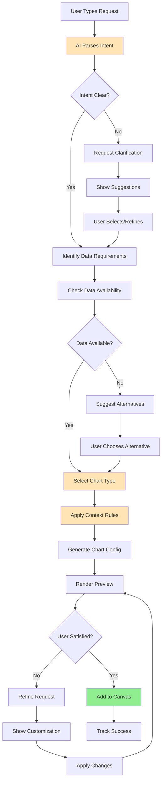
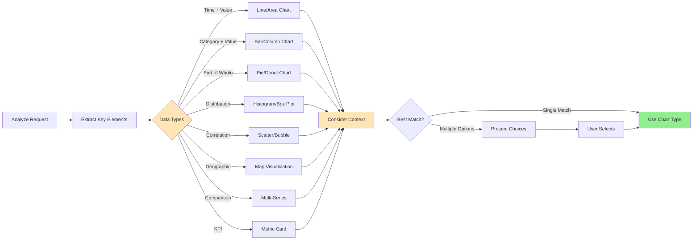
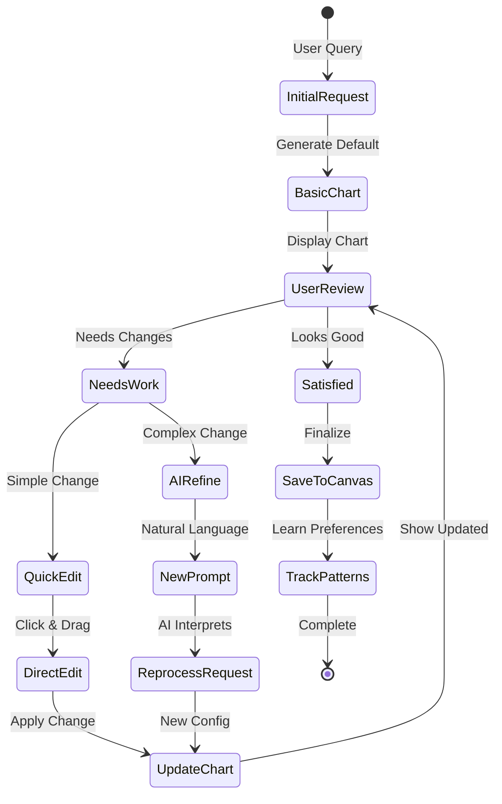
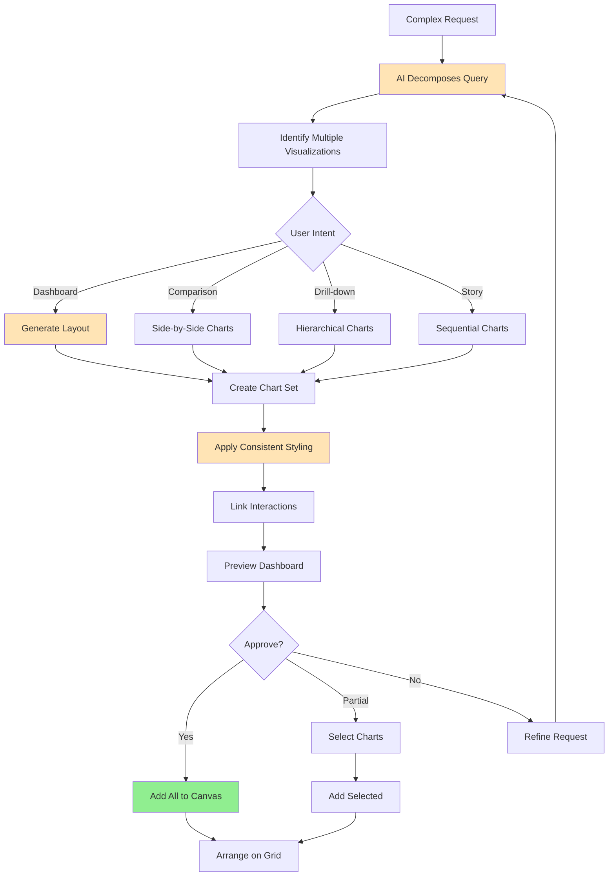

# User Flows & Wireframes - AI-Assisted Chart Generation

## 1. Overview

AI-Assisted Chart Generation is a core differentiator for Jabiru, enabling users to create sophisticated data visualizations using natural language. This document details all flows related to chart creation through AI, including prompt interpretation, chart type selection, customization, error handling, and learning from user behavior.

## 2. AI-Assisted Chart Generation Flows

### 2.1. Natural Language to Chart Flow



### 2.2. Chart Type Selection Flow



### 2.3. Progressive Chart Refinement Flow



### 2.4. Multi-Chart Generation Flow



## 3. AI-Assisted Chart Generation Wireframes

### 3.1. Natural Language Chart Input

```
┌─────────────────────────────────────────────────────────────────┐
│ Sales Dashboard                              [👁 View] [↗ Share] │
├─────────────────────────────────────────────────────────────────┤
│                                                                 │
│ [Existing canvas content]                                       │
│                                                                 │
│ ┌─────────────────────────────────────────────────────────────┐│
│ │ 💬 What would you like to visualize?                       ││
│ │                                                             ││
│ │ Show me monthly revenue trends for 2024 with year-over-    ││
│ │ year comparison                                             ││
│ │                                                             ││
│ │ [↵ Generate] [🎤 Voice] [📊 Browse Charts]                ││
│ └─────────────────────────────────────────────────────────────┘│
│                                                                 │
│ 🤖 AI Suggestions based on your data:                          │
│ • "Compare revenue by product category"                        │
│ • "Show customer growth over time"                             │
│ • "Analyze seasonal sales patterns"                            │
│ • "Display top 10 customers by value"                          │
└─────────────────────────────────────────────────────────────────┘
```

### 3.2. AI Processing Feedback

```
┌─────────────────────────────────────────────────────────────────┐
│ 🤖 Creating your visualization...                               │
├─────────────────────────────────────────────────────────────────┤
│                                                                 │
│ Understanding your request:                                     │
│ ✓ Time period: Monthly for 2024                               │
│ ✓ Metric: Revenue                                             │
│ ✓ Comparison: Year-over-year (2023 vs 2024)                   │
│                                                                 │
│ ┌─────────────────────────────────────────────────────────────┐│
│ │ ⚡ Analyzing data patterns...                               ││
│ │                                                             ││
│ │ Found: 24 months of data                                   ││
│ │ Revenue range: $125K - $420K                               ││
│ │ Detecting: Strong Q4 seasonality                           ││
│ │                                                             ││
│ │ [████████████░░░░░░░] 70%                                 ││
│ └─────────────────────────────────────────────────────────────┘│
│                                                                 │
│ 💡 I'll create a dual-axis line chart to show both years       │
│    clearly with your company's brand colors                     │
└─────────────────────────────────────────────────────────────────┘
```

### 3.3. Chart Type Selection

```
┌─────────────────────────────────────────────────────────────────┐
│ 📊 Choose visualization type                               [×]  │
├─────────────────────────────────────────────────────────────────┤
│                                                                 │
│ Based on your request to show "monthly revenue trends", here   │
│ are the best options:                                           │
│                                                                 │
│ ┌─────────────────────────────────────────────────────────────┐│
│ │ ⭐ Recommended                                              ││
│ │ ┌─────────────┐ ┌─────────────┐ ┌─────────────┐           ││
│ │ │ Line Chart  │ │ Area Chart  │ │ Combo Chart │           ││
│ │ │    📈       │ │    📊       │ │    📊📈     │           ││
│ │ │             │ │             │ │             │           ││
│ │ │ Best for    │ │ Shows       │ │ Compare     │           ││
│ │ │ trends      │ │ volume      │ │ multiple    │           ││
│ │ │             │ │             │ │ metrics     │           ││
│ │ │ [Select]    │ │ [Select]    │ │ [Select]    │           ││
│ │ └─────────────┘ └─────────────┘ └─────────────┘           ││
│ └─────────────────────────────────────────────────────────────┘│
│                                                                 │
│ Other Options:                                                  │
│ ┌─────────────┐ ┌─────────────┐ ┌─────────────┐              │
│ │ Bar Chart   │ │ Waterfall   │ │ Sparklines  │              │
│ │ [Select]    │ │ [Select]    │ │ [Select]    │              │
│ └─────────────┘ └─────────────┘ └─────────────┘              │
│                                                                 │
│ [Let AI Decide] [Show More Options]                            │
└─────────────────────────────────────────────────────────────────┘
```

### 3.4. Generated Chart with AI Insights

```
┌─────────────────────────────────────────────────────────────────┐
│ Monthly Revenue Trends: 2023 vs 2024            [⚙️] [✏️] [×]  │
├─────────────────────────────────────────────────────────────────┤
│                                                                 │
│ ┌─────────────────────────────────────────────────────────────┐│
│ │     Revenue ($K)                                            ││
│ │ 450 ┤                                          ╭─────      ││
│ │ 400 ┤                                      ╭───╯ 2024      ││
│ │ 350 ┤                              ╭───────╯               ││
│ │ 300 ┤              ╭───────────────╯   ╭─────── 2023      ││
│ │ 250 ┤      ╭───────╯               ╭───╯                  ││
│ │ 200 ┤──────╯                   ────╯                      ││
│ │ 150 ┤                                                     ││
│ │     └──┬───┬───┬───┬───┬───┬───┬───┬───┬───┬───┬───┬──  ││
│ │       Jan Feb Mar Apr May Jun Jul Aug Sep Oct Nov Dec      ││
│ │                                                             ││
│ │ 🟦 2024 (Actual)  🟨 2023 (Comparison)                    ││
│ └─────────────────────────────────────────────────────────────┘│
│                                                                 │
│ 🤖 AI Insights:                                                │
│ • 2024 revenue is outperforming 2023 by an average of 23%     │
│ • Strongest growth in Q4: December +38% YoY                    │
│ • Consistent upward trend with no monthly declines             │
│ • Total 2024 revenue: $3.2M (+27% vs 2023)                   │
│                                                                 │
│ 💬 "Explain the December spike" | "Add forecast" | "Break down"│
│                                                                 │
│ [Add to Canvas] [Try Different Chart] [Customize]              │
└─────────────────────────────────────────────────────────────────┘
```

### 3.5. Chart Customization Panel

```
┌─────────────────────────────────────────────────────────────────┐
│ ✏️ Customize Chart                           [Reset] [Apply]    │
├─────────────────────────────────────────────────────────────────┤
│                                                                 │
│ ┌───────────────┬─────────────────────────────────────────────┐│
│ │ Quick Actions │ Chart Settings                               ││
│ │               │                                               ││
│ │ 🎨 Style      │ Title: [Monthly Revenue Trends: 2023 vs 2024]││
│ │ 📊 Data       │ Subtitle: [Year-over-year comparison       ]││
│ │ 📐 Axes       │                                               ││
│ │ 🏷️ Labels    │ Chart Type: [Line Chart ▼]                   ││
│ │ 🎯 Reference  │ • Line Chart                                  ││
│ │ 💡 Insights   │ • Area Chart                                  ││
│ │               │ • Bar Chart                                   ││
│ │               │                                               ││
│ │               │ ☑ Show data points                            ││
│ │               │ ☑ Display values on hover                     ││
│ │               │ ☐ Show trend line                             ││
│ │               │ ☑ Include legend                              ││
│ │               │                                               ││
│ │               │ Animation: [Smooth ▼]                         ││
│ │               │ Theme: [Company Brand ▼]                      ││
│ └───────────────┴─────────────────────────────────────────────┘│
│                                                                 │
│ Or describe changes in natural language:                        │
│ ┌─────────────────────────────────────────────────────────────┐│
│ │ "Make the 2024 line thicker and change colors to red/blue" ││
│ │                                                    [Apply]  ││
│ └─────────────────────────────────────────────────────────────┘│
└─────────────────────────────────────────────────────────────────┘
```

### 3.6. Chart Clarification Dialog

```
┌─────────────────────────────────────────────────────────────────┐
│ 🤔 Help me understand your request                         [×]  │
├─────────────────────────────────────────────────────────────────┤
│                                                                 │
│ You asked: "Show me sales by region"                           │
│                                                                 │
│ I need a bit more information:                                  │
│                                                                 │
│ 1. Which time period?                                           │
│ ┌─────────────────────────────────────────────────────────────┐│
│ │ ○ Current month (December 2024)                             ││
│ │ ○ Last quarter (Q4 2024)                                    ││
│ │ ● Full year 2024                                            ││
│ │ ○ Custom range...                                           ││
│ └─────────────────────────────────────────────────────────────┘│
│                                                                 │
│ 2. How should I show the data?                                  │
│ ┌─────────────────────────────────────────────────────────────┐│
│ │ ● Total sales amount                                        ││
│ │ ○ Number of transactions                                    ││
│ │ ○ Average order value                                       ││
│ │ ○ Growth percentage                                         ││
│ └─────────────────────────────────────────────────────────────┘│
│                                                                 │
│ 3. Would you like to see:                                       │
│ ┌─────────────────────────────────────────────────────────────┐│
│ │ ● All regions compared                                      ││
│ │ ○ Top 5 regions only                                        ││
│ │ ○ Specific regions: [                                    ]  ││
│ └─────────────────────────────────────────────────────────────┘│
│                                                                 │
│ [Generate Chart] [Start Over]                                   │
└─────────────────────────────────────────────────────────────────┘
```

### 3.7. Multi-Chart Dashboard Generation

```
┌─────────────────────────────────────────────────────────────────┐
│ 🎯 Creating Executive Dashboard                                 │
├─────────────────────────────────────────────────────────────────┤
│                                                                 │
│ Based on "Create an executive dashboard for Q4 performance":    │
│                                                                 │
│ ┌─────────────────────────────────────────────────────────────┐│
│ │ Suggested Layout (4 charts):                                ││
│ │                                                             ││
│ │ ┌─────────────────┬─────────────────┐                     ││
│ │ │ KPI Cards       │ Revenue Trend   │                     ││
│ │ │ Revenue | Growth│ 12-month line   │                     ││
│ │ │ Orders | AOV    │                 │                     ││
│ │ ├─────────────────┼─────────────────┤                     ││
│ │ │ Top Products    │ Regional Perf.  │                     ││
│ │ │ Bar chart       │ Map view        │                     ││
│ │ │                 │                 │                     ││
│ │ └─────────────────┴─────────────────┘                     ││
│ │                                                             ││
│ │ ☑ KPI Summary Cards                                        ││
│ │ ☑ Revenue Trend Chart                                      ││
│ │ ☑ Product Performance                                      ││
│ │ ☑ Geographic Distribution                                  ││
│ │ ☐ Customer Segments                                        ││
│ │ ☐ Conversion Funnel                                        ││
│ └─────────────────────────────────────────────────────────────┘│
│                                                                 │
│ [Generate Selected] [Customize Layout] [One at a Time]         │
└─────────────────────────────────────────────────────────────────┘
```

### 3.8. AI Learning from Preferences

```
┌─────────────────────────────────────────────────────────────────┐
│ 🧠 Learning Your Preferences                          [Disable] │
├─────────────────────────────────────────────────────────────────┤
│                                                                 │
│ I've noticed you frequently:                                    │
│                                                                 │
│ ✓ Prefer line charts for time series data                     │
│ ✓ Use company brand colors (blue/orange)                      │
│ ✓ Show YoY comparisons                                        │
│ ✓ Include data labels on key points                           │
│ ✓ Add trend lines to forecasts                                │
│                                                                 │
│ Would you like me to apply these as defaults?                  │
│                                                                 │
│ ┌─────────────────────────────────────────────────────────────┐│
│ │ ☑ Always use line charts for trends                        ││
│ │ ☑ Apply brand colors automatically                         ││
│ │ ☑ Include YoY when historical data exists                  ││
│ │ ☐ Add data labels (you can customize per chart)            ││
│ │ ☑ Show forecast when asking about future                   ││
│ └─────────────────────────────────────────────────────────────┘│
│                                                                 │
│ [Save Preferences] [Ask Each Time] [Reset to Defaults]         │
└─────────────────────────────────────────────────────────────────┘
```

### 3.9. Chart Error State

```
┌─────────────────────────────────────────────────────────────────┐
│ ⚠️ Unable to Create Chart                                      │
├─────────────────────────────────────────────────────────────────┤
│                                                                 │
│ I couldn't create the requested visualization:                  │
│                                                                 │
│ Request: "Show profit margins by customer age"                  │
│                                                                 │
│ Issue: Missing required data                                    │
│ ┌─────────────────────────────────────────────────────────────┐│
│ │ ❌ Customer age data not available                          ││
│ │    Your customer data doesn't include age information      ││
│ │                                                             ││
│ │ ✓ Profit margin data is available                          ││
│ └─────────────────────────────────────────────────────────────┘│
│                                                                 │
│ Here's what I can do instead:                                   │
│                                                                 │
│ • Show profit margins by customer segment                      │
│ • Display profit margins by customer lifetime value            │
│ • Analyze profit margins by acquisition channel                │
│ • Present profit margins by geographic region                  │
│                                                                 │
│ [Try Alternative] [Upload Age Data] [Different Analysis]       │
└─────────────────────────────────────────────────────────────────┘
```

### 3.10. Interactive Chart Refinement

```
┌─────────────────────────────────────────────────────────────────┐
│ Revenue by Product Category                    [💬] [⚙️] [×]   │
├─────────────────────────────────────────────────────────────────┤
│                                                                 │
│ ┌─────────────────────────────────────────────────────────────┐│
│ │ [Interactive bar chart displayed]                           ││
│ │                                                             ││
│ │ Electronics  ████████████████████ $2.1M                    ││
│ │ Clothing     ███████████████ $1.6M      ← Click to drill   ││
│ │ Home         ██████████ $1.1M                              ││
│ │ Sports       ████████ $0.9M                                ││
│ │ Books        ████ $0.4M                                    ││
│ └─────────────────────────────────────────────────────────────┘│
│                                                                 │
│ 💬 Quick refinements:                                           │
│ ┌─────────────────────────────────────────────────────────────┐│
│ │ "Sort by growth rate" | "Show only top 3" | "Add labels"   ││
│ │ "Compare to last year" | "Show as percentage" | "Drill down"││
│ └─────────────────────────────────────────────────────────────┘│
│                                                                 │
│ ✨ AI Suggestion: Electronics shows unusual growth. Would you   │
│    like to see a breakdown by sub-category?     [Yes] [No]     │
└─────────────────────────────────────────────────────────────────┘
```

### 3.11. Mobile Chart Generation

```
┌─────────────────────────────────────────┐
│ 📊 Dashboard                      ⋮     │
├─────────────────────────────────────────┤
│                                         │
│ [Canvas content]                        │
│                                         │
│ ┌─────────────────────────────────────┐│
│ │ 💬 Ask for any chart...             ││
│ │ [                              ] 🎤 ││
│ └─────────────────────────────────────┘│
│                                         │
│ Quick charts:                           │
│ [Revenue] [Growth] [Customers] [Trends]│
│                                         │
│ Recent:                                 │
│ • "Monthly sales trend"                 │
│ • "Top products by revenue"             │
│                                         │
│ [🏠] [📊] [💬] [👤]                     │
└─────────────────────────────────────────┘
```

### 3.12. Chart Export Options

```
┌─────────────────────────────────────────────────────────────────┐
│ 📤 Export Chart                                      [×]        │
├─────────────────────────────────────────────────────────────────┤
│                                                                 │
│ Chart: Monthly Revenue Trends 2024                              │
│                                                                 │
│ Export Format:                                                  │
│ ┌─────────────────────────────────────────────────────────────┐│
│ │ 🖼️ Image Formats                                            ││
│ │ ○ PNG (High resolution)                                     ││
│ │ ○ SVG (Vector, scalable)                                    ││
│ │ ○ JPG (Compressed)                                          ││
│ │                                                             ││
│ │ 📊 Data Formats                                             ││
│ │ ○ Excel with chart                                          ││
│ │ ○ CSV (data only)                                           ││
│ │ ○ JSON (chart config + data)                                ││
│ │                                                             ││
│ │ 📄 Document Formats                                         ││
│ │ ● PowerPoint slide                                          ││
│ │ ○ PDF report                                                ││
│ │ ○ Word document                                             ││
│ └─────────────────────────────────────────────────────────────┘│
│                                                                 │
│ Include:                                                        │
│ ☑ Chart title and labels                                       │
│ ☑ AI-generated insights                                        │
│ ☑ Data table                                                   │
│ ☐ Company logo                                                 │
│                                                                 │
│ [Download] [Email] [Share Link]                                 │
└─────────────────────────────────────────────────────────────────┘
```

## 4. Advanced AI Features

### 4.1. Predictive Chart Suggestions

```
┌─────────────────────────────────────────────────────────────────┐
│ 🔮 Predictive Analytics                           [Enable] [×]  │
├─────────────────────────────────────────────────────────────────┤
│                                                                 │
│ Based on your revenue trend, I can add:                        │
│                                                                 │
│ ┌─────────────────────────────────────────────────────────────┐│
│ │ 📈 Forecast                                                 ││
│ │                                                             ││
│ │ [Chart showing historical data + predicted future trend]    ││
│ │                                                             ││
│ │ Prediction: +15% growth over next 3 months                 ││
│ │ Confidence interval: ±3%                                    ││
│ │ Based on: Seasonal patterns, current trajectory             ││
│ └─────────────────────────────────────────────────────────────┘│
│                                                                 │
│ Options:                                                        │
│ • Forecast period: [3 months ▼]                                │
│ • Confidence level: [95% ▼]                                    │
│ • Include scenarios: ☑ Best case ☑ Worst case                  │
│                                                                 │
│ ⚠️ Note: Predictions are statistical estimates based on         │
│    historical patterns and should not replace business judgment │
│                                                                 │
│ [Add to Chart] [Adjust Parameters] [Learn More]                │
└─────────────────────────────────────────────────────────────────┘
```

### 4.2. Smart Chart Combinations

```
┌─────────────────────────────────────────────────────────────────┐
│ 🎨 AI Chart Composer                                      [×]   │
├─────────────────────────────────────────────────────────────────┤
│                                                                 │
│ I notice you're analyzing revenue and customer data.           │
│ Here's a comprehensive view:                                    │
│                                                                 │
│ ┌─────────────────────────────────────────────────────────────┐│
│ │ Combined Analysis: Revenue & Customer Metrics               ││
│ │                                                             ││
│ │ [Dual-axis chart with revenue bars and customer line]       ││
│ │                                                             ││
│ │ Key Correlation: Customer growth leads revenue by 1 month   ││
│ └─────────────────────────────────────────────────────────────┘│
│                                                                 │
│ This combination reveals:                                       │
│ • Strong correlation (R² = 0.87)                               │
│ • Customer acquisition predicts revenue                        │
│ • Optimal ratio: 100 new customers = $45K revenue              │
│                                                                 │
│ Related visualizations:                                         │
│ [Customer LTV] [Acquisition Cost] [Cohort Analysis]           │
│                                                                 │
│ [Use This View] [Separate Charts] [Customize]                  │
└─────────────────────────────────────────────────────────────────┘
```

### 4.3. Context-Aware Styling

```
┌─────────────────────────────────────────────────────────────────┐
│ 🎨 Smart Styling Applied                                        │
├─────────────────────────────────────────────────────────────────┤
│                                                                 │
│ Based on your company context, I've applied:                   │
│                                                                 │
│ Brand Colors:                                                   │
│ • Primary: #1E40AF (Blue) - Used for main data                │
│ • Secondary: #F59E0B (Orange) - Used for highlights           │
│ • Success: #10B981 (Green) - Positive trends                  │
│ • Warning: #EF4444 (Red) - Negative trends                    │
│                                                                 │
│ Industry Standards:                                             │
│ • Currency formatted with K/M suffixes                         │
│ • Percentages shown with 1 decimal place                       │
│ • Dates in MMM YY format                                       │
│ • Y-axis starts at 0 for accurate comparison                   │
│                                                                 │
│ Accessibility:                                                  │
│ • High contrast colors                                          │
│ • Patterns for colorblind users                                │
│ • Clear labels and legends                                     │
│                                                                 │
│ [Keep These Settings] [Customize] [Reset to Default]           │
└─────────────────────────────────────────────────────────────────┘
```

## 5. Integration with Canvas

### 5.1. Chart Placement Assistant

```
┌─────────────────────────────────────────────────────────────────┐
│ 📍 Where should I place this chart?                            │
├─────────────────────────────────────────────────────────────────┤
│                                                                 │
│ ┌─────────────────────────────────────────────────────────────┐│
│ │ [Canvas grid with existing charts and suggested placement]  ││
│ │                                                             ││
│ │ ┌─────┐ ┌─────┐ ┌ ─ ─ ┐                                  ││
│ │ │ KPI │ │Chart│ │  ?  │ ← Suggested placement              ││
│ │ └─────┘ └─────┘ └ ─ ─ ┘                                  ││
│ │ ┌─────────────┐ ┌─────┐                                  ││
│ │ │   Table     │ │Chart│                                  ││
│ │ └─────────────┘ └─────┘                                  ││
│ └─────────────────────────────────────────────────────────────┘│
│                                                                 │
│ AI Recommendation:                                              │
│ Place next to "Customer Metrics" for easy comparison           │
│                                                                 │
│ Or choose:                                                      │
│ [Auto-Place] [Select Manually] [Create New Section]            │
└─────────────────────────────────────────────────────────────────┘
```

### 5.2. Chart Interaction Setup

```
┌─────────────────────────────────────────────────────────────────┐
│ 🔗 Connect Chart Interactions                            [×]    │
├─────────────────────────────────────────────────────────────────┤
│                                                                 │
│ Make this chart interactive with others:                        │
│                                                                 │
│ When user clicks on this chart:                                │
│ ┌─────────────────────────────────────────────────────────────┐│
│ │ ☑ Filter "Customer Table" by selected category             ││
│ │ ☑ Update "Regional Map" to show breakdown                  ││
│ │ ☐ Drill down to detailed view                              ││
│ │ ☐ Show tooltip with extended info                          ││
│ └─────────────────────────────────────────────────────────────┘│
│                                                                 │
│ When other charts change:                                       │
│ ┌─────────────────────────────────────────────────────────────┐│
│ │ ☑ Update when date range changes                           ││
│ │ ☑ Filter by selected region                                ││
│ │ ☐ Highlight related data points                            ││
│ └─────────────────────────────────────────────────────────────┘│
│                                                                 │
│ [Apply Interactions] [Preview] [Skip]                          │
└─────────────────────────────────────────────────────────────────┘
```

## 6. Performance & Optimization

### 6.1. Large Dataset Handling

```
┌─────────────────────────────────────────────────────────────────┐
│ ⚡ Optimizing for Large Dataset                                 │
├─────────────────────────────────────────────────────────────────┤
│                                                                 │
│ Your data has 1.2M rows. Here's how I'll handle it:           │
│                                                                 │
│ Automatic Optimizations:                                        │
│ ✓ Intelligent sampling for initial preview                     │
│ ✓ Aggregation at appropriate level (daily → monthly)          │
│ ✓ Progressive loading as you zoom/filter                       │
│ ✓ Caching frequent queries                                     │
│                                                                 │
│ Recommended Approach:                                           │
│ ┌─────────────────────────────────────────────────────────────┐│
│ │ Instead of showing all 1.2M points, I'll:                  ││
│ │                                                             ││
│ │ • Aggregate to 365 daily totals                            ││
│ │ • Keep drill-down capability                               ││
│ │ • Load details on demand                                   ││
│ │                                                             ││
│ │ This will load 50x faster with no loss of insights         ││
│ └─────────────────────────────────────────────────────────────┘│
│                                                                 │
│ [Use Optimized View] [Show All Data] [Custom Settings]         │
└─────────────────────────────────────────────────────────────────┘
```

## 7. Learning & Improvement

### 7.1. Feedback Collection

```
┌─────────────────────────────────────────────────────────────────┐
│ 👍 How did I do?                                          [×]   │
├─────────────────────────────────────────────────────────────────┤
│                                                                 │
│ Was this chart what you expected?                              │
│                                                                 │
│ [😍 Perfect] [🙂 Good] [😐 OK] [☹️ Not quite] [😣 Wrong]      │
│                                                                 │
│ What could be better? (Optional)                               │
│ ┌─────────────────────────────────────────────────────────────┐│
│ │ ☐ Different chart type                                      ││
│ │ ☐ Other data included                                       ││
│ │ ☐ Different time period                                     ││
│ │ ☐ Better formatting                                         ││
│ │ ☐ Other: [                                              ]  ││
│ └─────────────────────────────────────────────────────────────┘│
│                                                                 │
│ 💡 This helps me learn your preferences                        │
│                                                                 │
│ [Submit Feedback] [Skip]                                        │
└─────────────────────────────────────────────────────────────────┘
```

## 8. Implementation Notes

### 8.1. AI Model Requirements

- **Primary model**: GPT-4 or equivalent for query understanding
- **Specialized model**: Fine-tuned for chart type selection
- **Context window**: Minimum 8k tokens for complex requests
- **Response time**: < 3 seconds for chart generation
- **Fallback**: Simpler model for basic requests

### 8.2. Technical Architecture

```javascript
ChartGenerationPipeline {
  1. QueryParser: Extract intent, metrics, dimensions
  2. DataValidator: Check availability and quality
  3. ChartSelector: Choose optimal visualization
  4. ConfigGenerator: Create chart specification
  5. Renderer: Generate interactive visualization
  6. InsightEngine: Add AI-generated annotations
  7. Optimizer: Performance and visual optimization
}
```

### 8.3. Caching Strategy

- **Query cache**: Common natural language patterns
- **Chart cache**: Frequently generated configurations
- **Data cache**: Aggregated results for performance
- **Preference cache**: User-specific settings
- **Invalidation**: On data update or manual refresh

## 9. Success Metrics

### 9.1. Generation Metrics

- **Success rate**: % of queries generating valid charts
- **First-try accuracy**: % needing no refinement
- **Time to chart**: Average generation time
- **Refinement loops**: Average iterations to satisfaction

### 9.2. Usage Metrics

- **NL vs manual**: % charts created via natural language
- **Chart diversity**: Distribution of chart types
- **Feature adoption**: % using advanced features
- **Mobile usage**: % of charts created on mobile

### 9.3. Quality Metrics

- **User satisfaction**: Feedback ratings
- **Chart effectiveness**: Engagement with generated charts
- **Insight relevance**: AI insight interaction rate
- **Error recovery**: Success rate after initial failure
