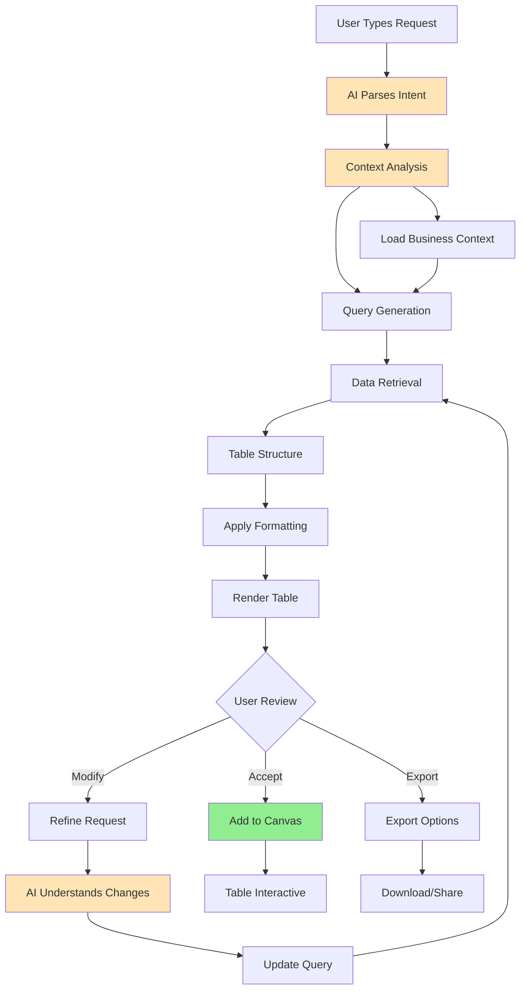
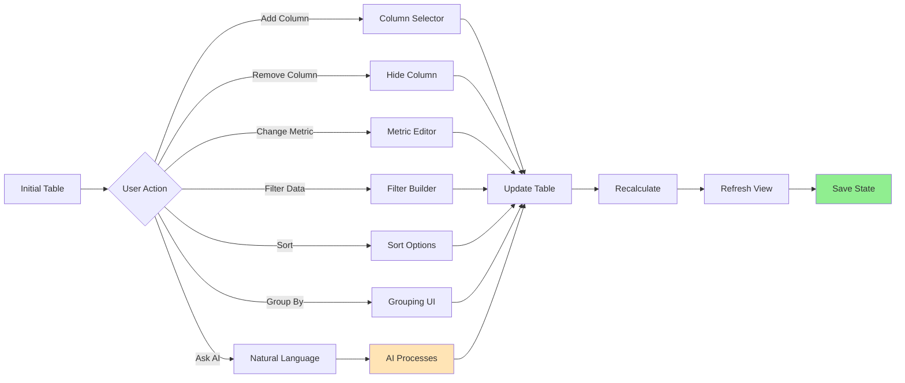
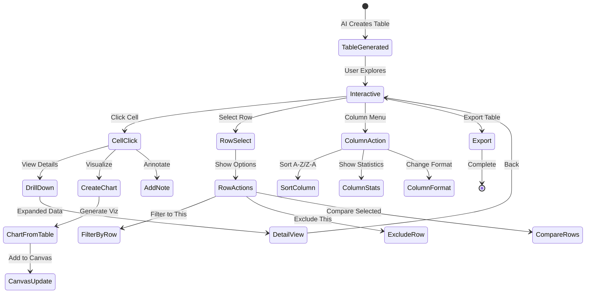
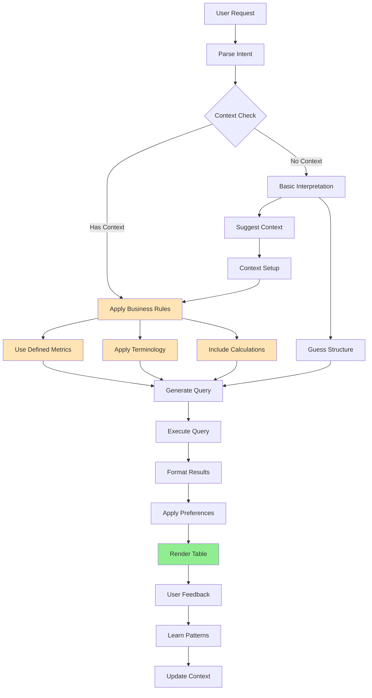

# User Flows & Wireframes - AI-Assisted Table Generation

## 1. Overview

AI-Assisted Table Generation enables users to create data tables and summaries through natural language prompts. This feature leverages Jabiru's context understanding to automatically generate properly formatted tables with the right dimensions, metrics, and aggregations. Users can request specific data cuts without manually configuring pivot tables or writing queries.

## 2. AI-Assisted Table Generation Flows

### 2.1. Natural Language to Table Flow



### 2.2. Table Refinement Flow



### 2.3. Interactive Table Analysis Flow



### 2.4. Context-Aware Table Generation Flow



## 3. AI-Assisted Table Generation Wireframes

### 3.1. Table Generation Interface

```
┌─────────────────────────────────────────────────────────────────┐
│ Sales Dashboard                               [Share] [Save] [⋮]│
├─────────────────────────────────────────────────────────────────┤
│                                                                 │
│ ┌─────────────────────────────────────────────────────────────┐│
│ │ 💬 Ask anything about your data...                          ││
│ │                                                             ││
│ │ "Show me revenue and profit by country for Q4"        [↵]  ││
│ └─────────────────────────────────────────────────────────────┘│
│                                                                 │
│ 🤖 Understanding your request...                                │
│ • Metrics: Revenue, Profit                                      │
│ • Dimension: Country                                            │
│ • Time period: Q4 2023                                          │
│                                                                 │
│ ┌─────────────────────────────────────────────────────────────┐│
│ │ 📊 Q4 2023 Performance by Country           [⚙️] [📥] [🔄]  ││
│ │                                                             ││
│ │ Country      │ Revenue      │ Profit      │ Margin %      ││
│ │ ─────────────┼──────────────┼─────────────┼───────────────││
│ │ United States│ $1,245,000   │ $380,000    │ 30.5%         ││
│ │ United Kingdom│ $890,000    │ $267,000    │ 30.0%         ││
│ │ Germany      │ $756,000     │ $218,000    │ 28.8%         ││
│ │ France       │ $623,000     │ $174,000    │ 27.9%         ││
│ │ Canada       │ $534,000     │ $156,000    │ 29.2%         ││
│ │ Australia    │ $423,000     │ $127,000    │ 30.0%         ││
│ │ ─────────────┼──────────────┼─────────────┼───────────────││
│ │ Total        │ $4,471,000   │ $1,322,000  │ 29.6%         ││
│ └─────────────────────────────────────────────────────────────┘│
│                                                                 │
│ 💡 Try: "Add customer count" or "Show only top 3"              │
└─────────────────────────────────────────────────────────────────┘
```

### 3.2. Table with AI Suggestions

```
┌─────────────────────────────────────────────────────────────────┐
│ 📊 Product Performance Analysis                                 │
├─────────────────────────────────────────────────────────────────┤
│                                                                 │
│ ┌─────────────────────────────────────────────────────────────┐│
│ │ Product      │ Units Sold │ Revenue    │ Returns │ Rating  ││
│ │ ─────────────┼────────────┼────────────┼─────────┼─────────││
│ │ Laptop Pro   │ 1,234      │ $1,480,800 │ 2.1%    │ 4.8 ⭐  ││
│ │ Tablet X     │ 2,456      │ $736,800   │ 1.5%    │ 4.6 ⭐  ││
│ │ Phone Ultra  │ 3,890      │ $3,890,000 │ 3.2%    │ 4.5 ⭐  ││
│ │ Watch Smart  │ 5,123      │ $1,537,000 │ 1.8%    │ 4.7 ⭐  ││
│ │ Earbuds Pro  │ 8,234      │ $823,400   │ 2.5%    │ 4.4 ⭐  ││
│ └─────────────────────────────────────────────────────────────┘│
│                                                                 │
│ 🤖 AI Insights:                                                 │
│ ┌─────────────────────────────────────────────────────────────┐│
│ │ • Phone Ultra has highest revenue but also highest returns ││
│ │ • Laptop Pro has best revenue per unit ($1,200)           ││
│ │ • Consider analyzing correlation between rating & returns  ││
│ │                                                             ││
│ │ Suggested additions:                                        ││
│ │ [+ Profit Margin] [+ YoY Growth] [+ Market Share]         ││
│ └─────────────────────────────────────────────────────────────┘│
│                                                                 │
│ 💬 Refine: "Add profit margin and sort by it"            [↵]   │
└─────────────────────────────────────────────────────────────────┘
```

### 3.3. Interactive Table Refinement

```
┌─────────────────────────────────────────────────────────────────┐
│ Customer Segment Analysis                    [Edit] [Export]    │
├─────────────────────────────────────────────────────────────────┤
│                                                                 │
│ Currently showing: All segments, Last 12 months                 │
│                                                                 │
│ ┌─────────────────────────────────────────────────────────────┐│
│ │ ⚙️ Table Configuration                         [Apply] [×]  ││
│ │                                                             ││
│ │ Dimensions:                     Metrics:                    ││
│ │ ☑ Customer Segment            ☑ Customer Count             ││
│ │ ☑ Region                      ☑ Total Revenue              ││
│ │ ☐ Product Category            ☑ Average Order Value        ││
│ │ ☐ Channel                     ☐ Lifetime Value             ││
│ │ [+ Add dimension]             ☐ Churn Rate                 ││
│ │                               [+ Add metric]                ││
│ │                                                             ││
│ │ Filters:                       Sorting:                     ││
│ │ Time: [Last 12 months ▼]     [Revenue ▼] [Descending ▼]  ││
│ │ Region: [All ▼]                                            ││
│ │ Min Revenue: [$1,000    ]     ☑ Show totals row           ││
│ │                               ☑ Show % of total            ││
│ └─────────────────────────────────────────────────────────────┘│
│                                                                 │
│ Preview updating...                                             │
└─────────────────────────────────────────────────────────────────┘
```

### 3.4. Drill-Down Detail View

```
┌─────────────────────────────────────────────────────────────────┐
│ 🔍 Drill Down: United States - Q4 2023          [Back] [×]     │
├─────────────────────────────────────────────────────────────────┤
│                                                                 │
│ Summary:                                                        │
│ • Total Revenue: $1,245,000                                     │
│ • Total Orders: 3,456                                           │
│ • Average Order: $360.24                                        │
│                                                                 │
│ Breakdown by State:                                             │
│ ┌─────────────────────────────────────────────────────────────┐│
│ │ State        │ Revenue    │ Orders │ AOV     │ % of Total ││
│ │ ─────────────┼────────────┼────────┼─────────┼────────────││
│ │ California   │ $345,000   │ 876    │ $393.84 │ 27.7%      ││
│ │ Texas        │ $234,000   │ 698    │ $335.24 │ 18.8%      ││
│ │ New York     │ $198,000   │ 512    │ $386.72 │ 15.9%      ││
│ │ Florida      │ $156,000   │ 487    │ $320.33 │ 12.5%      ││
│ │ Illinois     │ $123,000   │ 342    │ $359.65 │ 9.9%       ││
│ │ [Show all 23 states...]                                     ││
│ └─────────────────────────────────────────────────────────────┘│
│                                                                 │
│ Actions:                                                        │
│ [📊 Visualize This] [📋 Copy Data] [🔗 Share View]            │
│                                                                 │
│ 💬 Ask about this data: "Which state has highest AOV?"    [↵]  │
└─────────────────────────────────────────────────────────────────┘
```

### 3.5. Smart Table Formatting

```
┌─────────────────────────────────────────────────────────────────┐
│ Monthly Sales Trend                                             │
├─────────────────────────────────────────────────────────────────┤
│                                                                 │
│ AI detected time-series data. Applied smart formatting:        │
│                                                                 │
│ ┌─────────────────────────────────────────────────────────────┐│
│ │ Month     │ Revenue    │ Growth │ Target  │ Status         ││
│ │ ──────────┼────────────┼────────┼─────────┼────────────────││
│ │ Oct 2023  │ $890,000   │ --     │ $850K   │ ✅ Exceeded    ││
│ │ Nov 2023  │ $1,234,000 │ ↑38.7% │ $1.1M   │ ✅ Exceeded    ││
│ │ Dec 2023  │ $1,890,000 │ ↑53.2% │ $1.5M   │ ✅ Exceeded    ││
│ │ Jan 2024  │ $756,000   │ ↓60.0% │ $900K   │ ⚠️ Below       ││
│ │ Feb 2024  │ $823,000   │ ↑8.9%  │ $850K   │ ⚠️ Close       ││
│ │ Mar 2024  │ $945,000   │ ↑14.8% │ $900K   │ ✅ Exceeded    ││
│ └─────────────────────────────────────────────────────────────┘│
│                                                                 │
│ Formatting Applied:                                             │
│ • Currency format with K/M abbreviations                        │
│ • Growth indicators with color coding (↑ green, ↓ red)        │
│ • Status badges based on target comparison                      │
│ • Alternating row colors for readability                       │
│                                                                 │
│ [Customize Format] [Apply to Similar Tables] [Save as Template] │
└─────────────────────────────────────────────────────────────────┘
```

### 3.6. Table with Inline Calculations

```
┌─────────────────────────────────────────────────────────────────┐
│ Sales Team Performance                                          │
├─────────────────────────────────────────────────────────────────┤
│                                                                 │
│ 💬 "Show sales by rep with commission calculations"            │
│                                                                 │
│ ┌─────────────────────────────────────────────────────────────┐│
│ │ Sales Rep   │ Revenue    │ Deals │ Commission │ Quota %    ││
│ │ ────────────┼────────────┼───────┼────────────┼────────────││
│ │ Sarah Chen  │ $456,000   │ 34    │ $22,800    │ 114% 🏆    ││
│ │             │            │       │ (5% tier)  │            ││
│ │ Mike Johnson│ $398,000   │ 28    │ $15,920    │ 99.5%      ││
│ │             │            │       │ (4% tier)  │            ││
│ │ Emily Davis │ $512,000   │ 41    │ $30,720    │ 128% 🏆    ││
│ │             │            │       │ (6% tier)  │            ││
│ │ Tom Wilson  │ $234,000   │ 19    │ $7,020     │ 58.5% ⚠️   ││
│ │             │            │       │ (3% tier)  │            ││
│ └─────────────────────────────────────────────────────────────┘│
│                                                                 │
│ 📝 Commission Tiers (from context):                             │
│ • 0-80% of quota: 3%                                           │
│ • 80-100% of quota: 4%                                         │
│ • 100-120% of quota: 5%                                        │
│ • 120%+ of quota: 6%                                            │
│                                                                 │
│ [Edit Tiers] [Add Bonus Calc] [Project Next Month]             │
└─────────────────────────────────────────────────────────────────┘
```

### 3.7. Multi-Dimensional Pivot Table

```
┌─────────────────────────────────────────────────────────────────┐
│ 🔄 Product Sales by Region and Quarter                          │
├─────────────────────────────────────────────────────────────────┤
│                                                                 │
│ 💬 "Pivot table of products by region and quarter"             │
│                                                                 │
│ ┌─────────────────────────────────────────────────────────────┐│
│ │         │ North America │ Europe      │ Asia Pacific        ││
│ │ Product │ Q3   │ Q4    │ Q3   │ Q4   │ Q3    │ Q4         ││
│ │ ────────┼──────┼───────┼──────┼──────┼───────┼────────────││
│ │ Laptop  │ $234K│ $345K │ $189K│ $234K│ $156K │ $198K      ││
│ │         │ +15% │ +47%  │ +8%  │ +24% │ +12%  │ +27%       ││
│ │ ────────┼──────┼───────┼──────┼──────┼───────┼────────────││
│ │ Phone   │ $567K│ $789K │ $432K│ $567K│ $345K │ $456K      ││
│ │         │ +23% │ +39%  │ +19% │ +31% │ +15%  │ +32%       ││
│ │ ────────┼──────┼───────┼──────┼──────┼───────┼────────────││
│ │ Tablet  │ $123K│ $156K │ $98K │ $123K│ $87K  │ $109K      ││
│ │         │ +5%  │ +27%  │ +3%  │ +26% │ +8%   │ +25%       ││
│ │ ────────┼──────┼───────┼──────┼──────┼───────┼────────────││
│ │ Total   │ $924K│$1.29M │ $719K│ $924K│ $588K │ $763K      ││
│ └─────────────────────────────────────────────────────────────┘│
│                                                                 │
│ View Options:                                                   │
│ [🔄 Swap Axes] [📊 Visualize] [🎨 Heat Map] [💹 Show Trends]  │
└─────────────────────────────────────────────────────────────────┘
```

### 3.8. Table Export Options

```
┌─────────────────────────────────────────────────────────────────┐
│ 📥 Export Table                                          [×]    │
├─────────────────────────────────────────────────────────────────┤
│                                                                 │
│ Table: Q4 2023 Performance by Country                           │
│ Rows: 6 data rows + 1 total row                                │
│                                                                 │
│ Format:                                                         │
│ ┌─────────────────────────────────────────────────────────────┐│
│ │ ○ CSV - Comma separated values                             ││
│ │   Best for: Excel, data analysis tools                     ││
│ │                                                             ││
│ │ ● Excel (.xlsx)                                             ││
│ │   Best for: Formatted reports, sharing with team           ││
│ │                                                             ││
│ │ ○ PDF - Formatted document                                 ││
│ │   Best for: Reports, printing, presentations               ││
│ │                                                             ││
│ │ ○ Google Sheets                                            ││
│ │   Best for: Real-time collaboration                        ││
│ └─────────────────────────────────────────────────────────────┘│
│                                                                 │
│ Options:                                                        │
│ ☑ Include headers                                               │
│ ☑ Include totals row                                           │
│ ☑ Apply current formatting                                      │
│ ☐ Include underlying formulas                                   │
│                                                                 │
│ [Cancel] [Export]                                               │
└─────────────────────────────────────────────────────────────────┘
```

### 3.9. Table Learning Interface

```
┌─────────────────────────────────────────────────────────────────┐
│ 🧠 Table Pattern Detected                                [×]    │
├─────────────────────────────────────────────────────────────────┤
│                                                                 │
│ I noticed you often create tables with these characteristics:  │
│                                                                 │
│ • Revenue and profit metrics together                           │
│ • Grouped by geographic regions                                 │
│ • Sorted by revenue (descending)                               │
│ • Include percentage calculations                               │
│                                                                 │
│ Would you like me to:                                           │
│                                                                 │
│ ┌─────────────────────────────────────────────────────────────┐│
│ │ ☐ Always include profit margin when showing revenue        ││
│ │ ☐ Default to regional grouping for sales data              ││
│ │ ☐ Auto-calculate year-over-year growth                     ││
│ │ ☐ Save this as a table template                            ││
│ └─────────────────────────────────────────────────────────────┘│
│                                                                 │
│ Name this pattern: [Regional Performance Analysis          ]    │
│                                                                 │
│ [Not Now] [Apply Selected] [Apply All]                          │
└─────────────────────────────────────────────────────────────────┘
```

### 3.10. Complex Query Builder

```
┌─────────────────────────────────────────────────────────────────┐
│ 🔧 Advanced Table Builder                        [AI Mode] [×]  │
├─────────────────────────────────────────────────────────────────┤
│                                                                 │
│ Natural Language:                                               │
│ "Compare this year vs last year sales by product category,     │
│  showing only categories with >$100k revenue"                   │
│                                                                 │
│ Understanding:                                                  │
│ ┌─────────────────────────────────────────────────────────────┐│
│ │ SELECT                                                      ││
│ │   product_category,                                         ││
│ │   SUM(CASE WHEN year = 2024 THEN revenue END) as TY,      ││
│ │   SUM(CASE WHEN year = 2023 THEN revenue END) as LY,      ││
│ │   (TY - LY) / LY * 100 as growth_pct                      ││
│ │ FROM sales                                                  ││
│ │ WHERE product_category IN (                                 ││
│ │   SELECT product_category                                   ││
│ │   FROM sales                                                ││
│ │   WHERE year = 2024                                         ││
│ │   GROUP BY product_category                                 ││
│ │   HAVING SUM(revenue) > 100000                             ││
│ │ )                                                           ││
│ │ GROUP BY product_category                                   ││
│ │ ORDER BY TY DESC                                            ││
│ └─────────────────────────────────────────────────────────────┘│
│                                                                 │
│ [Simplify] [Edit SQL] [Run Query] [Save as View]               │
└─────────────────────────────────────────────────────────────────┘
```

### 3.11. Mobile Table View

```
┌─────────────────────────────────────────┐
│ 📊 Sales by Country          [⚙️] [×]   │
├─────────────────────────────────────────┤
│                                         │
│ Showing: Top 5 by Revenue              │
│                                         │
│ ┌─────────────────────────────────────┐│
│ │ United States                       ││
│ │ $1,245,000 | 30.5% margin          ││
│ │ [View Details >]                    ││
│ ├─────────────────────────────────────┤│
│ │ United Kingdom                      ││
│ │ $890,000 | 30.0% margin            ││
│ │ [View Details >]                    ││
│ ├─────────────────────────────────────┤│
│ │ Germany                             ││
│ │ $756,000 | 28.8% margin            ││
│ │ [View Details >]                    ││
│ └─────────────────────────────────────┘│
│                                         │
│ [Show All 15] [Change Metrics]          │
│                                         │
│ 💬 "Add customer count"            [↵]  │
│                                         │
│ [🏠] [📊] [💬] [⋮]                      │
└─────────────────────────────────────────┘
```

### 3.12. Table Template Gallery

```
┌─────────────────────────────────────────────────────────────────┐
│ 📚 Table Templates                               [Create New]   │
├─────────────────────────────────────────────────────────────────┤
│                                                                 │
│ Based on your data, these templates might help:                │
│                                                                 │
│ ┌─────────────────────────────────────────────────────────────┐│
│ │ ┌─────────────────┐ ┌─────────────────┐ ┌─────────────────┐││
│ │ │ 📊 Sales Summary│ │ 👥 Customer     │ │ 📈 Growth       │││
│ │ │                 │ │    Analysis     │ │    Tracking     │││
│ │ │ Revenue by:     │ │ Segments with:  │ │ Period over     │││
│ │ │ • Region        │ │ • Demographics  │ │ period:         │││
│ │ │ • Product       │ │ • LTV           │ │ • Revenue       │││
│ │ │ • Time          │ │ • Behavior      │ │ • Customers     │││
│ │ │                 │ │                 │ │ • Margins       │││
│ │ │ [Use Template]  │ │ [Use Template]  │ │ [Use Template]  │││
│ │ └─────────────────┘ └─────────────────┘ └─────────────────┘││
│ └─────────────────────────────────────────────────────────────┘│
│                                                                 │
│ Your Saved Templates:                                           │
│ ┌─────────────────────────────────────────────────────────────┐│
│ │ ⭐ Monthly Performance Report                               ││
│ │    Last used: 2 days ago                    [Use] [Edit]   ││
│ │                                                             ││
│ │ ⭐ Product Comparison Table                                 ││
│ │    Last used: 1 week ago                    [Use] [Edit]   ││
│ └─────────────────────────────────────────────────────────────┘│
│                                                                 │
│ Or describe what you need: "Inventory aging report"       [→]  │
└─────────────────────────────────────────────────────────────────┘
```

## 4. Advanced Table Features

### 4.1. Conditional Formatting Rules

```
┌─────────────────────────────────────────────────────────────────┐
│ 🎨 Conditional Formatting                         [Apply] [×]   │
├─────────────────────────────────────────────────────────────────┤
│                                                                 │
│ Active Rules:                                                   │
│                                                                 │
│ ┌─────────────────────────────────────────────────────────────┐│
│ │ Rule 1: Highlight High Performers                          ││
│ │ If Revenue > $1M then background = green                   ││
│ │ Applies to: Revenue column                    [Edit] [❌]   ││
│ │                                                             ││
│ │ Rule 2: Flag Low Margins                                   ││
│ │ If Margin % < 25% then text = red, bold                   ││
│ │ Applies to: Margin % column                   [Edit] [❌]   ││
│ └─────────────────────────────────────────────────────────────┘│
│                                                                 │
│ Add New Rule:                                                   │
│ ┌─────────────────────────────────────────────────────────────┐│
│ │ When [Column ▼] [Greater than ▼] [Value           ]       ││
│ │                                                             ││
│ │ Then apply:                                                 ││
│ │ ☐ Background color: [████]                                 ││
│ │ ☑ Text color: [████]                                       ││
│ │ ☐ Font style: [Bold ▼]                                     ││
│ │ ☐ Add icon: [⚠️ ▼]                                         ││
│ │                                                             ││
│ │ [Add Rule]                                                  ││
│ └─────────────────────────────────────────────────────────────┘│
└─────────────────────────────────────────────────────────────────┘
```

### 4.2. Table Calculation Builder

```
┌─────────────────────────────────────────────────────────────────┐
│ ➕ Add Calculated Column                          [Create] [×]  │
├─────────────────────────────────────────────────────────────────┤
│                                                                 │
│ Column Name: [Profit Margin %                              ]    │
│                                                                 │
│ Calculation Method:                                             │
│ ○ Simple formula                                                │
│ ● AI-assisted (describe what you want)                         │
│ ○ Custom code                                                   │
│                                                                 │
│ 💬 Describe your calculation:                                   │
│ "Calculate profit margin as (Revenue - Cost) / Revenue * 100"  │
│                                                                 │
│ AI Understanding:                                               │
│ ┌─────────────────────────────────────────────────────────────┐│
│ │ Formula: ((revenue - cost) / revenue) * 100                ││
│ │                                                             ││
│ │ Preview:                                                    ││
│ │ Row 1: (1000 - 700) / 1000 * 100 = 30.0%                  ││
│ │ Row 2: (1500 - 900) / 1500 * 100 = 40.0%                  ││
│ │                                                             ││
│ │ ✓ Formula validated successfully                            ││
│ └─────────────────────────────────────────────────────────────┘│
│                                                                 │
│ Format as: [Percentage ▼] Decimal places: [1 ▼]               │
│                                                                 │
│ [Test Formula] [Add Column]                                     │
└─────────────────────────────────────────────────────────────────┘
```

## 5. Error States & Edge Cases

### 5.1. No Data Available

```
┌─────────────────────────────────────────────────────────────────┐
│ 📊 Table Generation                                             │
├─────────────────────────────────────────────────────────────────┤
│                                                                 │
│ 💬 "Show me sales by region for 2025"                          │
│                                                                 │
│ ┌─────────────────────────────────────────────────────────────┐│
│ │ ℹ️ No data found for 2025                                   ││
│ │                                                             ││
│ │ Your data currently includes:                               ││
│ │ • Date range: Jan 2023 - Dec 2024                          ││
│ │ • Regions: North America, Europe, Asia                     ││
│ │                                                             ││
│ │ Would you like to:                                          ││
│ │ [View 2024 Data] [View All Years] [Upload New Data]        ││
│ └─────────────────────────────────────────────────────────────┘│
│                                                                 │
│ 💡 Try: "Show me sales by region for 2024" instead             │
└─────────────────────────────────────────────────────────────────┘
```

### 5.2. Ambiguous Request

```
┌─────────────────────────────────────────────────────────────────┐
│ 🤔 Need Clarification                                           │
├─────────────────────────────────────────────────────────────────┤
│                                                                 │
│ 💬 "Show me the numbers"                                        │
│                                                                 │
│ I found multiple possible interpretations:                      │
│                                                                 │
│ What would you like to see?                                     │
│ ┌─────────────────────────────────────────────────────────────┐│
│ │ 📊 Revenue numbers                                          ││
│ │    Total sales figures by period            [Choose This]   ││
│ │                                                             ││
│ │ 👥 Customer numbers                                         ││
│ │    Customer counts and demographics         [Choose This]   ││
│ │                                                             ││
│ │ 📦 Inventory numbers                                        ││
│ │    Stock levels and turnover               [Choose This]   ││
│ │                                                             ││
│ │ 💰 Financial numbers                                        ││
│ │    P&L, margins, and profitability         [Choose This]   ││
│ └─────────────────────────────────────────────────────────────┘│
│                                                                 │
│ Or clarify: "Show me revenue numbers for Q4"             [→]   │
└─────────────────────────────────────────────────────────────────┘
```

### 5.3. Performance Warning

```
┌─────────────────────────────────────────────────────────────────┐
│ ⚠️ Large Dataset Warning                                       │
├─────────────────────────────────────────────────────────────────┤
│                                                                 │
│ Your request will process 2.5 million rows                      │
│                                                                 │
│ This might take 30-45 seconds to complete.                     │
│                                                                 │
│ Suggestions to improve performance:                             │
│ ┌─────────────────────────────────────────────────────────────┐│
│ │ • Add filters to reduce data                               ││
│ │   [Add Time Filter] [Add Region Filter]                    ││
│ │                                                             ││
│ │ • Use pre-aggregated data                                  ││
│ │   [View Summary Table Instead]                             ││
│ │                                                             ││
│ │ • Sample the data first                                    ││
│ │   [Preview with 1% Sample]                                 ││
│ └─────────────────────────────────────────────────────────────┘│
│                                                                 │
│ [Continue Anyway] [Optimize Query] [Cancel]                     │
└─────────────────────────────────────────────────────────────────┘
```

## 6. Table Interaction Patterns

### 6.1. Cell Actions Menu

```
┌─────────────────────────────────────────┐
│ Cell Actions: $1,245,000                │
├─────────────────────────────────────────┤
│                                         │
│ 📊 Create chart from this              │
│ 🔍 Filter table to this value          │
│ 📌 Pin as KPI                          │
│ 📋 Copy value                          │
│ 🔗 View transactions                   │
│ 💬 Add note                            │
│ 🎯 Set as target                       │
│                                         │
│ Advanced:                               │
│ • Show formula                         │
│ • View data lineage                    │
│ • Export row data                      │
└─────────────────────────────────────────┘
```

### 6.2. Column Operations

```
┌─────────────────────────────────────────┐
│ Column: Revenue                    [×]  │
├─────────────────────────────────────────┤
│                                         │
│ Quick Stats:                            │
│ • Total: $4,471,000                    │
│ • Average: $745,167                    │
│ • Median: $689,500                     │
│ • Std Dev: $245,123                    │
│                                         │
│ Actions:                                │
│ [Sort ↑] [Sort ↓] [Filter]             │
│                                         │
│ ┌─────────────────────────────────────┐│
│ │ Rename to: [Revenue              ] ││
│ │                                     ││
│ │ Format: [Currency ▼]                ││
│ │ Decimal places: [0 ▼]              ││
│ │ ☑ Show thousands separator         ││
│ │ Prefix: [$    ] Suffix: [      ]   ││
│ └─────────────────────────────────────┘│
│                                         │
│ [Hide Column] [Freeze Column]           │
│ [Add Calculation] [Create Chart]        │
└─────────────────────────────────────────┘
```

## 7. Implementation Notes

### 7.1. AI Processing Pipeline

- **Intent Recognition**: Identify table request vs other queries
- **Context Application**: Use business rules and metrics
- **Query Optimization**: Generate efficient queries
- **Result Formatting**: Apply smart formatting rules
- **Interaction Enablement**: Add drill-down capabilities

### 7.2. Performance Optimization

- **Query Caching**: Cache frequent table requests
- **Incremental Loading**: Load visible rows first
- **Virtual Scrolling**: For large tables
- **Background Calculation**: For complex metrics
- **Smart Sampling**: For initial previews

### 7.3. Table Intelligence Features

- **Auto-format Detection**: Currency, percentages, dates
- **Smart Aggregations**: Contextual sum/average selection
- **Relationship Discovery**: Link related data
- **Pattern Recognition**: Learn user preferences
- **Template Suggestion**: Based on data shape

## 8. Success Metrics

### 8.1. Generation Metrics

- **Success Rate**: % of requests generating useful tables
- **Time to Table**: Average time from request to display
- **Iteration Count**: Average refinements needed
- **Context Usage**: % using business context

### 8.2. Usage Metrics

- **Table Interactions**: Clicks, sorts, filters per table
- **Export Rate**: % of tables exported
- **Drill-down Rate**: % exploring details
- **Template Adoption**: % using suggested templates
- **Calculation Usage**: Custom calculations per table
