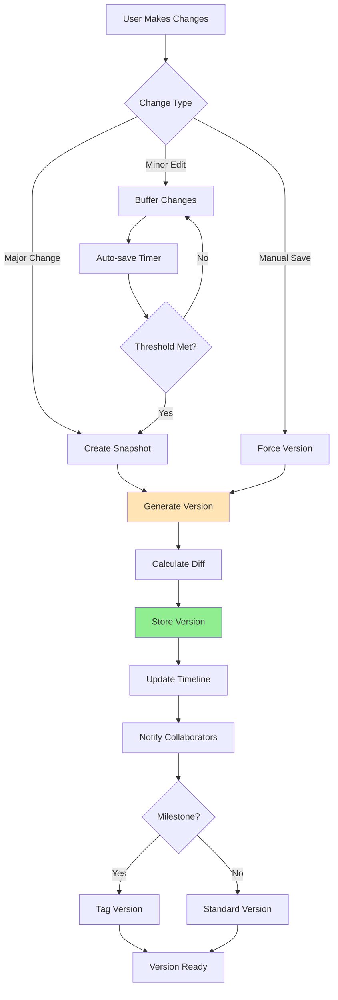
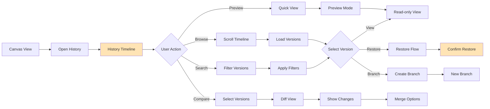
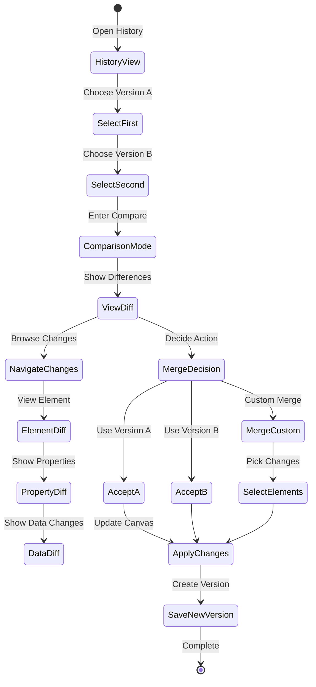
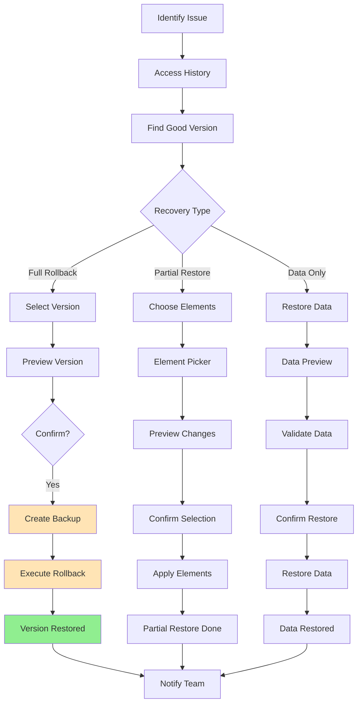

# User Flows & Wireframes - Version Control & History

## 1. Overview

Version Control & History provides users with complete transparency and control over changes made to their canvases and data. This feature enables tracking of all modifications, comparison between versions, rollback capabilities, and audit trails. It's essential for maintaining data integrity, enabling experimentation, and supporting collaborative workflows where multiple users make changes.

## 2. Version Control & History Flows

### 2.1. Automatic Version Creation Flow



### 2.2. Version History Navigation Flow



### 2.3. Version Comparison Flow



### 2.4. Rollback and Recovery Flow



## 3. Version Control & History Wireframes

### 3.1. Canvas with Version Indicator

```
┌─────────────────────────────────────────────────────────────────┐
│ Q1 2024 Sales Analysis                                          │
│ Version 47 • Last saved 2 minutes ago • Auto-save on           │
│                                                                 │
│ [📊 View] [✏️ Edit] [🕒 History] [↗ Share] [⋮ More]            │
├─────────────────────────────────────────────────────────────────┤
│                                                                 │
│ [Canvas Content]                                                │
│                                                                 │
│ ┌─────────────────────────────────────────────────────────────┐│
│ │ ℹ️ Unsaved changes (Last save: 2 min ago)      [Save Now]   ││
│ └─────────────────────────────────────────────────────────────┘│
└─────────────────────────────────────────────────────────────────┘
```

### 3.2. Version History Timeline

```
┌─────────────────────────────────────────────────────────────────┐
│ 🕒 Version History - Q1 2024 Sales Analysis      [Close] [×]   │
├─────────────────────────────────────────────────────────────────┤
│                                                                 │
│ [🔍 Search versions...] [Filter: All Changes ▼] [Compare Mode] │
│                                                                 │
│ Timeline View                           Total Versions: 47      │
│ ┌─────────────────────────────────────────────────────────────┐│
│ │                                                             ││
│ │ Today ─────────────────────────────────────────────────    ││
│ │                                                             ││
│ │ ● v47 (Current)                           2 min ago        ││
│ │   You • Added customer segment chart                       ││
│ │   Changes: +1 chart, ~2 metrics                           ││
│ │                                                             ││
│ │ ● v46                                     1 hour ago       ││
│ │   Sarah Chen • Updated revenue calculations                ││
│ │   Changes: ~5 formulas                    [View] [Restore] ││
│ │                                                             ││
│ │ ● v45 ⭐ Milestone: "Q1 Final"           3 hours ago      ││
│ │   You • Finalized Q1 analysis                              ││
│ │   Changes: +3 charts, +2 tables, ~10 text blocks          ││
│ │   Tagged by: You                         [View] [Restore]  ││
│ │                                                             ││
│ │ Yesterday ─────────────────────────────────────────────   ││
│ │                                                             ││
│ │ ● v44                                     18 hours ago     ││
│ │   Mike Johnson • Added comparative analysis                ││
│ │   Changes: +2 charts, +500 words         [View] [Restore] ││
│ │                                                             ││
│ │ ● v43                                     22 hours ago     ││
│ │   You • Fixed data connection issue                        ││
│ │   Changes: ~1 data source                [View] [Restore] ││
│ │                                                             ││
│ │ [Load More Versions...]                                    ││
│ └─────────────────────────────────────────────────────────────┘│
│                                                                 │
│ Quick Actions:                                                  │
│ [Compare Versions] [Export History] [Create Milestone]          │
└─────────────────────────────────────────────────────────────────┘
```

### 3.3. Version Comparison View

```
┌─────────────────────────────────────────────────────────────────┐
│ 📊 Compare Versions                    [Apply Changes] [Close]  │
├─────────────────────────────────────────────────────────────────┤
│                                                                 │
│ Version 45 (3 hours ago)          Version 47 (Current)         │
│ By: You                           By: You                       │
│                                                                 │
│ Summary of Changes:                                             │
│ • 2 charts added                                                │
│ • 5 metrics modified                                            │
│ • 3 text blocks updated                                         │
│                                                                 │
│ ┌─────────────────────────────────────────────────────────────┐│
│ │ Changed Elements:                      [Toggle View Mode ▼] ││
│ ├─────────────────────────────────────────────────────────────┤│
│ │ ➕ Customer Segments Chart                          Added   ││
│ │    New pie chart showing customer distribution              ││
│ │    [View in v47]                                           ││
│ │                                                             ││
│ │ 🔄 Revenue Metric                                  Modified ││
│ │    v45: $2.4M (excluding tax)                              ││
│ │    v47: $2.6M (including tax)     ← Current                ││
│ │    [Use v45] [Keep v47]                                    ││
│ │                                                             ││
│ │ 🔄 Growth Rate Calculation                         Modified ││
│ │    v45: YoY comparison                                     ││
│ │    v47: QoQ comparison            ← Current                ││
│ │    [Use v45] [Keep v47]                                    ││
│ │                                                             ││
│ │ ➖ Draft Analysis Text                              Removed  ││
│ │    "Preliminary findings suggest..."                        ││
│ │    [Restore from v45]                                      ││
│ └─────────────────────────────────────────────────────────────┘│
│                                                                 │
│ Visual Diff:  [Side by Side] [Overlay] [Slider]               │
│ ┌─────────────────────────────────────────────────────────────┐│
│ │ [Visual representation of canvas differences]              ││
│ └─────────────────────────────────────────────────────────────┘│
└─────────────────────────────────────────────────────────────────┘
```

### 3.4. Version Details Modal

```
┌─────────────────────────────────────────────────────────────────┐
│ Version 45 Details                          [Restore] [Close]   │
├─────────────────────────────────────────────────────────────────┤
│                                                                 │
│ ⭐ Milestone: "Q1 Final"                                        │
│                                                                 │
│ Created: March 15, 2024 at 2:30 PM                             │
│ Author: John Smith (You)                                        │
│ Canvas: Q1 2024 Sales Analysis                                  │
│                                                                 │
│ Version Notes:                                                  │
│ ┌─────────────────────────────────────────────────────────────┐│
│ │ "Finalized Q1 analysis with updated revenue figures and    ││
│ │  new customer segmentation. Ready for leadership review."   ││
│ └─────────────────────────────────────────────────────────────┘│
│                                                                 │
│ Changes in this version:                                        │
│ • Added 3 new charts (Revenue, Growth, Segments)               │
│ • Created 2 summary tables                                      │
│ • Updated 10 text blocks with final insights                   │
│ • Fixed calculation errors in metrics                          │
│                                                                 │
│ Statistics:                                                     │
│ • File size: 2.4 MB                                            │
│ • Elements: 23 total (15 visualizations, 8 text)              │
│ • Data sources: 3 connected                                    │
│                                                                 │
│ Related Activity:                                               │
│ • Shared with Leadership Team after this version               │
│ • 12 comments added by reviewers                              │
│ • Branched by Sarah for regional analysis                      │
│                                                                 │
│ [View Canvas] [Download] [Create Branch] [Compare to Current]   │
└─────────────────────────────────────────────────────────────────┘
```

### 3.5. Restore Version Confirmation

```
┌─────────────────────────────────────────────────────────────────┐
│ ⚠️ Restore Version 45?                                         │
├─────────────────────────────────────────────────────────────────┤
│                                                                 │
│ You're about to restore the canvas to version 45               │
│ (Created 3 hours ago by You)                                   │
│                                                                 │
│ This will:                                                      │
│ • Replace the current canvas (v47) with v45                    │
│ • Create a backup of the current version                        │
│ • Notify all collaborators of the change                       │
│                                                                 │
│ Changes that will be lost:                                     │
│ ┌─────────────────────────────────────────────────────────────┐│
│ │ • Customer segment chart (added in v47)                    ││
│ │ • Updated revenue calculations (v46)                        ││
│ │ • Mike's comparative analysis (v44)                         ││
│ └─────────────────────────────────────────────────────────────┘│
│                                                                 │
│ ☐ Create a branch instead of overwriting                       │
│ ☐ Notify specific people: [________________]                   │
│                                                                 │
│ Reason for restore (optional):                                  │
│ [_________________________________________________]             │
│                                                                 │
│ [Cancel] [Restore Version 45]                                   │
└─────────────────────────────────────────────────────────────────┘
```

### 3.6. Auto-save and Recovery

```
┌─────────────────────────────────────────────────────────────────┐
│ 🔄 Auto-save Settings                           [Save] [Close]  │
├─────────────────────────────────────────────────────────────────┤
│                                                                 │
│ Auto-save Preferences:                                          │
│                                                                 │
│ ☑ Enable auto-save                                             │
│ │                                                               │
│ └─ Save every: [5 minutes ▼]                                   │
│     • 1 minute (aggressive)                                     │
│     • 5 minutes (recommended)                                   │
│     • 10 minutes (conservative)                                 │
│     • Only on major changes                                     │
│                                                                 │
│ Version Creation:                                               │
│ ☑ Create version on significant changes                        │
│ ☑ Create version before risky operations                       │
│ ☐ Create version on every save                                 │
│                                                                 │
│ Recovery Options:                                               │
│ ☑ Keep unsaved changes in browser                              │
│ ☑ Recover from unexpected closure                              │
│ ☑ Show recovery prompt on conflict                             │
│                                                                 │
│ Version Retention:                                              │
│ Keep versions for: [90 days ▼]                                 │
│ Maximum versions: [Unlimited ▼]                                │
│                                                                 │
│ 💡 Current usage: 2.3 GB of version history                    │
└─────────────────────────────────────────────────────────────────┘
```

### 3.7. Version Branching

```
┌─────────────────────────────────────────────────────────────────┐
│ 🌿 Create Branch                                [Create] [Cancel]│
├─────────────────────────────────────────────────────────────────┤
│                                                                 │
│ Create a new branch from Version 45                            │
│                                                                 │
│ Branch Name:                                                    │
│ [Q1 Analysis - Regional Breakdown                    ]          │
│                                                                 │
│ Description:                                                    │
│ ┌─────────────────────────────────────────────────────────────┐│
│ │ Breaking down Q1 results by region for deeper analysis      ││
│ │ of geographic performance differences.                       ││
│ └─────────────────────────────────────────────────────────────┘│
│                                                                 │
│ Branch Settings:                                                │
│ ☑ Copy all canvas elements                                     │
│ ☑ Maintain data connections                                    │
│ ☐ Copy sharing permissions                                     │
│ ☐ Copy version history                                         │
│                                                                 │
│ This branch will:                                               │
│ • Create a separate canvas for experimentation                 │
│ • Not affect the main canvas                                   │
│ • Allow merging changes back later                             │
│                                                                 │
│ [Cancel] [Create Branch]                                        │
└─────────────────────────────────────────────────────────────────┘
```

### 3.8. Change Log Details

```
┌─────────────────────────────────────────────────────────────────┐
│ 📋 Detailed Change Log - Version 46            [Export] [Close] │
├─────────────────────────────────────────────────────────────────┤
│                                                                 │
│ Author: Sarah Chen                                              │
│ Time: March 15, 2024, 3:45 PM                                  │
│ Duration: 23 minutes                                            │
│                                                                 │
│ Element Changes:                                                │
│ ┌─────────────────────────────────────────────────────────────┐│
│ │ Modified: Revenue Calculation Block                         ││
│ │ ├─ Changed: Formula                                         ││
│ │ │  Before: SUM(sales_amount)                               ││
│ │ │  After:  SUM(sales_amount) * 1.08  // Adding tax        ││
│ │ └─ Reason: "Including tax for accurate reporting"          ││
│ │                                                             ││
│ │ Modified: YTD Growth Metric                                 ││
│ │ ├─ Changed: Comparison period                               ││
│ │ │  Before: vs. Previous Year                               ││
│ │ │  After:  vs. Previous Quarter                            ││
│ │ └─ Impact: Growth rate changed from 34% to 12%             ││
│ │                                                             ││
│ │ Modified: Executive Summary Text                            ││
│ │ ├─ Changed: 3 paragraphs                                   ││
│ │ └─ Word count: +127 words                                  ││
│ └─────────────────────────────────────────────────────────────┘│
│                                                                 │
│ Data Changes:                                                   │
│ • No data source modifications                                  │
│ • 5 calculated fields updated                                   │
│ • All charts automatically refreshed                           │
│                                                                 │
│ [View Full Diff] [Revert Changes] [Contact Sarah]              │
└─────────────────────────────────────────────────────────────────┘
```

### 3.9. Version Conflict Resolution

```
┌─────────────────────────────────────────────────────────────────┐
│ ⚠️ Version Conflict Detected                                   │
├─────────────────────────────────────────────────────────────────┤
│                                                                 │
│ Your changes conflict with Sarah's recent update               │
│                                                                 │
│ Your Version (Auto-saved)         Sarah's Version (2 min ago)  │
│ ┌─────────────────────┐ ┌─────────────────────┐               │
│ │ Revenue: $2.4M      │ │ Revenue: $2.6M      │               │
│ │ (Without tax)       │ │ (With tax)          │               │
│ │                     │ │                     │               │
│ │ Growth: 34% YoY     │ │ Growth: 12% QoQ     │               │
│ └─────────────────────┘ └─────────────────────┘               │
│                                                                 │
│ Conflicting Elements: 2                                         │
│                                                                 │
│ Resolution Options:                                             │
│ ┌─────────────────────────────────────────────────────────────┐│
│ │ ○ Use Sarah's version (recommended - she's the owner)      ││
│ │ ○ Keep my version                                          ││
│ │ ○ Merge both versions (create variant metrics)             ││
│ │ ○ Create a branch with my changes                          ││
│ └─────────────────────────────────────────────────────────────┘│
│                                                                 │
│ 💬 Add a comment about this conflict:                          │
│ [________________________________________________]              │
│                                                                 │
│ [View Details] [Resolve Conflict]                               │
└─────────────────────────────────────────────────────────────────┘
```

### 3.10. Version Export Options

```
┌─────────────────────────────────────────────────────────────────┐
│ 📥 Export Version History                      [Export] [Cancel]│
├─────────────────────────────────────────────────────────────────┤
│                                                                 │
│ Export Range:                                                   │
│ ○ All versions (47 total)                                      │
│ ○ Last [30 ▼] days                                            │
│ ○ Specific versions:                                           │
│   From: [Version 40 ▼] To: [Version 47 (Current) ▼]          │
│ ● Milestones only (3 versions)                                 │
│                                                                 │
│ Include in Export:                                              │
│ ☑ Version metadata (author, timestamp, notes)                  │
│ ☑ Change summaries                                             │
│ ☑ Full change diffs                                            │
│ ☐ Canvas snapshots (increases file size)                       │
│ ☐ Comments and discussions                                     │
│ ☑ Audit trail (who viewed/restored)                           │
│                                                                 │
│ Export Format:                                                  │
│ ○ PDF Report (human readable)                                  │
│ ● JSON (machine readable)                                      │
│ ○ CSV (summary only)                                           │
│                                                                 │
│ Estimated size: ~4.2 MB                                         │
│                                                                 │
│ [Cancel] [Export History]                                       │
└─────────────────────────────────────────────────────────────────┘
```

### 3.11. Mobile Version History

```
┌─────────────────────────────────────────┐
│ 🕒 Version History                 [×]  │
├─────────────────────────────────────────┤
│                                         │
│ Current: v47                            │
│ [Compare] [Restore]                     │
│                                         │
│ Today ─────────────────────             │
│                                         │
│ ┌─────────────────────────────────────┐│
│ │ v47 • 2 min ago            Current ││
│ │ You                                 ││
│ │ + Added customer chart              ││
│ └─────────────────────────────────────┘│
│                                         │
│ ┌─────────────────────────────────────┐│
│ │ v46 • 1 hour ago                   ││
│ │ Sarah Chen                          ││
│ │ ~ Updated calculations              ││
│ │ [View] [Restore]                    ││
│ └─────────────────────────────────────┘│
│                                         │
│ ┌─────────────────────────────────────┐│
│ │ v45 ⭐ • 3 hours ago               ││
│ │ You • "Q1 Final"                    ││
│ │ Major update                        ││
│ │ [View] [Restore]                    ││
│ └─────────────────────────────────────┘│
│                                         │
│ [Load More]                             │
└─────────────────────────────────────────┘
```

### 3.12. Recovery Prompt

```
┌─────────────────────────────────────────────────────────────────┐
│ 🔄 Unsaved Changes Recovered                                    │
├─────────────────────────────────────────────────────────────────┤
│                                                                 │
│ We found unsaved changes from your last session                │
│ (15 minutes ago)                                               │
│                                                                 │
│ Recovered changes:                                              │
│ • Modified revenue chart                                        │
│ • Added 2 new text blocks                                      │
│ • Updated customer segmentation                                │
│                                                                 │
│ What would you like to do?                                     │
│                                                                 │
│ [Restore Changes] [Discard] [View Details]                     │
│                                                                 │
│ 💡 Tip: Recovered changes are saved for 24 hours              │
└─────────────────────────────────────────────────────────────────┘
```

## 4. Advanced Version Control Features

### 4.1. Version Tagging System

```
┌─────────────────────────────────────────────────────────────────┐
│ 🏷️ Manage Version Tags                         [Save] [Close]   │
├─────────────────────────────────────────────────────────────────┤
│                                                                 │
│ Version 45 Tags:                                                │
│                                                                 │
│ Current Tags:                                                   │
│ [⭐ Milestone] [✅ Approved] [📊 Q1-Final] [×]                 │
│                                                                 │
│ Add New Tag:                                                    │
│ [Enter tag name...] [+ Add]                                     │
│                                                                 │
│ Suggested Tags:                                                 │
│ [WIP] [Review] [Final] [Archived] [Baseline]                   │
│                                                                 │
│ Tag Colors:                                                     │
│ ○ 🔴 Red (Critical)                                            │
│ ○ 🟡 Yellow (Review)                                           │
│ ● 🟢 Green (Approved)                                          │
│ ○ 🔵 Blue (Information)                                        │
│                                                                 │
│ Tag Rules:                                                      │
│ ☑ Only owners can add milestone tags                           │
│ ☑ Notify team when tagged as "Final"                          │
│ ☐ Require approval for "Approved" tag                          │
│                                                                 │
│ [Apply to Version] [Create Tag Template]                        │
└─────────────────────────────────────────────────────────────────┘
```

### 4.2. Version Merge Tool

```
┌─────────────────────────────────────────────────────────────────┐
│ 🔀 Merge Versions                             [Preview] [Merge] │
├─────────────────────────────────────────────────────────────────┤
│                                                                 │
│ Merging: Branch "Regional Analysis" → Main Canvas              │
│                                                                 │
│ Changes to Merge:                                               │
│ ┌─────────────────────────────────────────────────────────────┐│
│ │ Source (Regional Branch)    Target (Main)      Action      ││
│ ├─────────────────────────────────────────────────────────────┤│
│ │ + Region Chart              (Not in main)      [Include ✓] ││
│ │ + Regional Table            (Not in main)      [Include ✓] ││
│ │ ~ Revenue Metric            $2.4M → $2.6M      [Keep Main] ││
│ │ ~ Growth Calculation        Different          [Use Branch]││
│ │ - Draft Section             (In main only)     [Keep ✓]    ││
│ └─────────────────────────────────────────────────────────────┘│
│                                                                 │
│ Merge Strategy:                                                 │
│ ○ Add new elements only (safe)                                 │
│ ● Smart merge (recommended)                                     │
│ ○ Replace with branch version                                  │
│ ○ Manual selection                                             │
│                                                                 │
│ Conflict Resolution: 2 conflicts found                          │
│ [Review Conflicts] [Auto-resolve]                               │
│                                                                 │
│ Post-merge Actions:                                             │
│ ☑ Create backup before merge                                   │
│ ☑ Tag as merged version                                        │
│ ☐ Archive source branch                                        │
│                                                                 │
│ [Cancel] [Preview Merge] [Execute Merge]                       │
└─────────────────────────────────────────────────────────────────┘
```

### 4.3. Audit Trail View

```
┌─────────────────────────────────────────────────────────────────┐
│ 🔍 Version Audit Trail                        [Export] [Close]  │
├─────────────────────────────────────────────────────────────────┤
│                                                                 │
│ Canvas: Q1 2024 Sales Analysis                                  │
│ Period: Last 7 days              [Change Period ▼]             │
│                                                                 │
│ Version Access Log:                                             │
│ ┌─────────────────────────────────────────────────────────────┐│
│ │ Time          User         Action       Version   Details  ││
│ ├─────────────────────────────────────────────────────────────┤│
│ │ 10 min ago   Sarah Chen   Viewed       v47       2 min    ││
│ │ 1 hour ago   Mike J.      Compared     v45→v46   5 min    ││
│ │ 2 hours ago  You          Restored     v45       Success  ││
│ │ 3 hours ago  Amy Liu      Downloaded   v44       PDF      ││
│ │ 5 hours ago  You          Created      v47       Manual   ││
│ │ 1 day ago    System       Auto-saved   v46       Success  ││
│ │ 1 day ago    Sarah Chen   Branched     v45       Regional ││
│ └─────────────────────────────────────────────────────────────┘│
│                                                                 │
│ Summary Statistics:                                             │
│ • Most viewed: v45 (12 views)                                  │
│ • Most restored: v42 (3 times)                                 │
│ • Average time between versions: 4.2 hours                     │
│ • Total storage used: 124 MB                                   │
│                                                                 │
│ Suspicious Activity: None detected                              │
│                                                                 │
│ [Download Full Audit] [Security Settings]                      │
└─────────────────────────────────────────────────────────────────┘
```

## 5. Error States and Edge Cases

### 5.1. Version Corruption Recovery

```
┌─────────────────────────────────────────────────────────────────┐
│ ❌ Version Error Detected                                       │
├─────────────────────────────────────────────────────────────────┤
│                                                                 │
│ Version 46 appears to be corrupted or incomplete               │
│                                                                 │
│ Error Details:                                                  │
│ • Missing chart data references                                 │
│ • Incomplete save operation at 3:45 PM                         │
│ • Possible cause: Network interruption                         │
│                                                                 │
│ Recovery Options:                                               │
│ ┌─────────────────────────────────────────────────────────────┐│
│ │ 1. Use automatic backup (v46-backup)                       ││
│ │    Created: 3:44 PM (1 minute before error)               ││
│ │    Status: ✅ Intact                                       ││
│ │    [Restore Backup]                                        ││
│ │                                                             ││
│ │ 2. Skip to previous version (v45)                          ││
│ │    Created: 2:30 PM by You                                 ││
│ │    Status: ✅ Verified                                     ││
│ │    [Use v45]                                               ││
│ │                                                             ││
│ │ 3. Attempt repair (may lose some data)                     ││
│ │    [Try Repair]                                            ││
│ └─────────────────────────────────────────────────────────────┘│
│                                                                 │
│ [Contact Support] [View Technical Details]                      │
└─────────────────────────────────────────────────────────────────┘
```

### 5.2. Storage Limit Warning

```
┌─────────────────────────────────────────────────────────────────┐
│ ⚠️ Version Storage Limit Approaching                           │
├─────────────────────────────────────────────────────────────────┤
│                                                                 │
│ You've used 9.2 GB of your 10 GB version history quota        │
│                                                                 │
│ Storage Breakdown:                                              │
│ ┌─────────────────────────────────────────────────────────────┐│
│ │ Canvas versions:      6.8 GB (74%)                         ││
│ │ Data snapshots:       1.9 GB (21%)                         ││
│ │ Media attachments:    0.5 GB (5%)                          ││
│ └─────────────────────────────────────────────────────────────┘│
│                                                                 │
│ Recommended Actions:                                            │
│ • Archive versions older than 90 days                          │
│ • Remove duplicate versions                                     │
│ • Upgrade to Pro for unlimited storage                         │
│                                                                 │
│ Quick Cleanup Options:                                          │
│ ┌─────────────────────────────────────────────────────────────┐│
│ │ ☐ Auto-archive versions > 6 months (saves ~3 GB)          ││
│ │ ☐ Remove non-milestone versions > 90 days (saves ~2 GB)   ││
│ │ ☐ Compress old versions (saves ~1.5 GB)                   ││
│ └─────────────────────────────────────────────────────────────┘│
│                                                                 │
│ [Clean Up Now] [Upgrade Storage] [Remind Me Later]             │
└─────────────────────────────────────────────────────────────────┘
```

## 6. Implementation Notes

### 6.1. Technical Architecture

- **Incremental saves**: Only store diffs between versions
- **Compression**: Use efficient compression for storage
- **Deduplication**: Identify and remove duplicate data
- **Background processing**: Version creation doesn't block UI
- **Conflict detection**: Real-time monitoring for conflicts

### 6.2. Performance Optimization

- **Lazy loading**: Load version details on demand
- **Pagination**: Handle large version histories efficiently
- **Caching**: Cache frequently accessed versions
- **Preview generation**: Pre-render version previews
- **Delta sync**: Only sync changes between versions

### 6.3. Security and Compliance

- **Immutable history**: Versions cannot be deleted, only archived
- **Audit logging**: Track all version access and changes
- **Encryption**: Encrypt version data at rest
- **Access control**: Respect canvas permissions for versions
- **Compliance**: Support regulatory retention requirements

## 7. Success Metrics

### 7.1. Usage Metrics

- **Version creation rate**: Avg versions per canvas per week
- **Restore frequency**: How often users restore old versions
- **Comparison usage**: % of users who compare versions
- **Branch creation**: Number of branches per canvas
- **Conflict rate**: Conflicts per 100 collaborative edits

### 7.2. Performance Metrics

- **Save latency**: Time to create new version < 2s
- **Load time**: Version history loads < 1s
- **Restore time**: Complete restore < 5s
- **Storage efficiency**: Compression ratio > 10:1
- **Conflict resolution**: Avg time to resolve < 30s

### 7.3. User Satisfaction

- **Recovery success**: % of successful data recoveries
- **Feature adoption**: % of users using version control
- **Error rate**: Version-related errors < 0.1%
- **Support tickets**: Version-related issues trend
- **User feedback**: Version control satisfaction score
