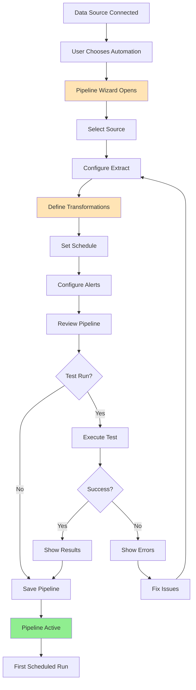
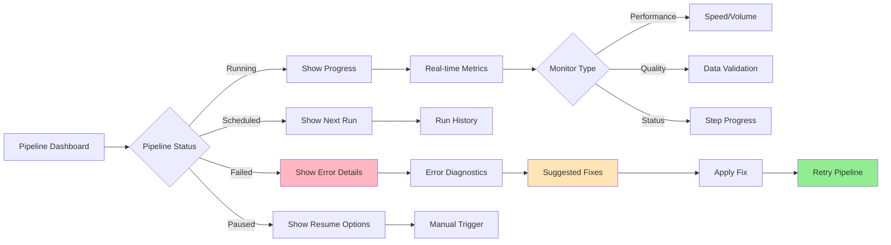
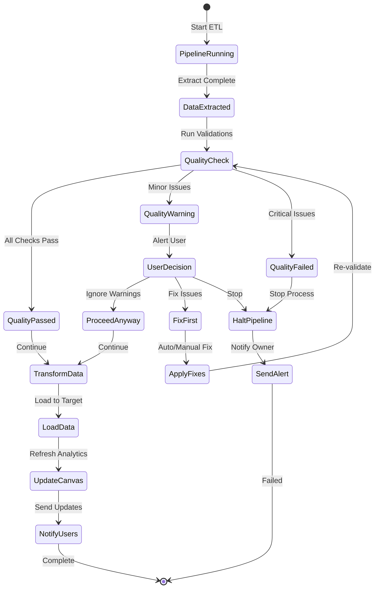
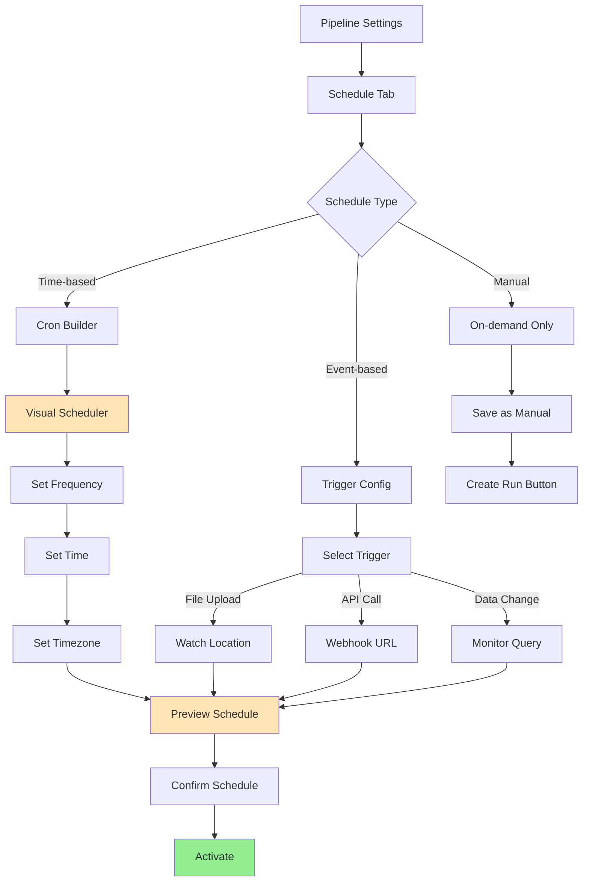

# User Flows & Wireframes - Automated ETL and Data Refresh

## 1. Overview

Automated ETL and Data Refresh transforms Jabiru from a one-time analysis tool into a living, breathing analytics platform. This document details all flows related to creating, managing, and monitoring automated data pipelines that keep analyses current without manual intervention. The focus is on making complex ETL operations accessible to non-technical users while providing power users with advanced capabilities.

## 2. Automated ETL and Data Refresh Flows

### 2.1. ETL Pipeline Creation Flow



### 2.2. Pipeline Monitoring Flow



### 2.3. Data Quality Management Flow



### 2.4. Schedule Management Flow



## 3. Automated ETL and Data Refresh Wireframes

### 3.1. ETL Pipeline Dashboard

```
┌─────────────────────────────────────────────────────────────────┐
│ 🔄 Data Pipelines                              [+ New Pipeline] │
├─────────────────────────────────────────────────────────────────┤
│                                                                 │
│ [🔍 Search pipelines...]        [Status: All ▼] [Sort: Recent ▼]│
│                                                                 │
│ Active Pipelines (3)                          System Health: 98%│
│ ┌─────────────────────────────────────────────────────────────┐│
│ │ ┌─────────────────────────────────┬─────────────────────┐  ││
│ │ │ 📊 Daily Sales Sync             │ 🟢 Healthy          │  ││
│ │ │                                 │                     │  ││
│ │ │ PostgreSQL → Sales Dashboard    │ Next run: 2 hrs    │  ││
│ │ │ Every day at 6:00 AM           │ Last run: Success  │  ││
│ │ │                                 │ 1,234 rows updated │  ││
│ │ │ [▶️ Run Now] [⚙️] [📊 View]     │ Runtime: 2m 34s    │  ││
│ │ └─────────────────────────────────┴─────────────────────┘  ││
│ │                                                             ││
│ │ ┌─────────────────────────────────┬─────────────────────┐  ││
│ │ │ 🔗 Customer Data Integration    │ ⚠️ Needs Attention  │  ││
│ │ │                                 │                     │  ││
│ │ │ CRM API → Customer Analytics    │ Last run: Warning  │  ││
│ │ │ Every 4 hours                  │ 12 quality issues  │  ││
│ │ │                                 │ 5,432 rows updated │  ││
│ │ │ [⏸️ Pause] [🔧 Fix] [📊 View]   │ [View Issues]      │  ││
│ │ └─────────────────────────────────┴─────────────────────┘  ││
│ │                                                             ││
│ │ ┌─────────────────────────────────┬─────────────────────┐  ││
│ │ │ 📈 Weekly Metrics Rollup        │ 🟢 Running Now      │  ││
│ │ │                                 │                     │  ││
│ │ │ Multiple sources → KPI Dashboard│ Progress: 67%      │  ││
│ │ │ Every Monday at 9:00 AM        │ ETA: 3 minutes    │  ││
│ │ │                                 │ Processing step 4/6│  ││
│ │ │ [⏹️ Stop] [👁️ Monitor] [📊]     │ [View Progress]    │  ││
│ │ └─────────────────────────────────┴─────────────────────┘  ││
│ └─────────────────────────────────────────────────────────────┘│
│                                                                 │
│ Recent Activity                                   [View All →]  │
│ • Daily Sales Sync completed successfully - 5 min ago          │
│ • Marketing Pipeline paused by user - 1 hour ago               │
│ • New pipeline "Inventory Update" created - 2 hours ago        │
└─────────────────────────────────────────────────────────────────┘
```

### 3.2. Create New Pipeline Wizard - Step 1: Source Selection

```
┌─────────────────────────────────────────────────────────────────┐
│ Create Data Pipeline - Step 1 of 5              [Save Draft] [×]│
├─────────────────────────────────────────────────────────────────┤
│                                                                 │
│ Pipeline Name: [Monthly Sales Report Update                   ] │
│                                                                 │
│ 📊 Select Data Source                                           │
│                                                                 │
│ Your Connected Sources:                                         │
│ ┌─────────────────────────────────────────────────────────────┐│
│ │ ┌─────────────────┐ ┌─────────────────┐ ┌─────────────────┐││
│ │ │ 🗄️ PostgreSQL   │ │ 📁 CSV Upload   │ │ 🔗 Salesforce  │││
│ │ │ Production DB   │ │ Monthly Files  │ │ CRM Data       │││
│ │ │                 │ │                 │ │                 │││
│ │ │ 15 tables       │ │ /data/uploads/ │ │ Opportunities  │││
│ │ │ Live connection │ │ File watcher   │ │ Accounts       │││
│ │ │                 │ │                 │ │                 │││
│ │ │ [Select]        │ │ [Select]        │ │ [Select]       │││
│ │ └─────────────────┘ └─────────────────┘ └─────────────────┘││
│ └─────────────────────────────────────────────────────────────┘│
│                                                                 │
│ Or add a new source:                                            │
│ [+ Connect New Database] [+ Configure API] [+ Add File Path]   │
│                                                                 │
│ 💡 Tip: You can combine multiple sources in the next step      │
│                                                                 │
│ [← Back] [Next: Configure Extract →]                           │
└─────────────────────────────────────────────────────────────────┘
```

### 3.3. Create New Pipeline Wizard - Step 2: Extract Configuration

```
┌─────────────────────────────────────────────────────────────────┐
│ Create Data Pipeline - Step 2 of 5              [Save Draft] [×]│
├─────────────────────────────────────────────────────────────────┤
│                                                                 │
│ 🔍 Configure Data Extraction                                    │
│                                                                 │
│ Source: PostgreSQL - Production DB                              │
│                                                                 │
│ Extract Method:                                                 │
│ ○ Full Refresh - Replace all data each run                    │
│ ● Incremental - Only new/modified records                     │
│ ○ Custom Query - Write your own SQL                           │
│                                                                 │
│ ┌─────────────────────────────────────────────────────────────┐│
│ │ Tables to Extract:                          [Select All]    ││
│ │ ☑ orders (125,432 rows)                                    ││
│ │   Track by: [updated_at ▼] Since: [Last successful run ▼] ││
│ │ ☑ order_items (342,123 rows)                               ││
│ │   Track by: [created_at ▼] Since: [Last successful run ▼] ││
│ │ ☐ customers (45,231 rows)                                  ││
│ │ ☐ products (1,234 rows)                                    ││
│ └─────────────────────────────────────────────────────────────┘│
│                                                                 │
│ Advanced Filters:                               [+ Add Filter] │
│ • WHERE order_status != 'cancelled'                           │
│ • AND region IN ('North America', 'Europe')                   │
│                                                                 │
│ Estimated data size: ~15 MB per run                            │
│ Estimated duration: 2-3 minutes                                │
│                                                                 │
│ [← Back] [Test Extraction] [Next: Transform →]                 │
└─────────────────────────────────────────────────────────────────┘
```

### 3.4. Create New Pipeline Wizard - Step 3: Transformations

```
┌─────────────────────────────────────────────────────────────────┐
│ Create Data Pipeline - Step 3 of 5              [Save Draft] [×]│
├─────────────────────────────────────────────────────────────────┤
│                                                                 │
│ 🔄 Define Transformations                                       │
│                                                                 │
│ Applied Transformations:                        [+ Add Step]    │
│ ┌─────────────────────────────────────────────────────────────┐│
│ │ 1. Clean Data                                    [⚙️] [🗑️]  ││
│ │    Remove null customer_ids                                ││
│ │    Standardize date formats                                ││
│ │    → Affects 234 rows                                      ││
│ │                                                             ││
│ │ 2. Calculate Metrics                              [⚙️] [🗑️]  ││
│ │    Add column: order_value_tier                            ││
│ │    Formula: CASE WHEN total > 1000 THEN 'High'...         ││
│ │    → Creates 1 new column                                  ││
│ │                                                             ││
│ │ 3. Join Data                                      [⚙️] [🗑️]  ││
│ │    Left join: orders + customers                           ││
│ │    On: orders.customer_id = customers.id                   ││
│ │    → Enriches with customer demographics                   ││
│ └─────────────────────────────────────────────────────────────┘│
│                                                                 │
│ AI-Suggested Transformations:                 [Apply All]      │
│ ┌─────────────────────────────────────────────────────────────┐│
│ │ 💡 Detected wide format data in order_items                ││
│ │    Suggestion: Unpivot months to rows         [Apply]      ││
│ │                                                             ││
│ │ 💡 Found inconsistent product categories                    ││
│ │    Suggestion: Standardize naming             [Apply]      ││
│ └─────────────────────────────────────────────────────────────┘│
│                                                                 │
│ Preview Output:                          [Refresh Preview]     │
│ [Table showing 10 sample rows after transformations]           │
│                                                                 │
│ [← Back] [Test Transformations] [Next: Schedule →]             │
└─────────────────────────────────────────────────────────────────┘
```

### 3.5. Create New Pipeline Wizard - Step 4: Schedule Setup

```
┌─────────────────────────────────────────────────────────────────┐
│ Create Data Pipeline - Step 4 of 5              [Save Draft] [×]│
├─────────────────────────────────────────────────────────────────┤
│                                                                 │
│ ⏰ Set Refresh Schedule                                         │
│                                                                 │
│ Schedule Type:                                                  │
│ ○ Run manually only                                            │
│ ● Run on schedule                                              │
│ ○ Trigger by event                                             │
│                                                                 │
│ ┌─────────────────────────────────────────────────────────────┐│
│ │ Frequency: [Daily ▼]                                        ││
│ │ • Hourly                                                    ││
│ │ • Daily ✓                                                   ││
│ │ • Weekly                                                    ││
│ │ • Monthly                                                   ││
│ │ • Custom (cron)                                             ││
│ │                                                             ││
│ │ Time: [06:00 ▼] [AM ▼]   Timezone: [America/New_York ▼]   ││
│ │                                                             ││
│ │ Starting: [Tomorrow ▼]                                      ││
│ │                                                             ││
│ │ 📅 Schedule Preview:                                        ││
│ │ Next 5 runs:                                                ││
│ │ • Tomorrow, Jan 16 at 6:00 AM EST                          ││
│ │ • Wednesday, Jan 17 at 6:00 AM EST                         ││
│ │ • Thursday, Jan 18 at 6:00 AM EST                          ││
│ │ • Friday, Jan 19 at 6:00 AM EST                            ││
│ │ • Saturday, Jan 20 at 6:00 AM EST                          ││
│ └─────────────────────────────────────────────────────────────┘│
│                                                                 │
│ Advanced Options:                                               │
│ ☑ Skip if previous run still active                           │
│ ☑ Retry failed runs (up to 3 times)                           │
│ ☐ Pause on weekends                                           │
│                                                                 │
│ [← Back] [Next: Notifications →]                               │
└─────────────────────────────────────────────────────────────────┘
```

### 3.6. Create New Pipeline Wizard - Step 5: Alerts & Review

```
┌─────────────────────────────────────────────────────────────────┐
│ Create Data Pipeline - Step 5 of 5              [Save Draft] [×]│
├─────────────────────────────────────────────────────────────────┤
│                                                                 │
│ 🔔 Configure Alerts                                             │
│                                                                 │
│ Notify me when:                                                 │
│ ☑ Pipeline fails                     → Email, In-app          │
│ ☑ Data quality issues detected       → Email                  │
│ ☐ Each run completes successfully    → None                   │
│ ☑ No data found for extraction       → Email, SMS             │
│                                                                 │
│ Additional recipients: [sarah@company.com, team@company.com  ] │
│                                                                 │
│ 📋 Pipeline Summary:                                            │
│ ┌─────────────────────────────────────────────────────────────┐│
│ │ Name: Monthly Sales Report Update                           ││
│ │                                                             ││
│ │ Source: PostgreSQL - Production DB                          ││
│ │ Tables: orders, order_items (incremental)                   ││
│ │ Transforms: 3 steps (clean, calculate, join)               ││
│ │ Schedule: Daily at 6:00 AM EST                              ││
│ │ Destination: Project dataset                                ││
│ │                                                             ││
│ │ Estimated impact:                                           ││
│ │ • ~15k new rows daily                                      ││
│ │ • 2-3 minute runtime                                       ││
│ │ • Updates 5 canvases automatically                         ││
│ └─────────────────────────────────────────────────────────────┘│
│                                                                 │
│ ☐ Run test before activating                                   │
│                                                                 │
│ [← Back] [Save as Draft] [Activate Pipeline]                   │
└─────────────────────────────────────────────────────────────────┘
```

### 3.7. Pipeline Monitoring View

```
┌─────────────────────────────────────────────────────────────────┐
│ 📊 Daily Sales Sync - Monitoring           [⚙️ Settings] [×]   │
├─────────────────────────────────────────────────────────────────┤
│                                                                 │
│ Status: 🟢 Running                    Started: 6:00:03 AM      │
│ Progress: ████████████░░░░░ 67%       ETA: 48 seconds         │
│                                                                 │
│ Current Step: Transform Data (3 of 5)                           │
│ ┌─────────────────────────────────────────────────────────────┐│
│ │ ✅ Connect to source              0:02s                    ││
│ │ ✅ Extract data                   0:45s  15,234 rows      ││
│ │ ⚡ Transform data                  0:23s  In progress...   ││
│ │ ○ Validate quality                --     Pending          ││
│ │ ○ Load to destination             --     Pending          ││
│ └─────────────────────────────────────────────────────────────┘│
│                                                                 │
│ Live Metrics:                                                   │
│ ┌────────────────┬────────────────┬────────────────┐          │
│ │ Rows Processed │ Processing Rate │ Memory Usage   │          │
│ │ 10,234 / 15,234│ 450 rows/sec    │ 234 MB         │          │
│ └────────────────┴────────────────┴────────────────┘          │
│                                                                 │
│ Recent Runs:                                                    │
│ [Chart showing last 7 days of runs with duration and status]   │
│                                                                 │
│ Quality Metrics:                                                │
│ • Data freshness: ✅ Current (< 1 hour old)                   │
│ • Completeness: ✅ 99.8% (26 nulls in optional fields)        │
│ • Accuracy: ✅ All validation rules passing                    │
│                                                                 │
│ [Pause Pipeline] [View Logs] [Export Metrics]                  │
└─────────────────────────────────────────────────────────────────┘
```

### 3.8. Pipeline Error Details

```
┌─────────────────────────────────────────────────────────────────┐
│ ❌ Pipeline Failed - Customer Data Integration                  │
├─────────────────────────────────────────────────────────────────┤
│                                                                 │
│ Failed at: Transform Data step           Time: 6:03:45 AM      │
│ Error Type: Data Quality Violation                              │
│                                                                 │
│ Error Details:                                                  │
│ ┌─────────────────────────────────────────────────────────────┐│
│ │ Column 'customer_email' contains 523 invalid values:       ││
│ │                                                             ││
│ │ Examples:                                                   ││
│ │ • Row 1,234: "notanemail"                                  ││
│ │ • Row 2,456: "@company.com"                                ││
│ │ • Row 3,789: "test@test"                                   ││
│ │                                                             ││
│ │ Validation rule: Must be valid email format                ││
│ │ Action taken: Pipeline halted to prevent bad data          ││
│ └─────────────────────────────────────────────────────────────┘│
│                                                                 │
│ 🔧 Suggested Fixes:                                            │
│ ┌─────────────────────────────────────────────────────────────┐│
│ │ 1. Skip invalid rows (lose 523 records)       [Apply]      ││
│ │ 2. Set invalid emails to null                 [Apply]      ││
│ │ 3. Fix at source (update CRM data)            [Guide]      ││
│ │ 4. Relax validation rules                     [Configure]  ││
│ └─────────────────────────────────────────────────────────────┘│
│                                                                 │
│ Previous successful run: Yesterday, 6:00 AM                     │
│ Affected canvases: Customer Analytics, Sales Dashboard          │
│                                                                 │
│ [Retry with Fix] [Skip This Run] [Contact Support]             │
└─────────────────────────────────────────────────────────────────┘
```

### 3.9. Data Lineage View

```
┌─────────────────────────────────────────────────────────────────┐
│ 🔍 Data Lineage - Sales Dashboard                    [Export]   │
├─────────────────────────────────────────────────────────────────┤
│                                                                 │
│ Trace data flow from source to visualization:                   │
│                                                                 │
│ ┌─────────────────────────────────────────────────────────────┐│
│ │   PostgreSQL          Pipeline           Dataset            ││
│ │   Database            Processing         Storage            ││
│ │                                                             ││
│ │ ┌──────────┐    ┌─────────────┐    ┌──────────────┐      ││
│ │ │ orders   │───▶│ Daily Sales │───▶│ sales_clean  │      ││
│ │ │ table    │    │ Sync        │    │ dataset      │      ││
│ │ └──────────┘    │             │    └──────┬───────┘      ││
│ │                 │ • Clean     │            │              ││
│ │ ┌──────────┐    │ • Join      │            ▼              ││
│ │ │ customers│───▶│ • Calculate │    ┌──────────────┐      ││
│ │ │ table    │    │             │    │ Revenue      │      ││
│ │ └──────────┘    └─────────────┘    │ Chart        │      ││
│ │                                     └──────────────┘      ││
│ │                                                             ││
│ │ Last updated: 2 hours ago via automated pipeline           ││
│ └─────────────────────────────────────────────────────────────┘│
│                                                                 │
│ Impact Analysis:                                                │
│ This data powers:                                               │
│ • 3 Executive dashboards                                        │
│ • 12 Team canvases                                             │
│ • 5 Scheduled reports                                           │
│ • 2 Public shares                                               │
│                                                                 │
│ Change Alert: Modifying this pipeline affects 47 users         │
│                                                                 │
│ [View Dependencies] [Test Impact] [Clone Pipeline]             │
└─────────────────────────────────────────────────────────────────┘
```

### 3.10. Schedule Calendar View

```
┌─────────────────────────────────────────────────────────────────┐
│ 📅 Pipeline Schedule Calendar - January 2024      [List View]  │
├─────────────────────────────────────────────────────────────────┤
│                                                                 │
│ [◀ December]          January 2024            [February ▶]     │
│                                                                 │
│ ┌─────┬─────┬─────┬─────┬─────┬─────┬─────┐                  │
│ │ Sun │ Mon │ Tue │ Wed │ Thu │ Fri │ Sat │   Legend:        │
│ ├─────┼─────┼─────┼─────┼─────┼─────┼─────┤   ● Daily        │
│ │     │  1  │  2  │  3  │  4  │  5  │  6  │   ◆ Weekly       │
│ │     │ ●●● │ ●●● │ ●●● │ ●●● │ ●●● │ ●   │   ■ Monthly      │
│ ├─────┼─────┼─────┼─────┼─────┼─────┼─────┤                  │
│ │  7  │  8  │  9  │ 10  │ 11  │ 12  │ 13  │   Today: Jan 15  │
│ │ ●   │ ●●●◆│ ●●● │ ●●● │ ●●● │ ●●● │ ●   │                  │
│ ├─────┼─────┼─────┼─────┼─────┼─────┼─────┤                  │
│ │ 14  │ 15  │ 16  │ 17  │ 18  │ 19  │ 20  │   Scheduled:     │
│ │ ●   │ ●●●■│ ●●● │ ●●● │ ●●● │ ●●● │ ●   │   • 3 pipelines  │
│ │     │ ▼   │     │     │     │     │     │   • 6:00 AM      │
│ └─────┴─────┴─────┴─────┴─────┴─────┴─────┘                  │
│                                                                 │
│ Today's Schedule (Monday, January 15):                          │
│ ┌─────────────────────────────────────────────────────────────┐│
│ │ 6:00 AM  ● Daily Sales Sync              [Running now]     ││
│ │ 6:00 AM  ● Customer Data Refresh         [Scheduled]       ││
│ │ 9:00 AM  ◆ Weekly KPI Rollup             [Scheduled]       ││
│ │ 12:00 PM ■ Monthly Executive Report      [Scheduled]       ││
│ │ 6:00 PM  ● Daily Sales Sync (Run 2)      [Scheduled]       ││
│ └─────────────────────────────────────────────────────────────┘│
│                                                                 │
│ [Add Pipeline] [Manage Conflicts] [Export Schedule]            │
└─────────────────────────────────────────────────────────────────┘
```

### 3.11. Mobile Pipeline Management

```
┌─────────────────────────────────────────┐
│ 🔄 Pipelines                       [+]  │
├─────────────────────────────────────────┤
│                                         │
│ Running Now (1)                         │
│ ┌─────────────────────────────────────┐│
│ │ 📊 Daily Sales Sync                 ││
│ │ ████████░░ 78% • ETA: 30s          ││
│ │ [⏸️] [View Details]                 ││
│ └─────────────────────────────────────┘│
│                                         │
│ Scheduled Today (2)                     │
│ ┌─────────────────────────────────────┐│
│ │ Customer Refresh • 12:00 PM         ││
│ │ Marketing Sync • 6:00 PM            ││
│ └─────────────────────────────────────┘│
│                                         │
│ Recent Issues (1)                       │
│ ┌─────────────────────────────────────┐│
│ │ ⚠️ Inventory Update                 ││
│ │ Failed 2 hours ago                  ││
│ │ [Fix Now] [Details]                 ││
│ └─────────────────────────────────────┘│
│                                         │
│ [Home] [Pipelines] [Data] [Alerts]      │
└─────────────────────────────────────────┘
```

### 3.12. Quick Pipeline Actions

```
┌─────────────────────────────────────────┐
│ 🔧 Quick Actions - Daily Sales Sync    │
├─────────────────────────────────────────┤
│                                         │
│ Pipeline is healthy and active          │
│                                         │
│ ┌─────────────────────────────────────┐│
│ │ ▶️ Run Now                          ││
│ │ Trigger immediate refresh           ││
│ └─────────────────────────────────────┘│
│                                         │
│ ┌─────────────────────────────────────┐│
│ │ ⏸️ Pause Pipeline                   ││
│ │ Temporarily stop scheduled runs     ││
│ └─────────────────────────────────────┘│
│                                         │
│ ┌─────────────────────────────────────┐│
│ │ 📊 View Affected Canvases           ││
│ │ See all analytics using this data   ││
│ └─────────────────────────────────────┘│
│                                         │
│ ┌─────────────────────────────────────┐│
│ │ 🔄 Clone Pipeline                   ││
│ │ Create a copy with same settings    ││
│ └─────────────────────────────────────┘│
│                                         │
│ ┌─────────────────────────────────────┐│
│ │ 📧 Change Notifications             ││
│ │ Update alert preferences            ││
│ └─────────────────────────────────────┘│
│                                         │
│ [Close]                                 │
└─────────────────────────────────────────┘
```

## 4. Advanced ETL Features

### 4.1. Multi-Step Pipeline Builder

```
┌─────────────────────────────────────────────────────────────────┐
│ 🔀 Advanced Pipeline Builder                    [Save] [Test]   │
├─────────────────────────────────────────────────────────────────┤
│                                                                 │
│ Pipeline Flow:                                  [Add Step +]    │
│                                                                 │
│ ┌───────────┐    ┌───────────┐    ┌───────────┐              │
│ │ Extract   │───▶│ Branch 1  │───▶│ Join      │              │
│ │ Orders    │    │ Calculate │    │ Results   │              │
│ └───────────┘    └───────────┘    └─────┬─────┘              │
│                                           ▼                     │
│ ┌───────────┐    ┌───────────┐    ┌───────────┐              │
│ │ Extract   │───▶│ Branch 2  │───▶│ Output    │              │
│ │ Customers │    │ Cleanse   │    │ Dataset   │              │
│ └───────────┘    └───────────┘    └───────────┘              │
│                                                                 │
│ Step Details: Join Results                      [Configure]     │
│ ┌─────────────────────────────────────────────────────────────┐│
│ │ Type: Left Join                                             ││
│ │ Left: Branch 1 output                                       ││
│ │ Right: Branch 2 output                                      ││
│ │ On: customer_id = customer_id                               ││
│ │                                                             ││
│ │ Output columns: All from left, demographics from right      ││
│ └─────────────────────────────────────────────────────────────┘│
│                                                                 │
│ [Visual Mode] [Code Mode] [Preview Output]                     │
└─────────────────────────────────────────────────────────────────┘
```

### 4.2. Data Quality Rules Configuration

```
┌─────────────────────────────────────────────────────────────────┐
│ 🎯 Data Quality Rules                          [+ Add Rule]     │
├─────────────────────────────────────────────────────────────────┤
│                                                                 │
│ Active Rules for: Daily Sales Sync                             │
│                                                                 │
│ ┌─────────────────────────────────────────────────────────────┐│
│ │ 1. Completeness Check                         [Edit] [🗑️]   ││
│ │    Field: order_id, customer_id                            ││
│ │    Rule: NOT NULL                                          ││
│ │    Action on fail: Stop pipeline ⚠️                        ││
│ │                                                             ││
│ │ 2. Referential Integrity                      [Edit] [🗑️]   ││
│ │    Check: All customer_ids exist in customers table        ││
│ │    Current: 99.8% valid                                    ││
│ │    Action on fail: Log warning, continue                   ││
│ │                                                             ││
│ │ 3. Business Rule - Order Value                [Edit] [🗑️]   ││
│ │    Rule: order_total >= 0 AND order_total < 100000        ││
│ │    Current: 100% valid                                     ││
│ │    Action on fail: Flag for review                         ││
│ │                                                             ││
│ │ 4. Freshness Check                            [Edit] [🗑️]   ││
│ │    Rule: MAX(order_date) >= CURRENT_DATE - 1              ││
│ │    Ensures: Data is no more than 1 day old                ││
│ │    Action on fail: Alert team                              ││
│ └─────────────────────────────────────────────────────────────┘│
│                                                                 │
│ Rule Templates:                                [Browse All →]   │
│ [Duplicate Detection] [Format Validation] [Range Checks]       │
│                                                                 │
│ Quality Score Target: [95% ▼]  Current Average: 98.7% ✅       │
└─────────────────────────────────────────────────────────────────┘
```

### 4.3. Pipeline Version Control

```
┌─────────────────────────────────────────────────────────────────┐
│ 📚 Pipeline Version History                    [Compare] [×]    │
├─────────────────────────────────────────────────────────────────┤
│                                                                 │
│ Daily Sales Sync - Version History                              │
│                                                                 │
│ Current Version: v7 (Active)                                    │
│                                                                 │
│ ┌─────────────────────────────────────────────────────────────┐│
│ │ Version │ Modified By │ Date       │ Changes               ││
│ ├─────────┼─────────────┼────────────┼───────────────────────┤│
│ │ v7 ●    │ You         │ Today      │ Added quality rules   ││
│ │         │             │ 2:30 PM    │ Modified schedule     ││
│ │         │             │            │ [View Diff]           ││
│ ├─────────┼─────────────┼────────────┼───────────────────────┤│
│ │ v6      │ Sarah Chen  │ Jan 10     │ New transform step    ││
│ │         │             │ 10:00 AM   │ Added customer join   ││
│ │         │             │            │ [Restore] [View]      ││
│ ├─────────┼─────────────┼────────────┼───────────────────────┤│
│ │ v5      │ Mike J.     │ Jan 5      │ Changed to incremental││
│ │         │             │ 3:15 PM    │ Updated filters       ││
│ │         │             │            │ [Restore] [View]      ││
│ └─────────┴─────────────┴────────────┴───────────────────────┘│
│                                                                 │
│ Rollback Options:                                               │
│ ○ Restore configuration only                                    │
│ ○ Restore and reprocess historical data                        │
│                                                                 │
│ [Compare Versions] [Restore Selected] [Download History]        │
└─────────────────────────────────────────────────────────────────┘
```

## 5. Error Handling & Recovery

### 5.1. Automatic Retry Configuration

```
┌─────────────────────────────────────────────────────────────────┐
│ 🔁 Retry & Recovery Settings                    [Save] [×]     │
├─────────────────────────────────────────────────────────────────┤
│                                                                 │
│ Automatic Retry Configuration:                                  │
│                                                                 │
│ Enable automatic retry: [ON ✓]                                  │
│                                                                 │
│ Retry Strategy:                                                 │
│ ┌─────────────────────────────────────────────────────────────┐│
│ │ Maximum attempts: [3 ▼]                                     ││
│ │                                                             ││
│ │ Retry delays:                                               ││
│ │ • 1st retry: after [1 ▼] [minutes ▼]                      ││
│ │ • 2nd retry: after [5 ▼] [minutes ▼]                      ││
│ │ • 3rd retry: after [15 ▼] [minutes ▼]                     ││
│ │                                                             ││
│ │ Backoff type: [Exponential ▼]                              ││
│ └─────────────────────────────────────────────────────────────┘│
│                                                                 │
│ Retry only for these error types:                              │
│ ☑ Connection timeout                                           │
│ ☑ Temporary network errors                                     │
│ ☑ Source database unavailable                                  │
│ ☐ Authentication failures                                      │
│ ☐ Data quality violations                                      │
│                                                                 │
│ Recovery Actions:                                               │
│ ☑ Resume from last successful step                            │
│ ☑ Use cached data if available (max age: 24 hours)            │
│ ☐ Skip failed records and continue                            │
│                                                                 │
│ [Test Configuration] [Apply to All Pipelines]                  │
└─────────────────────────────────────────────────────────────────┘
```

### 5.2. Manual Intervention Required

```
┌─────────────────────────────────────────────────────────────────┐
│ 🔧 Manual Intervention Required                                 │
├─────────────────────────────────────────────────────────────────┤
│                                                                 │
│ Pipeline: Customer Data Integration                             │
│ Status: Paused - Awaiting user input                           │
│                                                                 │
│ Issue: Ambiguous data mapping detected                          │
│                                                                 │
│ The source system has a new field that doesn't match existing: │
│                                                                 │
│ New field: "customer_segment_v2"                               │
│ Possible matches in destination:                                │
│                                                                 │
│ ┌─────────────────────────────────────────────────────────────┐│
│ │ ○ customer_segment (87% similarity)                         ││
│ │ ○ customer_category (72% similarity)                        ││
│ │ ○ Create new field "customer_segment_v2"                   ││
│ │ ○ Ignore this field                                         ││
│ └─────────────────────────────────────────────────────────────┘│
│                                                                 │
│ Preview of data in new field:                                   │
│ • "Premium_2024"                                                │
│ • "Standard_2024"                                               │
│ • "Basic_2024"                                                  │
│                                                                 │
│ ☐ Apply this decision to future occurrences                    │
│                                                                 │
│ [Cancel Pipeline] [Apply & Continue]                            │
└─────────────────────────────────────────────────────────────────┘
```

## 6. Performance & Optimization

### 6.1. Pipeline Performance Dashboard

```
┌─────────────────────────────────────────────────────────────────┐
│ 📈 Pipeline Performance Analytics              [Export] [⚙️]    │
├─────────────────────────────────────────────────────────────────┤
│                                                                 │
│ Daily Sales Sync - Last 30 Days                                │
│                                                                 │
│ Performance Trends:                                             │
│ ┌─────────────────────────────────────────────────────────────┐│
│ │ [Line chart showing:                                        ││
│ │  - Execution time (trending down from 3m to 2.5m)          ││
│ │  - Data volume (steady around 15k rows)                    ││
│ │  - Success rate (98% average)]                             ││
│ └─────────────────────────────────────────────────────────────┘│
│                                                                 │
│ Key Metrics:                                                    │
│ ┌─────────────────┬─────────────────┬─────────────────┐      │
│ │ Avg Runtime     │ Success Rate    │ Data Processed   │      │
│ │ 2m 34s          │ 98.3%           │ 456K rows/day    │      │
│ │ ↓ 15% improved  │ ↑ 2% better     │ ↑ 12% more       │      │
│ └─────────────────┴─────────────────┴─────────────────┘      │
│                                                                 │
│ Optimization Suggestions:                                       │
│ ┌─────────────────────────────────────────────────────────────┐│
│ │ 💡 Enable parallel processing for transforms               ││
│ │    Potential improvement: 30-40% faster         [Enable]   ││
│ │                                                             ││
│ │ 💡 Add index on customer_id in source                      ││
│ │    Potential improvement: 0.5s faster extract   [Guide]    ││
│ └─────────────────────────────────────────────────────────────┘│
│                                                                 │
│ [View Detailed Logs] [Configure Alerts] [Optimization Wizard]  │
└─────────────────────────────────────────────────────────────────┘
```

### 6.2. Resource Usage Monitor

```
┌─────────────────────────────────────────────────────────────────┐
│ 💻 Resource Usage - All Pipelines              [Settings] [×]  │
├─────────────────────────────────────────────────────────────────┤
│                                                                 │
│ Current Usage:                          Limit: Professional Plan│
│                                                                 │
│ Pipeline Runs:                                                  │
│ ████████████████████░░░░░░ 2,341 / 3,000 this month           │
│                                                                 │
│ Data Processed:                                                 │
│ ██████████████░░░░░░░░░░░░ 67.8 GB / 100 GB                   │
│                                                                 │
│ Compute Time:                                                   │
│ █████████████████░░░░░░░░░ 18.5 hrs / 24 hrs                  │
│                                                                 │
│ Top Resource Consumers:                                         │
│ ┌─────────────────────────────────────────────────────────────┐│
│ │ 1. Weekly Analytics Rollup     - 8.2 hrs (44%)            ││
│ │ 2. Daily Sales Sync           - 4.1 hrs (22%)            ││
│ │ 3. Customer Data Integration  - 3.7 hrs (20%)            ││
│ │ 4. Others                     - 2.5 hrs (14%)            ││
│ └─────────────────────────────────────────────────────────────┘│
│                                                                 │
│ 📊 Projected usage by month end: 89% of limits                 │
│                                                                 │
│ [Upgrade Plan] [Optimize Usage] [Set Alerts]                   │
└─────────────────────────────────────────────────────────────────┘
```

## 7. Implementation Notes

### 7.1. Technical Architecture

- **Workflow orchestration**: Apache Airflow or Temporal
- **Data processing**: Apache Spark for large datasets
- **Queue management**: RabbitMQ or AWS SQS
- **State management**: Redis for pipeline state
- **Monitoring**: Prometheus + Grafana

### 7.2. Security Considerations

- **Credential management**: Encrypted vault for connections
- **Data encryption**: In-transit and at-rest
- **Access control**: Pipeline-level permissions
- **Audit trail**: Complete lineage tracking
- **Compliance**: GDPR/CCPA data handling

### 7.3. Scalability Features

- **Horizontal scaling**: Distributed processing
- **Resource pooling**: Shared compute resources
- **Priority queues**: Critical pipelines first
- **Auto-scaling**: Based on workload
- **Caching layer**: Reduce redundant processing

## 8. Success Metrics

### 8.1. Pipeline Reliability

- **Success rate**: > 95% for all pipelines
- **Mean time to recovery**: < 5 minutes
- **Data freshness**: 99% within SLA
- **Quality score**: > 90% average

### 8.2. User Efficiency

- **Pipeline creation time**: < 10 minutes
- **Time to first successful run**: < 30 minutes
- **Manual intervention rate**: < 5%
- **Self-service success**: > 80%

### 8.3. System Performance

- **Processing throughput**: 1M rows/minute
- **Pipeline latency**: < 30s startup time
- **Resource efficiency**: 70% utilization
- **Cost per GB**: Decreasing trend
