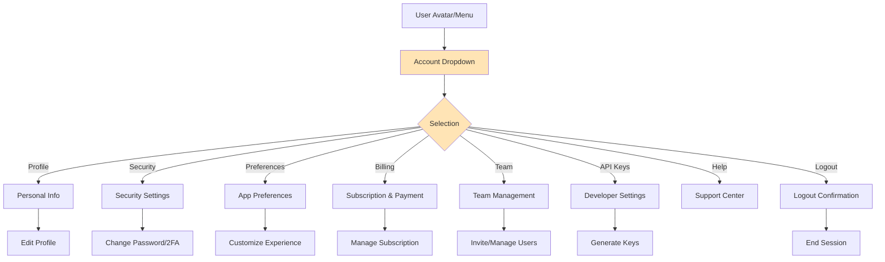
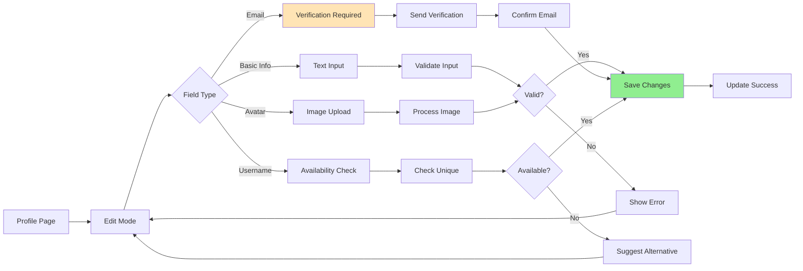
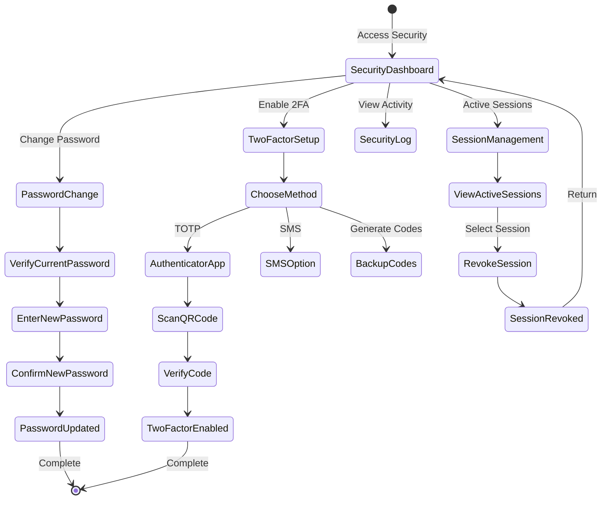
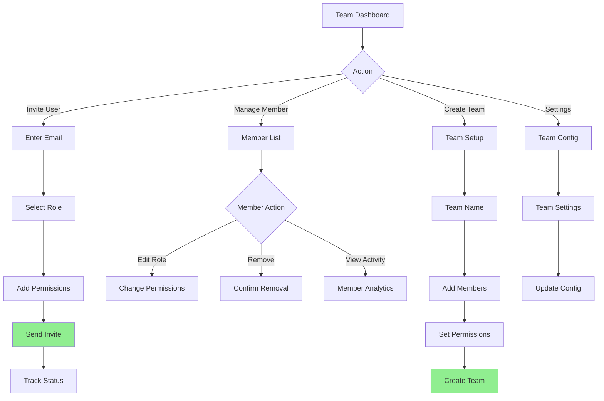

# User Flows & Wireframes - Account Management

## 1. Overview

Account Management encompasses all user-related settings, security configurations, preferences, and team management features. This document details flows for profile management, security settings, notification preferences, billing, team administration, and account lifecycle management.

## 2. Account Management Flows

### 2.1. Account Settings Navigation Flow



### 2.2. Profile Update Flow



### 2.3. Security Configuration Flow



### 2.4. Team Management Flow



## 3. Account Management Wireframes

### 3.1. Account Settings Main Page

```
┌─────────────────────────────────────────────────────────────────┐
│ ⚙️ Account Settings                           [Save Changes]    │
├─────────────────────────────────────────────────────────────────┤
│                                                                 │
│ ┌───────────────┬─────────────────────────────────────────────┐│
│ │ Settings Menu │  John Smith                                  ││
│ │               │  john.smith@company.com                      ││
│ │ ▼ Profile     │  Member since January 2024                   ││
│ │ ▶ Security    │                                              ││
│ │ ▶ Preferences │  ┌─────────────────────────────────────────┐││
│ │ ▶ Billing     │  │ Quick Actions                           │││
│ │ ▶ Team        │  │                                         │││
│ │ ▶ API Keys    │  │ [📸 Change Photo] [✏️ Edit Profile]    │││
│ │ ▶ Integrations│  │ [🔒 Security] [🔔 Notifications]       │││
│ │               │  │ [💳 Billing] [👥 Team Settings]        │││
│ │               │  └─────────────────────────────────────────┘││
│ │ ──────────    │                                              ││
│ │               │  Account Status                              ││
│ │ ▶ Activity Log│  ┌─────────────────────────────────────────┐││
│ │ ▶ Data Export │  │ Plan: Professional                      │││
│ │ ▶ Privacy     │  │ Storage: 45.2 GB / 100 GB used         │││
│ │               │  │ Team Members: 12 / 20                   │││
│ │ ──────────    │  │ API Calls: 45,234 / 100,000 (month)    │││
│ │               │  │                                         │││
│ │ 🗑 Delete Acct│  │ [Upgrade Plan] [View Usage Details]    │││
│ └───────────────┴─────────────────────────────────────────────┘│
└─────────────────────────────────────────────────────────────────┘
```

### 3.2. Profile Settings

```
┌─────────────────────────────────────────────────────────────────┐
│ 👤 Profile Settings                      [Cancel] [Save Changes]│
├─────────────────────────────────────────────────────────────────┤
│                                                                 │
│ Profile Picture                                                 │
│ ┌─────────────────────────────────────────────────────────────┐│
│ │ ┌─────┐  Upload a profile picture                           ││
│ │ │ 👤  │  Recommended: Square image, at least 400x400px     ││
│ │ │     │                                                     ││
│ │ └─────┘  [Choose File] [Remove Photo]                       ││
│ └─────────────────────────────────────────────────────────────┘│
│                                                                 │
│ Personal Information                                            │
│ ┌─────────────────────────────────────────────────────────────┐│
│ │ First Name *                    Last Name *                 ││
│ │ [John                        ]  [Smith                    ] ││
│ │                                                             ││
│ │ Display Name                    Username *                  ││
│ │ [John Smith                 ]  [@johnsmith               ] ││
│ │                                 ✓ Username available       ││
│ │                                                             ││
│ │ Email *                         Phone (Optional)            ││
│ │ [john.smith@company.com     ]  [+1 (555) 123-4567       ] ││
│ │ ⚠️ Changing email requires verification                    ││
│ └─────────────────────────────────────────────────────────────┘│
│                                                                 │
│ Professional Information                                        │
│ ┌─────────────────────────────────────────────────────────────┐│
│ │ Job Title                       Department                  ││
│ │ [Data Analyst               ]  [Analytics Team ▼]          ││
│ │                                                             ││
│ │ Bio                                                         ││
│ │ [Data analyst focused on e-commerce analytics and         ]││
│ │ [customer insights. Passionate about making data          ]││
│ │ [accessible to everyone.                                  ]││
│ │                                          140/200 characters ││
│ └─────────────────────────────────────────────────────────────┘│
└─────────────────────────────────────────────────────────────────┘
```

### 3.3. Security Settings

```
┌─────────────────────────────────────────────────────────────────┐
│ 🔒 Security Settings                                      [×]   │
├─────────────────────────────────────────────────────────────────┤
│                                                                 │
│ Password                                          Last changed  │
│ ┌─────────────────────────────────────────────────────────────┐│
│ │ ••••••••••••                                    3 months ago││
│ │                                                             ││
│ │ [Change Password]                                           ││
│ └─────────────────────────────────────────────────────────────┘│
│                                                                 │
│ Two-Factor Authentication (2FA)                    Status: OFF  │
│ ┌─────────────────────────────────────────────────────────────┐│
│ │ Add an extra layer of security to your account             ││
│ │                                                             ││
│ │ [Enable 2FA]  Recommended for all users                    ││
│ └─────────────────────────────────────────────────────────────┘│
│                                                                 │
│ Active Sessions                                   [Revoke All]  │
│ ┌─────────────────────────────────────────────────────────────┐│
│ │ Current Session                                             ││
│ │ Chrome on MacOS • San Francisco, CA • Active now           ││
│ │                                                             ││
│ │ Other Sessions                                              ││
│ │ Safari on iPhone • San Francisco, CA • 2 hours ago [Revoke]││
│ │ Firefox on Windows • New York, NY • Yesterday     [Revoke] ││
│ └─────────────────────────────────────────────────────────────┘│
│                                                                 │
│ Security Activity                                 [View All]    │
│ ┌─────────────────────────────────────────────────────────────┐│
│ │ • Successful login from new device         2 days ago      ││
│ │ • Password changed                         3 months ago    ││
│ │ • Failed login attempt (wrong password)    1 week ago      ││
│ └─────────────────────────────────────────────────────────────┘│
│                                                                 │
│ Download Your Data                                              │
│ [Request Data Export]  Get a copy of all your Jabiru data      │
└─────────────────────────────────────────────────────────────────┘
```

### 3.4. Change Password Flow

```
┌─────────────────────────────────────────────────────────────────┐
│ 🔑 Change Password                              [Cancel] [×]    │
├─────────────────────────────────────────────────────────────────┤
│                                                                 │
│ For security, please enter your current password first         │
│                                                                 │
│ Current Password *                                              │
│ ┌─────────────────────────────────────────────────────────────┐│
│ │ [••••••••••••                                             ] ││
│ └─────────────────────────────────────────────────────────────┘│
│                                                                 │
│ New Password *                                                  │
│ ┌─────────────────────────────────────────────────────────────┐│
│ │ [••••••••                                                 ] ││
│ │                                                             ││
│ │ Password Strength: ████████░░░░ Strong                     ││
│ │                                                             ││
│ │ ✓ At least 8 characters                                    ││
│ │ ✓ Contains uppercase and lowercase                         ││
│ │ ✓ Contains numbers                                         ││
│ │ ✓ Contains special characters                              ││
│ └─────────────────────────────────────────────────────────────┘│
│                                                                 │
│ Confirm New Password *                                          │
│ ┌─────────────────────────────────────────────────────────────┐│
│ │ [••••••••                                                 ] ││
│ │ ✓ Passwords match                                          ││
│ └─────────────────────────────────────────────────────────────┘│
│                                                                 │
│ ☑ Log out of all other sessions                                │
│                                                                 │
│ [Update Password]                                               │
└─────────────────────────────────────────────────────────────────┘
```

### 3.5. Two-Factor Authentication Setup

```
┌─────────────────────────────────────────────────────────────────┐
│ 🔐 Set Up Two-Factor Authentication              Step 1 of 3    │
├─────────────────────────────────────────────────────────────────┤
│                                                                 │
│ Choose your 2FA method:                                         │
│                                                                 │
│ ┌─────────────────────────────────────────────────────────────┐│
│ │ ● 📱 Authenticator App (Recommended)                        ││
│ │   Use Google Authenticator, Authy, or similar              ││
│ │   Most secure option                                       ││
│ │                                                             ││
│ │ ○ 💬 SMS Text Message                                      ││
│ │   Receive codes via text                                   ││
│ │   Less secure but convenient                               ││
│ └─────────────────────────────────────────────────────────────┘│
│                                                                 │
│ [Continue] [Cancel]                                             │
├─────────────────────────────────────────────────────────────────┤
│                                           Step 2 of 3           │
│ Scan this QR code with your authenticator app:                 │
│                                                                 │
│ ┌─────────────────────────────────────────────────────────────┐│
│ │                    [QR CODE IMAGE]                          ││
│ │                                                             ││
│ │ Can't scan? Enter manually:                                ││
│ │ JBSWY3DPEHPK3PXP                                          ││
│ └─────────────────────────────────────────────────────────────┘│
│                                                                 │
│ [I've Added It] [Back]                                          │
├─────────────────────────────────────────────────────────────────┤
│                                           Step 3 of 3           │
│ Enter the 6-digit code from your app to verify:                │
│                                                                 │
│ ┌─────────────────────────────────────────────────────────────┐│
│ │ [   ] [   ] [   ] [   ] [   ] [   ]                       ││
│ └─────────────────────────────────────────────────────────────┘│
│                                                                 │
│ [Verify & Enable] [Back]                                        │
└─────────────────────────────────────────────────────────────────┘
```

### 3.6. Preferences Settings

```
┌─────────────────────────────────────────────────────────────────┐
│ 🎨 Preferences                                   [Save Changes] │
├─────────────────────────────────────────────────────────────────┤
│                                                                 │
│ Appearance                                                      │
│ ┌─────────────────────────────────────────────────────────────┐│
│ │ Theme                                                       ││
│ │ ○ Light  ● Dark  ○ Auto (match system)                    ││
│ │                                                             ││
│ │ Color Scheme                                                ││
│ │ [Default ▼]  • Default • Colorblind • High Contrast       ││
│ │                                                             ││
│ │ Interface Density                                           ││
│ │ ○ Comfortable  ● Normal  ○ Compact                        ││
│ └─────────────────────────────────────────────────────────────┘│
│                                                                 │
│ Language & Region                                               │
│ ┌─────────────────────────────────────────────────────────────┐│
│ │ Language: [English (US) ▼]                                 ││
│ │ Time Zone: [Pacific Time (PT) ▼]                           ││
│ │ Date Format: [MM/DD/YYYY ▼]                                ││
│ │ Number Format: [1,234.56 ▼]                                ││
│ │ Currency: [USD ($) ▼]                                      ││
│ │ First Day of Week: [Sunday ▼]                              ││
│ └─────────────────────────────────────────────────────────────┘│
│                                                                 │
│ Notifications                                                   │
│ ┌─────────────────────────────────────────────────────────────┐│
│ │ Email Notifications                                         ││
│ │ ☑ Comments and mentions                    [Immediate ▼]   ││
│ │ ☑ Canvas shared with me                    [Daily Digest ▼]││
│ │ ☑ Weekly analytics summary                 [Weekly ▼]      ││
│ │ ☐ Product updates and news                                 ││
│ │                                                             ││
│ │ In-App Notifications                                        ││
│ │ ☑ Show desktop notifications                               ││
│ │ ☑ Play sound for mentions                                  ││
│ └─────────────────────────────────────────────────────────────┘│
│                                                                 │
│ Privacy                                                         │
│ ┌─────────────────────────────────────────────────────────────┐│
│ │ ☑ Show my online status                                    ││
│ │ ☐ Allow others to see my email                             ││
│ │ ☑ Include me in product improvement analytics              ││
│ └─────────────────────────────────────────────────────────────┘│
└─────────────────────────────────────────────────────────────────┘
```

### 3.7. Billing & Subscription

```
┌─────────────────────────────────────────────────────────────────┐
│ 💳 Billing & Subscription                        [Manage]       │
├─────────────────────────────────────────────────────────────────┤
│                                                                 │
│ Current Plan: Professional                                      │
│ ┌─────────────────────────────────────────────────────────────┐│
│ │ $79/month • Billed monthly                                  ││
│ │ Next billing date: April 15, 2024                           ││
│ │                                                             ││
│ │ Included:                          Usage:                   ││
│ │ • 20 team members                  12 active                ││
│ │ • 100 GB storage                   45.2 GB used            ││
│ │ • Unlimited canvases               234 created             ││
│ │ • 100K API calls/month             45,234 used             ││
│ │ • Advanced AI features             ✓ Active                ││
│ │                                                             ││
│ │ [Change Plan] [Add Users] [Add Storage]                    ││
│ └─────────────────────────────────────────────────────────────┘│
│                                                                 │
│ Payment Method                                    [Update]      │
│ ┌─────────────────────────────────────────────────────────────┐│
│ │ 💳 •••• •••• •••• 4242 (Visa)                             ││
│ │ Expires 12/2025                                            ││
│ └─────────────────────────────────────────────────────────────┘│
│                                                                 │
│ Billing History                                   [Download All]│
│ ┌─────────────────────────────────────────────────────────────┐│
│ │ Date         Description          Amount    Status          ││
│ ├─────────────────────────────────────────────────────────────┤│
│ │ Mar 15, 2024 Monthly subscription $79.00    Paid [Receipt] ││
│ │ Feb 15, 2024 Monthly subscription $79.00    Paid [Receipt] ││
│ │ Jan 15, 2024 Monthly subscription $79.00    Paid [Receipt] ││
│ │ Dec 15, 2023 Annual discount      -$158.00  Credit         ││
│ └─────────────────────────────────────────────────────────────┘│
│                                                                 │
│ [Update Billing Info] [Change Plan] [Cancel Subscription]      │
└─────────────────────────────────────────────────────────────────┘
```

### 3.8. Team Management

```
┌─────────────────────────────────────────────────────────────────┐
│ 👥 Team Management                              [Invite Member] │
├─────────────────────────────────────────────────────────────────┤
│                                                                 │
│ Organization: Acme Corporation                                  │
│ Members: 12 / 20                                                │
│                                                                 │
│ [🔍 Search members...]                         [Filter: All ▼]  │
│                                                                 │
│ ┌─────────────────────────────────────────────────────────────┐│
│ │ Name              Email                 Role      Status    ││
│ ├─────────────────────────────────────────────────────────────┤│
│ │ 👤 John Smith     john@acme.com        Admin     Active    ││
│ │    (You)                                          [Settings]││
│ ├─────────────────────────────────────────────────────────────┤│
│ │ 👤 Sarah Chen     sarah@acme.com       Editor    Active    ││
│ │                                                   [Manage ▼]││
│ ├─────────────────────────────────────────────────────────────┤│
│ │ 👤 Mike Johnson   mike@acme.com        Viewer    Active    ││
│ │                                                   [Manage ▼]││
│ ├─────────────────────────────────────────────────────────────┤│
│ │ 📧 Amy Liu        amy@acme.com         Editor    Pending   ││
│ │    Invited 2 days ago                        [Resend] [×]  ││
│ └─────────────────────────────────────────────────────────────┘│
│                                                                 │
│ Teams                                            [Create Team]  │
│ ┌─────────────────────────────────────────────────────────────┐│
│ │ 👥 Analytics Team (5 members)                    [Manage]  ││
│ │ 👥 Marketing Team (4 members)                    [Manage]  ││
│ │ 👥 Leadership (3 members)                        [Manage]  ││
│ └─────────────────────────────────────────────────────────────┘│
│                                                                 │
│ Roles & Permissions                              [Customize]    │
│ • Admin: Full access to all features                           │
│ • Editor: Create and edit content                              │
│ • Viewer: View only access                                     │
└─────────────────────────────────────────────────────────────────┘
```

### 3.9. API Keys Management

```
┌─────────────────────────────────────────────────────────────────┐
│ 🔑 API Keys                                    [Generate New]   │
├─────────────────────────────────────────────────────────────────┤
│                                                                 │
│ Use API keys to integrate Jabiru with your applications        │
│                                                                 │
│ Active Keys                                                     │
│ ┌─────────────────────────────────────────────────────────────┐│
│ │ Production API Key                                          ││
│ │ sk_live_••••••••••••••••••••4Gh9                          ││
│ │ Created: Jan 15, 2024 • Last used: 2 hours ago            ││
│ │ Permissions: Read, Write                                   ││
│ │ [Show] [Regenerate] [Delete]                               ││
│ ├─────────────────────────────────────────────────────────────┤│
│ │ Development API Key                                         ││
│ │ sk_test_••••••••••••••••••••7Kl2                          ││
│ │ Created: Feb 1, 2024 • Last used: Yesterday               ││
│ │ Permissions: Read only                                     ││
│ │ [Show] [Regenerate] [Delete]                               ││
│ └─────────────────────────────────────────────────────────────┘│
│                                                                 │
│ Usage This Month                                                │
│ ┌─────────────────────────────────────────────────────────────┐│
│ │ Total Requests: 45,234 / 100,000                           ││
│ │ ████████████████████░░░░░░░░░░░ 45%                       ││
│ │                                                             ││
│ │ By Endpoint:                                                ││
│ │ • /api/charts: 23,456 requests                             ││
│ │ • /api/data: 15,678 requests                               ││
│ │ • /api/canvas: 6,100 requests                              ││
│ └─────────────────────────────────────────────────────────────┘│
│                                                                 │
│ [View Documentation] [Usage Analytics] [Webhook Settings]       │
└─────────────────────────────────────────────────────────────────┘
```

### 3.10. Mobile Account Settings

```
┌─────────────────────────────────────────┐
│ ⚙️ Settings                        [×]  │
├─────────────────────────────────────────┤
│                                         │
│ 👤 John Smith                           │
│ john.smith@company.com                  │
│ Professional Plan                       │
│                                         │
│ ┌─────────────────────────────────────┐│
│ │ Profile                         >   ││
│ │ Security & Privacy              >   ││
│ │ Notifications                   >   ││
│ │ Appearance                      >   ││
│ │ Language & Region               >   ││
│ ├─────────────────────────────────────┤│
│ │ Billing & Subscription          >   ││
│ │ Team Management                 >   ││
│ │ Connected Apps                  >   ││
│ ├─────────────────────────────────────┤│
│ │ Help & Support                  >   ││
│ │ About Jabiru                    >   ││
│ │ Privacy Policy                  >   ││
│ │ Terms of Service                >   ││
│ └─────────────────────────────────────┘│
│                                         │
│ [Sign Out]                              │
│                                         │
│ Version 2.4.1                           │
└─────────────────────────────────────────┘
```

## 4. Advanced Features

### 4.1. Single Sign-On (SSO) Configuration

```
┌─────────────────────────────────────────────────────────────────┐
│ 🔐 Single Sign-On Configuration                  [Save] [Test]  │
├─────────────────────────────────────────────────────────────────┤
│                                                                 │
│ SSO Provider: [SAML 2.0 ▼]                                     │
│               • SAML 2.0                                        │
│               • OAuth 2.0                                       │
│               • OpenID Connect                                  │
│                                                                 │
│ SAML Configuration                                              │
│ ┌─────────────────────────────────────────────────────────────┐│
│ │ Identity Provider URL                                       ││
│ │ [https://idp.company.com/saml                            ] ││
│ │                                                             ││
│ │ Entity ID                                                   ││
│ │ [impala-production                                       ] ││
│ │                                                             ││
│ │ X.509 Certificate                                           ││
│ │ [-----BEGIN CERTIFICATE-----                             ] ││
│ │ [MIIDXTCCAkWgAwIBAgIJALmVVuDWu4NYMA0GCSqGSIb3DQEBCwUAMEUx]││
│ │ [...                                                     ] ││
│ │ [-----END CERTIFICATE-----                               ] ││
│ └─────────────────────────────────────────────────────────────┘│
│                                                                 │
│ Attribute Mapping                                               │
│ ┌─────────────────────────────────────────────────────────────┐│
│ │ Email: [http://schemas.xmlsoap.org/ws/2005/05/identity/ ▼]││
│ │ First Name: [givenName ▼]                                  ││
│ │ Last Name: [surname ▼]                                     ││
│ │ Groups: [memberOf ▼]                                       ││
│ └─────────────────────────────────────────────────────────────┘│
│                                                                 │
│ ☑ Enable Just-In-Time provisioning                             │
│ ☑ Allow SSO users to use password login                        │
│                                                                 │
│ [Test Configuration] [Download Metadata] [Save Changes]         │
└─────────────────────────────────────────────────────────────────┘
```

### 4.2. Audit Log

```
┌─────────────────────────────────────────────────────────────────┐
│ 📋 Activity Log                    [Export] [Filter ▼] [🔄]     │
├─────────────────────────────────────────────────────────────────┤
│                                                                 │
│ [🔍 Search activities...]          Date: [Last 30 days ▼]      │
│                                                                 │
│ ┌─────────────────────────────────────────────────────────────┐│
│ │ Time          Action              Details         IP        ││
│ ├─────────────────────────────────────────────────────────────┤│
│ │ 2 min ago    Canvas viewed       Q1 Report       10.0.1.42 ││
│ │               You                                            ││
│ ├─────────────────────────────────────────────────────────────┤│
│ │ 1 hour ago   Password changed    Security update 10.0.1.42 ││
│ │               You                                            ││
│ ├─────────────────────────────────────────────────────────────┤│
│ │ 3 hours ago  Member invited      amy@acme.com    10.0.1.42 ││
│ │               You                                            ││
│ ├─────────────────────────────────────────────────────────────┤│
│ │ Yesterday    Login               Chrome/MacOS     24.5.67.89││
│ │               You                 San Francisco              ││
│ ├─────────────────────────────────────────────────────────────┤│
│ │ 2 days ago   API key created     Production key  10.0.1.42 ││
│ │               You                                            ││
│ └─────────────────────────────────────────────────────────────┘│
│                                                                 │
│ Filter by: [All Activities ▼] [All Users ▼] [All IPs ▼]       │
│                                                                 │
│ [Load More] [Export CSV] [Export JSON]                         │
└─────────────────────────────────────────────────────────────────┘
```

### 4.3. Data Privacy & Export

```
┌─────────────────────────────────────────────────────────────────┐
│ 🔒 Privacy & Data Management                             [×]    │
├─────────────────────────────────────────────────────────────────┤
│                                                                 │
│ Your Data                                                       │
│ ┌─────────────────────────────────────────────────────────────┐│
│ │ Request a copy of your data                                 ││
│ │ Download all your Jabiru data in machine-readable format   ││
│ │                                                             ││
│ │ Includes:                                                   ││
│ │ • Profile information                                       ││
│ │ • Canvases and analyses                                     ││
│ │ • Uploaded data files                                       ││
│ │ • Comments and activity                                     ││
│ │                                                             ││
│ │ [Request Data Export]                                       ││
│ │                                                             ││
│ │ ℹ️ Exports are typically ready within 24 hours             ││
│ └─────────────────────────────────────────────────────────────┘│
│                                                                 │
│ Data Retention                                                  │
│ ┌─────────────────────────────────────────────────────────────┐│
│ │ Canvas History: [Keep Forever ▼]                            ││
│ │ Deleted Items: [30 days ▼]                                 ││
│ │ Activity Logs: [1 year ▼]                                  ││
│ └─────────────────────────────────────────────────────────────┘│
│                                                                 │
│ Delete Account                                                  │
│ ┌─────────────────────────────────────────────────────────────┐│
│ │ ⚠️ This action cannot be undone                            ││
│ │                                                             ││
│ │ Deleting your account will:                                ││
│ │ • Remove all your personal data                            ││
│ │ • Delete canvases you own                                  ││
│ │ • Remove you from all teams                                ││
│ │ • Cancel any active subscriptions                          ││
│ │                                                             ││
│ │ [Delete My Account]                                         ││
│ └─────────────────────────────────────────────────────────────┘│
└─────────────────────────────────────────────────────────────────┘
```

## 5. Error States & Validations

### 5.1. Email Change Verification

```
┌─────────────────────────────────────────────────────────────────┐
│ ✉️ Verify Email Change                                    [×]   │
├─────────────────────────────────────────────────────────────────┤
│                                                                 │
│ We've sent a verification email to:                            │
│ new.email@company.com                                           │
│                                                                 │
│ Please check your email and click the verification link.       │
│                                                                 │
│ ┌─────────────────────────────────────────────────────────────┐│
│ │ Didn't receive the email?                                  ││
│ │                                                             ││
│ │ • Check your spam folder                                   ││
│ │ • Make sure the email address is correct                   ││
│ │                                                             ││
│ │ [Resend Email] [Change Email] [Cancel]                     ││
│ └─────────────────────────────────────────────────────────────┘│
│                                                                 │
│ ⏱️ This verification link expires in 24 hours                  │
└─────────────────────────────────────────────────────────────────┘
```

### 5.2. Subscription Limit Reached

```
┌─────────────────────────────────────────────────────────────────┐
│ ⚠️ Team Member Limit Reached                                   │
├─────────────────────────────────────────────────────────────────┤
│                                                                 │
│ Your current plan includes 20 team members.                    │
│ You've reached this limit.                                      │
│                                                                 │
│ To invite more team members, you can:                          │
│                                                                 │
│ ┌─────────────────────────────────────────────────────────────┐│
│ │ 🚀 Upgrade to Enterprise                                    ││
│ │    Unlimited team members                                   ││
│ │    Advanced permissions                                     ││
│ │    Priority support                                         ││
│ │                                                             ││
│ │    [Upgrade Now]                                            ││
│ ├─────────────────────────────────────────────────────────────┤│
│ │ 💳 Add More Seats                                           ││
│ │    $10/month per additional member                          ││
│ │                                                             ││
│ │    Add [5 ▼] more seats                                    ││
│ │    Total: $50/month extra                                   ││
│ │                                                             ││
│ │    [Add Seats]                                              ││
│ └─────────────────────────────────────────────────────────────┘│
│                                                                 │
│ [Contact Sales] [Manage Team] [Cancel]                          │
└─────────────────────────────────────────────────────────────────┘
```

## 6. Implementation Notes

### 6.1. Security Requirements

- **Password complexity**: Enforce strong passwords
- **Session management**: Automatic timeout after inactivity
- **2FA options**: TOTP, SMS, backup codes
- **Audit logging**: All security events tracked
- **Data encryption**: At rest and in transit

### 6.2. Performance Considerations

- **Lazy loading**: Load settings sections on demand
- **Debounced saves**: Auto-save preferences with delay
- **Optimistic updates**: Immediate UI feedback
- **Background sync**: Update across devices
- **Caching**: Cache user preferences locally

### 6.3. Accessibility

- **Keyboard navigation**: Full keyboard support
- **Screen readers**: ARIA labels and descriptions
- **Focus management**: Clear focus indicators
- **Error announcements**: Screen reader friendly
- **Color contrast**: WCAG AA compliance

## 7. Success Metrics

### 7.1. Engagement Metrics

- **Settings access**: % users accessing settings monthly
- **Profile completion**: % with complete profiles
- **2FA adoption**: % with 2FA enabled
- **Team utilization**: Average team size vs. limit

### 7.2. Security Metrics

- **Password strength**: % using strong passwords
- **Session security**: Average sessions per user
- **Security incidents**: Failed login attempts
- **2FA success rate**: Successful 2FA verifications

### 7.3. User Satisfaction

- **Settings findability**: Time to find settings
- **Task completion**: Success rate for common tasks
- **Error recovery**: Recovery from error states
- **Support tickets**: Settings-related issues
