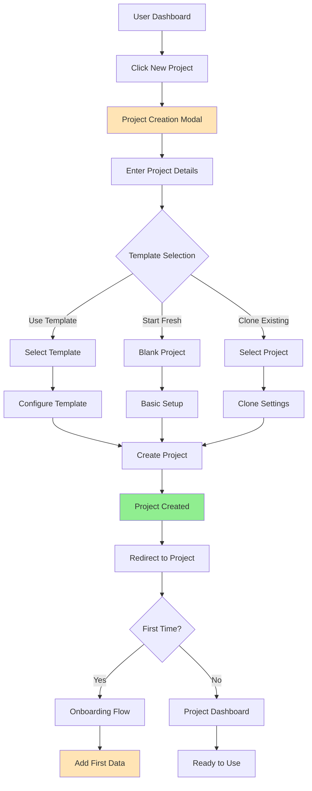
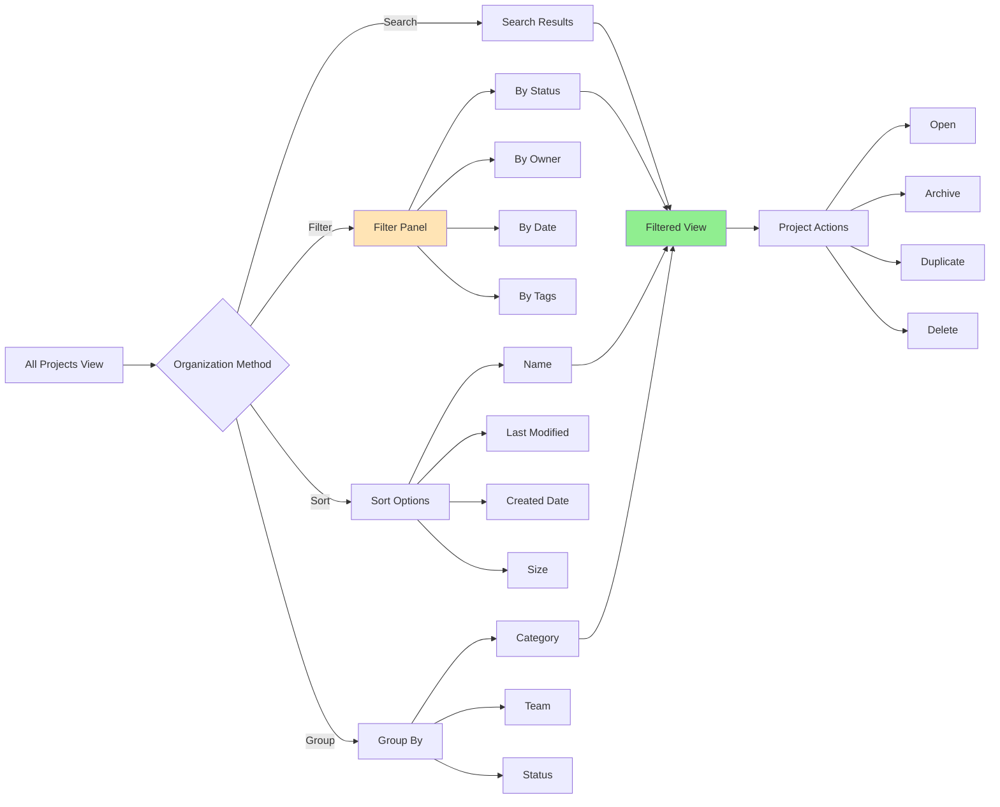
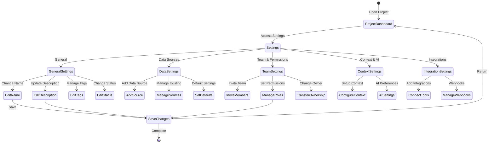
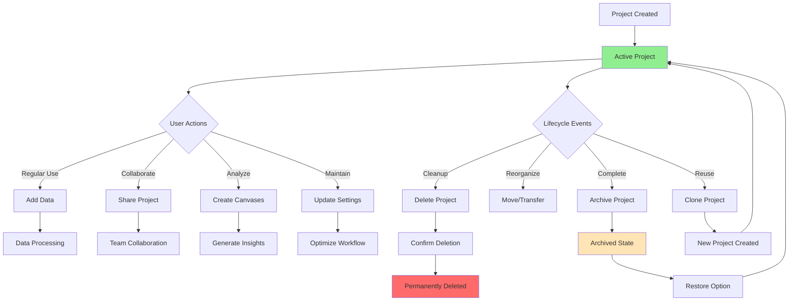

# User Flows & Wireframes - Project Management Details

## 1. Overview

Project Management is the organizational foundation of Jabiru, enabling users to structure their analytical work into logical containers. Each project acts as a workspace that brings together data sources, canvases, context settings, and team members. This document details all flows related to creating, configuring, organizing, and managing projects throughout their lifecycle.

## 2. Project Management Flows

### 2.1. Project Creation Flow



### 2.2. Project Organization Flow



### 2.3. Project Configuration Flow



### 2.4. Project Lifecycle Flow



## 3. Project Management Wireframes

### 3.1. Projects Dashboard (Home View)

```
┌─────────────────────────────────────────────────────────────────┐
│ 🏠 My Projects                               [+ New Project]    │
├─────────────────────────────────────────────────────────────────┤
│                                                                 │
│ Welcome back, John! You have 3 active projects                 │
│                                                                 │
│ [🔍 Search projects...]            [Filter: All ▼] [View: Grid ▼]│
│                                                                 │
│ Quick Actions                                                   │
│ ┌─────────────────────────────────────────────────────────────┐│
│ │ [📊 New Project] [📁 Import Data] [👥 Join Team] [📚 Browse Templates]│
│ └─────────────────────────────────────────────────────────────┘│
│                                                                 │
│ Recent Projects                                    [See All →] │
│ ┌─────────────────────────────────────────────────────────────┐│
│ │ ┌─────────────────┐ ┌─────────────────┐ ┌─────────────────┐││
│ │ │ 📊 Q1 Sales     │ │ 📈 Marketing    │ │ 💰 Budget 2024 │││
│ │ │    Analysis     │ │    Campaign     │ │    Planning    │││
│ │ │                 │ │                 │ │                 │││
│ │ │ 3 canvases      │ │ 5 canvases      │ │ 2 canvases     │││
│ │ │ 2 data sources  │ │ 4 data sources  │ │ 1 data source  │││
│ │ │ Updated 2h ago  │ │ Updated 1d ago  │ │ Updated 3d ago │││
│ │ │                 │ │                 │ │                 │││
│ │ │ 👥 5 members    │ │ 👥 3 members    │ │ 👥 You only     │││
│ │ │                 │ │                 │ │                 │││
│ │ │ [Open] [⋮]      │ │ [Open] [⋮]      │ │ [Open] [⋮]     │││
│ │ └─────────────────┘ └─────────────────┘ └─────────────────┘││
│ └─────────────────────────────────────────────────────────────┘│
│                                                                 │
│ Shared with Me                                     [See All →] │
│ ┌─────────────────────────────────────────────────────────────┐│
│ │ 📊 Regional Analysis - Shared by Sarah Chen (Viewer)       ││
│ │    Last viewed: Yesterday                        [Open]     ││
│ └─────────────────────────────────────────────────────────────┘│
└─────────────────────────────────────────────────────────────────┘
```

### 3.2. Create New Project Modal

```
┌─────────────────────────────────────────────────────────────────┐
│ Create New Project                                        [×]   │
├─────────────────────────────────────────────────────────────────┤
│                                                                 │
│ Project Name *                                                  │
│ [Q2 Customer Analysis                                      ]    │
│                                                                 │
│ Description (optional)                                          │
│ ┌─────────────────────────────────────────────────────────────┐│
│ │ Analyzing customer behavior and segmentation for Q2 2024    ││
│ │ to identify growth opportunities...                         ││
│ └─────────────────────────────────────────────────────────────┘│
│                                                                 │
│ How would you like to start?                                   │
│ ┌─────────────────────────────────────────────────────────────┐│
│ │ ○ 📄 Start from scratch                                     ││
│ │   Begin with an empty project                               ││
│ │                                                             ││
│ │ ● 📚 Use a template                                         ││
│ │   Get started quickly with pre-built structure              ││
│ │   [Select: Sales Analytics Template ▼]                      ││
│ │                                                             ││
│ │ ○ 🔄 Clone existing project                                 ││
│ │   Copy settings and structure from another project          ││
│ │   [Select project to clone ▼]                               ││
│ └─────────────────────────────────────────────────────────────┘│
│                                                                 │
│ Advanced Settings                                    [Show ▼]   │
│                                                                 │
│ [Cancel] [Create Project]                                       │
└─────────────────────────────────────────────────────────────────┘
```

### 3.3. Project Overview Dashboard

```
┌─────────────────────────────────────────────────────────────────┐
│ 📊 Q1 Sales Analysis                    [Share] [Settings] [⋮] │
├─────────────────────────────────────────────────────────────────┤
│                                                                 │
│ ┌───────────────┬───────────────┬───────────────┬────────────┐│
│ │ 📊 Canvases   │ 📁 Data       │ 👥 Team       │ 🔔 Activity││
│ │    (3)        │    Sources (2) │    (5)        │            ││
│ └───────────────┴───────────────┴───────────────┴────────────┘│
│                                                                 │
│ Project Overview                                                │
│ ┌─────────────────────────────────────────────────────────────┐│
│ │ Description: Comprehensive analysis of Q1 2024 sales        ││
│ │ performance across all regions and product categories       ││
│ │                                                             ││
│ │ 🏷️ Tags: sales, quarterly-review, 2024                      ││
│ │ 👤 Owner: John Smith                                        ││
│ │ 📅 Created: Jan 15, 2024                                    ││
│ │ 🔄 Last updated: 2 hours ago by Sarah Chen                 ││
│ └─────────────────────────────────────────────────────────────┘│
│                                                                 │
│ Quick Stats                                                     │
│ ┌────────────────┬────────────────┬────────────────┬─────────┐│
│ │ Total Views    │ Data Size      │ Compute Time   │ Cost    ││
│ │ 1,234          │ 125 MB         │ 4.5 hrs        │ $12.50  ││
│ └────────────────┴────────────────┴────────────────┴─────────┘│
│                                                                 │
│ [Go to Canvases] [Manage Data] [View Activity]                 │
└─────────────────────────────────────────────────────────────────┘
```

### 3.4. Project Canvases Tab

```
┌─────────────────────────────────────────────────────────────────┐
│ 📊 Q1 Sales Analysis > Canvases                  [+ New Canvas]│
├─────────────────────────────────────────────────────────────────┤
│                                                                 │
│ [🔍 Search canvases...]                      [Sort: Recent ▼]  │
│                                                                 │
│ Your Canvases (3)                                               │
│ ┌─────────────────────────────────────────────────────────────┐│
│ │ ┌─────────────────────────────────────────────────────────┐││
│ │ │ 📊 Executive Summary                                     │││
│ │ │                                                           │││
│ │ │ [Canvas preview thumbnail]                               │││
│ │ │                                                           │││
│ │ │ High-level overview of Q1 performance                    │││
│ │ │ Last edited: 2 hours ago by You                          │││
│ │ │ 👥 Shared with 5 people                                  │││
│ │ │                                                           │││
│ │ │ [Open] [Duplicate] [Share] [⋮]                           │││
│ │ └─────────────────────────────────────────────────────────┘││
│ │                                                             ││
│ │ ┌─────────────────────────────────────────────────────────┐││
│ │ │ 📈 Regional Breakdown                                    │││
│ │ │                                                           │││
│ │ │ [Canvas preview thumbnail]                               │││
│ │ │                                                           │││
│ │ │ Detailed analysis by geographic region                   │││
│ │ │ Last edited: 1 day ago by Sarah Chen                     │││
│ │ │ 💬 3 unresolved comments                                 │││
│ │ │                                                           │││
│ │ │ [Open] [Duplicate] [Share] [⋮]                           │││
│ │ └─────────────────────────────────────────────────────────┘││
│ └─────────────────────────────────────────────────────────────┘│
│                                                                 │
│ Templates                                          [Browse All] │
│ [Use Sales Template] [Use Dashboard Template] [Start Blank]     │
└─────────────────────────────────────────────────────────────────┘
```

### 3.5. Project Data Sources Tab

```
┌─────────────────────────────────────────────────────────────────┐
│ 📊 Q1 Sales Analysis > Data Sources              [+ Add Source]│
├─────────────────────────────────────────────────────────────────┤
│                                                                 │
│ Connected Sources (2)                          Total: 125 MB    │
│                                                                 │
│ ┌─────────────────────────────────────────────────────────────┐│
│ │ 📄 sales_data_q1_2024.csv                                   ││
│ │ ┌─────────────────────────────────────────────────────────┐││
│ │ │ Type: CSV File            Status: 🟢 Active              │││
│ │ │ Size: 45.2 MB            Rows: 156,234                   │││
│ │ │ Columns: 24              Quality: 98%                    │││
│ │ │                                                           │││
│ │ │ Last refresh: 2 hours ago (Manual upload)                │││
│ │ │ Used in: 3 canvases                                      │││
│ │ │                                                           │││
│ │ │ [Preview] [Refresh] [Edit Schema] [Replace] [Remove]     │││
│ │ └─────────────────────────────────────────────────────────┘││
│ │                                                             ││
│ │ 🔗 PostgreSQL - Customer Database                           ││
│ │ ┌─────────────────────────────────────────────────────────┐││
│ │ │ Type: Database            Status: 🟢 Connected           │││
│ │ │ Tables: 5                 Last sync: 1 hour ago          │││
│ │ │ Schedule: Every 6 hours   Next sync: in 5 hours          │││
│ │ │                                                           │││
│ │ │ Connected tables: customers, orders, products            │││
│ │ │ Used in: 2 canvases                                      │││
│ │ │                                                           │││
│ │ │ [Explore] [Sync Now] [Edit Connection] [Disconnect]      │││
│ │ └─────────────────────────────────────────────────────────┘││
│ └─────────────────────────────────────────────────────────────┘│
│                                                                 │
│ 💡 Tip: Keep your data fresh with automated refresh schedules  │
└─────────────────────────────────────────────────────────────────┘
```

### 3.6. Project Team Management

```
┌─────────────────────────────────────────────────────────────────┐
│ 📊 Q1 Sales Analysis > Team                    [+ Invite People]│
├─────────────────────────────────────────────────────────────────┤
│                                                                 │
│ Project Members (5)                                             │
│                                                                 │
│ ┌─────────────────────────────────────────────────────────────┐│
│ │ Role          Member                  Access      Actions   ││
│ ├─────────────────────────────────────────────────────────────┤│
│ │ 👑 Owner      John Smith (You)        Full        -         ││
│ │               john@company.com                               ││
│ │                                                              ││
│ │ ✏️ Editor     Sarah Chen              Can edit    [▼] [×]   ││
│ │               sarah@company.com        Last active: 2h ago   ││
│ │                                                              ││
│ │ ✏️ Editor     Mike Johnson            Can edit    [▼] [×]   ││
│ │               mike@company.com         Last active: 1d ago   ││
│ │                                                              ││
│ │ 👁 Viewer     Amy Liu                 View only   [▼] [×]   ││
│ │               amy@company.com          Last active: 3d ago   ││
│ │                                                              ││
│ │ 👁 Viewer     David Park              View only   [▼] [×]   ││
│ │               david@company.com        Never accessed        ││
│ └─────────────────────────────────────────────────────────────┘│
│                                                                 │
│ Pending Invitations (1)                                         │
│ ┌─────────────────────────────────────────────────────────────┐│
│ │ 📧 lisa@company.com - Editor access                         ││
│ │    Invited 2 days ago                [Resend] [Cancel]      ││
│ └─────────────────────────────────────────────────────────────┘│
│                                                                 │
│ Project Permissions:                                            │
│ ☑ Members can invite others                                    │
│ ☑ Members can export data                                      │
│ ☐ Members can delete canvases                                  │
│                                                                 │
│ [Save Permissions]                                              │
└─────────────────────────────────────────────────────────────────┘
```

### 3.7. Project Settings - General

```
┌─────────────────────────────────────────────────────────────────┐
│ ⚙️ Project Settings                              [Save] [Cancel]│
├─────────────────────────────────────────────────────────────────┤
│                                                                 │
│ ┌──────────────┬──────────────────────────────────────────────┐│
│ │ General      │ General Settings                             ││
│ │ Data Sources │                                              ││
│ │ Team         │ Project Name *                               ││
│ │ Context & AI │ [Q1 Sales Analysis                      ]    ││
│ │ Integrations │                                              ││
│ │ Advanced     │ Description                                  ││
│ │              │ ┌────────────────────────────────────────────┐││
│ │              │ │ Comprehensive analysis of Q1 2024 sales   │││
│ │              │ │ performance across all regions...         │││
│ │              │ └────────────────────────────────────────────┘││
│ │              │                                              ││
│ │              │ Project URL                                  ││
│ │              │ impala.ai/projects/[q1-sales-analysis   ]   ││
│ │              │                                              ││
│ │              │ Tags                                         ││
│ │              │ [sales] [quarterly] [2024] [+ Add tag]      ││
│ │              │                                              ││
│ │              │ Project Status                               ││
│ │              │ [Active ▼]                                   ││
│ │              │ • Active - In progress                       ││
│ │              │ • Completed - Archived but accessible       ││
│ │              │ • On Hold - Temporarily paused              ││
│ │              │                                              ││
│ │              │ Visibility                                   ││
│ │              │ ● Private - Only invited members            ││
│ │              │ ○ Team - All team members can view          ││
│ │              │ ○ Public - Anyone with link can view        ││
│ └──────────────┴──────────────────────────────────────────────┘│
└─────────────────────────────────────────────────────────────────┘
```

### 3.8. Project Activity Feed

```
┌─────────────────────────────────────────────────────────────────┐
│ 📊 Q1 Sales Analysis > Activity                   [Filter ▼]   │
├─────────────────────────────────────────────────────────────────┤
│                                                                 │
│ Recent Activity                                                 │
│                                                                 │
│ Today                                                           │
│ ┌─────────────────────────────────────────────────────────────┐│
│ │ 2:30 PM  👤 You edited "Executive Summary" canvas          ││
│ │          Added new revenue chart and updated insights       ││
│ │                                                             ││
│ │ 11:45 AM 👤 Sarah Chen commented on "Regional Breakdown"   ││
│ │          "The West region numbers look off..."              ││
│ │          [View Comment]                                     ││
│ │                                                             ││
│ │ 10:00 AM 🔄 System refreshed data from Customer Database   ││
│ │          156 new records added                              ││
│ └─────────────────────────────────────────────────────────────┘│
│                                                                 │
│ Yesterday                                                       │
│ ┌─────────────────────────────────────────────────────────────┐│
│ │ 4:15 PM  👤 Mike Johnson shared canvas with Marketing Team ││
│ │          "Executive Summary" now accessible to 8 people     ││
│ │                                                             ││
│ │ 2:00 PM  📊 New canvas created: "Product Performance"      ││
│ │          Created by Sarah Chen                              ││
│ │                                                             ││
│ │ 9:30 AM  🔗 New data source connected                      ││
│ │          PostgreSQL database "analytics_prod" added         ││
│ └─────────────────────────────────────────────────────────────┘│
│                                                                 │
│ [Load More Activity]                                            │
└─────────────────────────────────────────────────────────────────┘
```

### 3.9. Project Templates Gallery

```
┌─────────────────────────────────────────────────────────────────┐
│ 📚 Project Templates                    [Search...] [Filter ▼] │
├─────────────────────────────────────────────────────────────────┤
│                                                                 │
│ Featured Templates                                              │
│ ┌─────────────────────────────────────────────────────────────┐│
│ │ ┌──────────────┐ ┌──────────────┐ ┌──────────────┐        ││
│ │ │ 📊 Sales     │ │ 📈 Marketing │ │ 💰 Financial │        ││
│ │ │ Analytics    │ │ Campaign     │ │ Planning     │        ││
│ │ │              │ │              │ │              │        ││
│ │ │ • 5 canvases │ │ • 4 canvases │ │ • 6 canvases │        ││
│ │ │ • KPI dashboard│ • ROI tracking│ │ • Budget views│       ││
│ │ │ • Auto reports│ │ • A/B testing│ │ • Forecasting│        ││
│ │ │              │ │              │ │              │        ││
│ │ │ Used 2.3k    │ │ Used 1.8k    │ │ Used 945     │        ││
│ │ │ times        │ │ times        │ │ times        │        ││
│ │ │              │ │              │ │              │        ││
│ │ │ [Use Template]│ │ [Use Template]│ │ [Use Template]│       ││
│ │ └──────────────┘ └──────────────┘ └──────────────┘        ││
│ └─────────────────────────────────────────────────────────────┘│
│                                                                 │
│ Industry Specific                                               │
│ ┌─────────────────────────────────────────────────────────────┐│
│ │ 🛍️ E-commerce | 🏥 Healthcare | 🏭 Manufacturing | More... ││
│ └─────────────────────────────────────────────────────────────┘│
│                                                                 │
│ Your Organization's Templates                                   │
│ ┌─────────────────────────────────────────────────────────────┐│
│ │ ⭐ Quarterly Review Template - Created by Finance Team      ││
│ │    Standardized format for quarterly business reviews       ││
│ │    [Preview] [Use Template]                                 ││
│ └─────────────────────────────────────────────────────────────┘│
└─────────────────────────────────────────────────────────────────┘
```

### 3.10. Archive Project Confirmation

```
┌─────────────────────────────────────────────────────────────────┐
│ 📦 Archive Project?                                             │
├─────────────────────────────────────────────────────────────────┤
│                                                                 │
│ You're about to archive "Q1 Sales Analysis"                    │
│                                                                 │
│ What happens when you archive:                                  │
│ • Project becomes read-only                                     │
│ • Automated data refreshes will stop                            │
│ • Project won't appear in active projects list                  │
│ • All team members retain view access                           │
│ • You can restore it anytime                                    │
│                                                                 │
│ Project contains:                                               │
│ • 3 canvases                                                    │
│ • 2 data sources (125 MB)                                       │
│ • 5 team members                                                │
│                                                                 │
│ ┌─────────────────────────────────────────────────────────────┐│
│ │ Reason for archiving (optional):                            ││
│ │ [Project completed - Q1 analysis finished              ]    ││
│ └─────────────────────────────────────────────────────────────┘│
│                                                                 │
│ ☐ Download project backup before archiving                      │
│                                                                 │
│ [Cancel] [Archive Project]                                      │
└─────────────────────────────────────────────────────────────────┘
```

### 3.11. Project Quick Actions Menu

```
┌─────────────────────────────────────────┐
│ Quick Actions                      [×]  │
├─────────────────────────────────────────┤
│                                         │
│ 📊 Q1 Sales Analysis                    │
│                                         │
│ ├─ 📋 Duplicate Project                 │
│ ├─ 📤 Export Project                    │
│ ├─ 🏷️ Edit Tags                        │
│ ├─ 👥 Manage Team                       │
│ ├─ 🔄 Refresh All Data                  │
│ ├─ 📊 View Analytics                    │
│ ├─ ⚙️ Project Settings                  │
│ ├─ 📦 Archive Project                   │
│ └─ 🗑️ Delete Project                   │
│                                         │
│ Shortcuts:                              │
│ ├─ 📊 New Canvas                        │
│ ├─ 📁 Add Data Source                   │
│ └─ 👤 Invite Team Member                │
└─────────────────────────────────────────┘
```

### 3.12. Mobile Project View

```
┌─────────────────────────────────────────┐
│ 📱 Projects                        [+]  │
├─────────────────────────────────────────┤
│                                         │
│ [🔍 Search...]                          │
│                                         │
│ Recent                                  │
│ ┌─────────────────────────────────────┐│
│ │ 📊 Q1 Sales Analysis                ││
│ │ Updated 2 hours ago                 ││
│ │ 3 canvases • 5 members              ││
│ │                          [Open] [⋮] ││
│ └─────────────────────────────────────┘│
│                                         │
│ ┌─────────────────────────────────────┐│
│ │ 📈 Marketing Campaign               ││
│ │ Updated yesterday                   ││
│ │ 5 canvases • 3 members              ││
│ │                          [Open] [⋮] ││
│ └─────────────────────────────────────┘│
│                                         │
│ [View All Projects]                     │
│                                         │
│ [Home] [Projects] [Data] [Profile]      │
└─────────────────────────────────────────┘
```

## 4. Advanced Project Management Features

### 4.1. Project Analytics Dashboard

```
┌─────────────────────────────────────────────────────────────────┐
│ 📊 Project Analytics: Q1 Sales Analysis       [Export] [Close] │
├─────────────────────────────────────────────────────────────────┤
│                                                                 │
│ Time Period: [Last 30 days ▼]                                  │
│                                                                 │
│ Usage Overview                                                  │
│ ┌─────────────────────────────────────────────────────────────┐│
│ │ Total Views: 1,234        Active Users: 5/5                 ││
│ │ Data Processed: 2.3 GB    Compute Time: 4.5 hrs             ││
│ │ AI Queries: 156           Cost to Date: $45.23              ││
│ └─────────────────────────────────────────────────────────────┘│
│                                                                 │
│ Activity Trends                                                 │
│ [Line chart showing daily active users and canvas views]       │
│                                                                 │
│ Most Active Components                                          │
│ ┌─────────────────────────────────────────────────────────────┐│
│ │ Canvas              Views    Edits    Avg. Time            ││
│ ├─────────────────────────────────────────────────────────────┤│
│ │ Executive Summary   456      23       12 min               ││
│ │ Regional Breakdown  312      18       15 min               ││
│ │ Product Analysis    234      12       8 min                ││
│ └─────────────────────────────────────────────────────────────┘│
│                                                                 │
│ Data Source Performance                                         │
│ ┌─────────────────────────────────────────────────────────────┐│
│ │ • CSV Upload: 99.8% success rate, avg 12s processing       ││
│ │ • PostgreSQL: 100% uptime, avg 230ms query time            ││
│ └─────────────────────────────────────────────────────────────┘│
└─────────────────────────────────────────────────────────────────┘
```

### 4.2. Bulk Project Operations

```
┌─────────────────────────────────────────────────────────────────┐
│ Manage Multiple Projects                    [Apply] [Cancel]    │
├─────────────────────────────────────────────────────────────────┤
│                                                                 │
│ Selected Projects (3)                                           │
│ ☑ Q1 Sales Analysis                                            │
│ ☑ Q4 2023 Review                                               │
│ ☑ Product Launch Metrics                                        │
│                                                                 │
│ Bulk Actions:                                                   │
│ ┌─────────────────────────────────────────────────────────────┐│
│ │ 🏷️ Add Tags                                                 ││
│ │ Tags to add: [archived] [2024] [reviewed]                   ││
│ │                                                             ││
│ │ 👥 Share with Team                                          ││
│ │ Team: [Analytics Team ▼]                                    ││
│ │ Permission: [Viewer ▼]                                      ││
│ │                                                             ││
│ │ 📦 Bulk Archive                                             ││
│ │ ☐ Archive selected projects                                 ││
│ │                                                             ││
│ │ 📤 Export                                                   ││
│ │ ☐ Export project data                                       ││
│ │ ☐ Export project settings                                   ││
│ │ ☐ Include canvas definitions                                ││
│ └─────────────────────────────────────────────────────────────┘│
│                                                                 │
│ ⚠️ These changes will affect 3 projects and 12 team members    │
└─────────────────────────────────────────────────────────────────┘
```

### 4.3. Project Transfer Ownership

```
┌─────────────────────────────────────────────────────────────────┐
│ 🔄 Transfer Project Ownership                                   │
├─────────────────────────────────────────────────────────────────┤
│                                                                 │
│ Project: Q1 Sales Analysis                                      │
│ Current Owner: John Smith (you)                                 │
│                                                                 │
│ Transfer ownership to:                                          │
│ ┌─────────────────────────────────────────────────────────────┐│
│ │ 🔍 Search team members...                                   ││
│ └─────────────────────────────────────────────────────────────┘│
│                                                                 │
│ Suggested Recipients:                                           │
│ ┌─────────────────────────────────────────────────────────────┐│
│ │ 👤 Sarah Chen (sarah@company.com)                          ││
│ │    Current role: Editor                                     ││
│ │    Active on project: Yes (last seen 2 hours ago)          ││
│ │                                               [Select]      ││
│ │                                                             ││
│ │ 👤 Mike Johnson (mike@company.com)                          ││
│ │    Current role: Editor                                     ││
│ │    Active on project: Yes (last seen yesterday)            ││
│ │                                               [Select]      ││
│ └─────────────────────────────────────────────────────────────┘│
│                                                                 │
│ After transfer:                                                 │
│ • New owner will have full control                             │
│ • You'll become an Editor (can be changed)                     │
│ • All other permissions remain the same                        │
│                                                                 │
│ [Cancel] [Transfer Ownership]                                   │
└─────────────────────────────────────────────────────────────────┘
```

### 4.4. Project Deletion Confirmation

```
┌─────────────────────────────────────────────────────────────────┐
│ ⚠️ Delete Project Permanently?                                  │
├─────────────────────────────────────────────────────────────────┤
│                                                                 │
│ You're about to permanently delete:                            │
│ "Q1 Sales Analysis"                                             │
│                                                                 │
│ This will delete:                                               │
│ • 3 canvases with all visualizations                           │
│ • 2 data sources (125 MB)                                       │
│ • All comments and activity history                             │
│ • Project context and AI training                               │
│                                                                 │
│ This will affect:                                               │
│ • 5 team members will lose access                              │
│ • All shared links will stop working                           │
│ • Scheduled data refreshes will be cancelled                   │
│                                                                 │
│ ⚠️ This action cannot be undone!                               │
│                                                                 │
│ To confirm, type the project name:                             │
│ [                                                          ]    │
│                                                                 │
│ ☐ I understand this action is permanent                        │
│                                                                 │
│ [Cancel] [Delete Forever]                                       │
└─────────────────────────────────────────────────────────────────┘
```

## 5. Project Organization Views

### 5.1. Projects List View

```
┌─────────────────────────────────────────────────────────────────┐
│ 📋 All Projects (12)                    [Grid View] [List View] │
├─────────────────────────────────────────────────────────────────┤
│                                                                 │
│ [🔍 Search...] [Filter ▼] [Sort: Last Modified ▼] [Group by ▼] │
│                                                                 │
│ ┌─────────────────────────────────────────────────────────────┐│
│ │ Name              Owner      Modified    Status   Actions   ││
│ ├─────────────────────────────────────────────────────────────┤│
│ │ 📊 Q1 Sales       You        2 hrs ago   Active   [⋮]      ││
│ │    Analysis                                                 ││
│ │    3 canvases, 5 members                                   ││
│ │                                                             ││
│ │ 📈 Marketing      Sarah C.   1 day ago   Active   [⋮]      ││
│ │    Campaign                                                 ││
│ │    5 canvases, 3 members                                   ││
│ │                                                             ││
│ │ 💰 Budget 2024    You        3 days ago  Draft    [⋮]      ││
│ │    2 canvases, 1 member                                    ││
│ │                                                             ││
│ │ 📊 Q4 2023        Mike J.    1 week ago  Complete [⋮]      ││
│ │    Review                                                   ││
│ │    8 canvases, 12 members                                  ││
│ └─────────────────────────────────────────────────────────────┘│
│                                                                 │
│ Showing 4 of 12 projects                          [Load More]  │
└─────────────────────────────────────────────────────────────────┘
```

### 5.2. Project Filters Panel

```
┌─────────────────────────────────────────┐
│ Filter Projects                    [×]  │
├─────────────────────────────────────────┤
│                                         │
│ Status                                  │
│ ☑ Active (8)                           │
│ ☑ Draft (2)                            │
│ ☐ Complete (1)                         │
│ ☐ Archived (1)                         │
│                                         │
│ Owner                                   │
│ ☑ My Projects (6)                      │
│ ☐ Shared with Me (4)                   │
│ ☐ Team Projects (2)                    │
│                                         │
│ Date Range                              │
│ ○ All Time                             │
│ ● Last 30 days                         │
│ ○ Last 90 days                         │
│ ○ Custom range...                      │
│                                         │
│ Tags                                    │
│ ☐ sales (4)                            │
│ ☐ marketing (3)                        │
│ ☐ quarterly-review (3)                 │
│ ☐ 2024 (8)                             │
│ [+ Add tag filter]                     │
│                                         │
│ Data Size                               │
│ ○ Any size                             │
│ ○ < 100 MB                             │
│ ○ 100 MB - 1 GB                        │
│ ○ > 1 GB                               │
│                                         │
│ [Clear Filters] [Apply]                 │
└─────────────────────────────────────────┘
```

## 6. Error States & Edge Cases

### 6.1. Project Access Denied

```
┌─────────────────────────────────────────────────────────────────┐
│ 🔒 Access Denied                                                │
├─────────────────────────────────────────────────────────────────┤
│                                                                 │
│ You don't have permission to access this project               │
│                                                                 │
│ Project: Q1 Sales Analysis                                      │
│ Owner: Sarah Chen                                               │
│                                                                 │
│ This project is private and you haven't been invited.          │
│                                                                 │
│ What you can do:                                                │
│ • Request access from the project owner                         │
│ • Ask a team member to share it with you                       │
│ • Check if you're signed in with the right account             │
│                                                                 │
│ [Request Access] [Contact Owner] [Go to My Projects]           │
└─────────────────────────────────────────────────────────────────┘
```

### 6.2. Project Limits Reached

```
┌─────────────────────────────────────────────────────────────────┐
│ 📊 Project Limit Reached                                        │
├─────────────────────────────────────────────────────────────────┤
│                                                                 │
│ You've reached your project limit                              │
│                                                                 │
│ Current Plan: Basic (5 projects)                                │
│ Projects Used: 5 of 5                                           │
│                                                                 │
│ Your Projects:                                                  │
│ • Q1 Sales Analysis (125 MB)                                   │
│ • Marketing Campaign (89 MB)                                    │
│ • Budget Planning 2024 (45 MB)                                  │
│ • Customer Insights (234 MB)                                    │
│ • Product Performance (156 MB)                                  │
│                                                                 │
│ Options:                                                        │
│ ┌─────────────────────────────────────────────────────────────┐│
│ │ 🚀 Upgrade to Pro                                           ││
│ │    • Unlimited projects                                     ││
│ │    • Advanced features                                      ││
│ │    • Priority support                                       ││
│ │                                         [Upgrade Plan]      ││
│ ├─────────────────────────────────────────────────────────────┤│
│ │ 📦 Archive Old Projects                                     ││
│ │    Free up space by archiving completed projects           ││
│ │                                         [Manage Projects]   ││
│ └─────────────────────────────────────────────────────────────┘│
└─────────────────────────────────────────────────────────────────┘
```

### 6.3. Project Recovery

```
┌─────────────────────────────────────────────────────────────────┐
│ 🔄 Recover Deleted Project?                                     │
├─────────────────────────────────────────────────────────────────┤
│                                                                 │
│ We found a recently deleted project:                           │
│                                                                 │
│ "Q1 Sales Analysis"                                             │
│ Deleted: 2 days ago by You                                     │
│ Size: 125 MB                                                    │
│                                                                 │
│ This project is still recoverable for the next 28 days.        │
│                                                                 │
│ Recovery will restore:                                          │
│ • All canvases and visualizations                              │
│ • Data source connections                                       │
│ • Team members and permissions                                  │
│ • Comments and activity history                                 │
│                                                                 │
│ Note: Some external data connections may need to be            │
│ re-authenticated after recovery.                                │
│                                                                 │
│ [Cancel] [Recover Project]                                      │
└─────────────────────────────────────────────────────────────────┘
```

## 7. Implementation Notes

### 7.1. Technical Considerations

- **Project data structure** stored in PostgreSQL
- **Soft delete** for projects (30-day recovery window)
- **Cascading permissions** from project to canvases
- **Efficient loading** with pagination for large projects
- **Real-time updates** for team collaboration

### 7.2. Performance Optimization

- **Lazy loading** of project contents
- **Cached project metadata** for quick access
- **Background processing** for analytics
- **Incremental search** indexing
- **Optimized queries** for project lists

### 7.3. Security & Permissions

- **Row-level security** for project access
- **Audit logging** for all project changes
- **Permission inheritance** to child objects
- **Secure sharing** with expiring links
- **Data isolation** between projects

## 8. Success Metrics

### 8.1. Project Management Metrics

- **Average projects per user**: Target 3-5 active
- **Project activation rate**: >80% have data within 24h
- **Team collaboration rate**: >60% have multiple members
- **Template usage**: >40% start from templates
- **Archive rate**: <20% abandoned projects

### 8.2. Performance Metrics

- **Project creation time**: <3 seconds
- **Load time**: <2s for project dashboard
- **Search response**: <500ms
- **Bulk operations**: <5s for 10 projects
- **Data source connection**: <10s average

### 8.3. User Satisfaction

- **Project organization NPS**: >40
- **Feature adoption**: >70% use tags/filters
- **Error rate**: <1% failed operations
- **Recovery success**: >95% successful restores
- **Support tickets**: <5% project-related
